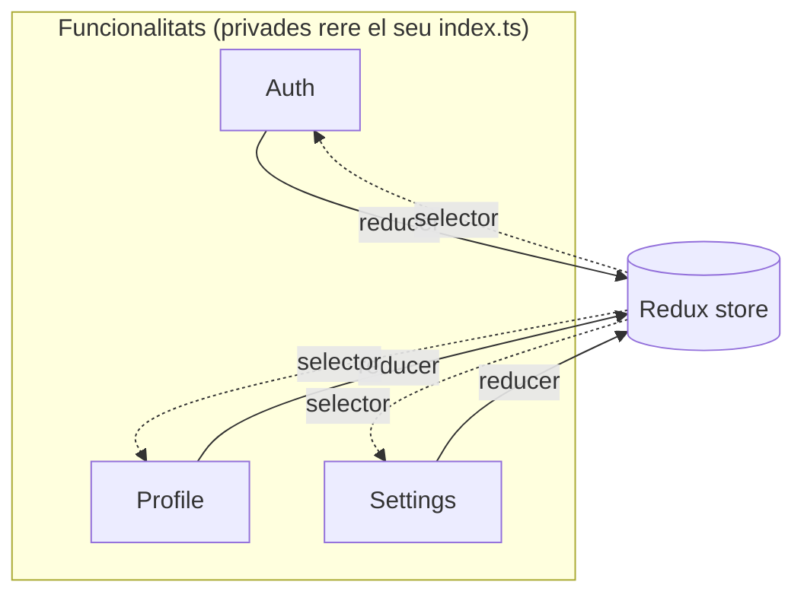

La versió curta: per sota d'unes cinc funcionalitats amb el seu propi estat, les carpetes per tipus (`screens/`, `hooks/`, `services/`) van bé. Per sobre, la mateixa estructura comença a costar més del que estalvia. Aquest post va de per què, i d'on cau la línia.

## 85 fitxers per una sola funcionalitat

Aquests són els fitxers TypeScript que té la meva funcionalitat d'Auth. Sis pantalles, un store de Redux, un context de React, un hook personalitzat, components de PIN amb stories de Storybook, esquemes de validació de formularis contra una **llista negra de contrasenyes comunes**, limitació de peticions, un servei de bloqueig, i tests a tots els nivells.

A la majoria de projectes React Native, aquests 85 fitxers estarien repartits per **set carpetes diferents**. Les pantalles en un lloc, els hooks en un altre, el slice del store en un altre, la validació en un altre. Per entendre com funciona l'autenticació, obriries set carpetes i reconstruiries mentalment les relacions entre fitxers que no estan a prop els uns dels altres.

L'esquema queda polit amb tres o quatre pantalles. Passat això, les relacions es tornen invisibles. El hook d'una funcionalitat viu lluny de la pantalla que el fa servir. Les regles de validació són en una carpeta separada del formulari que validen. Revisar una funcionalitat vol dir escanejar diverses llistes alfabètiques buscant les peces.

## L'estructura per tipus, i per què és la per defecte

Coneixes aquest:

```
src/
├── screens/
│   ├── LoginScreen.tsx
│   ├── ProfileScreen.tsx
│   ├── SettingsScreen.tsx
│   └── WorkExperienceScreen.tsx
├── components/
│   ├── PINInput.tsx
│   ├── ProfileCard.tsx
│   └── AlertBox.tsx
├── hooks/
│   ├── useAuth.ts
│   └── useProfile.ts
├── store/
│   ├── authSlice.ts
│   └── profileSlice.ts
└── utils/
    └── dateFormatter.ts
```

Fitxers agrupats per mena. **Per tipus.** La majoria de tutorials de React Native ho munten així, i hi ha bones raons. Els col·laboradors nous reconeixen la forma al moment. Un revisor que mira per sobre una prova tècnica veu `screens/`, `hooks/`, `components/` sense pensar-hi. Els noms de carpeta encaixen amb el vocabulari del framework, i el model mental viatja d'un projecte a un altre. Per a tres o quatre pantalles, n'hi ha prou per mantenir-ho ordenat. Si alguna vegada has fet una prova tècnica, [l'estructura de carpetes és una de les primeres coses que mira un revisor](/blog/how-to-pass-a-react-native-tech-test/), i per tipus és l'opció segura.

L'esquema aguanta mentre l'app és petita. Llavors afegeixes autenticació amb configuració de PIN, verificació per correu, recuperació de contrasenya. Afegeixes gestió del perfil amb pujada de fotos, edició del compte, canvi de contrasenya. De cop `screens/` té 25 fitxers, i trobar el hook de la pujada de foto de perfil vol dir escanejar una llista alfabètica de *tots els hooks de l'app*.

Ara prova d'**eliminar una funcionalitat**. Treu la pantalla de `screens/`. Troba el seu hook a `hooks/`. El seu servei a `services/`. El seu slice del store. Els seus components. El seu esquema de validació. Els seus tests, en un arbre `__tests__/` apart. Si et deixes un fitxer, tens codi mort que s'hi quedarà durant mesos.

Aquesta és la prova. Si eliminar una funcionalitat triga més que construir-la, l'estructura et juga en contra.

## Una carpeta per funcionalitat

La meva app té 13 funcionalitats. Cadascuna viu en un sol directori:

```
src/features/
├── Auth/           # 85 fitxers. Login, registre, PIN, bloqueig
├── Profile/        # API, store, pujada de foto, 5 pantalles
├── Settings/       # Tema, idioma, 3 pantalles
├── Education/      # Store, API, 1 pantalla
├── WorkExperience/ # Store, API, 4 pantalles
├── Home/           # 1 pantalla, 1 export
├── Legal/          # Política de privacitat, T&Cs
├── Permissions/    # Càmera, galeria, pantalles de denegació
├── MockStatus/     # Pantalla d'estat MSW només per a dev
├── PDF/            # Visor de PDF
├── Placeholder/    # Placeholders de xat i de reserves
├── WebView/        # Pantalla webview genèrica
└── Splash/         # Pantalla de splash
```

La resta queda fora de les funcionalitats: `shared/` per a components i hooks reutilitzables, `store/` per a la configuració de Redux, `navigation/`, `httpClients/`, `utils/`, `i18n/`.

La funcionalitat més senzilla són dos fitxers. La més complexa, 85. **Cadascuna només té les carpetes que realment necessita.** Cap directori `services/` buit perquè una plantilla deia que hi havia de ser.

## Com es veuen 85 fitxers quan estan co-localitzats

```
src/features/Auth/
├── __tests__/
├── api/
│   └── __tests__/
├── components/
│   ├── __tests__/
│   ├── PINDot.tsx
│   ├── PINDot.stories.tsx
│   ├── PINInput.tsx
│   ├── PINInput.stories.tsx
│   ├── PINKeypad.tsx
│   └── PINKeypad.stories.tsx
├── context/
│   └── AuthContext.tsx
├── hooks/
│   └── useAuth.ts
├── services/
│   └── pinLockoutService.ts
├── store/
│   ├── __tests__/
│   ├── actions.ts
│   ├── reducer.ts
│   └── selectors.ts
├── utils/
│   ├── __tests__/
│   ├── emailResendRateLimiter.ts
│   ├── pinHashing.ts
│   ├── pinValidation.ts
│   └── rateLimiter.ts
├── validation/
│   ├── __tests__/
│   ├── customRules.ts
│   ├── loginSchema.ts
│   ├── passwordRecoverySchema.ts
│   └── registrationSchema.ts
├── EmailVerificationScreen.tsx
├── ForgotPasswordScreen.tsx
├── LoginScreen.tsx
├── PINSetupScreen.tsx
├── RegistrationScreen.tsx
├── ResetPasswordScreen.tsx
└── index.ts
```

El hashing del PIN seu al costat de la validació del PIN, al costat dels components de PIN, al costat de la pantalla de configuració del PIN. **La relació entre fitxers es veu a la mateixa disposició de carpetes.** Obro `Auth/` i puc veure cada peça del sistema d'autenticació sense anar enlloc més.

En una estructura per tipus, aquests mateixos fitxers de PIN estarien a `components/`, `utils/`, `services/` i `screens/`. *Quatre carpetes per un sol concepte.*

## La prova d'eliminació en la pràctica

La prova de foc d'abans. Com queda de debò per a cada disposició?

**Per tipus:** esborra fitxers de `screens/`, `components/`, `hooks/`, `services/`, `store/`, `utils/`, `validation/` i `__tests__/`. Si et deixes un fitxer, tens un orfe. Si et deixes un import, l'app peta a l'arrencada.

**Per funcionalitat:** esborra `src/features/Auth/`, treu `authReducer` de la configuració del store, treu les rutes de navegació. **Tres passos.** El compilador m'avisa si m'he deixat alguna referència.

Ho he fet. Eliminar una funcionalitat que tocava més de 40 fitxers va trigar menys d'un minut. La major part d'aquell minut va ser la configuració de navegació.

## El contracte que fa segur el refactoring

Cada funcionalitat només exporta el que la resta de l'app necessita. El `index.ts` a l'arrel de la funcionalitat és el contracte:

```typescript
// src/features/Auth/index.ts
export { authReducer, login, logout, selectIsAuthenticated } from './store';
export { AuthProvider } from './context';
export { useAuth } from './hooks';
export { LoginScreen } from './LoginScreen';
export { RegistrationScreen } from './RegistrationScreen';
```

El hashing del PIN, la limitació de peticions, la lògica de bloqueig. **Res d'això s'exporta.** És privat d'Auth. Puc reescriure *tota* la implementació del PIN, i mentre els exports no canviïn, res fora d'Auth se n'assabenta.

La configuració del store importa `authReducer`. La navegació importa les pantalles. Prou. Els més de 80 fitxers interns són invisibles per a la resta del codebase.

## Les funcionalitats mai importen d'altres funcionalitats

Aquesta és la regla que ho aguanta tot.

Si Auth necessita saber si un perfil està carregat, llegeix del store de Redux via un selector. No importa de `@app/features/Profile` directament. **El store és l'única capa de comunicació entre funcionalitats.**

<div id="feature-boundaries"></div>



Cada funcionalitat és propietària del seu slice de Redux. El store arrel els combina:

```typescript
import { authReducer } from '@app/features/Auth';
import { profileReducer } from '@app/features/Profile';
import { settingsReducer } from '@app/features/Settings';
import { educationReducer } from '@app/features/Education';
import { workExperienceReducer } from '@app/features/WorkExperience';

const rootReducer = combineReducers({
  settings: settingsReducer,
  auth: persistedAuthReducer,
  profile: profileReducer,
  workExperience: workExperienceReducer,
  education: educationReducer,
});
```

Trenca la regla de no importar entre funcionalitats un cop i acabaràs amb dependències circulars en una setmana. La funcionalitat A importa de la B, que importa de la C, que importa de la A. El bundler llança un error críptic i ningú sap on comença el cicle.

## El codi compartit es guanya el seu lloc

Si un component el fa servir **una sola funcionalitat**, es queda dins d'aquella funcionalitat. Si dues o més el necessiten, es mou a `src/shared/`. El llistó és alt.

Cada abstracció compartida és un **punt d'acoblament**. En el moment que `AlertBox` viu a `shared/`, cinc funcionalitats depenen de la seva interfície. Canviar-lo vol dir revisar les cinc. Prefereixo duplicar tres línies en dues funcionalitats que crear una utilitat compartida que faci les dues més difícils de canviar pel seu compte.

Els hooks que acaben a `shared/` són els genuïnament transversals: `useAppColorScheme`, `useHapticFeedback`, `useReducedMotion`, `useCameraPermission`, `usePhotoLibraryPermission`. Coses que qualsevol pantalla pot necessitar. No coses que *dues pantalles* resulta que necessiten ara mateix.

## Els tests segueixen la mateixa regla

Els tests viuen al costat del codi que proven. Els tests del store d'Auth són a `Auth/store/__tests__/`. Els tests de validació d'Auth són a `Auth/validation/__tests__/`. Cap arbre de tests separat a l'arrel del projecte.

L'única excepció: **tests d'integració entre funcionalitats**. El login que flueix cap a la càrrega del perfil. Canvis de configuració que es propaguen a la UI. Tasques en segon pla que es passen entre funcionalitats. Aquests abasten múltiples funcionalitats, així que viuen a `src/features/__tests__/`, fora de cap funcionalitat individual.

```
src/features/__tests__/
├── BackgroundTasks.integration.rntl.tsx
├── CrossFeatureIntegration.rntl.tsx
├── OnboardingJourney.integration.rntl.tsx
├── ProfileCompletionJourney.integration.rntl.tsx
└── RealtimeSubscription.integration.rntl.tsx
```

Quan un test falla, la ubicació em diu on mirar. Si és a `Auth/store/__tests__/`, el problema és al store d'auth. Si és a `features/__tests__/`, el problema és en com interactuen les funcionalitats. La ubicació *és* el diagnòstic.

## Quan canviar

Si la teva app té tres pantalles i cap gestió d'estat, *no facis això*. Una llista plana de pantalles i un parell de hooks compartits ja va bé. L'estructura per funcionalitat afegeix sobrecàrrega que els projectes petits no necessiten.

El punt d'inflexió cau al voltant de **cinc funcionalitats amb el seu propi estat**. Per sota, l'estructura costa més del que estalvia. Per sobre, l'estructura per tipus es converteix en allò que et frena.

Obre la teva carpeta `screens/` ara mateix. Compta els fitxers. Si no pots dir quins van junts només mirant la llista, l'estructura ja ha deixat d'ajudar-te.

## Posar-ho en marxa

L'estructura d'aquí dalt és una convenció, no una eina. Dues peces de configuració l'aguanten.

**Path aliases.** Sense ells, acabes amb `import { authReducer } from '../../../features/Auth'` a tot arreu. Afegeix els aliases a `tsconfig.json`:

```json
{
  "compilerOptions": {
    "baseUrl": ".",
    "paths": {
      "@app": ["src"],
      "@app/*": ["src/*"]
    }
  }
}
```

I a `babel.config.js` perquè el runtime els resolgui:

```js
module.exports = {
  presets: ['@react-native/babel-preset'],
  plugins: [
    [
      'module-resolver',
      {
        root: ['./src'],
        alias: {
          '@app': './src',
        },
      },
    ],
  ],
};
```

```bash
yarn add -D babel-plugin-module-resolver
```

Ara `import { authReducer } from '@app/features/Auth'` es resol a temps de compilació i en runtime, sigui on sigui el fitxer que l'importa.

**Una regla d'ESLint per mantenir la frontera honesta.** Els path aliases sols no impedeixen que algú escrigui `import { profileSelector } from '@app/features/Profile'` dins d'Auth. En el moment que això es publica, l'estructura comença a esfondrar-se. Una regla `no-restricted-imports` fixa la frontera:

```js
// eslint.config.mjs
export default [
  {
    rules: {
      'no-restricted-imports': ['error', {
        patterns: [
          {
            group: ['@app/features/*/!(index)', '@app/features/*/*/**'],
            message: 'Import another feature through its public index (@app/features/X), not its internals. Within a feature, use relative imports.',
          },
        ],
      }],
    },
  },
  {
    // Els tests poden accedir als interns d'una funcionalitat per preparar l'estat.
    files: ['**/__tests__/**'],
    rules: { 'no-restricted-imports': 'off' },
  },
];
```

El patró bloqueja qualsevol import que arribi als interns d'una altra funcionalitat. Dins d'una funcionalitat fas servir imports relatius (`./store`, `../components`), que mai coincideixen amb el patró d'àlies, així que una funcionalitat sempre pot accedir al seu propi codi. L'única excepció són els tests, que sovint necessiten entrar en una funcionalitat per preparar l'estat.

Prou. Path aliases, una regla d'ESLint, i la disciplina de mantenir privats els interns de cada funcionalitat. L'arquitectura aguanta perquè el tooling fa complir el que la convenció demana.

El codi font complet del projecte és a [github.com/warrendeleon/rn-warrendeleon](https://github.com/warrendeleon/rn-warrendeleon).
