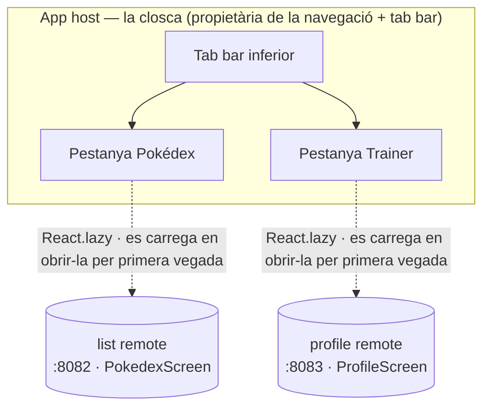

Fins ara el host ha carregat una pantalla d'un remote. Una app de debò és més que una pantalla: té una closca, una tab bar, un lloc on posar les features. Aquest post converteix el host en aquesta closca. És propietari de la navegació i de la tab bar, i cada pestanya és un remote separat, construït i desplegat pel seu compte, carregat en temps d'execució.

La forma que construirem, abans de tocar codi: el host és propietari de la tab bar, i cada pestanya és un remote separat, que es descarrega i s'executa en temps d'execució el primer cop que l'obres.

<div id="tab-architecture"></div>



Reprenem on ho va deixar el post 3. Si vas seguir el tutorial, queda't amb el teu propi codi. Si no, parteix de l'estat final del post 3:

```sh
git clone https://github.com/warrendeleon/react-native-module-federation
git checkout post-03-shared-singleton
```

## Un segon remote per omplir una segona pestanya

Una pestanya no és una tab bar. Així que afegim un segon remote, `profile`, igual que el post 2 va construir el remote `list`: una app de React Native nova sobre Re.Pack, sense `AppRegistry.registerComponent`, exposant una pantalla. Crea'l al costat dels altres, instal·la les seves dependències igual que vas fer amb `list` i copia-hi el `rspack.config.mjs` de `list`. Canvien quatre camps, i els quatre importen: el `name` del plugin (`profileApp`), el `filename` del contenidor (`profileApp.container.js.bundle`), la pantalla exposada (`./ProfileScreen`) i `output.uniqueName` (`'ProfileApp'`). Aquest últim és el fàcil de passar per alt: `uniqueName` delimita els globals de càrrega de chunks de webpack, així que dos remotes que portin el mateix valor xoquen dins del runtime del host exactament de la manera que aquesta sèrie no para d'advertir.

La pantalla que exposa, `apps/profile/src/ProfileScreen.tsx`. Llegeix l'inset del safe area del provider del host, el mateix singleton compartit del post 3:

```tsx
import React from 'react';
import { StyleSheet, Text, View } from 'react-native';
import { useSafeAreaInsets } from 'react-native-safe-area-context';

const TRAINER = { name: 'Ash Ketchum', region: 'Kanto', badges: 8, caught: 151 };

export default function ProfileScreen() {
  const insets = useSafeAreaInsets();
  return (
    <View style={[styles.screen, { paddingTop: insets.top + 24 }]}>
      <Text style={styles.title}>Trainer</Text>
      <Text style={styles.subtitle}>Served by the profile remote</Text>
      <View style={styles.card}>
        <Text style={styles.name}>{TRAINER.name}</Text>
        <Text style={styles.meta}>
          {TRAINER.region} · {TRAINER.badges} badges · {TRAINER.caught} caught
        </Text>
      </View>
    </View>
  );
}

const styles = StyleSheet.create({
  screen: { flex: 1, padding: 24, backgroundColor: '#fff' },
  title: { fontSize: 28, fontWeight: '700' },
  subtitle: { fontSize: 14, color: '#6b7280', marginBottom: 16 },
  card: {
    padding: 16,
    borderRadius: 12,
    borderWidth: StyleSheet.hairlineWidth,
    borderColor: '#e5e7eb',
    backgroundColor: '#f9fafb',
  },
  name: { fontSize: 18, fontWeight: '600', marginBottom: 4 },
  meta: { fontSize: 14, color: '#6b7280' },
});
```

La seva entry de contenidor, `apps/profile/src/index.js`, es queda buida, perquè un remote no arrenca res pel seu compte:

```js
export {};
```

El seu `apps/profile/rspack.config.mjs` manté els mateixos singletons compartits; el bloc de federació després dels quatre canvis:

```js
new Repack.plugins.ModuleFederationPluginV2({
  name: 'profileApp',
  filename: 'profileApp.container.js.bundle',
  exposes: {
    './ProfileScreen': './src/ProfileScreen.tsx',
  },
  dts: false,
  shared: {
    react: { singleton: true, requiredVersion: pkg.dependencies.react },
    'react-native': {
      singleton: true,
      requiredVersion: pkg.dependencies['react-native'],
    },
    'react-native-safe-area-context': {
      singleton: true,
      requiredVersion: pkg.dependencies['react-native-safe-area-context'],
    },
  },
}),
```

Dona-li el seu propi port de dev server perquè no xoqui amb `list` al 8082. A `apps/profile/package.json`:

```json
"scripts": {
  "start:remote": "react-native start --config rspack.config.mjs --port 8083"
}
```

Ara hi ha dos remotes, al 8082 i 8083, cadascun una pantalla esperant un host.

## El host rep navegació

La tab bar pertany al host, no als remotes. El host instal·la una llibreria de navegació; els remotes continuen sent pantalles planes que no saben res de pestanyes. Instal·la-la només al host:

```sh
cd apps/host
npm install @react-navigation/native @react-navigation/bottom-tabs react-native-screens
cd ios && bundle exec pod install
```

`react-native-screens` és un mòdul natiu, així que el host necessita un pod install i una compilació nativa nova. `react-native-safe-area-context` ja hi és des del post 3, i React Navigation la fa servir.

I aquí tens el punt important sobre compartir, que és el contracte del post 3 a l'inrevés. React Navigation viu només al host perquè només el host la fa servir. Els remotes no la importen mai, així que no hi ha res a compartir. Els singletons compartits continuen sent exactament el que eren: `react`, `react-native` i `react-native-safe-area-context`. Una llibreria només necessita compartir-se quan hi ha codi a banda i banda de la frontera que la toca.

## La closca

Reescriu `apps/host/App.tsx`. El host ara és propietari d'un `SafeAreaProvider`, un `NavigationContainer` i un navegador de pestanyes inferior. El contingut de cada pestanya és un remote carregat de manera mandrosa:

```tsx
import React, { Suspense } from 'react';
import { ActivityIndicator, StyleSheet } from 'react-native';
import { SafeAreaProvider } from 'react-native-safe-area-context';
import { NavigationContainer } from '@react-navigation/native';
import { createBottomTabNavigator } from '@react-navigation/bottom-tabs';

const PokedexScreen = React.lazy(() => import('listApp/PokedexScreen'));
const ProfileScreen = React.lazy(() => import('profileApp/ProfileScreen'));

// A remote downloads the first time its tab is opened, so each tab renders behind a Suspense
// spinner. Wrapping once here keeps the lazy boundary out of the remotes.
function withSuspense(Remote: React.ComponentType) {
  return function Tab() {
    return (
      <Suspense fallback={<ActivityIndicator style={styles.loader} size="large" />}>
        <Remote />
      </Suspense>
    );
  };
}

const PokedexTab = withSuspense(PokedexScreen);
const ProfileTab = withSuspense(ProfileScreen);

const Tab = createBottomTabNavigator();

export default function App() {
  return (
    <SafeAreaProvider>
      <NavigationContainer>
        <Tab.Navigator screenOptions={{ headerShown: false }}>
          <Tab.Screen name="Pokédex" component={PokedexTab} />
          <Tab.Screen name="Trainer" component={ProfileTab} />
        </Tab.Navigator>
      </NavigationContainer>
    </SafeAreaProvider>
  );
}

const styles = StyleSheet.create({
  loader: { flex: 1 },
});
```

Cada pestanya és un remote darrere de `React.lazy` i `Suspense`. El remote es descarrega el primer cop que obres la seva pestanya, no en arrencar, així que l'app comença a la primera pestanya i només busca la segona quan hi canvies.

El host necessita saber on viu el segon remote. Afegeix-lo a `remotes` a `apps/host/rspack.config.mjs`:

```js
remotes: {
  listApp: `listApp@http://localhost:8082/${platform}/mf-manifest.json`,
  profileApp: `profileApp@http://localhost:8083/${platform}/mf-manifest.json`,
},
```

I digues a TypeScript la forma del nou import federat, a `apps/host/mf-modules.d.ts`:

```ts
declare module 'profileApp/ProfileScreen' {
  import type React from 'react';
  const ProfileScreen: React.ComponentType;
  export default ProfileScreen;
}
```

## Executa-ho

Ara quatre terminals, un per remote i un per al host, més la compilació:

```sh
cd apps/list && npm run start:remote      # :8082
cd apps/profile && npm run start:remote   # :8083
cd apps/host && npm start                 # :8081
cd apps/host && npm run ios
```

El host arrenca a la pestanya Pokédex i renderitza el remote `list`. Toca **Trainer** i el host busca el remote `profile` al 8083, l'executa, i mostra la targeta de l'entrenador. Dues features, construïdes i servides per dues apps separades, en una tab bar que no pertany a cap de les dues.

<div class="device-frame">
  
</div>

## Què has construït, i què ve

El host ja és una closca. És propietari de la navegació i la tab bar; cada pestanya és un remote que es va construir i desplegar pel seu compte i es va carregar en temps d'execució. Els remotes continuen sent simples: renderitzen una pantalla i no saben res de com estan ordenats. Afegir una tercera feature és afegir un tercer remote i una tercera pestanya, sense tocar les que ja estan desplegades.

El codi acabat d'aquest post és el tag `post-04-host-shell`, perquè en puguis fer un diff contra el teu:

```sh
git checkout post-04-host-shell
```

El següent a la sèrie: el host escriu a mà la forma de cada remote que carrega, una suposició que res no comprova contra la pantalla de debò. La substituïm per un petit paquet de contractes compartit, així el host i els remotes es posen d'acord sobre les props que travessen entre ells i el compilador detecta qualsevol deriva.

## Fonts

- [React Navigation](https://reactnavigation.org/) — el navegador de pestanyes inferior sobre el qual es construeix la closca del host
- [Module Federation 2.0](https://module-federation.io/) — els remotes `name@url` que carreguen cada pestanya en temps d'execució
- [react-native-module-federation](https://github.com/warrendeleon/react-native-module-federation) — el repo company, al tag `post-04-host-shell`
