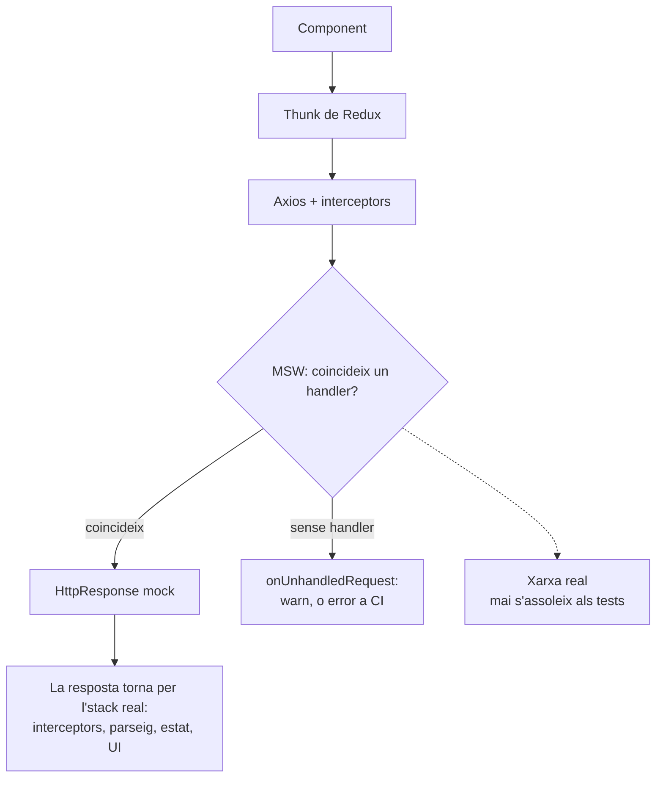

## Per què MSW en comptes de mocks manuals

La majoria de projectes React Native simulen la seva capa d'API amb `jest.fn()`. Simules `fetch` o la teva instància d'Axios, defineixes què retorna, i proves contra això.

Funciona. Fins que no.

El problema: estàs verificant la interacció del teu codi amb un mock, no amb una capa HTTP. Si el teu client d'API canvia com construeix URLs, afegeix headers o gestiona reintents, el mock no detecta la regressió. Això importa encara més si valides respostes en temps d'execució amb alguna cosa com Zod, perquè vols que la capa de [validació de respostes en temps d'execució amb Zod](/blog/runtime-api-validation-zod-react-native/) corri contra formes de resposta reals, no contra objectes mock fets a mà. El mock sempre retorna el que li has dit, independentment del que el codi realment ha enviat.

**Mock Service Worker (MSW)** intercepta les peticions a nivell de xarxa. El teu codi fa crides HTTP reals. MSW les captura abans que surtin del procés i retorna les teves respostes simulades. Tot el que hi ha entre el teu component i la xarxa s'exercita: el thunk de Redux, els interceptors d'Axios, la gestió d'errors, el parseig de la resposta.

Els mocks manuals reemplacen el teu codi. MSW reemplaça la xarxa. El codi s'executa exactament com ho faria en un dispositiu, fins al punt just on la petició n'hauria sortit.

<div id="msw-intercept"></div>



## Premisses

El setup de sota es va escriure contra:

- React Native 0.74+ amb el preset de Jest `react-native` per defecte
- TypeScript amb la config de Babel estàndard de RN
- Redux Toolkit (el wrapper de render personalitzat ho dóna per fet)
- Node 18 o posterior (es recomana Node 20)

Si estàs en una versió antiga de RN, un preset de Jest d'Expo, o sense Redux, els *conceptes* segueixen aplicant, però uns quants snippets necessitaran ajustos.

## Instal·lació

MSW v2 corre als tests de Jest a través del servidor de Node.js. El service worker del navegador no és rellevant per a mòbil, així que ignora tot el que diguin els docs de MSW sobre el registre del service worker.

```bash
yarn add -D msw node-fetch@2 web-streams-polyfill
```

`msw` és l'obvi. `node-fetch` i `web-streams-polyfill` són els polyfills que MSW v2 necessita en l'entorn de Jest de React Native, que connectaré al pas següent.

> 💡 **Per què fixar `node-fetch@2`?** `node-fetch` v3+ és només ESM i no es carregarà via `require()` en un fitxer de setup de Jest CommonJS. O bé fixes la v2 (el que fa aquest post), o bé migres el fitxer de polyfills a ESM. La v2 és el camí de menys fricció en un preset de Jest de React Native per defecte.

> 💡 **No et fiïs de posts que diuen "no calen polyfills".** MSW v2 està construït sobre la Fetch API i Web Streams. Algunes combinacions de Node + Jest tenen aquests globals; el preset de Jest de React Native no. Sense els polyfills veuràs `ReferenceError: Response is not defined` o `TextEncoder is not defined` el primer cop que MSW intenti construir una resposta.

## Polyfills

Crea `jest.polyfills.cjs` a l'arrel del projecte. Ha de ser `.cjs` (no `.ts`) perquè Jest el carrega abans que el transformador de TypeScript estigui llest:

```js
/**
 * Polyfills de MSW per a React Native.
 * Necessaris per a Mock Service Worker v2 als tests de Jest.
 */

// TextEncoder / TextDecoder
const { TextEncoder, TextDecoder } = require('util');
global.TextEncoder = TextEncoder;
global.TextDecoder = TextDecoder;

// Fetch API
if (!global.fetch) {
  global.fetch = require('node-fetch');
  global.Headers = require('node-fetch').Headers;
  global.Request = require('node-fetch').Request;
  global.Response = require('node-fetch').Response;
}

// ReadableStream (per a streaming de respostes)
if (!global.ReadableStream) {
  try {
    const { ReadableStream } = require('web-streams-polyfill');
    global.ReadableStream = ReadableStream;
  } catch {
    // web-streams-polyfill és opcional per a MSW v2 antic
  }
}
```

Aquest fitxer corre *abans* que es carregui el framework de tests, així que `beforeAll`, `jest`, etc. no estan disponibles aquí. És purament per configurar globals.

## Config de Jest

Connecta el fitxer de polyfills i un fitxer de setup separat a `jest.config.cjs`:

```js
module.exports = {
  preset: 'react-native',
  testEnvironment: 'node',
  setupFiles: ['<rootDir>/jest.polyfills.cjs'],
  setupFilesAfterEnv: ['<rootDir>/jest.setup.ts'],
  transformIgnorePatterns: [
    // El preset de RN per defecte ignora la major part de node_modules; MSW s'ha de transformar.
    'node_modules/(?!(react-native|@react-native|msw|until-async|rettime|@mswjs|@open-draft|@bundled-es-modules|headers-polyfill|strict-event-emitter|outvariant)/)',
  ],
  moduleFileExtensions: ['ts', 'tsx', 'js', 'jsx', 'json', 'node'],
};
```

Dues claus fan la feina:

| Clau | Quan corre | Per a què |
|---|---|---|
| `setupFiles` | Abans que s'instal·li el framework de Jest | Polyfills, variables globals, qualsevol cosa que no necessiti `jest`/`expect` |
| `setupFilesAfterEnv` | Després del framework de Jest, abans de cada fitxer de test | Hooks `beforeAll`/`afterEach`, cicle de vida del servidor de MSW, matchers personalitzats |

La línia `transformIgnorePatterns` és l'altre parany: el preset de RN per defecte salta la transformació de `node_modules`, però MSW porta sintaxi moderna que Jest no pot executar tal com ve. Afegeix MSW i les seves dependències sense transpilar (`msw|until-async|rettime|@mswjs|@open-draft|@bundled-es-modules|headers-polyfill|strict-event-emitter|outvariant`) a la allow-list o veuràs `SyntaxError: Cannot use import statement outside a module` des de dins de `node_modules/msw/`. Les versions més noves de MSW en porten més; si l'error anomena un paquet que encara no és a la teva llista, afegeix-lo al mateix grup.

## El servidor

Crea `src/test-utils/msw/server.ts`:

```typescript
import { setupServer } from 'msw/node';
import { handlers } from './handlers';

/**
 * Servidor de MSW per a Jest. S'inicia/atura a jest.setup.ts.
 * Usa `server.use(...errorHandlers)` per sobreescriure per test.
 */
export const server = setupServer(...handlers);
```

El servidor agafa els teus handlers per defecte (respostes exitoses) i intercepta les peticions que coincideixen.

## Connectant el cicle de vida

A `jest.setup.ts` (que Jest carrega via `setupFilesAfterEnv`), inicia el servidor abans dels tests, reseteja entre tests, i tanca al final:

```typescript
import '@testing-library/jest-native/extend-expect'; // RNTL >=12.4 porta aquests matchers integrats; aquest import és només per a RNTL antics
import { server } from './src/test-utils/msw/server';

// Cicle de vida del servidor de MSW
beforeAll(() => server.listen({ onUnhandledRequest: 'warn' }));
afterEach(() => server.resetHandlers());
afterAll(() => server.close());
```

| Hook | Què fa |
|---|---|
| `beforeAll` | Inicia el servidor abans que s'executi cap test |
| `afterEach` | Reseteja els handlers als defaults entre tests (perquè els overrides d'un test no es filtrin) |
| `afterAll` | Atura el servidor després que tots els tests acabin |

L'opció `onUnhandledRequest: 'warn'` registra un warning si el teu codi fa una petició que cap handler coincideix. A CI, canvia-ho per `'error'` perquè els handlers que falten facin fallar el build:

```typescript
const onUnhandledRequest = process.env.CI ? 'error' : 'warn';
beforeAll(() => server.listen({ onUnhandledRequest }));
```

> 💡 **Si els teus tests usen fake timers**, buida els timers pendents a `afterEach` abans de resetejar els handlers. Si no, un timer d'animació programat dins d'un component pot disparar-se després que el següent test comenci i provocar fallades espúries.

## Escrivint handlers

Cada handler és una funció que coincideix amb un mètode HTTP i una URL, i retorna una resposta.

Un handler bàsic per a una REST API:

```typescript
import { http, HttpResponse } from 'msw';

const BASE_URL = 'https://api.example.com';

export const handlers = [
  http.get(`${BASE_URL}/items`, () => {
    return HttpResponse.json([
      { id: 1, name: 'Item One' },
      { id: 2, name: 'Item Two' },
    ]);
  }),

  http.get(`${BASE_URL}/items/:id`, ({ params }) => {
    const { id } = params;
    return HttpResponse.json({ id: Number(id), name: `Item ${id}` });
  }),

  http.post(`${BASE_URL}/items`, async ({ request }) => {
    const body = await request.json();
    return HttpResponse.json({ id: 3, ...body }, { status: 201 });
  }),
];
```

Algunes coses que val la pena saber: els helpers específics per mètode (`http.get`, `http.post` i la resta) coincideixen pel verb HTTP, els paràmetres d'URL com `:id` se t'extreuen a `params`, el body de la petició arriba via `await request.json()`, i `HttpResponse.json()` retorna JSON tipat amb el codi d'estat que li passis.

## Separant fixtures dels handlers

Els objectes de resposta inline van bé per a un esbós. No van bé en una base de codi real: les mateixes formes apareixen als handlers, als tests de components i a les stories de Storybook, i no vols mantenir tres còpies.

Treu les dades fixture al seu propi fitxer:

```typescript
// src/test-utils/msw/mockData.ts
export const mockItems = [
  { id: 1, name: 'Item One', createdAt: '2026-01-01T00:00:00Z' },
  { id: 2, name: 'Item Two', createdAt: '2026-01-02T00:00:00Z' },
];

export const mockProfile = {
  id: 'user_1',
  name: 'Warren de Leon',
  email: 'hi@example.com',
};
```

Els handlers llegeixen llavors de `mockData`:

```typescript
import { http, HttpResponse } from 'msw';
import { mockItems, mockProfile } from './mockData';

export const handlers = [
  http.get(`${BASE_URL}/items`, () => HttpResponse.json(mockItems)),
  http.get(`${BASE_URL}/me`, () => HttpResponse.json(mockProfile)),
];
```

Les mateixes fixtures es reutilitzen als tests de components on saltes MSW i passes les dades directament. Una sola font de veritat.

## Handler sets per a cada escenari

Els handlers d'èxit per defecte són el punt de partida. Però les apps reals necessiten gestionar errors també. Aquí és on la majoria de setups de MSW s'aturen. **No t'aturis aquí.**

Els bugs que de debò arriben a producció no són les fallades del happy path. Són les incòmodes: el 401 que torna a mitja sessió perquè un token va caducar fa cinc minuts, el 429 d'una ràfega d'intents de refresc després d'un breu tall de xarxa, el 422 amb una forma de validació diferent de la que el teu formulari espera, el 408 que hauria d'haver estat un reintent però no ho va ser. Cap d'aquests es detecta si la teva cobertura d'errors és "i si l'API retorna un 500?".

Jo creo handler sets separats per a cada escenari d'error que l'app necessita gestionar:

```typescript
// Èxit (default)
export const handlers = [...apiHandlers, ...authHandlers];

// Errors del servidor
export const errorHandlers = [
  http.get(`${BASE_URL}/items`, () => {
    return HttpResponse.json(
      { message: 'Internal server error' },
      { status: 500 }
    );
  }),
];

// No autoritzat (token expirat)
export const unauthorizedHandlers = [
  http.get(`${BASE_URL}/items`, () => {
    return HttpResponse.json(
      { error: 'invalid_token', message: 'Token has expired' },
      { status: 401 }
    );
  }),
];

// Rate limiting
export const rateLimitHandlers = [
  http.post(`${BASE_URL}/auth/token`, () => {
    return HttpResponse.json(
      { error: 'too_many_requests', message: 'Try again in 60 seconds' },
      { status: 429, headers: { 'Retry-After': '60' } }
    );
  }),
];

// Timeout (mai resol)
export const timeoutHandlers = [
  http.get(`${BASE_URL}/items`, async () => {
    await new Promise(resolve => setTimeout(resolve, 60000));
    return HttpResponse.json({}, { status: 408 });
  }),
];

// Offline (fallada de xarxa)
export const offlineHandlers = [
  http.get(`${BASE_URL}/items`, () => {
    return HttpResponse.error();
  }),
];
```

Al meu projecte, tinc **11 handler sets**:

| Handler set | Status | Què verifica |
|---|---|---|
| `handlers` | 200 | Respostes exitoses per defecte |
| `errorHandlers` | 500 | Gestió d'errors del servidor |
| `unauthorizedHandlers` | 401 | Fluxos de token expirat/invàlid |
| `forbiddenHandlers` | 403 | Comptes baneigs/suspesos |
| `conflictHandlers` | 409 | Registre duplicat |
| `validationErrorHandlers` | 422 | Errors de validació de formularis |
| `rateLimitHandlers` | 429 | Rate limiting amb Retry-After |
| `emailNotConfirmedHandlers` | 400 | Verificació d'email requerida |
| `storageErrorHandlers` | 413/404 | Errors de pujada/eliminació de fitxers |
| `timeoutHandlers` | 408 | Simulació de timeout de xarxa |
| `offlineHandlers` | Error | Fallada total de xarxa |

Cada set s'exporta i es pot intercanviar per test.

> 💡 **Consell:** El handler de timeout usa `await new Promise(resolve => setTimeout(resolve, 60000))` per simular una petició que mai acaba. El timeout del teu codi es dispararà primer, verificant el path de gestió de timeout.

## Usant handlers en tests

Els handlers per defecte s'executen automàticament (registrats a `setupServer`). Per provar escenaris d'error, sobreescriu-los per test:

```typescript
import { server } from '@app/test-utils/msw/server';
import { errorHandlers, unauthorizedHandlers } from '@app/test-utils/msw/handlers';

describe('API error handling', () => {
  it('shows error message on server failure', async () => {
    server.use(...errorHandlers);

    // Renderitzar component, disparar fetch, verificar UI d'error
  });

  it('redirects to login on 401', async () => {
    server.use(...unauthorizedHandlers);

    // Renderitzar component, disparar fetch, verificar redirecció
  });

  // No cleanup needed - afterEach in jest.setup resets handlers
});
```

L'spread (`...errorHandlers`) reemplaça els handlers que coincideixen. Els handlers del set per defecte que no coincideixen segueixen actius. Després del test, `server.resetHandlers()` restaura els defaults.

## El wrapper de render personalitzat

MSW funciona millor amb un store real de Redux, no un de simulat. El punt és provar la integració completa: component → thunk de Redux → petició HTTP → intercepció de MSW → resposta → actualització d'estat → actualització d'UI.

```typescript
// src/test-utils/renderWithProviders.tsx
import React from 'react';
import { Provider } from 'react-redux';
import { combineReducers, configureStore } from '@reduxjs/toolkit';
import type { RenderOptions } from '@testing-library/react-native';
import { render } from '@testing-library/react-native';

import { itemsReducer } from '@app/features/Items';
import { authReducer } from '@app/features/Auth';

const rootReducer = combineReducers({
  items: itemsReducer,
  auth: authReducer,
});

type RootState = ReturnType<typeof rootReducer>;

function createTestStore(preloadedState?: Partial<RootState>) {
  return configureStore({
    reducer: rootReducer,
    preloadedState,
    middleware: getDefaultMiddleware =>
      getDefaultMiddleware({
        serializableCheck: false,
        immutableCheck: false,
      }),
  });
}

type AppStore = ReturnType<typeof createTestStore>;

interface ExtendedRenderOptions extends Omit<RenderOptions, 'wrapper'> {
  preloadedState?: Partial<RootState>;
  store?: AppStore;
}

export function renderWithProviders(
  ui: React.ReactElement,
  { preloadedState, store, ...options }: ExtendedRenderOptions = {},
) {
  const createdStore = store ?? createTestStore(preloadedState);

  const Wrapper = ({ children }: { children: React.ReactNode }) => (
    <Provider store={createdStore}>{children}</Provider>
  );

  return {
    store: createdStore,
    ...render(ui, { wrapper: Wrapper, ...options }),
  };
}
```

Això cobreix Redux. Les apps reals normalment necessiten més: i18n, navegació, theming, context de toast. El wrapper és el lloc adequat per compondre-ho tot: nia cada provider al voltant de `{children}` exactament com ho fa `App.tsx`, i embolcalla les pantalles que depenen de navegació en un `NavigationContainer` amb un navegador en memòria. El principi: cada provider que embolcalla la teva app en runtime hauria d'embolcallar el teu component a `renderWithProviders`. Tot el que oblidis és una diferència entre l'entorn de test i el runtime, i aquestes diferències són on viuen els tests flaky.

Ara els teus tests renderitzen amb un store real, despatxen thunks reals, i MSW gestiona la xarxa:

```typescript
it('loads and displays items', async () => {
  // Els handlers per defecte retornen resposta exitosa
  const { getByText } = renderWithProviders(<ItemList />);

  await waitFor(() => {
    expect(getByText('Item One')).toBeTruthy();
  });
});

it('shows error state on failure', async () => {
  server.use(...errorHandlers);

  const { getByText } = renderWithProviders(<ItemList />);

  await waitFor(() => {
    expect(getByText('Something went wrong')).toBeTruthy();
  });
});
```

Sense simulació manual de dispatch, selectors o fetch. Tot l'stack és real excepte la xarxa.

## Overrides de handlers inline

De vegades necessites una resposta puntual que no encaixa en cap handler set. Defineix-la inline:

```typescript
it('handles unexpected response shape', async () => {
  server.use(
    http.get('https://api.example.com/items', () => {
      return HttpResponse.json({ unexpected: 'shape' });
    })
  );

  // Verificar que el codi gestiona respostes malformades correctament
});
```

Això és útil per a edge cases com JSON malformat, camps que falten o codis d'estat inesperats que no mereixen un handler set complet.

## Executant els tests

Amb tot connectat, una execució d'un sol fitxer de test té aquest aspecte:

```bash
yarn jest src/features/Items/__tests__/ItemList.rntl.tsx
```

```text
PASS  src/features/Items/__tests__/ItemList.rntl.tsx
  ItemList
    ✓ loads and displays items (218 ms)
    ✓ shows error state on failure (94 ms)
    ✓ redirects to login on 401 (102 ms)
    ✓ surfaces rate-limit message (89 ms)

Test Suites: 1 passed, 1 total
Tests:       4 passed, 4 total
```

Si veus un warning com `[MSW] Warning: captured a request without a matching request handler`, això és `onUnhandledRequest: 'warn'` fent la seva feina. O bé afegeixes un handler per a la URL, o bé arregles la petició que el teu codi està fent.

Si la suite es penja i no acaba mai, MSW normalment està esperant una petició que mai resol. El més habitual és un set de `timeoutHandlers` que usa `setTimeout(..., 60000)` mentre l'entorn de test encara té timers reals. Canvia a fake timers en aquell test (`jest.useFakeTimers()` i després `jest.advanceTimersByTime(...)`) o escurça el retard simulat.

## Errors comuns

Els handlers es comproven en ordre. Si dos handlers coincideixen amb la mateixa petició, guanya el primer. Quan crides `server.use(...overrides)`, els overrides s'afegeixen al principi, així que prevalen sobre els defaults.

`HttpResponse.error()` simula una fallada de xarxa, no un error HTTP. La petició mai rep resposta. Usa-ho per a escenaris offline. Per a errors HTTP (500, 401, etc.), tira de `HttpResponse.json()` amb un codi d'estat.

Si el teu handler llegeix el body de la petició via `request.json()`, la funció del handler ha de ser `async`. Oblidar-ho és una de les maneres més habituals d'acabar amb un handler que retorna `undefined` silenciosament.

**Les peticions sense handler són silencioses per defecte.** Sempre usa `onUnhandledRequest: 'warn'` (o `'error'` en CI) perquè els handlers que falten surtin a la llum. Una petició sense handler silenciosa vol dir que el test passa per la raó equivocada.

Un error `Response is not defined` o `TextEncoder is not defined` vol dir que el fitxer de polyfills no s'està carregant. Comprova que `setupFiles: ['<rootDir>/jest.polyfills.cjs']` hi és a la config de Jest, que l'extensió del fitxer és `.cjs` i no `.ts`, i que el path és correcte respecte a `rootDir`.

Un `SyntaxError: Cannot use import statement outside a module` llançat des de `node_modules/msw/` (o d'una de les seves dependències) vol dir que aquell paquet no s'està transformant. Afegeix-lo a la allow-list dins de `transformIgnorePatterns`; la config de dalt porta el conjunt complet per a MSW 2.14.

Les query strings no participen en la coincidència de paths: `http.get('/api/items')` també coincideix amb `/api/items?page=2`, i el handler llegeix els paràmetres de `request.url`. Si un test sembla ignorar el teu handler específic per a una query, la raó és aquesta.

**Els tests passen en local i fallen en CI** acostuma a ser `onUnhandledRequest: 'error'` atrapant una petició que no t'havies adonat que el codi feia en l'entorn de CI, sovint d'analytics o crash reporting. O bé hi afegeixes un handler, o bé treus aquestes crides en mode test.

## L'estructura de fitxers completa

```text
project-root/
  jest.config.cjs           # Config de Jest (preset, setupFiles, setupFilesAfterEnv)
  jest.polyfills.cjs        # Globals de TextEncoder, fetch, ReadableStream
  jest.setup.ts             # Cicle de vida del servidor, matchers personalitzats, mocks globals
  src/
    test-utils/
      msw/
        handlers.ts         # Tots els handler sets (èxit, error, 401, etc.)
        server.ts           # setupServer amb handlers per defecte
        mockData.ts         # Dades fixture usades pels handlers
      renderWithProviders.tsx  # Render personalitzat amb store real + providers
      index.ts              # Barrel export
```

El barrel export (`index.ts`) permet que els tests importin utilitats comunes des d'un sol lloc. Per a handler sets específics, importa directament del fitxer de handlers:

```typescript
import { server, renderWithProviders } from '@app/test-utils';
import { errorHandlers, unauthorizedHandlers } from '@app/test-utils/msw/handlers';
```

## En resum

El setup costa uns trenta minuts. A partir d'aquí, cada test nou surt més simple que l'equivalent amb mocks manuals. Escrius `server.use(...errorHandlers)` en comptes de `jest.fn().mockRejectedValue(new Error('Network error'))`. Els handlers es reutilitzen a cada fitxer de test. I el que el test exercita és comportament d'integració, no comportament de mocks.

Els 11 handler sets del meu projecte cobreixen cada path d'error que l'app gestiona. Quan afegeixo un nou endpoint d'API, afegeixo handlers un cop, i cada test que toca aquell endpoint obté mocking correcte gratis. El mateix enfocament de handler sets també lliga bé amb tests E2E, on [Detox + Cucumber](/blog/detox-cucumber-bdd-react-native-e2e-testing/) condueix els fluxos d'usuari i una capa separada de mocking en temps d'execució controla les respostes de l'API. La mesura de tot el setup és que escriure el pròxim test ara és més fàcil que saltar-se'l.

*Els exemples de codi d'aquest post són de [rn-warrendeleon](https://github.com/warrendeleon/rn-warrendeleon), el meu projecte personal de React Native. El setup complet de MSW, els handler sets i el wrapper de render personalitzat són al repo.*
