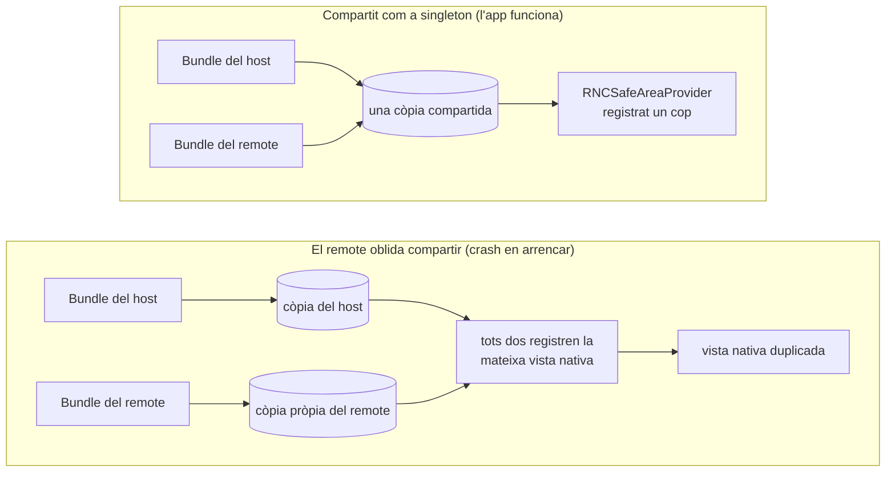

El [post anterior](/blog/your-first-federated-remote-react-native/) acabava apuntant aquí: el contracte de singletons compartits, i l'error que fa petar l'app en arrencar. Aquest post cobreix tots dos. Què vol dir de debò `shared`, les tres opcions que el controlen, i la fallada amb què topa un remote quan trenca el contracte en una llibreria amb costat natiu. Aquesta fallada és sorollosa, immediata, i s'anomena a si mateixa, cosa que la converteix en una de les més fàcils d'arreglar.

Reprenem just on ho va deixar el post 2. Si vas seguir el tutorial llavors, queda't amb el teu propi codi. Si no, parteix de l'estat final del post 2:

```sh
git clone https://github.com/warrendeleon/react-native-module-federation
git checkout post-02-first-remote
```

## Què volia dir "compartit" al post 2

El post 2 va declarar `react` i `react-native` com a singletons compartits i va tirar endavant. Aquí tens la meitat del host, a `apps/host/rspack.config.mjs`:

```js
shared: {
  react: { singleton: true, eager: true, requiredVersion: pkg.dependencies.react },
  'react-native': {
    singleton: true,
    eager: true,
    requiredVersion: pkg.dependencies['react-native'],
  },
},
```

Tres opcions fan la feina, i cadascuna respon a una pregunta diferent.

**`singleton: true` respon a "quantes còpies poden existir en runtime?"** Una. Quan el host i el remote demanen tots dos `react`, Module Federation els entrega la mateixa instància en comptes de deixar que cadascun carregui la seva. Aquesta és l'opció clau. React desa l'estat dels seus hooks en variables a nivell de mòdul, així que dues còpies de React en una app volen dir dos munts d'estat separats, i qualsevol hook cridat contra el munt equivocat llança un error.

**`eager: true` respon a "aquesta còpia està llesta abans que corri la primera línia de l'app?"** Al host, sí. Una entry normal de Module Federation és asíncrona: prepara el share scope i després arrenca el teu codi. React Native no et dona aquest marge. La seva entry és síncrona, així que el host marca les seves còpies compartides com a `eager` per carregar-les al share scope per endavant, abans que `AppRegistry` renderitzi res. El remote no necessita `eager`, perquè quan carrega, el host ja ha omplert el scope.

**`requiredVersion` respon a "quines versions compten com la mateixa?"** Fixa el rang acceptable, llegit directament del `package.json` del host. Treu-lo i Module Federation no pot saber si la còpia del host satisfà el remote, així que deixa de tractar-les com a intercanviables. Més sobre això al final, perquè és l'única fallada d'aquí que sí que es queda callada.

Fins aquí això és el post 2 amb el raonament afegit. El contracte comença a importar tan bon punt un remote depèn d'una tercera llibreria, no només de React.

## Una dependència de debò: el safe area

El `SafeAreaView` que porta React Native està deprecat. El reemplaçament mantingut és [react-native-safe-area-context](https://github.com/AppAndFlow/react-native-safe-area-context), i ve amb la plantilla actual de React Native, així que les dues apps del repo ja el tenen. És una bona prova del contracte perquè funciona a través d'un context de React: un `SafeAreaProvider` muntat a prop de l'arrel mesura el safe area del dispositiu, i qualsevol component per sota el llegeix amb `useSafeAreaInsets`.

En una app federada, el provider i el consumidor viuen en bundles diferents. El host és el propietari de la closca, així que el host munta el provider. Reescriu `apps/host/App.tsx`:

```tsx
import React, { Suspense } from 'react';
import { ActivityIndicator, StyleSheet } from 'react-native';
import { SafeAreaProvider } from 'react-native-safe-area-context';

const PokedexScreen = React.lazy(() => import('listApp/PokedexScreen'));

export default function App() {
  return (
    <SafeAreaProvider>
      <Suspense fallback={<ActivityIndicator style={styles.loader} size="large" />}>
        <PokedexScreen />
      </Suspense>
    </SafeAreaProvider>
  );
}

const styles = StyleSheet.create({
  loader: { flex: 1 },
});
```

El host ja no omple la pantalla ell mateix. Proveeix el context del safe area i entrega tot el llenç al remote. Ara el remote llegeix l'inset i manté el seu propi títol lluny del notch. Actualitza `apps/list/src/PokedexScreen.tsx`:

```tsx
import React from 'react';
import { FlatList, StyleSheet, Text, View } from 'react-native';
import { useSafeAreaInsets } from 'react-native-safe-area-context';

const POKEMON = [
  { id: 1, name: 'Bulbasaur' },
  { id: 4, name: 'Charmander' },
  { id: 7, name: 'Squirtle' },
  { id: 25, name: 'Pikachu' },
  { id: 133, name: 'Eevee' },
];

export default function PokedexScreen() {
  const insets = useSafeAreaInsets();
  return (
    <View style={[styles.screen, { paddingTop: insets.top + 24 }]}>
      <Text style={styles.title}>Pokédex</Text>
      <Text style={styles.subtitle}>Served by the list remote</Text>
      <FlatList
        data={POKEMON}
        keyExtractor={p => String(p.id)}
        renderItem={({ item }) => (
          <View style={styles.row}>
            <Text style={styles.number}>#{String(item.id).padStart(3, '0')}</Text>
            <Text style={styles.name}>{item.name}</Text>
          </View>
        )}
      />
    </View>
  );
}

const styles = StyleSheet.create({
  screen: { flex: 1, padding: 24, backgroundColor: '#fff' },
  title: { fontSize: 28, fontWeight: '700' },
  subtitle: { fontSize: 14, color: '#6b7280', marginBottom: 16 },
  row: {
    flexDirection: 'row',
    paddingVertical: 12,
    borderBottomWidth: StyleSheet.hairlineWidth,
    borderBottomColor: '#e5e7eb',
  },
  number: { width: 56, color: '#9ca3af', fontVariant: ['tabular-nums'] },
  name: { fontSize: 16, fontWeight: '500' },
});
```

Ara hi ha una encaixada de mans de context que travessa la frontera entre bundles: el provider és al host, i la crida a `useSafeAreaInsets` és al remote. Perquè això connecti, les dues apps necessiten el *mateix* `SafeAreaProvider`, de la mateixa còpia de la llibreria. Un context de React s'identifica per l'objecte que el crea. Dues còpies de la llibreria creen dos objectes de context diferents, i un consumidor que llegeix la còpia B mai no veurà un provider muntat des de la còpia A.

Per a això serveix el contracte. Afegeix la llibreria a `shared` a les dues configs, com a singleton. El host (`apps/host/rspack.config.mjs`), eager com les seves altres còpies compartides:

```js
shared: {
  react: { singleton: true, eager: true, requiredVersion: pkg.dependencies.react },
  'react-native': {
    singleton: true,
    eager: true,
    requiredVersion: pkg.dependencies['react-native'],
  },
  'react-native-safe-area-context': {
    singleton: true,
    eager: true,
    requiredVersion: pkg.dependencies['react-native-safe-area-context'],
  },
},
```

I el remote (`apps/list/rspack.config.mjs`), singleton però no eager:

```js
shared: {
  react: { singleton: true, requiredVersion: pkg.dependencies.react },
  'react-native': {
    singleton: true,
    requiredVersion: pkg.dependencies['react-native'],
  },
  'react-native-safe-area-context': {
    singleton: true,
    requiredVersion: pkg.dependencies['react-native-safe-area-context'],
  },
},
```

Arrenca els dos dev servers i corre el host (la [rutina de tres terminals del post 2](/blog/your-first-federated-remote-react-native/)). El Pokédex es renderitza amb el títol situat sota la Dynamic Island, amb el padding de l'inset que el remote va llegir del provider del host. Una llibreria, un provider, un objecte de context, compartits entre dues apps que es van construir i publicar per separat.

## Ara trenca-ho

Esborra una entrada. Treu `react-native-safe-area-context` del bloc `shared` del *remote*, deixant-lo al del host. Aquesta és la versió realista de l'error: l'autor del host el va compartir, l'autor del remote se'n va oblidar. Reinicia el dev server del remote i recarrega el host.

L'app no renderitza una pantalla una mica malament. Peta en arrencar:

```
Uncaught Error: Tried to register two views with the same name RNCSafeAreaProvider
```

<div class="device-frame">
  
</div>

I aquí tens per què és sorollós i no silenciós. `react-native-safe-area-context` no és JavaScript pur. Porta una vista nativa, `RNCSafeAreaProvider`, que registra al registre de vistes de React Native en arrencar. La còpia del host la registra un cop. Quan el remote deixa anar el share, empaqueta la seva pròpia còpia, i aquesta còpia intenta registrar el mateix nom natiu una segona vegada. React Native manté un únic registre per app i rebutja el duplicat. El crash salta abans que un sol Pokémon arribi a la pantalla.

<div id="crash-flow"></div>



Aquest és el patró per a qualsevol llibreria amb costat natiu: una llibreria de navegació, un gesture handler, un mòdul d'emmagatzematge. Comparteix-la des d'un únic lloc i funciona. Deixa que dos bundles portin cadascun la seva i xoquen a la capa nativa, aviat i de manera evident. L'error fins i tot anomena la vista, així que la solució apunta de tornada al share que falta.

Torna a posar aquesta entrada al bloc `shared` del remote, i l'app compila i corre de nou.

El mateix React falla igual de sorollosament, per un motiu diferent. Treu `react` del `shared` d'un remote i el remote empaqueta el seu propi React. El primer hook que corre el remote es comprova contra la còpia equivocada, i t'emportes el conegut red box d'`Invalid hook call`. Mateixa lliçó: el runtime no correrà en silenci dues còpies d'una cosa que es va dissenyar per ser una.

## La fallada que sí que es queda callada

Un cas es guanya l'etiqueta de "callat", i és `requiredVersion`. Mantén `singleton: true` però treu `requiredVersion`, i l'app es continua construint i corrent. La regla del singleton força una còpia, així que en desenvolupament, amb una sola versió instal·lada, no canvia res a la vista. El perill només apareix quan el host i un remote es construeixen contra versions realment diferents d'un paquet compartit de JavaScript pur. Sense un rang de versió per comprovar, Module Federation no pot avisar que no coincideixen. Carrega la còpia que guanyi i segueix endavant. Aquest és el que cal vigilar, perquè compila i es publica sense problemes, i només apareix quan dos equips acaben en versions diferents d'una dependència. Fixa `requiredVersion` des del `package.json`, com fan les configs de dalt, i converteixes aquesta deriva silenciosa en un avís que pots llegir.

Així que la regla pràctica és la tranquil·litzadora. Gairebé totes les maneres de trencar el contracte compartit peten en arrencar, anomenen el que vas fer malament, i et costen uns minuts. La callada és estreta i la tanques amb un sol camp.

## Què has construït, i què ve

El host és propietari d'un únic `SafeAreaProvider`. El remote llegeix els seus insets travessant la frontera entre bundles, perquè les dues apps resolen a una sola còpia compartida de la llibreria. Vas veure el contracte aguantar, després el vas veure petar quan un remote va oblidar la seva meitat, i ara saps que el crash és el resultat amable.

El codi acabat d'aquest post és l'etiqueta `post-03-shared-singleton`, perquè en puguis fer un diff contra el teu:

```sh
git checkout post-03-shared-singleton
```

El següent a la sèrie: el host deixa de ser una sola pantalla i es converteix en una closca de debò, propietària de la tab bar mentre cada pestanya és un remote carregat en runtime.

## Fonts

- [react-native-safe-area-context](https://github.com/AppAndFlow/react-native-safe-area-context): la llibreria de safe area mantinguda, i la vista nativa `RNCSafeAreaProvider` del crash
- [Module Federation 2.0](https://module-federation.io/): el contracte `shared`: `singleton`, `eager` i `requiredVersion`
- [react-native-module-federation](https://github.com/warrendeleon/react-native-module-federation): el repo company, a l'etiqueta `post-03-shared-singleton`
