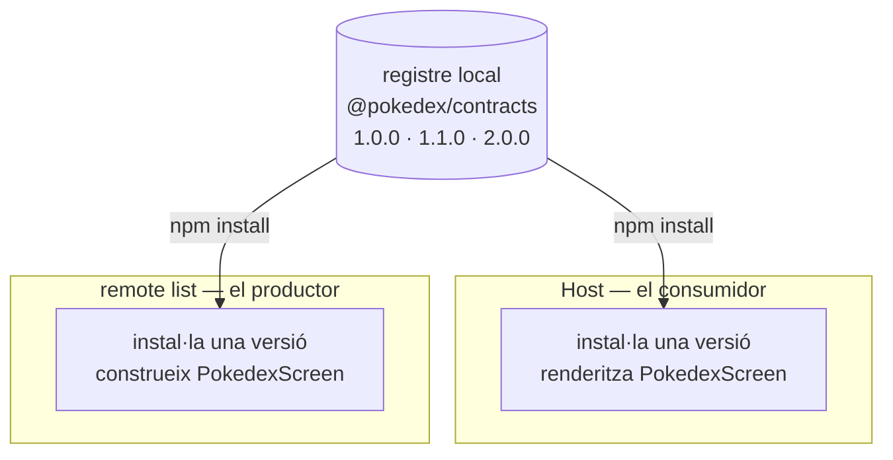

Fins ara el host ha carregat els seus remotes sense veure mai què exposen. Un remote es construeix i es desplega pel seu compte, així que en temps de compilació el host no té cap fitxer per a `listApp/PokedexScreen`; aquell mòdul només existeix en temps d'execució, un cop Module Federation el va a buscar. Per evitar que TypeScript es queixi, el host escriu a mà una forma per a ell:

```ts
declare module 'listApp/PokedexScreen' {
  import type React from 'react';
  const PokedexScreen: React.ComponentType;
  export default PokedexScreen;
}
```

Aquesta declaració és una suposició: l'autor del host la va escriure, el compilador se la creu, i res no la comprova contra la pantalla que el remote realment publica. Mentre la pantalla no rep props no costa res; en el moment que rep una prop, el host i el remote es poden contradir, i te n'assabentes en temps d'execució, no en compilar.

La solució és un contracte que els dos costats importen. Però aquí hi ha la part que decideix si val res: el host i el remote es construeixen i es despleguen pel seu compte, així que no poden compartir un fitxer en disc. Fins i tot en un sol repositori són builds separats, i en el món real solen ser repositoris separats d'equips separats. Així que el contracte no és un fitxer al qual arribes des de l'altre costat. És un paquet que publiques, i instal·les per versió. Aquest post el construeix, el publica en un registre, l'instal·la als dos costats, i després fa la pregunta que ho decideix tot: què passa quan el host i un remote acaben en versions diferents.

<div id="architecture"></div>



Continua amb el teu propi codi del post 4 si ho vas construir pas a pas. Si no, parteix del seu estat final:

```sh
git clone https://github.com/warrendeleon/react-native-module-federation
git checkout post-04-host-shell
```

## El contracte

El contracte és un paquet petit de tipus i res més. Crea `packages/contracts` al costat d'`apps`.

Els tipus que exporta, `packages/contracts/src/screens.ts`. Aquest és l'únic lloc on el host i el remote es posen d'acord sobre el que travessa la costura:

```ts
import type { ComponentType } from 'react';

export interface PokedexScreenProps {
  // The list remote reports which Pokémon was tapped. The host owns navigation and decides what
  // happens next, so the remote never imports a navigator; it just hands back an id.
  onSelectPokemon: (id: number) => void;
}

// The profile screen takes nothing from the host yet. An empty contract is still a contract: the
// host's import resolves to "a component with no props", enforced rather than assumed.
export type ProfileScreenProps = Record<string, never>;

// The exposed-module types, composed from the props above. The host's ambient declarations point at
// these, so a federated import is typed from the same source the remote was built against.
export type PokedexScreenModule = ComponentType<PokedexScreenProps>;
export type ProfileScreenModule = ComponentType<ProfileScreenProps>;
```

Un barrel, `packages/contracts/src/index.ts`:

```ts
export * from './screens';
```

El seu `package.json`. La versió és la part que més importarà: aquesta és `1.0.0`, el primer tall publicat de la costura. `publishConfig` apunta la publicació al registre local que arrencarem, i `prepublishOnly` construeix els tipus abans de cada publicació perquè els consumidors rebin sempre declaracions fresques:

```json
{
  "name": "@pokedex/contracts",
  "version": "1.0.0",
  "description": "The typed seam between the host and every federated remote: the props each exposed screen takes.",
  "main": "dist/index.js",
  "types": "dist/index.d.ts",
  "files": ["dist", "src", "README.md"],
  "scripts": {
    "build": "tsc",
    "typecheck": "tsc --noEmit",
    "prepublishOnly": "npm run build"
  },
  "publishConfig": {
    "registry": "http://localhost:4873/"
  },
  "peerDependencies": {
    "react": "*"
  },
  "devDependencies": {
    "@types/react": "^19.2.0",
    "typescript": "^5.8.3"
  }
}
```

El seu `tsconfig.json` emet declaracions a `dist`, perquè els consumidors rebin tipus a més de JavaScript:

```json
{
  "compilerOptions": {
    "target": "ES2020",
    "module": "CommonJS",
    "moduleResolution": "node",
    "lib": ["ES2020"],
    "jsx": "react-jsx",
    "strict": true,
    "esModuleInterop": true,
    "skipLibCheck": true,
    "declaration": true,
    "declarationMap": true,
    "sourceMap": true,
    "outDir": "dist",
    "rootDir": "src",
    "forceConsistentCasingInFileNames": true,
    "isolatedModules": true
  },
  "include": ["src/**/*"],
  "exclude": ["dist", "node_modules"]
}
```

Com que cada export és un tipus, l'import s'esborra en construir. Res d'aquest paquet arriba a un bundle, i no hi ha cap dependència de runtime a compartir com es comparteix `react`. Reflecteix el contracte del post 3 en una altra capa: el post 3 compartia una llibreria en temps d'execució perquè l'app no peti; aquest comparteix un tipus en temps de compilació perquè el build no menteixi.

## Publica'l en un registre

Una ruta `file:` a `../../packages/contracts` funcionaria aquí, perquè en aquest monorepo les apps són veïnes en disc. També ensenyaria una cosa equivocada. Tot el sentit d'un remote federat és que es construeix i es desplega pel seu compte; el dia que passi al seu propi repositori, una ruta a través del sistema de fitxers desapareix. Així que tractem el contracte com l'hauran de tractar els seus consumidors en producció: un paquet versionat que es descarrega d'un registre.

En local, aquest registre és [Verdaccio](https://verdaccio.org/), un registre npm petit que executes tu mateix. Fa les funcions del que facis servir en producció: un registre npm privat, GitHub Packages o Artifactory. Arrenca'l a la seva pròpia terminal:

```sh
npx verdaccio
```

Arrenca a `http://localhost:4873`. Registra un usuari contra ell un cop, cosa que escriu un token al teu `~/.npmrc` d'usuari:

```sh
npm adduser --registry http://localhost:4873
```

Apunta el scope `@pokedex` al registre local perquè les dues apps resolguin el contracte allà, mentre tota la resta segueix venint de npm. Un `.npmrc` a nivell de projecte a l'arrel del repo:

```sh
@pokedex:registry=http://localhost:4873/
```

Construeix i publica des del paquet. `prepublishOnly` executa el build per tu:

```sh
cd packages/contracts
npm publish
```

```sh
+ @pokedex/contracts@1.0.0
```

Ara la costura és un artefacte publicat amb una versió a sobre. Aquesta versió està a punt de fer feina de debò.

## Instal·la'l als dos costats

El host i el remote list prenen cadascun el contracte com a dependència, per rang de versió. Afegeix-lo a `apps/host/package.json` i `apps/list/package.json`:

```json
"dependencies": {
  "@pokedex/contracts": "^1.0.0",
  ...
}
```

Després `npm install` a cadascuna. Aquest cop és una instal·lació de debò: cada app descarrega i desempaqueta la seva pròpia còpia de `@pokedex/contracts@1.0.0` a `node_modules`, en lloc d'apuntar a una carpeta compartida com faria una ruta `file:`. El host i el remote tenen cadascun la versió que van demanar.

El remote list construeix la seva pantalla contra el contracte. Les seves props vénen de `@pokedex/contracts`, així que la signatura es comprova contra el mateix tipus amb què el host renderitzarà. `apps/list/src/PokedexScreen.tsx`:

```tsx
import React from 'react';
import { FlatList, Pressable, StyleSheet, Text, View } from 'react-native';
import { useSafeAreaInsets } from 'react-native-safe-area-context';
import type { PokedexScreenProps } from '@pokedex/contracts';

const POKEMON = [
  { id: 1, name: 'Bulbasaur' },
  { id: 4, name: 'Charmander' },
  { id: 7, name: 'Squirtle' },
  { id: 25, name: 'Pikachu' },
  { id: 133, name: 'Eevee' },
];

export default function PokedexScreen({ onSelectPokemon }: PokedexScreenProps) {
  const insets = useSafeAreaInsets();
  return (
    <View style={[styles.screen, { paddingTop: insets.top + 24 }]}>
      <Text style={styles.title}>Pokédex</Text>
      <Text style={styles.subtitle}>Served by the list remote</Text>
      <FlatList
        data={POKEMON}
        keyExtractor={p => String(p.id)}
        renderItem={({ item }) => (
          <Pressable style={styles.row} onPress={() => onSelectPokemon(item.id)}>
            <Text style={styles.number}>#{String(item.id).padStart(3, '0')}</Text>
            <Text style={styles.name}>{item.name}</Text>
          </Pressable>
        )}
      />
    </View>
  );
}

const styles = StyleSheet.create({
  screen: { flex: 1, padding: 24, backgroundColor: '#fff' },
  title: { fontSize: 28, fontWeight: '700' },
  subtitle: { fontSize: 14, color: '#6b7280', marginBottom: 16 },
  row: {
    flexDirection: 'row',
    paddingVertical: 12,
    borderBottomWidth: StyleSheet.hairlineWidth,
    borderBottomColor: '#e5e7eb',
  },
  number: { width: 56, color: '#9ca3af', fontVariant: ['tabular-nums'] },
  name: { fontSize: 16, fontWeight: '500' },
});
```

El host renderitza la pantalla i passa un handler. El remote list reporta un id; el host és el propietari de la navegació i decideix què fer-ne, així que el remote mai no importa un navigator. L'embolcall genèric sense props del post 4 no pot portar cap prop, així que cada pestanya rep el seu propi embolcall petit. El `apps/host/App.tsx` complet:

```tsx
import React, { Suspense } from 'react';
import { ActivityIndicator, StyleSheet } from 'react-native';
import { SafeAreaProvider } from 'react-native-safe-area-context';
import { NavigationContainer } from '@react-navigation/native';
import { createBottomTabNavigator } from '@react-navigation/bottom-tabs';

const PokedexScreen = React.lazy(() => import('listApp/PokedexScreen'));
const ProfileScreen = React.lazy(() => import('profileApp/ProfileScreen'));

// The host owns navigation, so it owns what a selection means. The list remote reports an id through
// the onSelectPokemon prop typed in @pokedex/contracts; for now the host just logs it, and a later
// post wires it to a detail route. Pass a wrong-shaped handler here and TypeScript stops the build.
function handleSelectPokemon(id: number) {
  console.log(`Selected Pokémon #${id}`);
}

function PokedexTab() {
  return (
    <Suspense fallback={<ActivityIndicator style={styles.loader} size="large" />}>
      <PokedexScreen onSelectPokemon={handleSelectPokemon} />
    </Suspense>
  );
}

function ProfileTab() {
  return (
    <Suspense fallback={<ActivityIndicator style={styles.loader} size="large" />}>
      <ProfileScreen />
    </Suspense>
  );
}

const Tab = createBottomTabNavigator();

export default function App() {
  return (
    <SafeAreaProvider>
      <NavigationContainer>
        <Tab.Navigator screenOptions={{ headerShown: false }}>
          <Tab.Screen name="Pokédex" component={PokedexTab} />
          <Tab.Screen name="Trainer" component={ProfileTab} />
        </Tab.Navigator>
      </NavigationContainer>
    </SafeAreaProvider>
  );
}

const styles = StyleSheet.create({
  loader: { flex: 1 },
});
```

Per últim, retira la suposició. `apps/host/mf-modules.d.ts` deixa d'escriure la forma a mà i la pren prestada del contracte:

```ts
declare module 'listApp/PokedexScreen' {
  import type { PokedexScreenModule } from '@pokedex/contracts';
  const PokedexScreen: PokedexScreenModule;
  export default PokedexScreen;
}

declare module 'profileApp/ProfileScreen' {
  import type { ProfileScreenModule } from '@pokedex/contracts';
  const ProfileScreen: ProfileScreenModule;
  export default ProfileScreen;
}
```

Fes el typecheck del host i del list (`npx tsc --noEmit`, executat dins de cada app). Tots dos passen, cadascun contra el mateix `1.0.0` publicat. Productor i consumidor ara coincideixen en la costura a través d'un artefacte, no d'una suposició. Per ara això sembla un simple tràmit. La versió ho converteix en una cosa més.

## La prova de debò: quan les versions divergeixen

En un monorepo amb un sol build, la divergència es detecta de franc, perquè tot compila junt. Aquesta xarxa de seguretat és justament el que una app federada deixa enrere: el host i cada remote es construeixen, i es despleguen, pel seu compte. Poden estar en versions diferents del contracte al mateix temps. Si això és inofensiu o fatal és el veritable tema d'aquest post.

### Canvi additiu: divergir és segur

Posem que el remote list vol suportar una pulsació llarga, i que el host potser li passi un handler algun dia. Afegeix la prop al contracte, opcional a propòsit:

```ts
export interface PokedexScreenProps {
  onSelectPokemon: (id: number) => void;
  // Added in 1.1.0. Optional on purpose: a host built against 1.0.0 never passes it, and still
  // satisfies the contract. That is what makes an additive change safe to roll out unevenly.
  onLongPressPokemon?: (id: number) => void;
}
```

Això afegeix a la costura sense canviar res del que ja hi havia, així que és una pujada minor. Posa la versió a `1.1.0` i publica:

```sh
+ @pokedex/contracts@1.1.0
```

El remote list l'adopta, i connecta la pulsació llarga amb optional chaining perquè sigui un no-op segur fins que un host passi un handler:

```tsx
export default function PokedexScreen({
  onSelectPokemon,
  onLongPressPokemon,
}: PokedexScreenProps) {
  // ...
  <Pressable
    style={styles.row}
    onPress={() => onSelectPokemon(item.id)}
    onLongPress={() => onLongPressPokemon?.(item.id)}
  >
```

Instal·la `1.1.0` al list, i deixa el host a `1.0.0`:

```sh
cd apps/list && npm install @pokedex/contracts@1.1.0
```

Ara els dos costats estan en versions diferents, i tots dos passen el typecheck. El list construeix contra `1.1.0`, que té la prop nova. El host construeix contra `1.0.0`, que no la té, així que el host mai no la passa, i una pantalla que només requereix `onSelectPokemon` està contenta sense ella. Un canvi additiu es desplega de manera desigual i segueix sent segur, que és tota la raó per la qual existeix un rang amb caret com `^1.0.0`: el host agafarà `1.1.0` en la seva pròxima instal·lació, però no té cap pressió per actualitzar al mateix temps. Executa `npm install @pokedex/contracts` al host quan vulguis, i els dos costats estan a `1.1.0`.

### Canvi incompatible: la versió fa feina de debò

Ara un canvi que no pot ser additiu. Suposa que l'equip decideix que els ids haurien de ser strings. Això re-tipa una prop existent, així que qualsevol cosa construïda contra la forma antiga està malament. Semver té un nom per a això, una pujada major. Posa la versió a `2.0.0`, canvia el tipus, i publica:

```ts
onSelectPokemon: (id: string) => void;
```

```sh
+ @pokedex/contracts@2.0.0
```

Passen tres coses, i juntes són el sentit de tot el paquet.

**El caret el rebutja.** El host està en `^1.x`. Instal·la, i després comprova a què s'ha resolt:

```sh
cd apps/host && npm install @pokedex/contracts
npm ls @pokedex/contracts
```

```sh
Host@0.0.1
└── @pokedex/contracts@1.1.0
```

Agafa `1.1.0`, la `1.x` més nova, i no creuarà a `2.0.0` pel seu compte. Un canvi incompatible no es propaga en silenci; algú ha de demanar-lo per versió major. Semver està fent la seva feina abans que s'executi una línia del teu codi.

**Optar-hi detecta la divergència.** Mou el list a `2.0.0` a propòsit, sense canviar el seu codi, i deixa de compilar:

```sh
cd apps/list && npm install @pokedex/contracts@2.0.0
```

```sh
src/PokedexScreen.tsx(32,44): error TS2345: Argument of type 'number' is not assignable to parameter of type 'string'.
src/PokedexScreen.tsx(33,53): error TS2345: Argument of type 'number' is not assignable to parameter of type 'string'.
```

La versió va detectar el desajust en el moment en què el list la va adoptar. Dins d'un repositori, contra una versió instal·lada, el contracte funciona exactament com esperaries.

**Entre versions, res no ho comprova.** Adapta el list a `2.0.0` perquè passi strings, i deixa el host a `1.1.0`:

```tsx
onPress={() => onSelectPokemon(String(item.id))}
```

Els dos repositoris compilen, el list contra `2.0.0` i el host contra `1.1.0`, i no estan d'acord: el handler del host està tipat per a un number, el list ara envia un string, i cap compilador pot veure entre les dues versions instal·lades. Aquest és el límit honest d'un contracte de tipus. És una especificació en temps de compilació, no una garantia en temps d'execució; no pot vigilar una frontera entre dues unitats que van fixar majors diferents. En temps d'execució el string arriba on el host esperava un number, sense res que ho aturi, i pitjor encara, pot ser que ni tan sols peti. Un simple `console.log` s'empassa la diferència. El bug apareix més tard, allà on l'id es faci servir com a number: una comparació que mai no coincideix, una ordenació numèrica que es descol·loca, un paràmetre de ruta tipat que falla.

Així que un canvi incompatible és un desplegament coordinat, no una publicació. Mous els dos costats a `2.0.0` alhora, o segueixes servint la versió antiga del remote fins que el host es posi al dia, una cosa que la federació fa possible i que construeix un post posterior. La feina de semver aquí no és evitar la ruptura. És fer que la ruptura sigui sorollosa i deliberada en lloc de silenciosa. Torna a posar el contracte a `1.1.0`; no publicarem strings, però tot equip federat ha de saber com és això abans que li passi en producció.

## Executa'l

Verdaccio només cal per publicar i instal·lar. Un cop el contracte és a `node_modules`, s'esborra en construir, així que l'app en execució mai no toca el registre. L'execució és la del post 4, amb cada remote i el host a la seva pròpia terminal:

```sh
cd apps/list && npm run start:remote      # :8082
cd apps/profile && npm run start:remote   # :8083
cd apps/host && npm start                 # :8081
cd apps/host && npm run ios
```

L'app es veu exactament com després del post 4: dues pestanyes, la llista Pokédex servida pel remote list. Toca un Pokémon i el host registra la selecció que ha rebut a través de la costura, per una prop que els dos costats tipen des d'una sola versió publicada.

<div class="device-frame">
  
</div>

## Què has construït, i què ve

La costura entre el host i els seus remotes és un artefacte publicat, versionat i revisable. Un canvi en ella apareix en un diff i en un número de versió, on els dos equips poden veure si és additiu o incompatible, en lloc de dos costats divergint a cegues contra una suposició. Els canvis additius es despleguen de manera desigual i segueixen sent segurs. Els canvis incompatibles es neguen a propagar-se sols i forcen un moviment coordinat. Res d'això és gratis: la publicació i les pujades de versió són feina de debò, però aquesta feina és el preu de deixar que dues apps es despleguin pel seu compte. Si no ho vols, no vols federació; vols una sola app.

L'única cosa que el contracte no pot fer és vigilar la frontera en temps d'execució, perquè per llavors els tipus ja no hi són. Una comprovació en temps d'execució a la costura és la salvaguarda: valida el que de debò la travessa amb una llibreria d'esquemes com Zod, perquè un valor equivocat falli a crits a la frontera en lloc de colar-se per un tipus que ja no existeix. Aquesta comprovació té el seu propi post més endavant a la sèrie.

El codi acabat d'aquest post és el tag `post-05-contracts`, així que el pots comparar amb el teu:

```sh
git checkout post-05-contracts
```

El següent, un breu desviament abans del treball d'estat federat: dos posts sobre l'estat de React en si, començant per la divisió entre estat de servidor i estat de client i per què una app de React els guarda en dues llibreries diferents. Després ho tornem a portar a la federació, on les pestanyes deixen de tenir dades hardcodejades i comparteixen un store entre els remotes, amb dades reals d'una API.

## Fonts

- [Verdaccio](https://verdaccio.org/) — el registre npm local on es publica el contracte
- [Module Federation 2.0](https://module-federation.io/) — el runtime que carrega cada remote que el contracte descriu
- [TypeScript: ambient modules](https://www.typescriptlang.org/docs/handbook/modules/reference.html#ambient-modules) — per què un import que només existeix en temps d'execució encara necessita una forma declarada
- [semver](https://semver.org/) — què promet a un consumidor una pujada major enfront d'una minor
- [react-native-module-federation](https://github.com/warrendeleon/react-native-module-federation) — el repo d'acompanyament, al tag `post-05-contracts`
