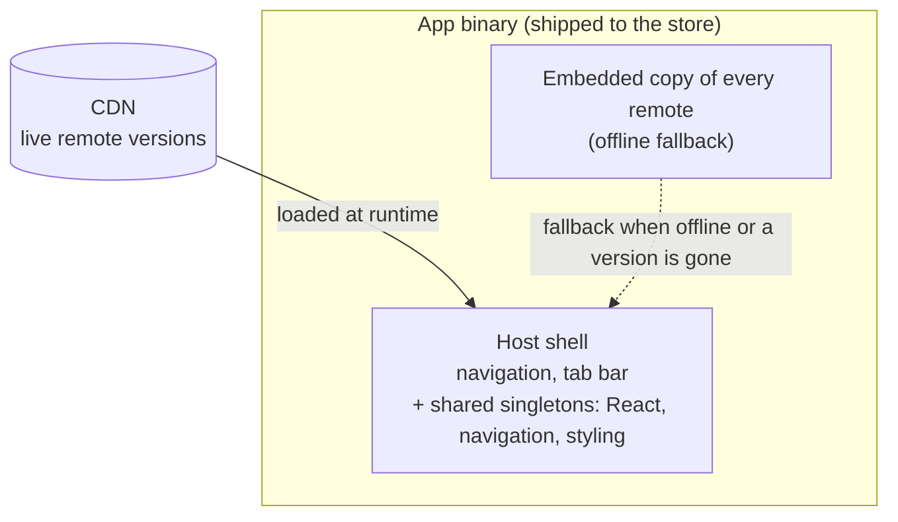

La versió curta: Module Federation permet que una app de React Native carregui les seves funcionalitats en temps d'execució, de manera que cadascuna es pot desplegar i actualitzar pel seu compte en lloc de viatjar en una sola publicació a l'app store. Això et dóna desplegaments independents i correccions over-the-air. També et posa a sobre un problema de sistemes distribuïts que abans era feina del bundler. Aquesta sèrie construeix un setup federat funcional des de zero sobre una petita app Pokédex. Aquest primer post tracta de si ho hauries de fer.

## Cada funcionalitat viatja en cada publicació

Una app de React Native estàndard és un sol bundle. Organitza-la bé, [per funcionalitat](/blog/feature-first-project-structure-react-native/) en lloc de per tipus, i això no canvia res aquí: la pantalla de login, la pàgina de configuració, l'informe que ningú obre, tot compilat junt, tot passant per la mateixa revisió de l'store, tot viatjant en el mateix tren de publicació. Una correcció d'una línia en una pantalla espera que tota l'app es reconstrueixi, es torni a enviar i s'aprovi.

Per a una app petita amb un sol equip, no passa res. El tren de publicació és barat i tothom hi va de totes maneres. Per a una app gran amb diversos equips, és car. La correcció urgent d'un equip queda darrere de la funcionalitat a mig fer d'un altre perquè comparteixen un binari. La publicació es converteix en una negociació i la cadència cau fins al col·laborador més lent del tren.

Aquest acoblament és el que Module Federation intenta desfer. No la mida del bundle, no la velocitat de build, això són efectes secundaris agradables. El premi de veritat és trencar el lligam entre "he canviat la meva funcionalitat" i "tota l'app s'ha de publicar".

## Què és en realitat

Una app federada té un **host** i un conjunt de **remotes**. El host és la closca: navegació, la tab bar, les llibreries compartides, les peces que sempre hi són. Els remotes són les funcionalitats, i cadascun es construeix i es desplega pel seu compte, després s'incorpora en temps d'execució des d'una URL.

El host no compila els remotes dins seu com fa un sol bundle. Una còpia de cadascun encara viatja dins del binari de l'app com a fallback, l'app revisada ha de funcionar per si sola, sense xarxa, però aquesta còpia és només el mínim garantit; la versió en viu ve del CDN i s'actualitza sense una publicació. El host també proporciona les llibreries compartides pesades un sol cop, React, el navigation stack, la capa d'estils, així cada remote consumeix la còpia del host en lloc de portar la seva. Un remote esdevé una petita càrrega de codi de funcionalitat que encaixa en una closca que ja té tot per sota.

A la pràctica això s'executa sobre [Re.Pack](https://re-pack.dev/) (Rspack per sota) amb [Module Federation 2.0](https://module-federation.io/). La mecànica és un post posterior. De moment el model mental ja n'hi ha prou: una closca que carrega funcionalitats en temps d'execució, des de la xarxa o d'un fallback incrustat, contra un contracte sobre què proporciona la closca.

## Què t'aporta

**Desplegaments independents.** Un equip de funcionalitat publica quan la seva funcionalitat està llesta, no quan surt el tren. La publicació deixa de ser un recurs compartit pel qual tothom fa cua.

**Correccions over-the-air.** Un bug en un remote és una repujada d'aquell remote, no un enviament a l'store. La correcció està en viu en minuts, i cada usuari l'agafa al següent arrencada, dins de les regles de la plataforma (més sobre això a sota).

**Arrencades més ràpides.** Les funcionalitats que no calen a l'arrencada es carreguen de manera lazy, així s'executa menys JavaScript al camí crític. La descàrrega en si no es redueix si envies un fallback offline, el binari segueix portant cada remote, però l'arrencada sí.

**Autonomia d'equip a escala.** Cada funcionalitat és propietària del seu propi build, el seu propi desplegament, la seva pròpia cadència. L'arquitectura deixa de forçar els equips a anar tots a una.

Si cap d'aquests no és un dolor que sentis de veritat, la resta d'aquest post és la teva sortida. La federació resol l'acoblament. Sense acoblament, cap motiu per pagar la solució.

## Què costa

Aquesta és la part que els posts entusiastes es salten, així que és la part que val la pena anar a poc a poc.

**El contracte de singletons compartits.** El host proporciona un React, una llibreria de navegació, una capa d'estils, i cada remote es renderitza contra aquests. En el moment que un remote necessita una versió *més nova* d'una llibreria compartida que la que porta el host, tens un problema de version skew. Sense gestionar-ho, el runtime negocia a la baixa cap a la còpia del host i el remote peta en una API que aquella còpia no té. Té solució, la sèrie construeix la correcció, però resoldre-ho és el cost: el conjunt compartit esdevé un contracte del qual ets propietari i que has de mantenir compatible, feina que el compilador feia gratis.

**La càrrega de compatibilitat, sobretot per a versions antigues de l'app.** Els usuaris no actualitzen tots. Un binari que algú es va instal·lar fa mesos té les llibreries compartides congelades a allò que es va publicar llavors. Empeny un remote que necessita unes de més noves i trenques exactament la gent que no s'ha mogut. Així que acabes mantenint disponibles versions antigues del remote per a versions antigues de l'app, la mateixa disciplina que mantenir viu un endpoint d'API antic fins que l'últim client deixa de cridar-lo. Això no és feina de bundler. Això és fer funcionar un servei versionat.

**Integritat.** Un cop la teva app descarrega i executa codi des d'una URL, aquella URL és una superfície d'atac. Has de signar el que envies i fer que el dispositiu ho verifiqui abans d'executar-ho, o un host compromès pot donar als teus usuaris el que vulgui. Després has de protegir també la *tria* de versió, perquè un manifest repetit o revertit no pugui servir en silenci un build antic i vulnerable. Seguretat que un sol binari signat et donava gratis, ara la construeixes tu.

**Regles de plataforma.** La [directriu 2.5.2 d'Apple](https://developer.apple.com/app-store/review/guidelines/#software-requirements) permet que una app descarregui i executi codi interpretat com JavaScript, que és el que fa que l'OTA sigui legal del tot, però només mentre no canviï el propòsit principal de l'app, i el binari que envies encara ha de funcionar per si sol. Res d'enviar funcionalitats grans sense revisar over-the-air. La federació viu dins d'aquestes línies; no les esborra.

**Superfície operativa.** Un CDN per fer funcionar, caches per invalidar, rollbacks per programar, fallades per monitoritzar. Quan un remote no carrega, l'app ha de degradar a alguna cosa segura en lloc de mostrar una pantalla en blanc. Aquesta xarxa de seguretat és enginyeria de veritat, i recau en tu.

Tot junt: Module Federation és un problema de sistemes distribuïts vestit de bundler. La part de bundler és acotada, la configures i ja està. La part de sistemes, signatura, versionat, compatibilitat, fallback, és la feina de veritat, i no acaba mai del tot.

## Quan val la pena

Tira'n quan totes tres siguin certes:

- **Diversos equips** s'estan trepitjant en una publicació compartida.
- **L'acoblament és un cost mesurat**, cadència més lenta, correccions bloquejades, no un de teòric.
- **Algú pot ser propietari de la plataforma**, el CDN, la signatura, el contracte de versions, la capa de fallback, com a feina contínua.

Salta-t'ho quan l'app és petita, un sol equip n'és propietari, i una publicació a l'store cada parell de setmanes no és cap càrrega. La complexitat que assumiries empetiteix l'acoblament que trauries. El code splitting sol, chunks asíncrons sense la maquinària de runtime-remote, et dóna el lazy-loading i l'arrencada més ràpida a una fracció del cost, i és un punt sensat per aturar-se abans de la federació completa.

La federació és una eina per escalar. Adopta-la perquè has arribat a l'escala que la justifica, no perquè l'arquitectura sigui interessant. Ho és. Aquesta és la trampa.

## Què fa la resta d'aquesta sèrie

A partir d'aquí és pràctic. Construïm un setup federat sobre una petita app Pokédex i el portem fins al final:

- un host i un primer remote, carregant en temps d'execució
- el contracte de singletons compartits, i la trampa que el fa fallar en silenci
- carregar remotes des d'un CDN, amb un fallback offline incrustat dins de l'app
- signar remotes i el manifest de versions perquè un build manipulat o repetit no pugui executar-se
- i la difícil, assegurar que una versió antiga de l'app mai rebi un remote que no pot executar, i mai peti quan en falta un

Al final tindràs una versió funcional de tot el que aquest post acaba d'advertir-te, i una idea clara de si és un canvi que la teva app hauria de fer.

## Fonts

- [Re.Pack](https://re-pack.dev/): el bundler de React Native que embolcalla Rspack i incorpora suport per a Module Federation
- [Module Federation 2.0](https://module-federation.io/): l'arquitectura de runtime
- [Rspack](https://rspack.dev/): el bundler basat en Rust que hi ha sota Re.Pack
- [App Store Review Guidelines, 2.5.2](https://developer.apple.com/app-store/review/guidelines/#software-requirements): la regla d'Apple sobre codi interpretat descarregat
