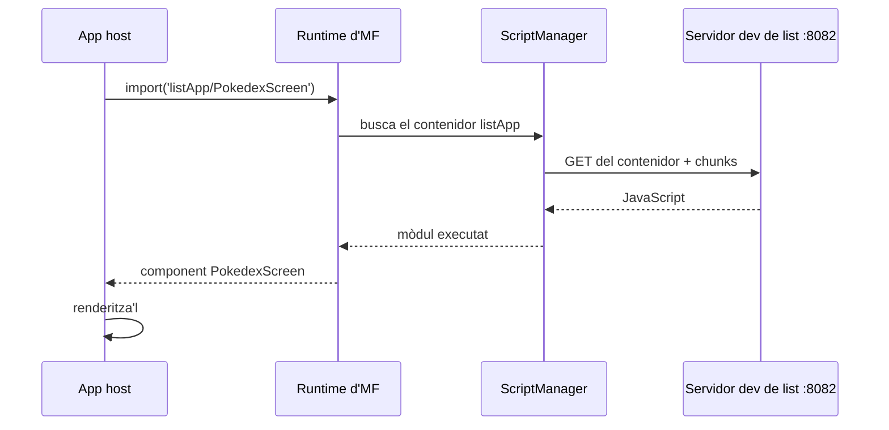

El [primer post](/blog/why-module-federation-react-native/) defensava Module Federation. Aquest construeix la versió real més petita: dues apps de React Native separades, on una app (el host) carrega una pantalla de l'altra (un remote) mentre s'està executant. Anem d'una carpeta buida a una app en funcionament, amb cada pas a la vista.

El codi acabat és al repo company a l'etiqueta d'aquest post, així el pots clonar i fer-ne un diff contra el teu si alguna cosa deriva:

```sh
git clone https://github.com/warrendeleon/react-native-module-federation
git checkout post-02-first-remote
```

Això és el que tindràs al final. La llista de Pokémon a la pantalla viu en, i és servida per, una app *diferent* de la que s'està executant:

<div class="device-frame">
  
</div>

## Dues apps

Una federació necessita un host i com a mínim un remote. Crea dues apps de React Native noves:

```sh
mkdir react-native-module-federation && cd react-native-module-federation
npx @react-native-community/cli@20.1.0 init Host --directory apps/host --version 0.85.3
npx @react-native-community/cli@20.1.0 init List --directory apps/list --version 0.85.3
```

Les versions estan fixades a propòsit: aquesta sèrie està construïda i verificada sobre RN 0.85.3 amb Re.Pack 5.2.5, al simulador d'iOS. Un scaffold de RN més nou probablement funcionarà, però series el primer a descobrir-ho. (Android fa anar les mateixes configs, amb un matís: les URLs de manifest amb `localhost` necessiten `adb reverse`, o `10.0.2.2` al seu lloc.)

`host` és la closca que l'usuari obre. `list` és una funcionalitat que s'hi carregarà en temps d'execució.

## Posa les dues sobre Re.Pack

React Native ve amb Metro. Module Federation 2.0 s'executa sobre [Re.Pack](https://re-pack.dev/) (Rspack per sota), així que la primera feina és canviar el bundler. Els passos són idèntics a les dues apps.

Instal·la el bundler i els paquets de federació a cada app:

```sh
npm install -D @callstack/repack @rspack/core \
  @module-federation/enhanced @swc/helpers
```

`@swc/helpers` és el fàcil de passar per alt. Re.Pack compila el teu codi amb SWC (el Speedy Web Compiler, una alternativa basada en Rust a Babel que fa servir per sota). Quan SWC compila sintaxi moderna a la baixa, emet crides `require("@swc/helpers/…")` a una petita llibreria d'helpers compartida en lloc d'incrustar el mateix boilerplate per tot arreu. Salta't el paquet i el build falla amb una pantalla d'errors "can't resolve" que no donen cap pista de la causa real.

Ara apunta la CLI de React Native cap a Re.Pack. A **les dues** apps, afegeix `react-native.config.js`:

```js
// apps/host/react-native.config.js  AND  apps/list/react-native.config.js
module.exports = {
  commands: require('@callstack/repack/commands/rspack'),
};
```

Aquest sol fitxer és el que fa que `react-native start` i `react-native bundle` facin servir Rspack en lloc de Metro. El bundler està canviat. El que difereix entre host i remote és el `rspack.config.mjs` que rep cadascun, que és on es configura la federació.

## El remote: exposa una pantalla

Un remote federat és una app sense `AppRegistry.registerComponent`. No s'arrenca a si mateix, espera ser incorporat a un host. Declara un nom i el que reparteix.

Primer la pantalla que reparteix, `apps/list/src/PokedexScreen.tsx`. React Native pelat a propòsit, aquest post tracta de carregar-la, no d'estilitzar-la:

```tsx
import React from 'react';
import { FlatList, StyleSheet, Text, View } from 'react-native';

const POKEMON = [
  { id: 1, name: 'Bulbasaur' },
  { id: 4, name: 'Charmander' },
  { id: 7, name: 'Squirtle' },
  { id: 25, name: 'Pikachu' },
  { id: 133, name: 'Eevee' },
];

export default function PokedexScreen() {
  return (
    <View style={styles.screen}>
      <Text style={styles.title}>Pokédex</Text>
      <Text style={styles.subtitle}>Served by the list remote</Text>
      <FlatList
        data={POKEMON}
        keyExtractor={p => String(p.id)}
        renderItem={({ item }) => (
          <View style={styles.row}>
            <Text style={styles.number}>#{String(item.id).padStart(3, '0')}</Text>
            <Text style={styles.name}>{item.name}</Text>
          </View>
        )}
      />
    </View>
  );
}

const styles = StyleSheet.create({
  screen: { flex: 1, padding: 24, backgroundColor: '#fff' },
  title: { fontSize: 28, fontWeight: '700' },
  subtitle: { fontSize: 14, color: '#6b7280', marginBottom: 16 },
  row: {
    flexDirection: 'row',
    paddingVertical: 12,
    borderBottomWidth: StyleSheet.hairlineWidth,
    borderBottomColor: '#e5e7eb',
  },
  number: { width: 56, color: '#9ca3af', fontVariant: ['tabular-nums'] },
  name: { fontSize: 16, fontWeight: '500' },
});
```

El punt d'entrada del container, `apps/list/src/index.js`, és gairebé buit. Un remote no registra cap component arrel, així que no té res a fer a l'arrencada:

```js
// apps/list/src/index.js
export {};
```

Ara la config, `apps/list/rspack.config.mjs`:

```js
import path from 'node:path';
import { fileURLToPath } from 'node:url';
import * as Repack from '@callstack/repack';
import pkg from './package.json' with { type: 'json' };

const __dirname = path.dirname(fileURLToPath(import.meta.url));

export default Repack.defineRspackConfig(env => {
  const { mode, platform } = env;

  return {
    mode,
    context: __dirname,
    entry: './src/index.js',
    resolve: {
      // Lets the resolver read each package's `exports` map, which the Module Federation
      // runtime needs for subpath imports like '@module-federation/runtime/helpers'.
      ...Repack.getResolveOptions({ enablePackageExports: true }),
    },
    output: {
      path: `${__dirname}/build/[platform]`,
      uniqueName: 'ListApp',
    },
    module: {
      rules: [
        {
          test: /\.[cm]?[jt]sx?$/,
          type: 'javascript/auto',
          use: { loader: '@callstack/repack/babel-swc-loader', parallel: true, options: {} },
        },
        ...Repack.getAssetTransformRules(),
      ],
    },
    plugins: [
      new Repack.RepackPlugin({
        extraChunks: [
          { include: /.*/, type: 'remote', outputPath: `build/${platform}/remote` },
        ],
      }),
      new Repack.plugins.ModuleFederationPluginV2({
        name: 'listApp',
        filename: 'listApp.container.js.bundle',
        exposes: {
          './PokedexScreen': './src/PokedexScreen.tsx',
        },
        dts: false,
        shared: {
          react: { singleton: true, requiredVersion: pkg.dependencies.react },
          'react-native': {
            singleton: true,
            requiredVersion: pkg.dependencies['react-native'],
          },
        },
      }),
    ],
  };
});
```

Tres coses d'aquí importen. `exposes` mapeja una clau pública, `./PokedexScreen`, a un fitxer. Aquesta clau és tota la superfície pública del remote. `shared` declara react i react-native com a singletons, així el remote es renderitza contra l'única còpia del host en lloc d'empaquetar la seva (dos React en un mateix runtime trencarien els hooks). I `enablePackageExports: true` no és opcional: sense això el runtime de federació no pot resoldre els seus propis subpath imports i el build falla.

Afegeix un script de dev-server a `apps/list/package.json`:

```json
"scripts": {
  "start:remote": "react-native start --config rspack.config.mjs --port 8082"
}
```

Arrenca'l:

```sh
cd apps/list && npm run start:remote
```

Serveix un manifest a `http://localhost:8082/ios/mf-manifest.json` que descriu el container i la pantalla que exposa. Obre aquesta URL i veuràs `./PokedexScreen` a la llista. El remote no renderitza res per si sol, és una funcionalitat que espera una app.

## El host: carrega el remote

El host és una app de React Native corrent. El seu `apps/host/rspack.config.mjs` consumeix el remote:

```js
import path from 'node:path';
import { fileURLToPath } from 'node:url';
import * as Repack from '@callstack/repack';
import pkg from './package.json' with { type: 'json' };

const __dirname = path.dirname(fileURLToPath(import.meta.url));

export default Repack.defineRspackConfig(env => {
  const { mode, platform } = env;

  return {
    mode,
    context: __dirname,
    entry: './index.js',
    resolve: {
      ...Repack.getResolveOptions({ enablePackageExports: true }),
    },
    output: {
      path: `${__dirname}/build/[platform]`,
      uniqueName: 'Host',
    },
    module: {
      rules: [
        {
          test: /\.[cm]?[jt]sx?$/,
          type: 'javascript/auto',
          use: { loader: '@callstack/repack/babel-swc-loader', parallel: true, options: {} },
        },
        ...Repack.getAssetTransformRules(),
      ],
    },
    plugins: [
      new Repack.RepackPlugin(),
      new Repack.plugins.ModuleFederationPluginV2({
        name: 'host',
        filename: 'host.container.js.bundle',
        remotes: {
          // name@url: the host knows listApp lives at this manifest URL. In dev that is the
          // remote's own dev server on :8082.
          listApp: `listApp@http://localhost:8082/${platform}/mf-manifest.json`,
        },
        dts: false,
        shared: {
          react: { singleton: true, eager: true, requiredVersion: pkg.dependencies.react },
          'react-native': {
            singleton: true,
            eager: true,
            requiredVersion: pkg.dependencies['react-native'],
          },
        },
      }),
    ],
  };
});
```

La línia `name@url` és tot el cablejat: el host sap que un remote anomenat `listApp` viu en aquella URL de manifest. El `shared` del host afegeix `eager: true`, perquè el host és l'única còpia contra la qual tothom es renderitza, i `eager` deixa el share scope llest abans que s'executi l'entrada síncrona de l'app, així no cal cap fitxer de bootstrap.

Ara carrega'l. Reemplaça `apps/host/App.tsx`:

```tsx
import React, { Suspense } from 'react';
import { ActivityIndicator, StyleSheet } from 'react-native';
import { SafeAreaProvider, SafeAreaView } from 'react-native-safe-area-context';

const PokedexScreen = React.lazy(() => import('listApp/PokedexScreen'));

export default function App() {
  return (
    <SafeAreaProvider>
      <SafeAreaView style={styles.root}>
        <Suspense fallback={<ActivityIndicator style={styles.loader} size="large" />}>
          <PokedexScreen />
        </Suspense>
      </SafeAreaView>
    </SafeAreaProvider>
  );
}

const styles = StyleSheet.create({
  root: { flex: 1 },
  loader: { flex: 1 },
});
```

`listApp/PokedexScreen` no és un paquet al disc. És el `listApp` dels `remotes` del host, després el `./PokedexScreen` que aquell remote ha exposat. En temps d'execució, Module Federation converteix aquest import en "vés a buscar el container de listApp a la seva URL, arrenca'l, retorna el seu export `PokedexScreen`". Com que és un import dinàmic que retorna una promesa, encaixa directament a `React.lazy` amb un spinner de `Suspense` mentre el remote es descarrega.

TypeScript no coneix aquest especificador, així que digues-li la forma. Afegeix `apps/host/mf-modules.d.ts`:

```ts
declare module 'listApp/PokedexScreen' {
  import type React from 'react';
  const PokedexScreen: React.ComponentType;
  export default PokedexScreen;
}
```

## ScriptManager: la part que és diferent en natiu

Tot l'anterior li resultaria familiar a qualsevol que hagi fet Module Federation a la web. React Native és on divergeix.

A la web, `import('listApp/PokedexScreen')` acaba amb el navegador anant a buscar un script per HTTP i el motor executant-lo. Un navegador ho fa constantment. Carregar codi des d'una URL és rutina per a ell. Un runtime de React Native no en té cap equivalent. Sense DOM, sense etiqueta `<script>`, sense cap manera integrada d'incorporar més codi sota demanda un cop l'app ha arrencat. Una app de RN estàndard és un sol bundle autocontingut, carregat a l'arrencada, sense res a dins que sàpiga com anar a buscar un altre chunk més tard.

Re.Pack omple aquest buit amb **ScriptManager**: la peça que converteix una petició que fa el runtime de federació ("necessito el container de listApp") en els passos reals, esbrinar la URL, anar a buscar l'script, passar-lo al motor perquè l'executi, posar-lo a la cache. En natiu, cada import federat passa per aquí.

La bona notícia per a aquest post: en dev no n'escrius res. El plugin de Module Federation que ja has afegit cabla ScriptManager automàticament i un resolver per defecte que sap com arribar al dev server del remote. Així que el bucle complet és simplement:

<div id="scriptmanager-flow"></div>



Quan passes a producció, ScriptManager és on hi ha la feina de veritat: resoldre URLs versionades del CDN, verificar una signatura abans d'executar res, recórrer a una còpia incrustada quan la xarxa falla. Tot més endavant a la sèrie. De moment n'hi ha prou de saber que és el pont entre "importar un remote" i "el codi arriba per la xarxa i s'executa" que el navegador donava gratis a la federació web.

## Fes-lo funcionar

El host és l'única app amb un projecte natiu que es compila; el remote conserva la seva carpeta `ios/` del scaffold, però res no la compila mai. Així que els pods s'instal·len només per al host:

```sh
cd apps/host/ios && bundle install && bundle exec pod install
```

Després, en tres terminals:

```sh
# 1. the remote's dev server (leave the one from earlier running, or start it)
cd apps/list && npm run start:remote     # :8082

# 2. the host's dev server
cd apps/host && npm start                # :8081

# 3. build and launch the host on a simulator
cd apps/host && npm run ios
```

El host arrenca, mostra l'spinner breument mentre va a buscar `listApp` a `:8082`, després renderitza la pantalla Pokédex, servida per una app completament separada.

Per demostrar que de veritat són separades, atura el dev server de list i recarrega el host. La pantalla no pot carregar. Fer que això degradi a alguna cosa segura, una còpia offline integrada al host, té el seu propi post més endavant a la sèrie. Ara mateix el que importa és el bucle bàsic, i funciona.

## Què has construït, i què encara és mínim

Tens dues apps que es construeixen i es despleguen pel seu compte, unides en temps d'execució. El host importa una pantalla pel nom, i el codi arriba per la xarxa i s'executa dins seu. El remote no ha compilat res dins del host.

Dues coses s'han mantingut deliberadament mínimes, cadascuna amb el seu propi post:

- **Les llibreries compartides.** react i react-native es comparteixen perquè el remote es renderitzi contra la còpia del host. El contracte complet, eager contra lazy, version skew, i l'error que fa petar l'app en arrencar, és el següent post.
- **Tot el que cal per a producció.** Càrregues versionades del CDN, signatura, un fallback offline, i què passa quan un remote ja no hi és. La segona meitat de la sèrie.

Següent: el contracte de singletons compartits, i l'error que fa petar l'app en arrencar.

## Fonts

- [Re.Pack](https://re-pack.dev/): el bundler de React Native que embolcalla Rspack i proporciona ScriptManager i suport per a Module Federation
- [Module Federation 2.0](https://module-federation.io/): l'arquitectura de runtime darrere dels remotes `name@url` i `exposes`
- [react-native-module-federation](https://github.com/warrendeleon/react-native-module-federation): el repo company, a l'etiqueta `post-02-first-remote`
