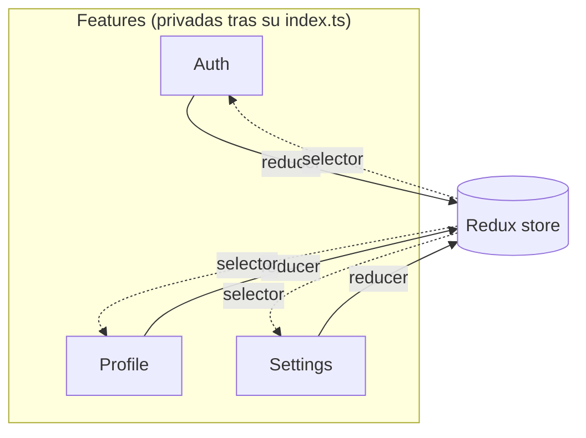

Versión corta: por debajo de unas cinco features con su propio estado, las carpetas type-first (`screens/`, `hooks/`, `services/`) están bien. Por encima de eso, el mismo layout empieza a costar más de lo que ahorra. Este post va de por qué, y de dónde está la frontera.

## 85 ficheros para una sola feature

Esos son los ficheros TypeScript que tiene mi feature de Auth. Seis pantallas, un store de Redux, un contexto de React, un custom hook, componentes de PIN con stories de Storybook, schemas de validación de formularios contra una **blacklist de contraseñas comunes**, rate limiting, un servicio de lockout, y tests a todos los niveles.

En la mayoría de proyectos React Native, esos 85 ficheros estarían repartidos entre **siete carpetas diferentes**. Las pantallas en un sitio, los hooks en otro, el store slice en otro, la validación en otro más. Para entender cómo funciona la autenticación, abrirías siete carpetas y reconstruirías mentalmente las relaciones entre ficheros que no están cerca unos de otros.

Ese layout queda ordenado con tres o cuatro pantallas. Pasado ese punto, las relaciones se vuelven invisibles. El hook de una feature vive lejos de la pantalla que lo usa. Las reglas de validación están en una carpeta separada del formulario que validan. Revisar una feature implica escanear varias listas alfabéticas buscando las piezas.

## El layout type-first, y por qué es la opción por defecto

Conoces este:

```
src/
├── screens/
│   ├── LoginScreen.tsx
│   ├── ProfileScreen.tsx
│   ├── SettingsScreen.tsx
│   └── WorkExperienceScreen.tsx
├── components/
│   ├── PINInput.tsx
│   ├── ProfileCard.tsx
│   └── AlertBox.tsx
├── hooks/
│   ├── useAuth.ts
│   └── useProfile.ts
├── store/
│   ├── authSlice.ts
│   └── profileSlice.ts
└── utils/
    └── dateFormatter.ts
```

Ficheros agrupados por tipo. **Type-first.** La mayoría de tutoriales de React Native organizan las cosas así, y hay buenas razones para ello. Los nuevos contribuyentes reconocen la forma al instante. Un revisor ojeando una prueba técnica detecta `screens/`, `hooks/`, `components/` sin pensar. Los nombres de carpeta encajan con el vocabulario del framework, así que el modelo mental se traslada de un proyecto a otro. Para tres o cuatro pantallas, eso es estructura suficiente para mantener el orden. Si alguna vez has hecho una prueba técnica, [la estructura de carpetas es una de las primeras cosas que mira un revisor](/blog/how-to-pass-a-react-native-tech-test/), y type-first es la apuesta segura ahí.

La forma aguanta mientras la app es pequeña. Luego añades autenticación con configuración de PIN, verificación de email, recuperación de contraseña. Añades gestión de perfil con subida de fotos, edición de cuenta, cambio de contraseña. De repente `screens/` tiene 25 ficheros, y encontrar el hook que pertenece a la subida de foto de perfil implica escanear una lista alfabética de *todos los hooks de la app*.

Ahora intenta **eliminar una feature**. Borra la pantalla de `screens/`. Busca su hook en `hooks/`. Su servicio en `services/`. Su store slice. Sus componentes. Su schema de validación. Sus tests, en un árbol `__tests__/` separado. Si te dejas un fichero, tienes código muerto que va a quedarse ahí meses.

Esa es la prueba. Si eliminar una feature lleva más tiempo que construirla, la estructura está jugando en tu contra.

## Una carpeta por feature

Mi app tiene 13 features. Cada una vive en un solo directorio:

```
src/features/
├── Auth/           # 85 ficheros. Login, registro, PIN, lockout
├── Profile/        # API, store, subida de foto, 5 pantallas
├── Settings/       # Tema, idioma, 3 pantallas
├── Education/      # Store, API, 1 pantalla
├── WorkExperience/ # Store, API, 4 pantallas
├── Home/           # 1 pantalla, 1 export
├── Legal/          # Política de privacidad, T&Cs
├── Permissions/    # Cámara, fototeca, pantallas de denegación
├── MockStatus/     # Pantalla de estado MSW solo para dev
├── PDF/            # Visor de PDF
├── Placeholder/    # Placeholders de chat, reservas
├── WebView/        # Pantalla webview genérica
└── Splash/         # Splash screen
```

Todo lo demás vive fuera de features: `shared/` para componentes y hooks reutilizables, `store/` para la configuración de Redux, `navigation/`, `httpClients/`, `utils/`, `i18n/`.

La feature más simple tiene dos ficheros. La más compleja, 85. **Cada una solo tiene las carpetas que realmente necesita.** Ningún directorio `services/` vacío porque una plantilla decía que debería estar ahí.

## Cómo se ven 85 ficheros cuando están co-localizados

```
src/features/Auth/
├── __tests__/
├── api/
│   └── __tests__/
├── components/
│   ├── __tests__/
│   ├── PINDot.tsx
│   ├── PINDot.stories.tsx
│   ├── PINInput.tsx
│   ├── PINInput.stories.tsx
│   ├── PINKeypad.tsx
│   └── PINKeypad.stories.tsx
├── context/
│   └── AuthContext.tsx
├── hooks/
│   └── useAuth.ts
├── services/
│   └── pinLockoutService.ts
├── store/
│   ├── __tests__/
│   ├── actions.ts
│   ├── reducer.ts
│   └── selectors.ts
├── utils/
│   ├── __tests__/
│   ├── emailResendRateLimiter.ts
│   ├── pinHashing.ts
│   ├── pinValidation.ts
│   └── rateLimiter.ts
├── validation/
│   ├── __tests__/
│   ├── customRules.ts
│   ├── loginSchema.ts
│   ├── passwordRecoverySchema.ts
│   └── registrationSchema.ts
├── EmailVerificationScreen.tsx
├── ForgotPasswordScreen.tsx
├── LoginScreen.tsx
├── PINSetupScreen.tsx
├── RegistrationScreen.tsx
├── ResetPasswordScreen.tsx
└── index.ts
```

El hashing del PIN se sitúa al lado de la validación del PIN, al lado de los componentes del PIN, al lado de la pantalla de configuración del PIN. **La relación entre ficheros es visible en la propia estructura de carpetas.** Abro `Auth/` y puedo ver cada pieza del sistema de autenticación sin ir a ningún otro sitio.

En una estructura type-first, esos mismos ficheros del PIN estarían en `components/`, `utils/`, `services/` y `screens/`. *Cuatro carpetas para un solo concepto.*

## La prueba de eliminar en la práctica

La prueba de fuego de antes. ¿Cómo se ve en realidad para cada layout?

**Type-first:** borrar ficheros de `screens/`, `components/`, `hooks/`, `services/`, `store/`, `utils/`, `validation/` y `__tests__/`. Si te dejas un fichero, tienes un huérfano. Si te dejas un import, la app falla al arrancar.

**Feature-first:** borrar `src/features/Auth/`, quitar `authReducer` de la configuración del store, eliminar las rutas de navegación. **Tres pasos.** El compilador me dice si me dejé alguna referencia.

Lo he hecho. Eliminar una feature que tocaba más de 40 ficheros me llevó menos de un minuto. La mayor parte de ese minuto fue la configuración de navegación.

## El contrato que hace seguro refactorizar

Cada feature exporta solo lo que el resto de la app necesita. El `index.ts` en la raíz de la feature es el contrato:

```typescript
// src/features/Auth/index.ts
export { authReducer, login, logout, selectIsAuthenticated } from './store';
export { AuthProvider } from './context';
export { useAuth } from './hooks';
export { LoginScreen } from './LoginScreen';
export { RegistrationScreen } from './RegistrationScreen';
```

El hashing del PIN, el rate limiting, la lógica de lockout. **Nada de eso se exporta.** Es privado de Auth. Puedo reescribir la implementación *entera* del PIN, y mientras los exports no cambien, nada fuera de Auth se entera.

La configuración del store importa `authReducer`. La navegación importa las pantallas. Eso es todo. Los más de 80 ficheros internos son invisibles para el resto del codebase.

## Las features nunca importan de otras features

Esta es la regla que mantiene todo unido.

Si Auth necesita saber si un perfil está cargado, lee del store de Redux a través de un selector. No importa de `@app/features/Profile` directamente. **El store es la única capa de comunicación entre features.**

<div id="feature-boundaries"></div>



Cada feature es dueña de su slice de Redux. El root store los combina:

```typescript
import { authReducer } from '@app/features/Auth';
import { profileReducer } from '@app/features/Profile';
import { settingsReducer } from '@app/features/Settings';
import { educationReducer } from '@app/features/Education';
import { workExperienceReducer } from '@app/features/WorkExperience';

const rootReducer = combineReducers({
  settings: settingsReducer,
  auth: persistedAuthReducer,
  profile: profileReducer,
  workExperience: workExperienceReducer,
  education: educationReducer,
});
```

Rompe la regla de no importar entre features una sola vez y acabarás con dependencias circulares en una semana. La Feature A importa de la Feature B, que importa de la Feature C, que importa de la Feature A. El bundler lanza un error críptico y nadie sabe dónde empieza el ciclo.

## El código compartido se gana su sitio

Si un componente lo usa **una sola feature**, se queda en esa feature. Si dos o más features lo necesitan, se mueve a `src/shared/`. El listón es alto.

Cada abstracción compartida es un **punto de acoplamiento**. En el momento en que `AlertBox` vive en `shared/`, cinco features dependen de su interfaz. Cambiarlo implica revisar las cinco. Prefiero duplicar tres líneas en dos features que crear una utilidad compartida que haga a ambas más difíciles de cambiar por separado.

Los hooks que acaban en `shared/` son los genuinamente transversales: `useAppColorScheme`, `useHapticFeedback`, `useReducedMotion`, `useCameraPermission`, `usePhotoLibraryPermission`. Cosas que cualquier pantalla puede necesitar. No cosas que *dos pantallas* resulta que necesitan ahora mismo.

## Los tests siguen la misma regla

Los tests viven al lado del código que testean. Los tests del store de Auth están en `Auth/store/__tests__/`. Los tests de validación de Auth están en `Auth/validation/__tests__/`. No hay un árbol de tests separado en la raíz del proyecto.

La única excepción: **tests de integración entre features**. El login fluyendo hacia la carga del perfil. Cambios en Settings propagándose a la UI. Tareas en segundo plano corriendo entre features. Estos abarcan múltiples features, así que viven en `src/features/__tests__/`, fuera de cualquier feature individual.

```
src/features/__tests__/
├── BackgroundTasks.integration.rntl.tsx
├── CrossFeatureIntegration.rntl.tsx
├── OnboardingJourney.integration.rntl.tsx
├── ProfileCompletionJourney.integration.rntl.tsx
└── RealtimeSubscription.integration.rntl.tsx
```

Cuando un test falla, la ubicación me dice dónde mirar. Si está en `Auth/store/__tests__/`, el problema está en el store de auth. Si está en `features/__tests__/`, el problema está en cómo interactúan las features. La ubicación *es* el diagnóstico.

## Cuándo hacer el cambio

Si tu app tiene tres pantallas y ninguna gestión de estado, *no hagas esto*. Una lista plana de pantallas y un par de hooks compartidos es suficiente. Feature-first añade una sobrecarga que los proyectos pequeños no necesitan.

El punto de inflexión está en torno a las **cinco features con su propio estado**. Por debajo, la estructura cuesta más de lo que ahorra. Por encima, type-first se convierte en lo que te frena.

Abre tu carpeta `screens/` ahora mismo. Cuenta los ficheros. Si no puedes decir cuáles van juntos solo mirando la lista, la estructura ya ha dejado de ayudarte.

## Cómo montarlo

La estructura de arriba es una convención, no una herramienta. Dos piezas de configuración hacen que se mantenga.

**Path aliases.** Sin ellos, acabas con `import { authReducer } from '../../../features/Auth'` por todas partes. Añade los aliases en `tsconfig.json`:

```json
{
  "compilerOptions": {
    "baseUrl": ".",
    "paths": {
      "@app": ["src"],
      "@app/*": ["src/*"]
    }
  }
}
```

Y en `babel.config.js` para que el runtime los resuelva:

```js
module.exports = {
  presets: ['@react-native/babel-preset'],
  plugins: [
    [
      'module-resolver',
      {
        root: ['./src'],
        alias: {
          '@app': './src',
        },
      },
    ],
  ],
};
```

```bash
yarn add -D babel-plugin-module-resolver
```

Ahora `import { authReducer } from '@app/features/Auth'` se resuelve en tiempo de compilación y en runtime, sin importar dónde esté el fichero que lo importa.

**Una regla de ESLint para mantener honesto el límite.** Los path aliases por sí solos no impiden que alguien escriba `import { profileSelector } from '@app/features/Profile'` dentro de Auth. En cuanto eso se publica, la estructura empieza a desmoronarse. Una regla `no-restricted-imports` fija el límite:

```js
// eslint.config.mjs
export default [
  {
    rules: {
      'no-restricted-imports': ['error', {
        patterns: [
          {
            group: ['@app/features/*/!(index)', '@app/features/*/*/**'],
            message: 'Import another feature through its public index (@app/features/X), not its internals. Within a feature, use relative imports.',
          },
        ],
      }],
    },
  },
  {
    // Los tests pueden acceder a los internos de una feature para preparar estado.
    files: ['**/__tests__/**'],
    rules: { 'no-restricted-imports': 'off' },
  },
];
```

El patrón bloquea cualquier import que acceda a los internos de otra feature. Dentro de una feature usas imports relativos (`./store`, `../components`), que nunca coinciden con el patrón del alias, así que una feature siempre puede acceder a su propio código. La única exención son los tests, que a menudo necesitan acceder al interior de una feature para preparar estado.

Eso es todo. Path aliases, una regla de ESLint, y la disciplina de mantener privados los internos de cada feature. La arquitectura sobrevive porque el tooling hace cumplir lo que la convención pide.

El código fuente completo del proyecto está en [github.com/warrendeleon/rn-warrendeleon](https://github.com/warrendeleon/rn-warrendeleon).
