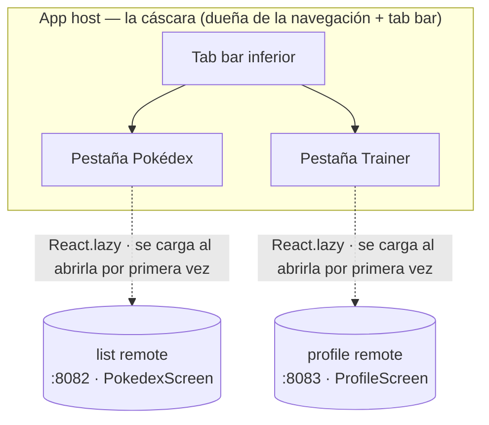

Hasta ahora el host ha cargado una pantalla de un remote. Una app de verdad es más que una pantalla: tiene una cáscara, una tab bar, un sitio donde poner las features. Este post convierte el host en esa cáscara. Es dueño de la navegación y de la tab bar, y cada pestaña es un remote separado, construido y desplegado por su cuenta, cargado en runtime.

La forma que vamos a construir, antes de tocar código: el host es dueño de la tab bar, y cada pestaña es un remote separado, que se descarga y se ejecuta en runtime la primera vez que la abres.

<div id="tab-architecture"></div>



Retomamos donde lo dejó el post 3. Si seguiste el tutorial, quédate con tu propio código. Si no, parte del estado final del post 3:

```sh
git clone https://github.com/warrendeleon/react-native-module-federation
git checkout post-03-shared-singleton
```

## Un segundo remote para llenar una segunda pestaña

Una pestaña no es una tab bar. Así que añadimos un segundo remote, `profile`, igual que el post 2 construyó el remote `list`: una app de React Native nueva sobre Re.Pack, sin `AppRegistry.registerComponent`, exponiendo una pantalla. Créalo junto a los otros, instala sus dependencias igual que hiciste con `list` y copia el `rspack.config.mjs` de `list`. Cambian cuatro campos, y los cuatro importan: el `name` del plugin (`profileApp`), el `filename` del contenedor (`profileApp.container.js.bundle`), la pantalla expuesta (`./ProfileScreen`) y `output.uniqueName` (`'ProfileApp'`). Este último es el fácil de pasar por alto: `uniqueName` delimita los globales de carga de chunks de webpack, así que dos remotes que traen el mismo valor chocan dentro del runtime del host justo de la forma sobre la que esta serie lleva avisando.

La pantalla que expone, `apps/profile/src/ProfileScreen.tsx`. Lee el inset del safe area del provider del host, el mismo singleton compartido del post 3:

```tsx
import React from 'react';
import { StyleSheet, Text, View } from 'react-native';
import { useSafeAreaInsets } from 'react-native-safe-area-context';

const TRAINER = { name: 'Ash Ketchum', region: 'Kanto', badges: 8, caught: 151 };

export default function ProfileScreen() {
  const insets = useSafeAreaInsets();
  return (
    <View style={[styles.screen, { paddingTop: insets.top + 24 }]}>
      <Text style={styles.title}>Trainer</Text>
      <Text style={styles.subtitle}>Served by the profile remote</Text>
      <View style={styles.card}>
        <Text style={styles.name}>{TRAINER.name}</Text>
        <Text style={styles.meta}>
          {TRAINER.region} · {TRAINER.badges} badges · {TRAINER.caught} caught
        </Text>
      </View>
    </View>
  );
}

const styles = StyleSheet.create({
  screen: { flex: 1, padding: 24, backgroundColor: '#fff' },
  title: { fontSize: 28, fontWeight: '700' },
  subtitle: { fontSize: 14, color: '#6b7280', marginBottom: 16 },
  card: {
    padding: 16,
    borderRadius: 12,
    borderWidth: StyleSheet.hairlineWidth,
    borderColor: '#e5e7eb',
    backgroundColor: '#f9fafb',
  },
  name: { fontSize: 18, fontWeight: '600', marginBottom: 4 },
  meta: { fontSize: 14, color: '#6b7280' },
});
```

Su entry de contenedor, `apps/profile/src/index.js`, se queda vacío, porque un remote no arranca nada por su cuenta:

```js
export {};
```

Su `apps/profile/rspack.config.mjs` mantiene los mismos singletons compartidos; el bloque de federación, tras los cuatro cambios:

```js
new Repack.plugins.ModuleFederationPluginV2({
  name: 'profileApp',
  filename: 'profileApp.container.js.bundle',
  exposes: {
    './ProfileScreen': './src/ProfileScreen.tsx',
  },
  dts: false,
  shared: {
    react: { singleton: true, requiredVersion: pkg.dependencies.react },
    'react-native': {
      singleton: true,
      requiredVersion: pkg.dependencies['react-native'],
    },
    'react-native-safe-area-context': {
      singleton: true,
      requiredVersion: pkg.dependencies['react-native-safe-area-context'],
    },
  },
}),
```

Dale su propio puerto de dev server para que no choque con `list` en 8082. En `apps/profile/package.json`:

```json
"scripts": {
  "start:remote": "react-native start --config rspack.config.mjs --port 8083"
}
```

Ahora hay dos remotes, en 8082 y 8083, cada uno una pantalla esperando un host.

## El host recibe navegación

La tab bar pertenece al host, no a los remotes. El host instala una librería de navegación; los remotes siguen siendo pantallas planas que no saben nada de pestañas. Instálala solo en el host:

```sh
cd apps/host
npm install @react-navigation/native @react-navigation/bottom-tabs react-native-screens
cd ios && bundle exec pod install
```

`react-native-screens` es un módulo nativo, así que el host necesita un pod install y una compilación nativa nueva. `react-native-safe-area-context` ya está desde el post 3, y React Navigation la usa.

Y aquí está el punto importante sobre compartir, que es el contrato del post 3 al revés. React Navigation vive solo en el host porque solo el host la usa. Los remotes nunca la importan, así que no hay nada que compartir. Los singletons compartidos siguen siendo exactamente lo que eran: `react`, `react-native` y `react-native-safe-area-context`. Una librería solo necesita compartirse cuando hay código a ambos lados de la frontera que la toca.

## La cáscara

Reescribe `apps/host/App.tsx`. El host ahora es dueño de un `SafeAreaProvider`, un `NavigationContainer` y un navegador de pestañas inferior. El contenido de cada pestaña es un remote cargado de forma perezosa:

```tsx
import React, { Suspense } from 'react';
import { ActivityIndicator, StyleSheet } from 'react-native';
import { SafeAreaProvider } from 'react-native-safe-area-context';
import { NavigationContainer } from '@react-navigation/native';
import { createBottomTabNavigator } from '@react-navigation/bottom-tabs';

const PokedexScreen = React.lazy(() => import('listApp/PokedexScreen'));
const ProfileScreen = React.lazy(() => import('profileApp/ProfileScreen'));

// A remote downloads the first time its tab is opened, so each tab renders behind a Suspense
// spinner. Wrapping once here keeps the lazy boundary out of the remotes.
function withSuspense(Remote: React.ComponentType) {
  return function Tab() {
    return (
      <Suspense fallback={<ActivityIndicator style={styles.loader} size="large" />}>
        <Remote />
      </Suspense>
    );
  };
}

const PokedexTab = withSuspense(PokedexScreen);
const ProfileTab = withSuspense(ProfileScreen);

const Tab = createBottomTabNavigator();

export default function App() {
  return (
    <SafeAreaProvider>
      <NavigationContainer>
        <Tab.Navigator screenOptions={{ headerShown: false }}>
          <Tab.Screen name="Pokédex" component={PokedexTab} />
          <Tab.Screen name="Trainer" component={ProfileTab} />
        </Tab.Navigator>
      </NavigationContainer>
    </SafeAreaProvider>
  );
}

const styles = StyleSheet.create({
  loader: { flex: 1 },
});
```

Cada pestaña es un remote tras `React.lazy` y `Suspense`. El remote se descarga la primera vez que abres su pestaña, no al arrancar, así que la app empieza en la primera pestaña y solo busca la segunda cuando cambias a ella.

El host necesita saber dónde vive el segundo remote. Añádelo a `remotes` en `apps/host/rspack.config.mjs`:

```js
remotes: {
  listApp: `listApp@http://localhost:8082/${platform}/mf-manifest.json`,
  profileApp: `profileApp@http://localhost:8083/${platform}/mf-manifest.json`,
},
```

Y dile a TypeScript la forma del nuevo import federado, en `apps/host/mf-modules.d.ts`:

```ts
declare module 'profileApp/ProfileScreen' {
  import type React from 'react';
  const ProfileScreen: React.ComponentType;
  export default ProfileScreen;
}
```

## Córrelo

Ahora cuatro terminales, uno por remote y uno para el host, más la compilación:

```sh
cd apps/list && npm run start:remote      # :8082
cd apps/profile && npm run start:remote   # :8083
cd apps/host && npm start                 # :8081
cd apps/host && npm run ios
```

El host arranca en la pestaña Pokédex y renderiza el remote `list`. Toca **Trainer** y el host busca el remote `profile` en 8083, lo ejecuta, y muestra la tarjeta del entrenador. Dos features, construidas y servidas por dos apps separadas, en una tab bar que no pertenece a ninguna de las dos.

<div class="device-frame">
  
</div>

## Lo que construiste, y lo que viene

El host ya es una cáscara. Es dueño de la navegación y la tab bar; cada pestaña es un remote que se construyó y desplegó por su cuenta y se cargó en runtime. Los remotes siguen siendo simples: renderizan una pantalla y no saben nada de cómo están ordenados. Añadir una tercera feature es añadir un tercer remote y una tercera pestaña, sin tocar las que ya están desplegadas.

El código terminado de este post es el tag `post-04-host-shell`, para que puedas hacer diff contra el tuyo:

```sh
git checkout post-04-host-shell
```

Lo siguiente en la serie: el host escribe a mano la forma de cada remote que carga, una conjetura que nada comprueba contra la pantalla real. La reemplazamos por un pequeño paquete de contratos compartido, para que el host y los remotes coincidan en las props que cruzan entre ellos y el compilador cace cualquier deriva.

## Fuentes

- [React Navigation](https://reactnavigation.org/) — el navegador de pestañas inferior sobre el que se construye la cáscara del host
- [Module Federation 2.0](https://module-federation.io/) — los remotes `name@url` que cargan cada pestaña en runtime
- [react-native-module-federation](https://github.com/warrendeleon/react-native-module-federation) — el repo compañero, en el tag `post-04-host-shell`
