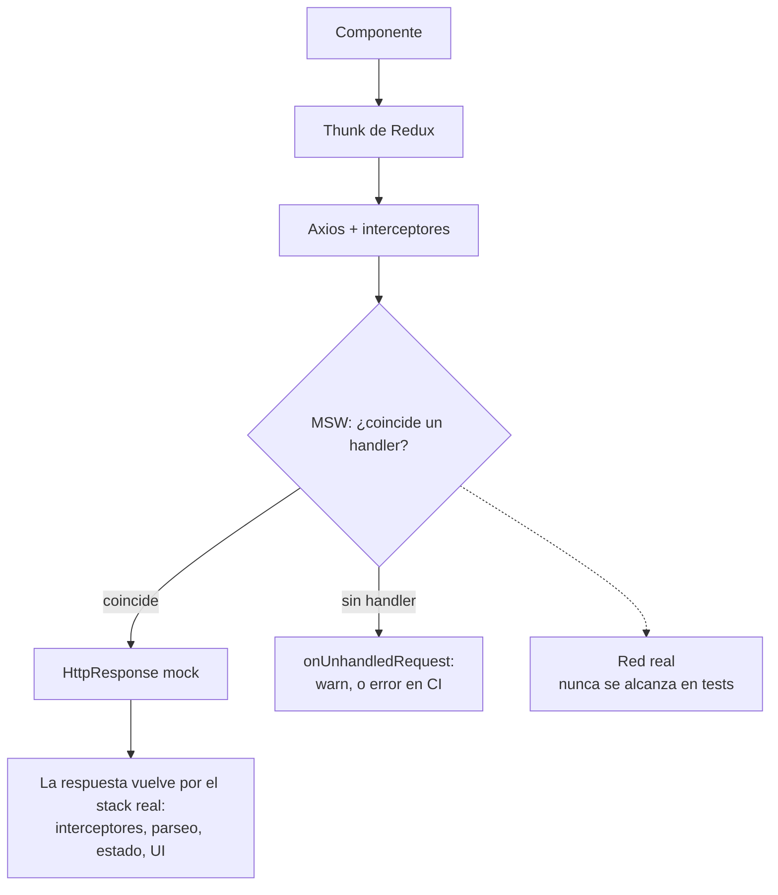

## Por qué MSW en vez de mocks manuales

La mayoría de los proyectos React Native mockean su capa de API con `jest.fn()`. Mockeas `fetch` o tu instancia de Axios, defines lo que devuelve, y testeas contra eso.

Funciona. Hasta que no.

El problema: estás testeando la interacción de tu código con un mock, no con una capa HTTP. Si tu cliente de API cambia cómo construye URLs, agrega headers o maneja reintentos, el mock no detecta la regresión. Esto importa aún más si validas respuestas en runtime con algo como Zod, porque quieres que la capa de [validación de respuestas en runtime con Zod](/blog/runtime-api-validation-zod-react-native/) corra contra formas de respuesta reales, no contra objetos mock hechos a mano. El mock siempre devuelve lo que le dijiste, sin importar lo que el código realmente envió.

**Mock Service Worker (MSW)** intercepta las peticiones a nivel de red. Tu código hace llamadas HTTP reales. MSW las captura antes de que salgan del proceso y devuelve tus respuestas mockeadas. Todo lo que hay entre tu componente y la red se ejercita: el thunk de Redux, los interceptores de Axios, el manejo de errores, el parseo de la respuesta.

Los mocks manuales reemplazan tu código. MSW reemplaza la red. El código corre exactamente como lo haría en un dispositivo, hasta el punto donde la petición habría salido.

<div id="msw-intercept"></div>



## Supuestos

El setup de abajo está escrito contra:

- React Native 0.74+ con el preset de Jest `react-native` por defecto
- TypeScript con la config de Babel estándar de RN
- Redux Toolkit (el wrapper de render personalizado lo asume)
- Node 18 o posterior (Node 20 recomendado)

Si estás en una versión más vieja de RN, en un preset de Jest de Expo, o sin Redux, los *conceptos* siguen aplicando pero algunos snippets necesitarán ajustes.

## Instalación

MSW v2 corre en los tests de Jest a través del servidor de Node.js. El service worker del navegador no aplica para mobile, así que ignora todo lo que digan los docs de MSW sobre el registro del service worker.

```bash
yarn add -D msw node-fetch@2 web-streams-polyfill
```

`msw` es el obvio. `node-fetch` y `web-streams-polyfill` son los polyfills que MSW v2 necesita en el entorno de Jest de React Native, que conectaremos en el siguiente paso.

> 💡 **¿Por qué fijar `node-fetch@2`?** `node-fetch` v3+ es solo ESM y no carga vía `require()` en un archivo de setup de Jest con CommonJS. O fijas a v2 (lo que hace este post), o migras el archivo de polyfills a ESM. v2 es el camino con menos fricción en un preset de Jest de React Native por defecto.

> 💡 **No confíes en posts que dicen "no hacen falta polyfills".** MSW v2 está construido sobre la Fetch API y Web Streams. Algunas combinaciones de Node + Jest tienen estos globals; el preset de Jest de React Native no. Sin los polyfills verás `ReferenceError: Response is not defined` o `TextEncoder is not defined` la primera vez que MSW intente construir una respuesta.

## Polyfills

Crea `jest.polyfills.cjs` en la raíz del proyecto. Tiene que ser `.cjs` (no `.ts`) porque Jest lo carga antes de que el transformer de TypeScript esté configurado:

```js
/**
 * Polyfills de MSW para React Native.
 * Necesarios para Mock Service Worker v2 en los tests de Jest.
 */

// TextEncoder / TextDecoder
const { TextEncoder, TextDecoder } = require('util');
global.TextEncoder = TextEncoder;
global.TextDecoder = TextDecoder;

// Fetch API
if (!global.fetch) {
  global.fetch = require('node-fetch');
  global.Headers = require('node-fetch').Headers;
  global.Request = require('node-fetch').Request;
  global.Response = require('node-fetch').Response;
}

// ReadableStream (para el streaming de respuestas)
if (!global.ReadableStream) {
  try {
    const { ReadableStream } = require('web-streams-polyfill');
    global.ReadableStream = ReadableStream;
  } catch {
    // web-streams-polyfill es opcional en versiones más viejas de MSW v2
  }
}
```

Este archivo corre *antes* de que cargue el framework de tests, así que `beforeAll`, `jest`, etc. no están disponibles aquí. Es puramente para configurar globals.

## Config de Jest

Conecta el archivo de polyfills y un archivo de setup aparte en `jest.config.cjs`:

```js
module.exports = {
  preset: 'react-native',
  testEnvironment: 'node',
  setupFiles: ['<rootDir>/jest.polyfills.cjs'],
  setupFilesAfterEnv: ['<rootDir>/jest.setup.ts'],
  transformIgnorePatterns: [
    // El preset de RN por defecto ignora casi todo node_modules; MSW necesita transformarse.
    'node_modules/(?!(react-native|@react-native|msw|until-async|rettime|@mswjs|@open-draft|@bundled-es-modules|headers-polyfill|strict-event-emitter|outvariant)/)',
  ],
  moduleFileExtensions: ['ts', 'tsx', 'js', 'jsx', 'json', 'node'],
};
```

Dos claves hacen el trabajo:

| Clave | Cuándo corre | Para qué |
|---|---|---|
| `setupFiles` | Antes de que se instale el framework de Jest | Polyfills, variables globales, cualquier cosa que no necesite `jest`/`expect` |
| `setupFilesAfterEnv` | Después del framework de Jest, antes de cada archivo de test | Hooks `beforeAll`/`afterEach`, ciclo de vida del servidor de MSW, matchers personalizados |

La línea de `transformIgnorePatterns` es el otro gotcha: el preset de RN por defecto se salta la transformación de `node_modules`, pero MSW trae sintaxis moderna que Jest no puede correr tal cual. Agrega MSW y sus dependencias sin transpilar (`msw|until-async|rettime|@mswjs|@open-draft|@bundled-es-modules|headers-polyfill|strict-event-emitter|outvariant`) a la allow-list o verás `SyntaxError: Cannot use import statement outside a module` desde dentro de `node_modules/msw/`. Las versiones más nuevas de MSW traen más de estas; si el error nombra un paquete que todavía no está en tu lista, agrégalo al mismo grupo.

## El servidor

Crea `src/test-utils/msw/server.ts`:

```typescript
import { setupServer } from 'msw/node';
import { handlers } from './handlers';

/**
 * Servidor de MSW para Jest. Se inicia/detiene en jest.setup.ts.
 * Usa `server.use(...errorHandlers)` para sobrescribir por test.
 */
export const server = setupServer(...handlers);
```

El servidor toma tus handlers por defecto (respuestas exitosas) e intercepta las peticiones que matchean.

## Conectando el ciclo de vida

En `jest.setup.ts` (que Jest carga vía `setupFilesAfterEnv`), inicia el servidor antes de los tests, resetéalo entre tests, ciérralo al final:

```typescript
import '@testing-library/jest-native/extend-expect'; // RNTL >=12.4 trae estos matchers de serie; este import es solo para RNTL más antiguas
import { server } from './src/test-utils/msw/server';

// Ciclo de vida del servidor de MSW
beforeAll(() => server.listen({ onUnhandledRequest: 'warn' }));
afterEach(() => server.resetHandlers());
afterAll(() => server.close());
```

| Hook | Qué hace |
|---|---|
| `beforeAll` | Inicia el servidor antes de que corra cualquier test |
| `afterEach` | Resetea los handlers a los defaults entre tests (para que los overrides de un test no se filtren) |
| `afterAll` | Apaga el servidor después de que todos los tests terminan |

La opción `onUnhandledRequest: 'warn'` registra un warning si tu código hace una petición que ningún handler coincide. En CI, cámbiala a `'error'` para que los handlers faltantes hagan fallar la build:

```typescript
const onUnhandledRequest = process.env.CI ? 'error' : 'warn';
beforeAll(() => server.listen({ onUnhandledRequest }));
```

> 💡 **Si tus tests usan fake timers**, vacía los timers pendientes en `afterEach` antes de resetear los handlers. Si no, un timer de animación agendado dentro de un componente puede dispararse después de que el siguiente test arranque y provocar fallos espurios.

## Escribiendo handlers

Cada handler es una función que matchea un método HTTP y una URL, y devuelve una respuesta.

Un handler básico para una REST API:

```typescript
import { http, HttpResponse } from 'msw';

const BASE_URL = 'https://api.example.com';

export const handlers = [
  http.get(`${BASE_URL}/items`, () => {
    return HttpResponse.json([
      { id: 1, name: 'Item One' },
      { id: 2, name: 'Item Two' },
    ]);
  }),

  http.get(`${BASE_URL}/items/:id`, ({ params }) => {
    const { id } = params;
    return HttpResponse.json({ id: Number(id), name: `Item ${id}` });
  }),

  http.post(`${BASE_URL}/items`, async ({ request }) => {
    const body = await request.json();
    return HttpResponse.json({ id: 3, ...body }, { status: 201 });
  }),
];
```

Algunas cosas que conviene saber: los helpers por método (`http.get`, `http.post` y los demás) matchean el verbo HTTP, los parámetros de URL como `:id` se extraen en `params` automáticamente, el body del request llega vía `await request.json()`, y `HttpResponse.json()` devuelve JSON tipado con el código de estado que le pases.

## Separando fixtures de handlers

Los objetos de respuesta inline sirven para un boceto. No sirven en un codebase real: las mismas formas aparecen en los handlers, en los tests de componentes y en las stories de Storybook, y no quieres mantener tres copias.

Saca los datos fixture a su propio archivo:

```typescript
// src/test-utils/msw/mockData.ts
export const mockItems = [
  { id: 1, name: 'Item One', createdAt: '2026-01-01T00:00:00Z' },
  { id: 2, name: 'Item Two', createdAt: '2026-01-02T00:00:00Z' },
];

export const mockProfile = {
  id: 'user_1',
  name: 'Warren de Leon',
  email: 'hi@example.com',
};
```

Los handlers entonces leen de `mockData`:

```typescript
import { http, HttpResponse } from 'msw';
import { mockItems, mockProfile } from './mockData';

export const handlers = [
  http.get(`${BASE_URL}/items`, () => HttpResponse.json(mockItems)),
  http.get(`${BASE_URL}/me`, () => HttpResponse.json(mockProfile)),
];
```

Los mismos fixtures se reutilizan en los tests de componentes donde te saltas MSW y pasas los datos directamente. Una sola fuente de verdad.

## Handler sets para cada escenario

Los handlers de éxito por defecto son el punto de partida. Pero las apps reales necesitan manejar errores también. Aquí es donde la mayoría de los setups de MSW se detienen. **No te detengas aquí.**

Los bugs que de verdad llegan a producción no son los fallos del happy path. Son los incómodos: el 401 que vuelve a mitad de sesión porque un token expiró hace cinco minutos, el 429 de una ráfaga de intentos de refresh tras un corte de red breve, el 422 con una forma de validación distinta a la que tu formulario espera, el 408 que debería haber sido un reintento pero no lo fue. Ninguno de esos se atrapa si tu cobertura de errores es "¿qué pasa si la API devuelve 500?".

Yo creo handler sets separados para cada escenario de error que la app necesita manejar:

```typescript
// Éxito (default)
export const handlers = [...apiHandlers, ...authHandlers];

// Errores del servidor
export const errorHandlers = [
  http.get(`${BASE_URL}/items`, () => {
    return HttpResponse.json(
      { message: 'Internal server error' },
      { status: 500 }
    );
  }),
];

// No autorizado (token expirado)
export const unauthorizedHandlers = [
  http.get(`${BASE_URL}/items`, () => {
    return HttpResponse.json(
      { error: 'invalid_token', message: 'Token has expired' },
      { status: 401 }
    );
  }),
];

// Rate limiting
export const rateLimitHandlers = [
  http.post(`${BASE_URL}/auth/token`, () => {
    return HttpResponse.json(
      { error: 'too_many_requests', message: 'Try again in 60 seconds' },
      { status: 429, headers: { 'Retry-After': '60' } }
    );
  }),
];

// Timeout (nunca resuelve)
export const timeoutHandlers = [
  http.get(`${BASE_URL}/items`, async () => {
    await new Promise(resolve => setTimeout(resolve, 60000));
    return HttpResponse.json({}, { status: 408 });
  }),
];

// Offline (fallo de red)
export const offlineHandlers = [
  http.get(`${BASE_URL}/items`, () => {
    return HttpResponse.error();
  }),
];
```

En mi proyecto, tengo **11 handler sets**:

| Handler set | Status | Qué testea |
|---|---|---|
| `handlers` | 200 | Respuestas exitosas por defecto |
| `errorHandlers` | 500 | Manejo de errores del servidor |
| `unauthorizedHandlers` | 401 | Flujos de token expirado/inválido |
| `forbiddenHandlers` | 403 | Cuentas baneadas/suspendidas |
| `conflictHandlers` | 409 | Registro duplicado |
| `validationErrorHandlers` | 422 | Errores de validación de formularios |
| `rateLimitHandlers` | 429 | Rate limiting con Retry-After |
| `emailNotConfirmedHandlers` | 400 | Verificación de email requerida |
| `storageErrorHandlers` | 413/404 | Errores de subida/eliminación de archivos |
| `timeoutHandlers` | 408 | Simulación de timeout de red |
| `offlineHandlers` | Error | Fallo total de red |

Cada set se exporta y se puede intercambiar por test.

> 💡 **Tip:** El handler de timeout usa `await new Promise(resolve => setTimeout(resolve, 60000))` para simular una petición que nunca termina. El timeout de tu código se disparará primero, testeando el path de manejo de timeout.

## Usando handlers en tests

Los handlers por defecto corren automáticamente (registrados en `setupServer`). Para testear escenarios de error, sobrescríbelos por test:

```typescript
import { server } from '@app/test-utils/msw/server';
import { errorHandlers, unauthorizedHandlers } from '@app/test-utils/msw/handlers';

describe('API error handling', () => {
  it('shows error message on server failure', async () => {
    server.use(...errorHandlers);

    // Renderizar componente, disparar fetch, verificar UI de error
  });

  it('redirects to login on 401', async () => {
    server.use(...unauthorizedHandlers);

    // Renderizar componente, disparar fetch, verificar redirección
  });

  // No hace falta limpiar - afterEach en jest.setup resetea los handlers
});
```

El spread (`...errorHandlers`) reemplaza los handlers que matchean. Los handlers del set por defecto que no matchean siguen activos. Después del test, `server.resetHandlers()` restaura los defaults.

## El wrapper de render personalizado

MSW funciona mejor con un store real de Redux, no uno mockeado. El punto es testear la integración real: componente → thunk de Redux → petición HTTP → intercepción de MSW → respuesta → actualización de estado → actualización de UI.

```typescript
// src/test-utils/renderWithProviders.tsx
import React from 'react';
import { Provider } from 'react-redux';
import { combineReducers, configureStore } from '@reduxjs/toolkit';
import type { RenderOptions } from '@testing-library/react-native';
import { render } from '@testing-library/react-native';

import { itemsReducer } from '@app/features/Items';
import { authReducer } from '@app/features/Auth';

const rootReducer = combineReducers({
  items: itemsReducer,
  auth: authReducer,
});

type RootState = ReturnType<typeof rootReducer>;

function createTestStore(preloadedState?: Partial<RootState>) {
  return configureStore({
    reducer: rootReducer,
    preloadedState,
    middleware: getDefaultMiddleware =>
      getDefaultMiddleware({
        serializableCheck: false,
        immutableCheck: false,
      }),
  });
}

type AppStore = ReturnType<typeof createTestStore>;

interface ExtendedRenderOptions extends Omit<RenderOptions, 'wrapper'> {
  preloadedState?: Partial<RootState>;
  store?: AppStore;
}

export function renderWithProviders(
  ui: React.ReactElement,
  { preloadedState, store, ...options }: ExtendedRenderOptions = {},
) {
  const createdStore = store ?? createTestStore(preloadedState);

  const Wrapper = ({ children }: { children: React.ReactNode }) => (
    <Provider store={createdStore}>{children}</Provider>
  );

  return {
    store: createdStore,
    ...render(ui, { wrapper: Wrapper, ...options }),
  };
}
```

Eso cubre Redux. Las apps reales suelen necesitar más: i18n, navegación, theming, contexto de toast. El wrapper es el lugar correcto para componerlos todos: anida cada provider alrededor de `{children}` exactamente como lo hace `App.tsx`, y envuelve las pantallas que dependen de navegación en un `NavigationContainer` con un navegador en memoria. El principio: cada provider que envuelve tu app en runtime debería envolver tu componente en `renderWithProviders`. Cualquier cosa que olvides es una diferencia entre el entorno de test y el runtime, y esas diferencias son donde viven los tests flaky.

Ahora tus tests renderizan con un store real, despachan thunks reales, y MSW maneja la red:

```typescript
it('loads and displays items', async () => {
  // Los handlers por defecto devuelven respuesta exitosa
  const { getByText } = renderWithProviders(<ItemList />);

  await waitFor(() => {
    expect(getByText('Item One')).toBeTruthy();
  });
});

it('shows error state on failure', async () => {
  server.use(...errorHandlers);

  const { getByText } = renderWithProviders(<ItemList />);

  await waitFor(() => {
    expect(getByText('Something went wrong')).toBeTruthy();
  });
});
```

Sin mockeo manual de dispatch, selectores o fetch. Todo el stack es real excepto la red.

## Overrides de handlers inline

A veces necesitas una respuesta puntual que no encaja en ningún handler set. Defínela inline:

```typescript
it('handles unexpected response shape', async () => {
  server.use(
    http.get('https://api.example.com/items', () => {
      return HttpResponse.json({ unexpected: 'shape' });
    })
  );

  // Testear que el código maneja respuestas malformadas correctamente
});
```

Esto es útil para edge cases como JSON malformado, campos faltantes o códigos de estado inesperados que no ameritan un handler set completo.

## Corriendo los tests

Con todo conectado, correr un solo archivo de test se ve así:

```bash
yarn jest src/features/Items/__tests__/ItemList.rntl.tsx
```

```text
PASS  src/features/Items/__tests__/ItemList.rntl.tsx
  ItemList
    ✓ loads and displays items (218 ms)
    ✓ shows error state on failure (94 ms)
    ✓ redirects to login on 401 (102 ms)
    ✓ surfaces rate-limit message (89 ms)

Test Suites: 1 passed, 1 total
Tests:       4 passed, 4 total
```

Si ves un warning como `[MSW] Warning: captured a request without a matching request handler`, eso es `onUnhandledRequest: 'warn'` haciendo su trabajo. O agregas un handler para la URL, o arreglas la petición que tu código está haciendo.

Si la suite se cuelga y nunca termina, normalmente MSW está esperando una petición que nunca resuelve. Lo más habitual es un set de `timeoutHandlers` que usa `setTimeout(..., 60000)` mientras el entorno de test todavía tiene timers reales. Cambia a fake timers en ese test (`jest.useFakeTimers()` y luego `jest.advanceTimersByTime(...)`) o acorta el delay simulado.

## Errores comunes

Los handlers se matchean en orden. Si dos handlers matchean la misma petición, el primero gana. Cuando llamas a `server.use(...overrides)`, los overrides se agregan al principio, así que tienen prioridad sobre los defaults.

`HttpResponse.error()` simula un fallo de red, no un error HTTP. La petición nunca recibe respuesta. Úsalo para escenarios offline. Para errores HTTP (500, 401 y demás), recurre a `HttpResponse.json()` con un código de estado.

Si tu handler lee el body del request vía `request.json()`, la función tiene que ser `async`. Olvidarlo es una de las formas más comunes de terminar con un handler que devuelve `undefined` en silencio.

**Las peticiones sin handler son silenciosas por defecto.** Siempre usa `onUnhandledRequest: 'warn'` (o `'error'` en CI) para que los handlers faltantes salgan a la luz. Una petición sin handler silenciosa significa que el test pasa por la razón equivocada.

Un error `Response is not defined` o `TextEncoder is not defined` significa que el archivo de polyfills no está cargando. Revisa que `setupFiles: ['<rootDir>/jest.polyfills.cjs']` esté en la config de Jest, que la extensión del archivo sea `.cjs` y no `.ts`, y que el path sea correcto respecto a `rootDir`.

Un `SyntaxError: Cannot use import statement outside a module` lanzado desde `node_modules/msw/` (o desde una de sus dependencias) significa que ese paquete no se está transformando. Agrégalo a la allow-list dentro de `transformIgnorePatterns`; la config de arriba lleva el set completo para MSW 2.14.

Los query strings no participan en el matching de paths: `http.get('/api/items')` también matchea `/api/items?page=2`, y el handler lee los parámetros de `request.url`. Si un test parece ignorar tu handler específico para una query, ese es el motivo.

**Los tests pasan en local y fallan en CI** suele ser `onUnhandledRequest: 'error'` atrapando una petición que no sabías que tu código hacía en el entorno de CI, a menudo analytics o crash reporting. O agregas un handler para ella, o quitas esas llamadas en modo test.

## La estructura de archivos completa

```text
project-root/
  jest.config.cjs           # Config de Jest (preset, setupFiles, setupFilesAfterEnv)
  jest.polyfills.cjs        # Globals de TextEncoder, fetch, ReadableStream
  jest.setup.ts             # Ciclo de vida del servidor, matchers personalizados, mocks globales
  src/
    test-utils/
      msw/
        handlers.ts         # Todos los handler sets (éxito, error, 401, etc.)
        server.ts           # setupServer con handlers por defecto
        mockData.ts         # Datos fixture usados por los handlers
      renderWithProviders.tsx  # Render personalizado con store real + providers
      index.ts              # Barrel export
```

El barrel export (`index.ts`) permite que los tests importen utilidades comunes desde un solo lugar. Para handler sets específicos, importa directamente del archivo de handlers:

```typescript
import { server, renderWithProviders } from '@app/test-utils';
import { errorHandlers, unauthorizedHandlers } from '@app/test-utils/msw/handlers';
```

## En resumen

El setup lleva unos treinta minutos. Después de eso, cada test nuevo es más simple que el equivalente con mocks manuales. Escribes `server.use(...errorHandlers)` en vez de `jest.fn().mockRejectedValue(new Error('Network error'))`. Los handlers son reutilizables en cada archivo de test. Y el test ejercita comportamiento de integración real, no comportamiento de mocks.

Los 11 handler sets de mi proyecto cubren cada path de error que la app maneja. Cuando añado un nuevo endpoint de API, añado handlers para él una vez, y cada test que toca ese endpoint obtiene mocking correcto gratis. El mismo enfoque de handler sets también combina bien con tests E2E, donde [Detox + Cucumber](/blog/detox-cucumber-bdd-react-native-e2e-testing/) maneja los flujos de usuario y una capa aparte de mocking en runtime controla las respuestas de la API. La medida de todo el setup es que escribir el próximo test ahora es más fácil que saltártelo.

*Los ejemplos de código en este post son de [rn-warrendeleon](https://github.com/warrendeleon/rn-warrendeleon), mi proyecto personal de React Native. El setup completo de MSW, los handler sets y el wrapper de render personalizado están en el repo.*
