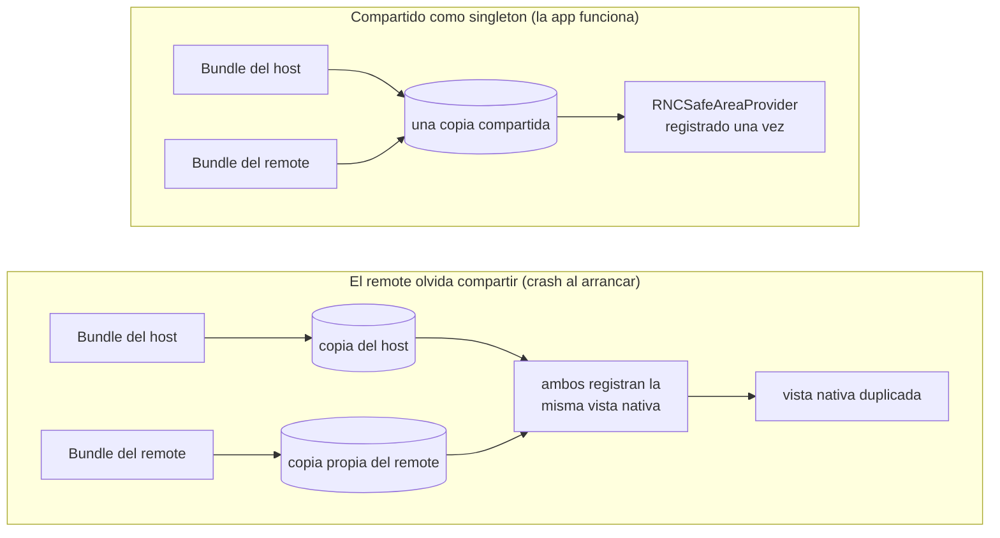

El [post anterior](/blog/your-first-federated-remote-react-native/) terminaba apuntando aquí: el contrato de singletons compartidos, y el error que hace petar la app al arrancar. Este post cubre los dos. Qué significa de verdad `shared`, las tres opciones que lo controlan, y el fallo con el que se topa un remote cuando rompe el contrato en una librería con lado nativo. Ese fallo es ruidoso, inmediato, y se nombra a sí mismo, lo que lo convierte en uno de los más fáciles de arreglar.

Retomamos justo donde lo dejó el post 2. Si seguiste el tutorial entonces, quédate con tu propio código. Si no, parte del estado final del post 2:

```sh
git clone https://github.com/warrendeleon/react-native-module-federation
git checkout post-02-first-remote
```

## Qué significaba "compartido" en el post 2

El post 2 declaró `react` y `react-native` como singletons compartidos y siguió adelante. Aquí está la mitad del host, en `apps/host/rspack.config.mjs`:

```js
shared: {
  react: { singleton: true, eager: true, requiredVersion: pkg.dependencies.react },
  'react-native': {
    singleton: true,
    eager: true,
    requiredVersion: pkg.dependencies['react-native'],
  },
},
```

Tres opciones hacen el trabajo, y cada una responde a una pregunta distinta.

**`singleton: true` responde a "¿cuántas copias pueden existir en runtime?"** Una. Cuando el host y el remote piden los dos `react`, Module Federation les entrega la misma instancia en vez de dejar que cada uno cargue la suya. Esta es la opción clave. React guarda el estado de sus hooks en variables a nivel de módulo, así que dos copias de React en una app significan dos montones de estado separados, y cualquier hook llamado contra el montón equivocado lanza un error.

**`eager: true` responde a "¿esta copia está lista antes de que corra la primera línea de la app?"** En el host, sí. Una entry normal de Module Federation es asíncrona: prepara el share scope y luego arranca tu código. React Native no te da ese hueco. Su entry es síncrona, así que el host marca sus copias compartidas como `eager` para cargarlas en el share scope por adelantado, antes de que `AppRegistry` renderice nada. El remote no necesita `eager`, porque cuando carga, el host ya ha llenado el scope.

**`requiredVersion` responde a "¿qué versiones cuentan como la misma?"** Fija el rango aceptable, leído directamente del `package.json` del host. Quítalo y Module Federation no puede saber si la copia del host satisface al remote, así que deja de tratarlas como intercambiables. Más sobre esto al final, porque es el único fallo de aquí que sí se queda callado.

Hasta aquí esto es el post 2 con el razonamiento añadido. El contrato empieza a importar en cuanto un remote depende de una tercera librería, no solo de React.

## Una dependencia de verdad: el safe area

El `SafeAreaView` que trae React Native está deprecado. El reemplazo mantenido es [react-native-safe-area-context](https://github.com/AppAndFlow/react-native-safe-area-context), y viene con la plantilla actual de React Native, así que las dos apps del repo ya lo tienen. Es una buena prueba del contrato porque funciona a través de un context de React: un `SafeAreaProvider` montado cerca de la raíz mide el safe area del dispositivo, y cualquier componente por debajo lo lee con `useSafeAreaInsets`.

En una app federada, el provider y el consumidor viven en bundles distintos. El host es el dueño de la cáscara, así que el host monta el provider. Reescribe `apps/host/App.tsx`:

```tsx
import React, { Suspense } from 'react';
import { ActivityIndicator, StyleSheet } from 'react-native';
import { SafeAreaProvider } from 'react-native-safe-area-context';

const PokedexScreen = React.lazy(() => import('listApp/PokedexScreen'));

export default function App() {
  return (
    <SafeAreaProvider>
      <Suspense fallback={<ActivityIndicator style={styles.loader} size="large" />}>
        <PokedexScreen />
      </Suspense>
    </SafeAreaProvider>
  );
}

const styles = StyleSheet.create({
  loader: { flex: 1 },
});
```

El host ya no rellena la pantalla él mismo. Provee el context del safe area y entrega todo el lienzo al remote. Ahora el remote lee el inset y mantiene su propio título lejos del notch. Actualiza `apps/list/src/PokedexScreen.tsx`:

```tsx
import React from 'react';
import { FlatList, StyleSheet, Text, View } from 'react-native';
import { useSafeAreaInsets } from 'react-native-safe-area-context';

const POKEMON = [
  { id: 1, name: 'Bulbasaur' },
  { id: 4, name: 'Charmander' },
  { id: 7, name: 'Squirtle' },
  { id: 25, name: 'Pikachu' },
  { id: 133, name: 'Eevee' },
];

export default function PokedexScreen() {
  const insets = useSafeAreaInsets();
  return (
    <View style={[styles.screen, { paddingTop: insets.top + 24 }]}>
      <Text style={styles.title}>Pokédex</Text>
      <Text style={styles.subtitle}>Served by the list remote</Text>
      <FlatList
        data={POKEMON}
        keyExtractor={p => String(p.id)}
        renderItem={({ item }) => (
          <View style={styles.row}>
            <Text style={styles.number}>#{String(item.id).padStart(3, '0')}</Text>
            <Text style={styles.name}>{item.name}</Text>
          </View>
        )}
      />
    </View>
  );
}

const styles = StyleSheet.create({
  screen: { flex: 1, padding: 24, backgroundColor: '#fff' },
  title: { fontSize: 28, fontWeight: '700' },
  subtitle: { fontSize: 14, color: '#6b7280', marginBottom: 16 },
  row: {
    flexDirection: 'row',
    paddingVertical: 12,
    borderBottomWidth: StyleSheet.hairlineWidth,
    borderBottomColor: '#e5e7eb',
  },
  number: { width: 56, color: '#9ca3af', fontVariant: ['tabular-nums'] },
  name: { fontSize: 16, fontWeight: '500' },
});
```

Ahora hay un apretón de manos de context que cruza la frontera entre bundles: el provider está en el host, y la llamada a `useSafeAreaInsets` está en el remote. Para que eso conecte, las dos apps necesitan el *mismo* `SafeAreaProvider`, de la misma copia de la librería. Un context de React se identifica por el objeto que lo crea. Dos copias de la librería crean dos objetos de context distintos, y un consumidor que lee la copia B nunca verá un provider montado desde la copia A.

Para eso está el contrato. Añade la librería a `shared` en las dos configs, como singleton. El host (`apps/host/rspack.config.mjs`), eager como sus otras copias compartidas:

```js
shared: {
  react: { singleton: true, eager: true, requiredVersion: pkg.dependencies.react },
  'react-native': {
    singleton: true,
    eager: true,
    requiredVersion: pkg.dependencies['react-native'],
  },
  'react-native-safe-area-context': {
    singleton: true,
    eager: true,
    requiredVersion: pkg.dependencies['react-native-safe-area-context'],
  },
},
```

Y el remote (`apps/list/rspack.config.mjs`), singleton pero no eager:

```js
shared: {
  react: { singleton: true, requiredVersion: pkg.dependencies.react },
  'react-native': {
    singleton: true,
    requiredVersion: pkg.dependencies['react-native'],
  },
  'react-native-safe-area-context': {
    singleton: true,
    requiredVersion: pkg.dependencies['react-native-safe-area-context'],
  },
},
```

Arranca los dos dev servers y corre el host (la [rutina de tres terminales del post 2](/blog/your-first-federated-remote-react-native/)). El Pokédex se renderiza con su título situado debajo de la Dynamic Island, con el padding del inset que el remote leyó del provider del host. Una librería, un provider, un objeto de context, compartidos entre dos apps que se construyeron y publicaron por separado.

## Ahora rómpelo

Borra una entrada. Quita `react-native-safe-area-context` del bloque `shared` del *remote*, dejándolo en el del host. Esta es la versión realista del error: el autor del host lo compartió, el autor del remote se olvidó. Reinicia el dev server del remote y recarga el host.

La app no renderiza una pantalla un poco mal. Peta al arrancar:

```
Uncaught Error: Tried to register two views with the same name RNCSafeAreaProvider
```

<div class="device-frame">
  
</div>

Y aquí está el porqué es ruidoso y no silencioso. `react-native-safe-area-context` no es JavaScript puro. Trae una vista nativa, `RNCSafeAreaProvider`, que registra en el registro de vistas de React Native al arrancar. La copia del host la registra una vez. Cuando el remote suelta el share, empaqueta su propia copia, y esa copia intenta registrar el mismo nombre nativo una segunda vez. React Native mantiene un único registro por app y rechaza el duplicado. El crash salta antes de que un solo Pokémon llegue a la pantalla.



Este es el patrón para cualquier librería con lado nativo: una librería de navegación, un gesture handler, un módulo de almacenamiento. Compártela desde un único sitio y funciona. Deja que dos bundles lleven cada uno la suya y chocan en la capa nativa, pronto y de forma evidente. El error hasta nombra la vista, así que la solución apunta de vuelta al share que falta.

Vuelve a poner esa entrada en el bloque `shared` del remote, y la app compila y corre otra vez.

El propio React falla igual de ruidosamente, por un motivo distinto. Quita `react` del `shared` de un remote y el remote empaqueta su propio React. El primer hook que corre el remote se comprueba contra la copia equivocada, y te llevas el conocido red box de `Invalid hook call`. Misma lección: el runtime no va a correr en silencio dos copias de algo que se diseñó para ser una.

## El fallo que sí se queda callado

Un caso se gana la etiqueta de "callado", y es `requiredVersion`. Mantén `singleton: true` pero quita `requiredVersion`, y la app sigue construyéndose y corriendo. La regla del singleton fuerza una copia, así que en desarrollo, con una sola versión instalada, no cambia nada a la vista. El peligro solo aparece cuando el host y un remote se construyen contra versiones realmente distintas de un paquete compartido de JavaScript puro. Sin un rango de versión que comprobar, Module Federation no puede avisar de que no coinciden. Carga la copia que gane y sigue adelante. Ese es el que hay que vigilar, porque compila y se publica sin problemas, y solo aparece cuando dos equipos acaban en versiones distintas de una dependencia. Fija `requiredVersion` desde `package.json`, como hacen las configs de arriba, y conviertes esa deriva silenciosa en un aviso que puedes leer.

Así que la regla práctica es la tranquilizadora. Casi todas las formas de romper el contrato compartido petan al arrancar, nombran lo que hiciste mal, y te cuestan unos minutos. La callada es estrecha y la cierras con un solo campo.

## Lo que construiste, y lo que viene

El host es dueño de un único `SafeAreaProvider`. El remote lee sus insets cruzando la frontera entre bundles, porque las dos apps resuelven a una sola copia compartida de la librería. Viste el contrato aguantar, luego lo viste petar cuando un remote olvidó su mitad, y ahora sabes que el crash es el resultado amable.

El código terminado de este post es el tag `post-03-shared-singleton`, para que puedas hacer diff contra el tuyo:

```sh
git checkout post-03-shared-singleton
```

Lo siguiente en la serie: el host deja de ser una sola pantalla y se convierte en una cáscara de verdad, dueña de la tab bar mientras cada pestaña es un remote cargado en runtime.

## Fuentes

- [react-native-safe-area-context](https://github.com/AppAndFlow/react-native-safe-area-context): la librería de safe area mantenida, y la vista nativa `RNCSafeAreaProvider` del crash
- [Module Federation 2.0](https://module-federation.io/): el contrato `shared`: `singleton`, `eager` y `requiredVersion`
- [react-native-module-federation](https://github.com/warrendeleon/react-native-module-federation): el repo compañero, en el tag `post-03-shared-singleton`
