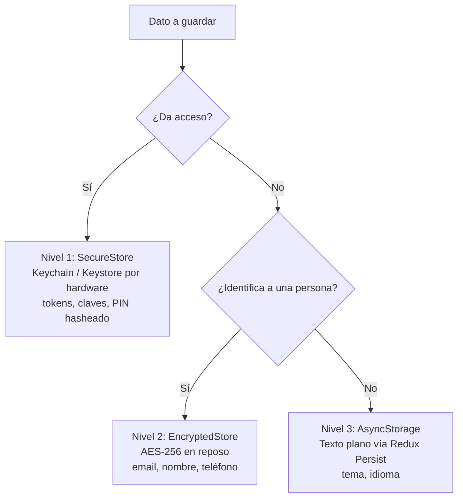

## Donde un solo almacenamiento se queda corto

La mayoría de las apps React Native guardan todo en AsyncStorage. Tokens, datos del usuario, preferencias, estado de sesión. Todo en un mismo sitio, todo en texto plano.

AsyncStorage es un key-value store respaldado por SQLite en iOS y SharedPreferences en Android. Es rápido y cómodo. También está sin cifrar. Cualquier persona con acceso físico, o un dispositivo rooteado o con jailbreak, puede leer cada valor.

Para una preferencia de tema, no pasa nada. Para un access token, es un incidente.

Este post recorre los tres niveles que uso en producción: Keychain respaldado por hardware para tokens, un almacenamiento cifrado para datos personales y AsyncStorage (vía Redux Persist) para preferencias. Cada nivel es un wrapper corto. El trabajo está en decidir qué vive dónde, y luego mantener esa frontera honesta dentro de tu flujo de auth.

<div id="storage-tiers"></div>



## Supuestos

El montaje de abajo se escribió contra:

- React Native 0.74+ (bare workflow, no Expo)
- TypeScript con la config de Babel estándar de RN
- Redux Toolkit + Redux Persist para la gestión de estado
- iOS 13+ y Android API 23+ (el Keystore respaldado por hardware necesita API 23 como mínimo)
- Un backend de Supabase (o cualquier REST API que devuelva access/refresh tokens)

En Expo, cambia `react-native-keychain` por `expo-secure-store` en el wrapper del Nivel 1. La estructura se mantiene igual.

## Los tres niveles

| Nivel | Librería | Seguridad | Velocidad | Usa para |
|---|---|---|---|---|
| 1. SecureStore | react-native-keychain | Respaldado por hardware (Keychain/Keystore) | Más lento | Tokens, claves de cifrado, PINs |
| 2. EncryptedStore | react-native-encrypted-storage | Cifrado AES-256 | Medio | Datos personales (email, nombre, teléfono) |
| 3. AsyncStorage | @react-native-async-storage | Ninguna (texto plano) | Más rápido | Preferencias (tema, idioma) |

Cada nivel es un wrapper delgado sobre una librería. El wrapper obliga a usar claves tipadas (así no puedes guardar un token en el nivel equivocado) y proporciona una API consistente.

## Nivel 1: SecureStore (Keychain / Keystore)

El nivel más alto. Usa el enclave seguro respaldado por hardware de la plataforma: iOS Keychain o Android Keystore. Los datos los cifra el propio sistema operativo y se puede exigir autenticación biométrica para leerlos.

```bash
yarn add react-native-keychain
cd ios && pod install && cd ..
```

El wrapper:

```typescript
// src/utils/storage/SecureStore.ts
import * as Keychain from 'react-native-keychain';

export enum SecureStoreKey {
  ACCESS_TOKEN = 'accessToken',
  REFRESH_TOKEN = 'refreshToken',
  USER_ID = 'userId',
  BIOMETRIC_PREFERENCE = 'biometricPreference',
  HASHED_PIN = 'hashedPIN',
  ENCRYPTION_KEY = 'encryptionKey',
}

const SERVICE_PREFIX = 'com.warrendeleon.portfolio';

export const SecureStore = {
  async set(key: SecureStoreKey, value: string): Promise<boolean> {
    await Keychain.setGenericPassword(key, value, {
      service: `${SERVICE_PREFIX}.${key}`,
      accessControl: Keychain.ACCESS_CONTROL.BIOMETRY_ANY_OR_DEVICE_PASSCODE,
      accessible: Keychain.ACCESSIBLE.WHEN_UNLOCKED_THIS_DEVICE_ONLY,
    });
    return true;
  },

  async get(key: SecureStoreKey): Promise<string | null> {
    const result = await Keychain.getGenericPassword({
      service: `${SERVICE_PREFIX}.${key}`,
    });
    return result ? result.password : null;
  },

  async remove(key: SecureStoreKey): Promise<boolean> {
    await Keychain.resetGenericPassword({
      service: `${SERVICE_PREFIX}.${key}`,
    });
    return true;
  },

  async clear(): Promise<boolean> {
    for (const key of Object.values(SecureStoreKey)) {
      await Keychain.resetGenericPassword({
        service: `${SERVICE_PREFIX}.${key}`,
      });
    }
    return true;
  },
};
```

En ese wrapper hay cuatro decisiones que conviene señalar:

- Un service por clave. Keychain almacena una sola credencial por identificador de servicio. Usar `com.warrendeleon.portfolio.accessToken` y `com.warrendeleon.portfolio.refreshToken` como servicios separados evita que se sobreescriban entre sí.
- Biometría o passcode del dispositivo. `BIOMETRY_ANY_OR_DEVICE_PASSCODE` significa que el usuario necesita Face ID, Touch ID o el PIN del dispositivo para leer el valor. Si el dispositivo no tiene seguridad configurada, los datos siguen protegidos por el sistema operativo.
- Solo este dispositivo. `WHEN_UNLOCKED_THIS_DEVICE_ONLY` mantiene los datos fuera de los backups de iCloud Keychain. Los tokens no deberían viajar.
- Claves tipadas con enum. No puedes pasar un string por accidente. El compilador obliga a que solo datos de nivel token vayan al SecureStore.

## Nivel 2: EncryptedStore (AES-256)

El nivel intermedio. Los datos se cifran con AES-256, sin barrera de hardware ni prompt biométrico. Más rápido que Keychain, mucho más seguro que texto plano.

```bash
yarn add react-native-encrypted-storage
cd ios && pod install && cd ..
```

El wrapper:

```typescript
// src/utils/storage/EncryptedStore.ts
import EncryptedStorage from 'react-native-encrypted-storage';

export enum EncryptedStoreKey {
  USER_EMAIL = 'userEmail',
  USER_FIRST_NAME = 'userFirstName',
  USER_LAST_NAME = 'userLastName',
  USER_PHONE_NUMBER = 'userPhoneNumber',
  PROFILE_PICTURE_URL = 'profilePictureURL',
  AUTH_PROVIDER = 'authProvider',
}

export const EncryptedStore = {
  async set(key: EncryptedStoreKey, value: string): Promise<boolean> {
    await EncryptedStorage.setItem(key, value);
    return true;
  },

  async get(key: EncryptedStoreKey): Promise<string | null> {
    return await EncryptedStorage.getItem(key);
  },

  async remove(key: EncryptedStoreKey): Promise<boolean> {
    await EncryptedStorage.removeItem(key);
    return true;
  },

  async setMultiple(
    items: { key: EncryptedStoreKey; value: string }[]
  ): Promise<boolean> {
    for (const item of items) {
      await EncryptedStorage.setItem(item.key, item.value);
    }
    return true;
  },

  async getMultiple(
    keys: EncryptedStoreKey[]
  ): Promise<Record<string, string | null>> {
    const result: Record<string, string | null> = {};
    for (const key of keys) {
      result[key] = await EncryptedStorage.getItem(key);
    }
    return result;
  },

  async clear(): Promise<boolean> {
    await EncryptedStorage.clear();
    return true;
  },
};
```

¿Por qué no poner los datos personales en SecureStore? Rendimiento. El acceso a Keychain hace una verificación de seguridad a nivel de sistema y, a veces, un prompt biométrico. Para mostrar el nombre de un usuario en una pantalla de perfil, esa sobrecarga no compensa. EncryptedStore te da cifrado AES-256 en reposo sin la barrera de hardware.

Las operaciones batch (`setMultiple`, `getMultiple`) importan para los flujos de auth que necesitan escribir varios campos a la vez:

```typescript
await EncryptedStore.setMultiple([
  { key: EncryptedStoreKey.USER_EMAIL, value: user.email },
  { key: EncryptedStoreKey.USER_FIRST_NAME, value: user.firstName },
  { key: EncryptedStoreKey.USER_LAST_NAME, value: user.lastName },
]);
```

## Nivel 3: AsyncStorage + Redux Persist

El nivel más rápido. Texto plano, sin cifrado. Reservado para datos sin peso de seguridad: preferencia de tema, selección de idioma.

```bash
yarn add @react-native-async-storage/async-storage redux-persist @reduxjs/toolkit react-redux
cd ios && pod install && cd ..
```

No hablas con AsyncStorage directamente para las preferencias. Lo hace Redux Persist por ti. Guarda tu estado de Redux en AsyncStorage y lo rehidrata al arrancar la app.

La configuración de persist es donde vive la frontera de seguridad:

```typescript
// src/store/configureStore.ts
import AsyncStorage from '@react-native-async-storage/async-storage';
import { combineReducers, configureStore } from '@reduxjs/toolkit';
import { persistReducer, persistStore, FLUSH, REHYDRATE, PAUSE, PERSIST, PURGE, REGISTER } from 'redux-persist';

import { authReducer } from '@app/features/Auth';
import { settingsReducer } from '@app/features/Settings';

// El slice de auth tiene su propio persist config para whitelistear un solo campo.
const authPersistConfig = {
  key: 'auth',
  storage: AsyncStorage,
  whitelist: ['biometricEnabled'],
  blacklist: ['user', 'error', 'isLoading'],
};

const persistedAuthReducer = persistReducer(authPersistConfig, authReducer);

const rootReducer = combineReducers({
  settings: settingsReducer,
  auth: persistedAuthReducer,
});

// El persist config raíz solo persiste el slice de settings (tema, idioma).
const rootPersistConfig = {
  key: 'root',
  storage: AsyncStorage,
  whitelist: ['settings'],
};

const persistedReducer = persistReducer(rootPersistConfig, rootReducer);

export const store = configureStore({
  reducer: persistedReducer,
  middleware: getDefaultMiddleware =>
    getDefaultMiddleware({
      serializableCheck: {
        // Redux Persist despacha acciones no serializables durante la rehidratación.
        // Ignóralas para que el middleware de serializable-check no avise.
        ignoredActions: [FLUSH, REHYDRATE, PAUSE, PERSIST, PURGE, REGISTER],
      },
    }),
});

export const persistor = persistStore(store);
```

| Config | Qué persiste | Qué excluye |
|---|---|---|
| `rootPersistConfig` | Solo el slice de settings (tema, idioma) | Todo lo demás |
| `authPersistConfig` | Solo el flag `biometricEnabled` | user, error, isLoading, tokens |

La `whitelist` es la pieza que sostiene todo. Es una lista positiva: solo los slices que nombras se persisten, el resto es efímero. Así evitas que los tokens acaben en AsyncStorage a través de Redux.

```typescript
const settingsSlice = createSlice({
  name: 'settings',
  initialState: {
    theme: 'system' as 'light' | 'dark' | 'system',
    language: 'en' as string,
  },
  reducers: {
    setTheme: (state, action) => { state.theme = action.payload; },
    setLanguage: (state, action) => { state.language = action.payload; },
  },
});
```

Cuando el usuario cambia el tema o el idioma, Redux Persist se encarga de escribir en AsyncStorage. En el próximo arranque, `PersistGate` espera la rehidratación antes de renderizar:

```typescript
// App.tsx
import { Provider } from 'react-redux';
import { PersistGate } from 'redux-persist/integration/react';
import { persistor, store } from '@app/store/configureStore';

export default function App() {
  return (
    <Provider store={store}>
      <PersistGate loading={null} persistor={persistor}>
        {/* tus pantallas */}
      </PersistGate>
    </Provider>
  );
}
```

`PersistGate` bloquea el render hasta que el slice persistido se ha vuelto a cargar en el store. Sin él, la app muestra el estado por defecto durante un frame antes de que el tema/idioma persistido tome el relevo.

## Cómo se componen los niveles en un flujo de auth

Los wrappers se ganan el sueldo cuando los miras trabajar juntos a lo largo de login, restauración de sesión, logout y renovación de token.

### Login

```typescript
// 1. El backend devuelve tokens y datos del usuario
const { access_token, refresh_token, user } = await authClient.signIn(credentials);

// 2. Tokens → SecureStore (Nivel 1)
await SecureStore.set(SecureStoreKey.ACCESS_TOKEN, access_token);
await SecureStore.set(SecureStoreKey.REFRESH_TOKEN, refresh_token);
await SecureStore.set(SecureStoreKey.USER_ID, user.id);

// 3. Datos personales → EncryptedStore (Nivel 2)
await EncryptedStore.set(EncryptedStoreKey.USER_EMAIL, user.email);
await EncryptedStore.set(EncryptedStoreKey.USER_FIRST_NAME, user.firstName);

// 4. Se actualiza el estado de Redux → la UI renderiza
dispatch(setUser(user));
// Los settings (tema, idioma) ya están en Redux vía Persist (Nivel 3)
```

### Arranque de la app (restauración de sesión)

```typescript
export const checkSession = createAsyncThunk(
  'auth/checkSession',
  async () => {
    // Verificar si tenemos un token válido (Nivel 1)
    const accessToken = await SecureStore.get(SecureStoreKey.ACCESS_TOKEN);
    if (!accessToken) return null;

    // Restaurar datos del usuario (Nivel 2)
    const email = await EncryptedStore.get(EncryptedStoreKey.USER_EMAIL);
    const firstName = await EncryptedStore.get(EncryptedStoreKey.USER_FIRST_NAME);
    const userId = await SecureStore.get(SecureStoreKey.USER_ID);

    // Los settings ya fueron restaurados por PersistGate (Nivel 3)
    return { id: userId, email, firstName };
  }
);
```

### Logout

```typescript
// 1. Invalidar el refresh token en el backend
await authClient.logout();

// 2. Limpiar tokens (Nivel 1)
await SecureStore.clear();

// 3. Limpiar datos personales (Nivel 2)
await EncryptedStore.clear();

// 4. Limpiar el estado de auth en Redux
dispatch(resetAuth());

// Los settings (Nivel 3) persisten después del logout. El usuario conserva su tema e idioma.
```

La secuencia de logout es deliberada. Los Niveles 1 y 2 se limpian porque los tokens y los datos personales pertenecen a la sesión. El Nivel 3 se queda porque el tema y el idioma pertenecen al dispositivo.

### Renovación de token

El interceptor de Axios se encarga de la [renovación de tokens](/blog/token-refresh-race-condition-react-native/) en segundo plano. Lee y escribe en SecureStore sin tocar los otros niveles:

```typescript
axiosInstance.interceptors.response.use(
  response => response,
  async error => {
    // Reintenta solo una vez por petición, o un refresh que sigue dando 401 entra en bucle infinito.
    if (error.response?.status === 401 && !error.config._retry) {
      error.config._retry = true;
      try {
        const refreshToken = await SecureStore.get(SecureStoreKey.REFRESH_TOKEN);
        const { data } = await axios.post('/auth/v1/token', {
          grant_type: 'refresh_token',
          refresh_token: refreshToken,
        });

        // Actualizar tokens en SecureStore
        await SecureStore.set(SecureStoreKey.ACCESS_TOKEN, data.access_token);
        await SecureStore.set(SecureStoreKey.REFRESH_TOKEN, data.refresh_token);

        // Reintentar la petición original
        error.config.headers.Authorization = `Bearer ${data.access_token}`;
        return axiosInstance(error.config);
      } catch (refreshError) {
        // No hay refresh token, o ha expirado: la sesión ha terminado. Limpia el
        // nivel seguro para que la app vuelva al flujo de login.
        await SecureStore.clear();
        return Promise.reject(refreshError);
      }
    }
    return Promise.reject(error);
  }
);
```

## La clasificación de datos

Cada dato almacenado tiene un lugar claro:

| Dato | Nivel | Por qué |
|---|---|---|
| Access token | 1 (SecureStore) | Da acceso a la API. Protección respaldada por hardware. |
| Refresh token | 1 (SecureStore) | Puede generar nuevos access tokens. El objetivo de mayor valor. |
| User ID | 1 (SecureStore) | Se usa para identificar al usuario en cada petición. |
| PIN hasheado | 1 (SecureStore) | Credencial de autenticación local. |
| Clave de cifrado | 1 (SecureStore) | Protege los datos del Nivel 2. Debe estar en hardware. |
| Email | 2 (EncryptedStore) | Dato personal. Cifrado pero necesita acceso rápido para mostrarse. |
| Nombre | 2 (EncryptedStore) | Dato personal. Se muestra en pantallas de perfil. |
| Teléfono | 2 (EncryptedStore) | Dato personal. Se muestra en configuración. |
| Proveedor de auth | 2 (EncryptedStore) | No es sensible pero está relacionado con la sesión de auth. |
| Tema | 3 (AsyncStorage) | Preferencia no sensible. Sobrevive al logout. |
| Idioma | 3 (AsyncStorage) | Preferencia no sensible. Sobrevive al logout. |

La regla es corta: si da acceso, Nivel 1. Si identifica a una persona, Nivel 2. Si es una preferencia, Nivel 3. La clasificación también moldea cómo organizas el proyecto. Los wrappers de almacenamiento van en una carpeta compartida `utils/storage/`, y el flujo de auth que los orquesta vive dentro de la feature Auth.

## Errores comunes

**No guardes tokens en Redux.** El estado de Redux se puede serializar, registrar en logs, persistir en AsyncStorage vía Redux Persist e inspeccionar con DevTools. Aunque pongas el slice de auth en blacklist, una sola mala configuración expone los tokens. Guarda los tokens en SecureStore, punto.

**No te saltes los enums tipados.** Sin `SecureStoreKey` y `EncryptedStoreKey` estás pasando strings sueltos. Un typo y lees de la clave equivocada. Un nivel equivocado y guardas un token en texto plano. El sistema de tipos es la auditoría de seguridad más barata que vas a tener.

**No te olvides de limpiar en el logout.** Limpias SecureStore pero te saltas EncryptedStore y los datos personales del usuario se quedan después del logout. El método `clear()` de cada nivel es el contrato: llama a los dos durante el logout.

**No asumas que Keychain es rápido.** SecureStore hace un round trip al enclave seguro. En dispositivos antiguos puede tardar entre 100 y 200ms por lectura. No lo llames en un render loop. Lee los tokens una vez al arrancar y pásalos a través de tu interceptor HTTP.

**Usa `whitelist` en Redux Persist, no `blacklist`.** Nombra lo que debe persistir. `blacklist` es peligroso porque los slices nuevos se persisten por defecto. Un slice nuevo con datos sensibles y tienes un leak. `whitelist` es opt-in, y más seguro.

## Entonces, ¿por qué tres librerías?

Una librería (AsyncStorage) deja los tokens en texto plano. Una librería (react-native-keychain) es demasiado lenta para lecturas no sensibles. Tres librerías, tres wrappers, tres enums. Cada wrapper se queda por debajo de las 50 líneas. El setup lleva una tarde.

Lo que te llevas: tokens que no se pueden leer sin autenticación biométrica, datos personales cifrados en reposo y preferencias que cargan en el primer frame. Cada dato está protegido en el nivel que realmente necesita.

> Guarda todo en un solo lugar y no proteges nada. Separa por sensibilidad y proteges lo que importa.

*Los ejemplos de código en este post son de [rn-warrendeleon](https://github.com/warrendeleon/rn-warrendeleon), mi proyecto personal de React Native. Las configuraciones completas de SecureStore, EncryptedStore y Redux Persist están en el repo.*
