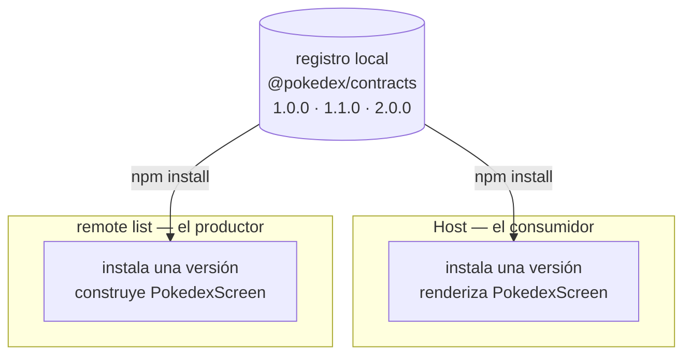

Hasta ahora el host ha cargado sus remotes sin ver nunca lo que exponen. Un remote se construye y se publica por su cuenta, así que en tiempo de compilación el host no tiene ningún archivo para `listApp/PokedexScreen`; ese módulo solo existe en runtime, una vez que Module Federation lo trae. Para que TypeScript no se queje, el host escribe a mano una forma para él:

```ts
declare module 'listApp/PokedexScreen' {
  import type React from 'react';
  const PokedexScreen: React.ComponentType;
  export default PokedexScreen;
}
```

Esa declaración es una conjetura: el autor del host la escribió, el compilador se la cree, y nada la comprueba contra la pantalla que el remote realmente publica. Mientras la pantalla no recibe props no cuesta nada; en cuanto recibe una prop, el host y el remote pueden no estar de acuerdo, y te enteras en runtime, no al compilar.

La solución es un contrato que los dos lados importan. Pero aquí está la parte que decide si vale algo: el host y el remote se construyen y se publican por su cuenta, así que no pueden compartir un archivo en disco. Incluso en un solo repositorio son builds separados, y en el mundo real suelen ser repositorios separados de equipos separados. Así que el contrato no es un archivo al que llegas desde el otro lado. Es un paquete que publicas, e instalas por versión. Este post lo construye, lo publica en un registro, lo instala en los dos lados, y luego hace la pregunta que lo decide todo: qué pasa cuando el host y un remote acaban en versiones distintas.

<div id="architecture"></div>



Retomamos donde lo dejó el post 4. Si lo construiste paso a paso, sigue con tu propio código. Si no, parte del estado final del post 4:

```sh
git clone https://github.com/warrendeleon/react-native-module-federation
git checkout post-04-host-shell
```

## El contrato

El contrato es un paquete pequeño de tipos y nada más. Crea `packages/contracts` junto a `apps`.

Los tipos que exporta, `packages/contracts/src/screens.ts`. Este es el único sitio donde el host y el remote se ponen de acuerdo sobre lo que cruza la costura:

```ts
import type { ComponentType } from 'react';

export interface PokedexScreenProps {
  // The list remote reports which Pokémon was tapped. The host owns navigation and decides what
  // happens next, so the remote never imports a navigator; it just hands back an id.
  onSelectPokemon: (id: number) => void;
}

// The profile screen takes nothing from the host yet. An empty contract is still a contract: the
// host's import resolves to "a component with no props", enforced rather than assumed.
export type ProfileScreenProps = Record<string, never>;

// The exposed-module types, composed from the props above. The host's ambient declarations point at
// these, so a federated import is typed from the same source the remote was built against.
export type PokedexScreenModule = ComponentType<PokedexScreenProps>;
export type ProfileScreenModule = ComponentType<ProfileScreenProps>;
```

Un barrel, `packages/contracts/src/index.ts`:

```ts
export * from './screens';
```

Su `package.json`. La versión es la parte que más importará: esta es `1.0.0`, el primer corte publicado de la costura. `publishConfig` apunta la publicación al registro local que vamos a arrancar, y `prepublishOnly` construye los tipos antes de cada publicación para que los consumidores reciban siempre declaraciones frescas:

```json
{
  "name": "@pokedex/contracts",
  "version": "1.0.0",
  "description": "The typed seam between the host and every federated remote: the props each exposed screen takes.",
  "main": "dist/index.js",
  "types": "dist/index.d.ts",
  "files": ["dist", "src", "README.md"],
  "scripts": {
    "build": "tsc",
    "typecheck": "tsc --noEmit",
    "prepublishOnly": "npm run build"
  },
  "publishConfig": {
    "registry": "http://localhost:4873/"
  },
  "peerDependencies": {
    "react": "*"
  },
  "devDependencies": {
    "@types/react": "^19.2.0",
    "typescript": "^5.8.3"
  }
}
```

Su `tsconfig.json` emite declaraciones en `dist`, para que los consumidores reciban tipos además de JavaScript:

```json
{
  "compilerOptions": {
    "target": "ES2020",
    "module": "CommonJS",
    "moduleResolution": "node",
    "lib": ["ES2020"],
    "jsx": "react-jsx",
    "strict": true,
    "esModuleInterop": true,
    "skipLibCheck": true,
    "declaration": true,
    "declarationMap": true,
    "sourceMap": true,
    "outDir": "dist",
    "rootDir": "src",
    "forceConsistentCasingInFileNames": true,
    "isolatedModules": true
  },
  "include": ["src/**/*"],
  "exclude": ["dist", "node_modules"]
}
```

Como cada export es un tipo, el import se borra al construir. Nada de este paquete llega a un bundle, y no hay ninguna dependencia de runtime que compartir como se comparte `react`. Refleja el contrato del post 3 en otra capa: el post 3 compartió una librería en runtime para que la app no pete; este comparte un tipo en tiempo de compilación para que el build no mienta.

## Publícalo en un registro

Una ruta `file:` a `../../packages/contracts` funcionaría aquí, porque en este monorepo las apps son vecinas en disco. También enseñaría algo equivocado. Todo el sentido de un remote federado es que se construye y se publica por su cuenta; el día que pase a su propio repositorio, una ruta a través del sistema de archivos desaparece. Así que tratamos el contrato como lo tendrán que tratar sus consumidores en producción: un paquete versionado que se descarga de un registro.

En local, ese registro es [Verdaccio](https://verdaccio.org/), un registro npm pequeño que ejecutas tú mismo. Hace las veces de lo que uses en producción: un registro npm privado, GitHub Packages o Artifactory. Arráncalo en su propia terminal:

```sh
npx verdaccio
```

Arranca en `http://localhost:4873`. Registra un usuario contra él una vez, lo que escribe un token en tu `~/.npmrc` de usuario:

```sh
npm adduser --registry http://localhost:4873
```

Apunta el scope `@pokedex` al registro local para que las dos apps resuelvan el contrato ahí, mientras todo lo demás sigue viniendo de npm. Un `.npmrc` a nivel de proyecto en la raíz del repo:

```sh
@pokedex:registry=http://localhost:4873/
```

Construye y publica desde el paquete. `prepublishOnly` ejecuta el build por ti:

```sh
cd packages/contracts
npm publish
```

```sh
+ @pokedex/contracts@1.0.0
```

Ahora la costura es un artefacto publicado con una versión encima. Esa versión está a punto de hacer trabajo de verdad.

## Instálalo en los dos lados

El host y el remote list toman cada uno el contrato como dependencia, por rango de versión. Añádelo a `apps/host/package.json` y `apps/list/package.json`:

```json
"dependencies": {
  "@pokedex/contracts": "^1.0.0",
  ...
}
```

Luego `npm install` en cada una. Esta vez es una instalación de verdad: cada app descarga y desempaqueta su propia copia de `@pokedex/contracts@1.0.0` en `node_modules`, en lugar de apuntar a una carpeta compartida como haría una ruta `file:`. El host y el remote tienen cada uno la versión que pidieron.

El remote list construye su pantalla contra el contrato. Sus props vienen de `@pokedex/contracts`, así que la firma se comprueba contra el mismo tipo con el que el host renderizará. `apps/list/src/PokedexScreen.tsx`:

```tsx
import React from 'react';
import { FlatList, Pressable, StyleSheet, Text, View } from 'react-native';
import { useSafeAreaInsets } from 'react-native-safe-area-context';
import type { PokedexScreenProps } from '@pokedex/contracts';

const POKEMON = [
  { id: 1, name: 'Bulbasaur' },
  { id: 4, name: 'Charmander' },
  { id: 7, name: 'Squirtle' },
  { id: 25, name: 'Pikachu' },
  { id: 133, name: 'Eevee' },
];

export default function PokedexScreen({ onSelectPokemon }: PokedexScreenProps) {
  const insets = useSafeAreaInsets();
  return (
    <View style={[styles.screen, { paddingTop: insets.top + 24 }]}>
      <Text style={styles.title}>Pokédex</Text>
      <Text style={styles.subtitle}>Served by the list remote</Text>
      <FlatList
        data={POKEMON}
        keyExtractor={p => String(p.id)}
        renderItem={({ item }) => (
          <Pressable style={styles.row} onPress={() => onSelectPokemon(item.id)}>
            <Text style={styles.number}>#{String(item.id).padStart(3, '0')}</Text>
            <Text style={styles.name}>{item.name}</Text>
          </Pressable>
        )}
      />
    </View>
  );
}

const styles = StyleSheet.create({
  screen: { flex: 1, padding: 24, backgroundColor: '#fff' },
  title: { fontSize: 28, fontWeight: '700' },
  subtitle: { fontSize: 14, color: '#6b7280', marginBottom: 16 },
  row: {
    flexDirection: 'row',
    paddingVertical: 12,
    borderBottomWidth: StyleSheet.hairlineWidth,
    borderBottomColor: '#e5e7eb',
  },
  number: { width: 56, color: '#9ca3af', fontVariant: ['tabular-nums'] },
  name: { fontSize: 16, fontWeight: '500' },
});
```

El host renderiza la pantalla y pasa un handler. El remote list reporta un id; el host es dueño de la navegación y decide qué hacer con él, así que el remote nunca importa un navigator. El wrapper genérico sin props del post 4 no puede llevar una prop, así que cada pestaña recibe su propio wrapper pequeño. El `apps/host/App.tsx` completo:

```tsx
import React, { Suspense } from 'react';
import { ActivityIndicator, StyleSheet } from 'react-native';
import { SafeAreaProvider } from 'react-native-safe-area-context';
import { NavigationContainer } from '@react-navigation/native';
import { createBottomTabNavigator } from '@react-navigation/bottom-tabs';

const PokedexScreen = React.lazy(() => import('listApp/PokedexScreen'));
const ProfileScreen = React.lazy(() => import('profileApp/ProfileScreen'));

// The host owns navigation, so it owns what a selection means. The list remote reports an id through
// the onSelectPokemon prop typed in @pokedex/contracts; for now the host just logs it, and a later
// post wires it to a detail route. Pass a wrong-shaped handler here and TypeScript stops the build.
function handleSelectPokemon(id: number) {
  console.log(`Selected Pokémon #${id}`);
}

function PokedexTab() {
  return (
    <Suspense fallback={<ActivityIndicator style={styles.loader} size="large" />}>
      <PokedexScreen onSelectPokemon={handleSelectPokemon} />
    </Suspense>
  );
}

function ProfileTab() {
  return (
    <Suspense fallback={<ActivityIndicator style={styles.loader} size="large" />}>
      <ProfileScreen />
    </Suspense>
  );
}

const Tab = createBottomTabNavigator();

export default function App() {
  return (
    <SafeAreaProvider>
      <NavigationContainer>
        <Tab.Navigator screenOptions={{ headerShown: false }}>
          <Tab.Screen name="Pokédex" component={PokedexTab} />
          <Tab.Screen name="Trainer" component={ProfileTab} />
        </Tab.Navigator>
      </NavigationContainer>
    </SafeAreaProvider>
  );
}

const styles = StyleSheet.create({
  loader: { flex: 1 },
});
```

Por último, retira la conjetura. `apps/host/mf-modules.d.ts` deja de escribir la forma a mano y la toma prestada del contrato:

```ts
declare module 'listApp/PokedexScreen' {
  import type { PokedexScreenModule } from '@pokedex/contracts';
  const PokedexScreen: PokedexScreenModule;
  export default PokedexScreen;
}

declare module 'profileApp/ProfileScreen' {
  import type { ProfileScreenModule } from '@pokedex/contracts';
  const ProfileScreen: ProfileScreenModule;
  export default ProfileScreen;
}
```

Haz typecheck del host y del list (`npx tsc --noEmit`, ejecutado dentro de cada app). Los dos pasan, cada uno contra el mismo `1.0.0` publicado. Productor y consumidor ahora coinciden en la costura a través de un artefacto, no de una conjetura. Por ahora esto parece un mero trámite. La versión lo convierte en algo más.

## La prueba de verdad: cuando las versiones divergen

En un monorepo con un solo build, la divergencia se detecta gratis, porque todo compila junto. Esa red de seguridad es justo lo que una app federada deja atrás: el host y cada remote se construyen, y se despliegan, por su cuenta. Pueden estar en versiones distintas del contrato al mismo tiempo. Si eso es inofensivo o fatal es el verdadero tema de este post.

### Cambio aditivo: divergir es seguro

Pongamos que el remote list quiere soportar una pulsación larga, y que el host quizá le pase un handler algún día. Añade la prop al contrato, opcional a propósito:

```ts
export interface PokedexScreenProps {
  onSelectPokemon: (id: number) => void;
  // Added in 1.1.0. Optional on purpose: a host built against 1.0.0 never passes it, and still
  // satisfies the contract. That is what makes an additive change safe to roll out unevenly.
  onLongPressPokemon?: (id: number) => void;
}
```

Esto añade a la costura sin cambiar nada de lo que ya estaba, así que es una subida minor. Pon la versión en `1.1.0` y publica:

```sh
+ @pokedex/contracts@1.1.0
```

El remote list lo adopta, y conecta la pulsación larga con optional chaining para que sea un no-op seguro hasta que un host pase un handler:

```tsx
export default function PokedexScreen({
  onSelectPokemon,
  onLongPressPokemon,
}: PokedexScreenProps) {
  // ...
  <Pressable
    style={styles.row}
    onPress={() => onSelectPokemon(item.id)}
    onLongPress={() => onLongPressPokemon?.(item.id)}
  >
```

Instala `1.1.0` en el list, y deja el host en `1.0.0`:

```sh
cd apps/list && npm install @pokedex/contracts@1.1.0
```

Ahora los dos lados están en versiones distintas, y los dos pasan el typecheck. El list construye contra `1.1.0`, que tiene la prop nueva. El host construye contra `1.0.0`, que no la tiene, así que el host nunca la pasa, y una pantalla que solo requiere `onSelectPokemon` está contenta sin ella. Un cambio aditivo se despliega de forma desigual y sigue siendo seguro, que es toda la razón por la que existe un rango con caret como `^1.0.0`: el host cogerá `1.1.0` en su próxima instalación, pero no tiene ninguna presión para actualizar al mismo tiempo. Ejecuta `npm install @pokedex/contracts` en el host cuando quieras, y los dos lados están en `1.1.0`.

### Cambio incompatible: la versión hace trabajo de verdad

Ahora un cambio que no puede ser aditivo. Supón que el equipo decide que los ids deberían ser strings. Eso re-tipa una prop existente, así que cualquier cosa construida contra la forma antigua está mal. Semver tiene un nombre para eso, una subida major. Pon la versión en `2.0.0`, cambia el tipo, y publica:

```ts
onSelectPokemon: (id: string) => void;
```

```sh
+ @pokedex/contracts@2.0.0
```

Pasan tres cosas, y juntas son el sentido de todo el paquete.

**El caret lo rechaza.** El host está en `^1.x`. Instala, y luego comprueba a qué se resolvió:

```sh
cd apps/host && npm install @pokedex/contracts
npm ls @pokedex/contracts
```

```sh
Host@0.0.1
└── @pokedex/contracts@1.1.0
```

Coge `1.1.0`, la `1.x` más nueva, y no cruzará a `2.0.0` por su cuenta. Un cambio incompatible no se propaga en silencio; alguien tiene que pedirlo por versión major. Semver está haciendo su trabajo antes de que se ejecute una línea de tu código.

**Optar por él detecta la divergencia.** Mueve el list a `2.0.0` a propósito, sin cambiar su código, y deja de compilar:

```sh
cd apps/list && npm install @pokedex/contracts@2.0.0
```

```sh
src/PokedexScreen.tsx(32,44): error TS2345: Argument of type 'number' is not assignable to parameter of type 'string'.
src/PokedexScreen.tsx(33,53): error TS2345: Argument of type 'number' is not assignable to parameter of type 'string'.
```

La versión detectó el desajuste en el momento en que el list la adoptó. Dentro de un repositorio, contra una versión instalada, el contrato funciona exactamente como esperarías.

**Entre versiones, nada lo comprueba.** Adapta el list a `2.0.0` para que pase strings, y deja el host en `1.1.0`:

```tsx
onPress={() => onSelectPokemon(String(item.id))}
```

Los dos repositorios compilan, el list contra `2.0.0` y el host contra `1.1.0`, y no están de acuerdo: el handler del host está tipado para un number, el list ahora envía un string, y ningún compilador puede ver entre las dos versiones instaladas. Este es el límite honesto de un contrato de tipos. Es una especificación en tiempo de compilación, no una garantía en runtime; no puede vigilar una frontera entre dos unidades que fijaron majors distintos. En runtime el string llega donde el host esperaba un number, sin nada que lo pare, y peor aún, puede que ni siquiera pete. Un simple `console.log` se traga la diferencia. El bug aparece más tarde, allá donde el id se use como number: una comparación que nunca coincide, una ordenación numérica que se descoloca, un parámetro de ruta tipado que falla.

Así que un cambio incompatible es un despliegue coordinado, no una publicación. Mueves los dos lados a `2.0.0` a la vez, o sigues sirviendo la versión antigua del remote hasta que el host se ponga al día, algo que la federación hace posible y que construye un post posterior. El trabajo de semver aquí no es evitar la ruptura. Es hacer que la ruptura sea ruidosa y deliberada en lugar de silenciosa. Vuelve a poner el contrato en `1.1.0`; no vamos a publicar strings, pero todo equipo federado tiene que saber cómo es esto antes de que le pase en producción.

## Ejecútalo

Verdaccio solo hace falta para publicar e instalar. Una vez que el contrato está en `node_modules`, se borra al construir, así que la app en ejecución nunca toca el registro. La ejecución es la del post 4, con cada remote y el host en su propia terminal:

```sh
cd apps/list && npm run start:remote      # :8082
cd apps/profile && npm run start:remote   # :8083
cd apps/host && npm start                 # :8081
cd apps/host && npm run ios
```

La app se ve exactamente como tras el post 4: dos pestañas, la lista Pokédex servida por el remote list. Toca un Pokémon y el host registra la selección que recibió a través de la costura, por una prop que los dos lados tipan desde una sola versión publicada.

<div class="device-frame">
  
</div>

## Lo que construiste, y lo que viene

La costura entre el host y sus remotes es un artefacto publicado, versionado y revisable. Un cambio en ella aparece en un diff y en un número de versión, donde los dos equipos pueden ver si es aditivo o incompatible, en lugar de dos lados divergiendo a ciegas contra una conjetura. Los cambios aditivos se despliegan de forma desigual y siguen siendo seguros. Los cambios incompatibles se niegan a propagarse solos y fuerzan un movimiento coordinado. Nada de esto es gratis: la publicación y las subidas de versión son trabajo de verdad, pero ese trabajo es el precio de dejar que dos apps se desplieguen por su cuenta. Si no lo quieres, no quieres federación; quieres una sola app.

Lo único que el contrato no puede hacer es vigilar la frontera en runtime, porque para entonces los tipos ya no están. Una comprobación en runtime en la costura es el respaldo: valida lo que de verdad la cruza con una librería de esquemas como Zod, para que un valor equivocado falle a gritos en la frontera en lugar de colarse por un tipo que ya no existe. Esa comprobación tiene su propio post más adelante en la serie.

El código terminado de este post es el tag `post-05-contracts`, así que puedes compararlo con el tuyo:

```sh
git checkout post-05-contracts
```

Lo siguiente, un breve desvío antes del trabajo de estado federado: dos posts sobre el estado de React en sí, empezando por la división entre estado de servidor y estado de cliente y por qué una app de React los guarda en dos librerías distintas. Después lo traemos de vuelta a la federación, donde las pestañas dejan de tener datos hardcodeados y comparten un store entre los remotes, con datos reales de una API.

## Fuentes

- [Verdaccio](https://verdaccio.org/) — el registro npm local donde se publica el contrato
- [Module Federation 2.0](https://module-federation.io/) — el runtime que carga cada remote que el contrato describe
- [TypeScript: ambient modules](https://www.typescriptlang.org/docs/handbook/modules/reference.html#ambient-modules) — por qué un import que solo existe en runtime aún necesita una forma declarada
- [semver](https://semver.org/) — qué promete a un consumidor una subida major frente a una minor
- [react-native-module-federation](https://github.com/warrendeleon/react-native-module-federation) — el repo de acompañamiento, en el tag `post-05-contracts`
