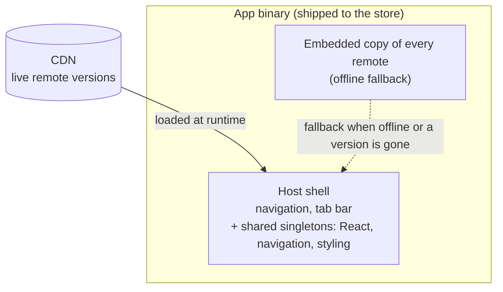

La versión corta: Module Federation permite que una app de React Native cargue sus features en runtime, así cada una se puede desplegar y actualizar por su cuenta en vez de viajar dentro de una única release de la app store. Eso te da deploys independientes y arreglos over-the-air. También te entrega un problema de sistemas distribuidos que antes era trabajo del bundler. Esta serie construye un setup federado funcionando desde cero sobre una pequeña app de Pokédex. Este primer post va sobre si deberías hacerlo o no.

## Cada feature se publica en cada release

Una app estándar de React Native es un único bundle. Organízala bien, [por feature](/blog/feature-first-project-structure-react-native/) en vez de por tipo, y aquí no cambia nada: la pantalla de login, la página de ajustes, el informe que nadie abre, todo compilado junto, todo bloqueado tras la misma revisión de la store, todo viajando en el mismo tren de releases. Un arreglo de una línea en una pantalla espera a que toda la app se reconstruya, se vuelva a enviar y se apruebe.

Para una app pequeña con un solo equipo, eso está bien. El tren de releases es barato y todo el mundo está en él de todas formas. Para una app grande con varios equipos, sale caro. El arreglo urgente de un equipo se queda detrás de la feature a medias de otro equipo porque comparten un binario. La release se convierte en una negociación, y la cadencia baja al ritmo del contribuyente más lento del tren.

Ese acoplamiento es lo que Module Federation intenta deshacer. No el tamaño del bundle, no la velocidad de build, esos son efectos secundarios agradables. El premio de verdad es romper el vínculo entre "cambié mi feature" y "toda la app tiene que publicarse".

## Qué es en realidad

Una app federada tiene un **host** y un conjunto de **remotes**. El host es el caparazón: la navegación, la tab bar, las librerías compartidas, las piezas que siempre están ahí. Los remotes son las features, y cada una se construye y se despliega por su cuenta, y luego se carga en runtime desde una URL.

El host no compila los remotes dentro de sí mismo como hace un bundle único. Una copia de cada uno sigue viajando dentro del binario de la app como fallback, la app revisada tiene que funcionar por sí sola, sin red, pero esa copia es solo el mínimo garantizado; la versión en vivo viene del CDN y se actualiza sin una release. El host también provee las librerías compartidas pesadas una sola vez, React, el stack de navegación, la capa de estilos, así cada remote consume la copia del host en vez de cargar la suya propia. Un remote pasa a ser una pequeña carga de código de feature que encaja en un caparazón que ya tiene todo lo de debajo.

En la práctica eso corre sobre [Re.Pack](https://re-pack.dev/) (Rspack por debajo) con [Module Federation 2.0](https://module-federation.io/). La mecánica es un post posterior. Por ahora el modelo mental basta: un caparazón que carga features en runtime, desde la red o desde un fallback empotrado, contra un contrato sobre lo que el caparazón provee.

## Qué te aporta

**Deploys independientes.** Un equipo de feature publica cuando su feature está lista, no cuando sale el tren. La release deja de ser un recurso compartido por el que todo el mundo hace cola.

**Arreglos over-the-air.** Un bug en un remote es volver a subir ese remote, no un envío a la store. El arreglo está en vivo en minutos, y cada usuario lo recoge en su siguiente arranque, dentro de las reglas de la plataforma (más sobre eso abajo).

**Arranques más rápidos.** Las features que no se necesitan al lanzar se cargan de forma lazy, así corre menos JavaScript en el camino crítico. La descarga en sí no encoge si publicas un fallback offline, el binario sigue cargando todos los remotes, pero el arranque sí puede.

**Autonomía de equipo a escala.** Cada feature posee su propio build, su propio deploy, su propia cadencia. La arquitectura deja de forzar a los equipos a ir al unísono.

Si nada de eso es un dolor que sientas de verdad, el resto de este post es tu salida. Federation resuelve el acoplamiento. Sin acoplamiento, no hay razón para pagar por la solución.

## Qué cuesta

Esta es la parte que los posts entusiastas se saltan, así que es la parte en la que merece la pena ir despacio.

**El contrato de singletons compartidos.** El host provee un React, una librería de navegación, una capa de estilos, y cada remote renderiza contra esos. En cuanto un remote necesita una versión *más nueva* de una librería compartida que la que el host carga, tienes un problema de version skew. Sin manejar, el runtime negocia a la baja hasta la copia del host y el remote se rompe sobre una API que esa copia no tiene. Tiene solución, la serie construye el arreglo, pero resolverlo es el coste: el conjunto compartido pasa a ser un contrato que posees y tienes que mantener compatible, trabajo que el compilador hacía gratis.

**La carga de compatibilidad, sobre todo para versiones antiguas de la app.** No todos los usuarios actualizan. Un binario que alguien instaló hace meses tiene las librerías compartidas congeladas en lo que se publicó entonces. Empuja un remote que necesite unas más nuevas y rompes precisamente a la gente que no se ha movido. Así que acabas manteniendo disponibles versiones antiguas del remote para versiones antiguas de la app, la misma disciplina que mantener vivo un endpoint de API viejo hasta que el último cliente deja de llamarlo. Eso no es trabajo de bundler. Eso es operar un servicio versionado.

**Integridad.** En cuanto tu app descarga y ejecuta código desde una URL, esa URL es una superficie de ataque. Tienes que firmar lo que publicas y que el dispositivo lo verifique antes de ejecutar, o un host comprometido puede entregar a tus usuarios lo que le dé la gana. Luego tienes que proteger también la *elección* de versión, para que un manifest reproducido o revertido no pueda servir en silencio un build viejo y vulnerable. Seguridad que un único binario firmado te daba gratis, ahora la construyes tú.

**Reglas de plataforma.** La [guideline 2.5.2 de Apple](https://developer.apple.com/app-store/review/guidelines/#software-requirements) permite que una app descargue y ejecute código interpretado como JavaScript, que es lo que hace legal el OTA en primer lugar, pero solo mientras no cambie el propósito principal de la app, y el binario que envías sigue teniendo que funcionar por sí solo. Nada de publicar features grandes sin revisar por OTA. Federation vive dentro de esas líneas; no las borra.

**Superficie operativa.** Un CDN que operar, cachés que invalidar, rollbacks que automatizar, fallos que monitorizar. Cuando un remote no carga, la app tiene que degradar a algo seguro en vez de mostrar una pantalla en blanco. Esa red de seguridad es ingeniería de verdad, y corre de tu cuenta.

En conjunto: Module Federation es un problema de sistemas distribuidos vestido de bundler. La parte del bundler está acotada, lo configuras y ya está. La parte de sistemas, firma, versionado, compatibilidad, fallback, es el trabajo de verdad, y nunca termina del todo.

## Cuándo merece la pena

Tira de ello cuando las tres cosas sean ciertas:

- **Varios equipos** se están pisando en una release compartida.
- **El acoplamiento es un coste medido**, cadencia más lenta, arreglos bloqueados, no uno teórico.
- **Alguien puede poseer la plataforma**, el CDN, la firma, el contrato de versiones, la capa de fallback, como trabajo continuo.

Sáltalo cuando la app es pequeña, la posee un solo equipo, y una release a la store cada par de semanas no es una carga. La complejidad que asumirías empequeñece el acoplamiento que quitarías. El code splitting por sí solo, chunks async sin la maquinaria de runtime-remote, te da la carga lazy y el arranque más rápido a una fracción del coste, y es una parada sensata antes de la federation completa.

Federation es una herramienta de escalado. Adóptala porque has llegado a la escala que la justifica, no porque la arquitectura sea interesante. Lo es. Esa es la trampa.

## Qué hace el resto de esta serie

A partir de aquí es práctico. Construimos un setup federado sobre una pequeña app de Pokédex y lo llevamos hasta el final:

- un host y un primer remote, cargando en runtime
- el contrato de singletons compartidos, y la trampa que lo rompe en silencio
- cargar remotes desde un CDN, con un fallback offline empotrado en la app
- firmar los remotes y el manifest de versión para que un build manipulado o reproducido no pueda correr
- y el difícil, asegurar que una versión antigua de la app nunca reciba un remote que no puede correr, y nunca crashee cuando uno desaparece

Al final tendrás una versión funcionando de todo lo que este post acaba de advertirte, y una idea clara de si es un intercambio que tu app debería hacer.

## Fuentes

- [Re.Pack](https://re-pack.dev/): el bundler de React Native que envuelve Rspack y trae soporte de Module Federation
- [Module Federation 2.0](https://module-federation.io/): la arquitectura de runtime
- [Rspack](https://rspack.dev/): el bundler basado en Rust que hay bajo Re.Pack
- [App Store Review Guidelines, 2.5.2](https://developer.apple.com/app-store/review/guidelines/#software-requirements): la regla de Apple sobre código interpretado descargado
