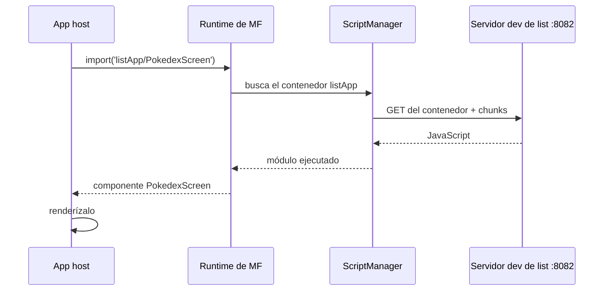

El [primer post](/blog/why-module-federation-react-native/) defendió Module Federation. Este construye la versión real más pequeña: dos apps de React Native separadas, donde una app (el host) carga una pantalla de la otra (un remote) mientras está corriendo. Vamos de una carpeta vacía a una app funcionando, con cada paso a la vista.

El código terminado está en el repo compañero en el tag de este post, así que puedes clonarlo y hacer diff contra el tuyo si algo se desvía:

```sh
git clone https://github.com/warrendeleon/react-native-module-federation
git checkout post-02-first-remote
```

Esto es lo que tendrás al final. La lista de Pokémon en pantalla vive en, y la sirve, una *app distinta* de la que está corriendo:

<div class="device-frame">
  
</div>

## Dos apps

Una federation necesita un host y al menos un remote. Crea dos apps de React Native nuevas:

```sh
mkdir react-native-module-federation && cd react-native-module-federation
npx @react-native-community/cli@latest init Host --directory apps/host
npx @react-native-community/cli@latest init List --directory apps/list
```

`host` es el caparazón que lanza el usuario. `list` es una feature que se cargará en él en runtime.

## Pon ambas sobre Re.Pack

React Native viene con Metro. Module Federation 2.0 corre sobre [Re.Pack](https://re-pack.dev/) (Rspack por debajo), así que el primer trabajo es cambiar el bundler. Los pasos son idénticos en ambas apps.

Instala el bundler y los paquetes de federation en cada app:

```sh
npm install -D @callstack/repack @rspack/core \
  @module-federation/enhanced @module-federation/runtime @swc/helpers
```

`@swc/helpers` es el fácil de olvidar. Re.Pack compila tu código con SWC (el Speedy Web Compiler, una alternativa a Babel basada en Rust que usa por debajo). Cuando SWC compila sintaxis moderna hacia abajo, emite llamadas `require("@swc/helpers/…")` a una pequeña librería de helpers compartida en vez de inyectar el mismo boilerplate por todas partes. Olvida el paquete y el build falla con una pantalla de errores "can't resolve" que no dan ninguna pista de la causa real.

Ahora apunta la CLI de React Native a Re.Pack. En **ambas** apps, añade `react-native.config.js`:

```js
// apps/host/react-native.config.js  AND  apps/list/react-native.config.js
module.exports = {
  commands: require('@callstack/repack/commands/rspack'),
};
```

Ese único archivo es lo que hace que `react-native start` y `react-native bundle` usen Rspack en vez de Metro. El bundler está cambiado. Lo que difiere entre host y remote es el `rspack.config.mjs` que recibe cada uno, que es donde se configura la federation.

## El remote: exponer una pantalla

Un remote federado es una app sin `AppRegistry.registerComponent`. No arranca por sí misma, espera a que la carguen en un host. Declara un nombre y lo que entrega.

Primero la pantalla que entrega, `apps/list/src/PokedexScreen.tsx`. React Native plano a propósito, este post va sobre cargarla, no sobre estilarla:

```tsx
import React from 'react';
import { FlatList, StyleSheet, Text, View } from 'react-native';

const POKEMON = [
  { id: 1, name: 'Bulbasaur' },
  { id: 4, name: 'Charmander' },
  { id: 7, name: 'Squirtle' },
  { id: 25, name: 'Pikachu' },
  { id: 133, name: 'Eevee' },
];

export default function PokedexScreen() {
  return (
    <View style={styles.screen}>
      <Text style={styles.title}>Pokédex</Text>
      <Text style={styles.subtitle}>Served by the list remote</Text>
      <FlatList
        data={POKEMON}
        keyExtractor={p => String(p.id)}
        renderItem={({ item }) => (
          <View style={styles.row}>
            <Text style={styles.number}>#{String(item.id).padStart(3, '0')}</Text>
            <Text style={styles.name}>{item.name}</Text>
          </View>
        )}
      />
    </View>
  );
}

const styles = StyleSheet.create({
  screen: { flex: 1, padding: 24, backgroundColor: '#fff' },
  title: { fontSize: 28, fontWeight: '700' },
  subtitle: { fontSize: 14, color: '#6b7280', marginBottom: 16 },
  row: {
    flexDirection: 'row',
    paddingVertical: 12,
    borderBottomWidth: StyleSheet.hairlineWidth,
    borderBottomColor: '#e5e7eb',
  },
  number: { width: 56, color: '#9ca3af', fontVariant: ['tabular-nums'] },
  name: { fontSize: 16, fontWeight: '500' },
});
```

El entry point del contenedor, `apps/list/src/index.js`, está casi vacío. Un remote no registra ningún componente raíz, así que no tiene nada que hacer al arrancar:

```js
// apps/list/src/index.js
export {};
```

Ahora la config, `apps/list/rspack.config.mjs`:

```js
import path from 'node:path';
import { fileURLToPath } from 'node:url';
import * as Repack from '@callstack/repack';
import pkg from './package.json' with { type: 'json' };

const __dirname = path.dirname(fileURLToPath(import.meta.url));

export default Repack.defineRspackConfig(env => {
  const { mode, platform } = env;

  return {
    mode,
    context: __dirname,
    entry: './src/index.js',
    resolve: {
      // Lets the resolver read each package's `exports` map, which the Module Federation
      // runtime needs for subpath imports like '@module-federation/runtime/helpers'.
      ...Repack.getResolveOptions({ enablePackageExports: true }),
    },
    output: {
      path: `${__dirname}/build/[platform]`,
      uniqueName: 'ListApp',
    },
    module: {
      rules: [
        {
          test: /\.[cm]?[jt]sx?$/,
          type: 'javascript/auto',
          use: { loader: '@callstack/repack/babel-swc-loader', parallel: true, options: {} },
        },
        ...Repack.getAssetTransformRules(),
      ],
    },
    plugins: [
      new Repack.RepackPlugin({
        extraChunks: [
          { include: /.*/, type: 'remote', outputPath: `build/${platform}/remote` },
        ],
      }),
      new Repack.plugins.ModuleFederationPluginV2({
        name: 'listApp',
        filename: 'listApp.container.js.bundle',
        exposes: {
          './PokedexScreen': './src/PokedexScreen.tsx',
        },
        dts: false,
        shared: {
          react: { singleton: true, requiredVersion: pkg.dependencies.react },
          'react-native': {
            singleton: true,
            requiredVersion: pkg.dependencies['react-native'],
          },
        },
      }),
    ],
  };
});
```

Tres cosas ahí dentro importan. `exposes` mapea una clave pública, `./PokedexScreen`, a un archivo. Esa clave es toda la superficie pública del remote. `shared` declara react y react-native como singletons, así el remote renderiza contra la única copia del host en vez de cargar la suya (dos Reacts en un mismo runtime romperían los hooks). Y `enablePackageExports: true` no es opcional: sin él el runtime de federation no puede resolver sus propios subpath imports y el build falla.

Añade un script de dev-server a `apps/list/package.json`:

```json
"scripts": {
  "start:remote": "react-native start --config rspack.config.mjs --port 8082"
}
```

Arráncalo:

```sh
cd apps/list && npm run start:remote
```

Sirve un manifest en `http://localhost:8082/ios/mf-manifest.json` que describe el contenedor y la pantalla que expone. Abre esa URL y verás `./PokedexScreen` en la lista. El remote no renderiza nada por sí solo, es una feature esperando a una app.

## El host: cargar el remote

El host es una app de React Native normal. Su `apps/host/rspack.config.mjs` consume el remote:

```js
import path from 'node:path';
import { fileURLToPath } from 'node:url';
import * as Repack from '@callstack/repack';
import pkg from './package.json' with { type: 'json' };

const __dirname = path.dirname(fileURLToPath(import.meta.url));

export default Repack.defineRspackConfig(env => {
  const { mode, platform } = env;

  return {
    mode,
    context: __dirname,
    entry: './index.js',
    resolve: {
      ...Repack.getResolveOptions({ enablePackageExports: true }),
    },
    output: {
      path: `${__dirname}/build/[platform]`,
      uniqueName: 'Host',
    },
    module: {
      rules: [
        {
          test: /\.[cm]?[jt]sx?$/,
          type: 'javascript/auto',
          use: { loader: '@callstack/repack/babel-swc-loader', parallel: true, options: {} },
        },
        ...Repack.getAssetTransformRules(),
      ],
    },
    plugins: [
      new Repack.RepackPlugin(),
      new Repack.plugins.ModuleFederationPluginV2({
        name: 'host',
        filename: 'host.container.js.bundle',
        remotes: {
          // name@url: the host knows listApp lives at this manifest URL. In dev that is the
          // remote's own dev server on :8082.
          listApp: `listApp@http://localhost:8082/${platform}/mf-manifest.json`,
        },
        dts: false,
        shared: {
          react: { singleton: true, eager: true, requiredVersion: pkg.dependencies.react },
          'react-native': {
            singleton: true,
            eager: true,
            requiredVersion: pkg.dependencies['react-native'],
          },
        },
      }),
    ],
  };
});
```

La línea `name@url` es todo el cableado: el host sabe que un remote llamado `listApp` está en esa URL de manifest. El `shared` del host añade `eager: true`, porque el host es la única copia contra la que renderiza todo el mundo, y `eager` deja el share scope listo antes de que corra el entry síncrono de la app, así no hace falta un archivo de bootstrap.

Ahora cárgalo. Reemplaza `apps/host/App.tsx`:

```tsx
import React, { Suspense } from 'react';
import { ActivityIndicator, StyleSheet } from 'react-native';
import { SafeAreaProvider, SafeAreaView } from 'react-native-safe-area-context';

const PokedexScreen = React.lazy(() => import('listApp/PokedexScreen'));

export default function App() {
  return (
    <SafeAreaProvider>
      <SafeAreaView style={styles.root}>
        <Suspense fallback={<ActivityIndicator style={styles.loader} size="large" />}>
          <PokedexScreen />
        </Suspense>
      </SafeAreaView>
    </SafeAreaProvider>
  );
}

const styles = StyleSheet.create({
  root: { flex: 1 },
  loader: { flex: 1 },
});
```

`listApp/PokedexScreen` no es un paquete en disco. Es el `listApp` de los `remotes` del host, y luego el `./PokedexScreen` que ese remote expuso. En runtime, Module Federation convierte ese import en "trae el contenedor de listApp desde su URL, arráncalo, devuelve su export `PokedexScreen`". Como es un import dinámico que devuelve una promesa, encaja directamente en `React.lazy` con un spinner de `Suspense` mientras el remote se descarga.

TypeScript no conoce ese specifier, así que dile la forma. Añade `apps/host/mf-modules.d.ts`:

```ts
declare module 'listApp/PokedexScreen' {
  import type React from 'react';
  const PokedexScreen: React.ComponentType;
  export default PokedexScreen;
}
```

## ScriptManager: la parte que es distinta en nativo

Todo lo de arriba le sonaría familiar a cualquiera que haya hecho Module Federation en web. React Native es donde diverge.

En la web, `import('listApp/PokedexScreen')` termina con el navegador trayendo un script por HTTP y el motor ejecutándolo. Un navegador hace eso constantemente. Cargar código desde una URL es rutina para él. Un runtime de React Native no tiene equivalente. Sin DOM, sin etiqueta `<script>`, sin forma integrada de traer más código bajo demanda una vez que la app ha arrancado. Una app RN estándar es un único bundle autocontenido, cargado al lanzar, sin nada dentro que sepa ir a buscar otro chunk más tarde.

Re.Pack rellena ese hueco con **ScriptManager**: la pieza que convierte una petición que hace el runtime de federation ("necesito el contenedor de listApp") en los pasos reales, calcular la URL, traer el script, entregárselo al motor para que lo ejecute, cachearlo. En nativo, cada import federado pasa por él.

La buena noticia para este post: en dev no escribes nada de eso. El plugin de Module Federation que ya añadiste cablea automáticamente ScriptManager y un resolver por defecto que sabe cómo llegar al dev server del remote. Así que el bucle completo es solo:



Cuando pasas a producción, ScriptManager es donde está el trabajo de verdad: resolver URLs de CDN versionadas, verificar una firma antes de ejecutar nada, recurrir a una copia empotrada cuando la red falla. Todo eso más adelante en la serie. Por ahora basta con saber que es el puente entre "importa un remote" y "el código llega por la red y corre" que el navegador le dio gratis a la federation web.

## Ponlo en marcha

El host tiene el proyecto nativo de iOS, el remote es solo JS. Así que los pods se instalan solo para el host:

```sh
cd apps/host/ios && bundle install && bundle exec pod install
```

Luego, en tres terminales:

```sh
# 1. the remote's dev server (leave the one from earlier running, or start it)
cd apps/list && npm run start:remote     # :8082

# 2. the host's dev server
cd apps/host && npm start                # :8081

# 3. build and launch the host on a simulator
cd apps/host && npm run ios
```

El host arranca, muestra el spinner un instante mientras trae `listApp` desde `:8082`, y luego renderiza la pantalla de Pokédex, servida por una app completamente separada.

Para demostrar que de verdad están separadas, para el dev server de list y recarga el host. La pantalla no puede cargar. Hacer que eso degrade a algo seguro, una copia offline construida dentro del host, es un post propio más adelante en la serie. Ahora mismo lo que importa es el bucle básico, y funciona.

## Qué construiste, y qué sigue siendo mínimo

Tienes dos apps que se construyen y despliegan por su cuenta, unidas en runtime. El host importa una pantalla por nombre, y el código llega por la red y corre dentro de él. El remote no compiló nada dentro del host.

Dos cosas se dejaron deliberadamente mínimas, cada una su propio post:

- **Las librerías compartidas.** react y react-native se comparten para que el remote renderice contra la copia del host. El contrato completo, eager contra lazy, version skew, y el error que rompe la app al arrancar, es el próximo post.
- **Todo lo que producción necesita.** Cargas de CDN versionadas, firma, un fallback offline, y qué pasa cuando un remote ya no está. La segunda mitad de la serie.

Siguiente: el contrato de singletons compartidos, y el error que rompe la app al arrancar.

## Fuentes

- [Re.Pack](https://re-pack.dev/): el bundler de React Native que envuelve Rspack y provee ScriptManager y soporte de Module Federation
- [Module Federation 2.0](https://module-federation.io/): la arquitectura de runtime detrás de los remotes `name@url` y `exposes`
- [react-native-module-federation](https://github.com/warrendeleon/react-native-module-federation): el repo compañero, en el tag `post-02-first-remote`
