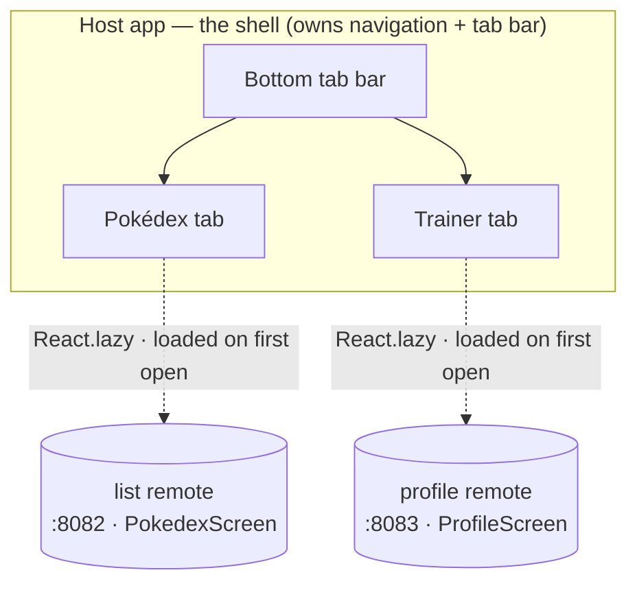

So far the host has loaded one screen from one remote. A real app is more than a screen: it has a shell, a tab bar, somewhere to put the features. This post makes the host that shell. It owns the navigation and the tab bar, and each tab is a separate remote, built and deployed on its own, loaded at runtime.

The shape we're building, before any code: the host owns the tab bar, and each tab is a separate remote app, fetched and run at runtime the first time you open it.



We pick up where post 3 left off. If you built along, stay on your own code. If not, start from post 3's finished state:

```sh
git clone https://github.com/warrendeleon/react-native-module-federation
git checkout post-03-shared-singleton
```

## A second remote to fill a second tab

One tab is not a tab bar. So we add a second remote, `profile`, the same way post 2 built the `list` remote: a fresh React Native app on Re.Pack, with no `AppRegistry.registerComponent`, exposing one screen. Create it next to the others and install its dependencies exactly as you did for `list`.

The screen it exposes, `apps/profile/src/ProfileScreen.tsx`. It reads the safe-area inset from the host's provider, the same shared singleton from post 3:

```tsx
import React from 'react';
import { StyleSheet, Text, View } from 'react-native';
import { useSafeAreaInsets } from 'react-native-safe-area-context';

const TRAINER = { name: 'Ash Ketchum', region: 'Kanto', badges: 8, caught: 151 };

export default function ProfileScreen() {
  const insets = useSafeAreaInsets();
  return (
    <View style={[styles.screen, { paddingTop: insets.top + 24 }]}>
      <Text style={styles.title}>Trainer</Text>
      <Text style={styles.subtitle}>Served by the profile remote</Text>
      <View style={styles.card}>
        <Text style={styles.name}>{TRAINER.name}</Text>
        <Text style={styles.meta}>
          {TRAINER.region} · {TRAINER.badges} badges · {TRAINER.caught} caught
        </Text>
      </View>
    </View>
  );
}

const styles = StyleSheet.create({
  screen: { flex: 1, padding: 24, backgroundColor: '#fff' },
  title: { fontSize: 28, fontWeight: '700' },
  subtitle: { fontSize: 14, color: '#6b7280', marginBottom: 16 },
  card: {
    padding: 16,
    borderRadius: 12,
    borderWidth: StyleSheet.hairlineWidth,
    borderColor: '#e5e7eb',
    backgroundColor: '#f9fafb',
  },
  name: { fontSize: 18, fontWeight: '600', marginBottom: 4 },
  meta: { fontSize: 14, color: '#6b7280' },
});
```

Its container entry, `apps/profile/src/index.js`, stays empty, because a remote boots nothing of its own:

```js
export {};
```

Its `apps/profile/rspack.config.mjs` is the `list` config with a different name, exposed screen, and the same shared singletons:

```js
new Repack.plugins.ModuleFederationPluginV2({
  name: 'profileApp',
  filename: 'profileApp.container.js.bundle',
  exposes: {
    './ProfileScreen': './src/ProfileScreen.tsx',
  },
  dts: false,
  shared: {
    react: { singleton: true, requiredVersion: pkg.dependencies.react },
    'react-native': {
      singleton: true,
      requiredVersion: pkg.dependencies['react-native'],
    },
    'react-native-safe-area-context': {
      singleton: true,
      requiredVersion: pkg.dependencies['react-native-safe-area-context'],
    },
  },
}),
```

Give it its own dev server port so it does not collide with `list` on 8082. In `apps/profile/package.json`:

```json
"scripts": {
  "start:remote": "react-native start --config rspack.config.mjs --port 8083"
}
```

Now there are two remotes, on 8082 and 8083, each a screen waiting for a host.

## The host gets navigation

The tab bar belongs to the host, not the remotes. The host installs a navigation library; the remotes stay plain screens that know nothing about tabs. Install it in the host only:

```sh
cd apps/host
npm install @react-navigation/native @react-navigation/bottom-tabs react-native-screens
cd ios && bundle exec pod install
```

`react-native-screens` is a native module, so the host needs a pod install and a fresh native build. `react-native-safe-area-context` is already there from post 3, and React Navigation uses it.

Here is the important point about sharing, and it is the post-3 contract in reverse. React Navigation lives only in the host because only the host uses it. The remotes never import it, so there is nothing to share. The shared singletons stay exactly what they were: `react`, `react-native`, and `react-native-safe-area-context`. A library only needs sharing when code on both sides of the boundary touches it.

## The shell

Rewrite `apps/host/App.tsx`. The host now owns a `SafeAreaProvider`, a `NavigationContainer`, and a bottom tab navigator. Each tab's content is a lazily-loaded remote:

```tsx
import React, { Suspense } from 'react';
import { ActivityIndicator, StyleSheet } from 'react-native';
import { SafeAreaProvider } from 'react-native-safe-area-context';
import { NavigationContainer } from '@react-navigation/native';
import { createBottomTabNavigator } from '@react-navigation/bottom-tabs';

const PokedexScreen = React.lazy(() => import('listApp/PokedexScreen'));
const ProfileScreen = React.lazy(() => import('profileApp/ProfileScreen'));

// A remote downloads the first time its tab is opened, so each tab renders behind a Suspense
// spinner. Wrapping once here keeps the lazy boundary out of the remotes.
function withSuspense(Remote: React.ComponentType) {
  return function Tab() {
    return (
      <Suspense fallback={<ActivityIndicator style={styles.loader} size="large" />}>
        <Remote />
      </Suspense>
    );
  };
}

const PokedexTab = withSuspense(PokedexScreen);
const ProfileTab = withSuspense(ProfileScreen);

const Tab = createBottomTabNavigator();

export default function App() {
  return (
    <SafeAreaProvider>
      <NavigationContainer>
        <Tab.Navigator screenOptions={{ headerShown: false }}>
          <Tab.Screen name="Pokédex" component={PokedexTab} />
          <Tab.Screen name="Trainer" component={ProfileTab} />
        </Tab.Navigator>
      </NavigationContainer>
    </SafeAreaProvider>
  );
}

const styles = StyleSheet.create({
  loader: { flex: 1 },
});
```

Each tab is a remote behind `React.lazy` and `Suspense`. The remote downloads the first time you open its tab, not at launch, so the app starts on the first tab and fetches the second only when you switch to it.

The host needs to know where the second remote lives. Add it to `remotes` in `apps/host/rspack.config.mjs`:

```js
remotes: {
  listApp: `listApp@http://localhost:8082/${platform}/mf-manifest.json`,
  profileApp: `profileApp@http://localhost:8083/${platform}/mf-manifest.json`,
},
```

And tell TypeScript the shape of the new federated import, in `apps/host/mf-modules.d.ts`:

```ts
declare module 'profileApp/ProfileScreen' {
  import type React from 'react';
  const ProfileScreen: React.ComponentType;
  export default ProfileScreen;
}
```

## Run it

Four terminals now, one per remote and one for the host, plus the build:

```sh
cd apps/list && npm run start:remote      # :8082
cd apps/profile && npm run start:remote   # :8083
cd apps/host && npm start                 # :8081
cd apps/host && npm run ios
```

The host boots on the Pokédex tab and renders the `list` remote. Tap **Trainer** and the host fetches the `profile` remote from 8083, runs it, and shows the trainer card. Two features, built and served by two separate apps, sitting in one tab bar that belongs to neither of them.

<div class="device-frame">
  
</div>

## What you built, and what's next

The host is a shell now. It owns the navigation and the tab bar; each tab is a remote that was built and deployed on its own and loaded at runtime. The remotes stay simple: they render a screen and know nothing about how they are arranged. Adding a third feature is adding a third remote and a third tab, no change to the ones already shipped.

The finished code for this post is the `post-04-host-shell` tag, so you can diff it against your own:

```sh
git checkout post-04-host-shell
```

Next in the series: the tabs stop holding hardcoded data and start sharing one store. A single RTK Query cache across remotes, real data from an API, and cross-module dispatch.

## Sources

- [React Navigation](https://reactnavigation.org/) — the bottom tab navigator the host shell is built on
- [Module Federation 2.0](https://module-federation.io/) — the `name@url` remotes that load each tab at runtime
- [react-native-module-federation](https://github.com/warrendeleon/react-native-module-federation) — the companion repo, at the tag `post-04-host-shell`
