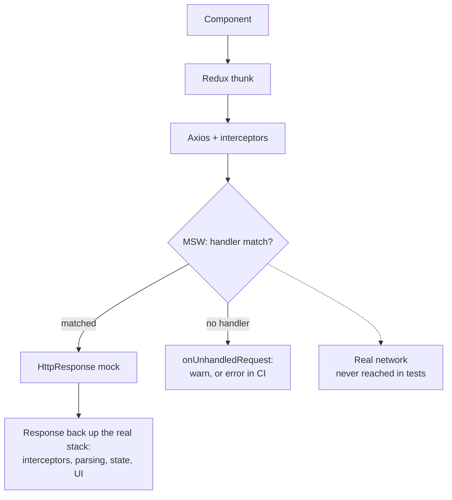

## Why MSW over manual mocks

Most React Native projects mock their API layer with `jest.fn()`. You mock `fetch` or your Axios instance, define what it returns, and test against that.

It works. Until it doesn't.

The problem: you're testing your code's interaction with a mock, not with an HTTP layer. If your API client changes how it constructs URLs, adds headers, or handles retries, the mock doesn't catch the regression. This matters even more if you're validating responses at runtime with something like Zod, because you want the validation layer to run against real response shapes, not hand-crafted mock objects. The mock always returns what you told it to return, regardless of what the code actually sent.

**Mock Service Worker (MSW)** intercepts requests at the network level. Your code makes real HTTP calls. MSW catches them before they leave the process and returns your mock responses. Everything between your component and the network is exercised: the Redux thunk, the Axios interceptors, the error handling, the response parsing.

Manual mocks replace your code. MSW replaces the network. The code runs exactly as it would on a device, right up to the point where the request would have left it.

<div id="msw-intercept"></div>



## Assumptions

The setup below was written against:

- React Native 0.74+ with the default `react-native` Jest preset
- TypeScript with the standard RN Babel config
- Redux Toolkit (the custom render wrapper assumes this)
- Node 18 or later (Node 20 recommended)

If you're on an older RN version, an Expo Jest preset, or no Redux, the *concepts* still apply but a few snippets will need adjustment.

## Installation

MSW v2 runs in Jest tests via the Node.js server. The browser service worker isn't relevant for mobile, so ignore everything in the MSW docs about service-worker registration.

```bash
yarn add -D msw node-fetch@2 web-streams-polyfill
```

`msw` is the obvious one. `node-fetch` and `web-streams-polyfill` are the polyfills MSW v2 needs in the React Native Jest environment, which I'll wire up in the next step.

> 💡 **Why pin `node-fetch@2`?** `node-fetch` v3+ is ESM-only and won't load through `require()` in a CommonJS Jest setup file. Either pin to v2 (what this post does), or migrate the polyfills file to ESM. v2 is the lower-friction path on a default React Native Jest preset.

> 💡 **Don't trust posts that say "no polyfills required".** MSW v2 is built on the Fetch API and Web Streams. Some Node + Jest combinations have these globals; the React Native Jest preset doesn't. Without the polyfills you'll see `ReferenceError: Response is not defined` or `TextEncoder is not defined` the first time MSW tries to construct a response.

## Polyfills

Create `jest.polyfills.cjs` at the project root. It must be `.cjs` (not `.ts`) because Jest loads it before the TypeScript transformer is set up:

```js
/**
 * MSW polyfills for React Native.
 * Required for Mock Service Worker v2 in Jest tests.
 */

// TextEncoder / TextDecoder
const { TextEncoder, TextDecoder } = require('util');
global.TextEncoder = TextEncoder;
global.TextDecoder = TextDecoder;

// Fetch API
if (!global.fetch) {
  global.fetch = require('node-fetch');
  global.Headers = require('node-fetch').Headers;
  global.Request = require('node-fetch').Request;
  global.Response = require('node-fetch').Response;
}

// ReadableStream (for response streaming)
if (!global.ReadableStream) {
  try {
    const { ReadableStream } = require('web-streams-polyfill');
    global.ReadableStream = ReadableStream;
  } catch {
    // web-streams-polyfill is optional for older MSW v2
  }
}
```

This file runs *before* the test framework loads, so `beforeAll`, `jest`, etc. aren't available here. It's purely for setting up globals.

## Jest config

Wire the polyfills file and a separate setup file into `jest.config.cjs`:

```js
module.exports = {
  preset: 'react-native',
  testEnvironment: 'node',
  setupFiles: ['<rootDir>/jest.polyfills.cjs'],
  setupFilesAfterEnv: ['<rootDir>/jest.setup.ts'],
  transformIgnorePatterns: [
    // The default RN preset ignores most of node_modules; MSW needs to be transformed.
    'node_modules/(?!(react-native|@react-native|msw|until-async|rettime|@mswjs|@open-draft|@bundled-es-modules|headers-polyfill|strict-event-emitter|outvariant)/)',
  ],
  moduleFileExtensions: ['ts', 'tsx', 'js', 'jsx', 'json', 'node'],
};
```

Two keys do the work:

| Key | When it runs | Use for |
|---|---|---|
| `setupFiles` | Before the Jest framework is installed | Polyfills, global variables, anything that doesn't need `jest`/`expect` |
| `setupFilesAfterEnv` | After Jest framework, before each test file | `beforeAll`/`afterEach` hooks, MSW server lifecycle, custom matchers |

The `transformIgnorePatterns` line is the other gotcha: the default RN preset skips transforming `node_modules`, but MSW ships modern syntax that Jest can't run as-is. Add MSW and its untranspiled dependencies (`msw|until-async|rettime|@mswjs|@open-draft|@bundled-es-modules|headers-polyfill|strict-event-emitter|outvariant`) to the allow-list or you'll see `SyntaxError: Cannot use import statement outside a module` from inside `node_modules/msw/`. Newer MSW versions ship more of these; if the error names a package that isn't in your list yet, add it to the same group.

## The server

Create `src/test-utils/msw/server.ts`:

```typescript
import { setupServer } from 'msw/node';
import { handlers } from './handlers';

/**
 * MSW server for Jest. Started/stopped in jest.setup.ts.
 * Use `server.use(...errorHandlers)` to override per test.
 */
export const server = setupServer(...handlers);
```

The server takes your default handlers (success responses) and intercepts matching requests.

## Wiring up the lifecycle

In `jest.setup.ts` (which Jest loads via `setupFilesAfterEnv`), start the server before tests, reset between tests, close after:

```typescript
import '@testing-library/jest-native/extend-expect'; // RNTL >=12.4 has these matchers built in; this import is only for older RNTL
import { server } from './src/test-utils/msw/server';

// MSW server lifecycle
beforeAll(() => server.listen({ onUnhandledRequest: 'warn' }));
afterEach(() => server.resetHandlers());
afterAll(() => server.close());
```

| Hook | What it does |
|---|---|
| `beforeAll` | Starts the server before any test runs |
| `afterEach` | Resets handlers to defaults between tests (so one test's overrides don't leak) |
| `afterAll` | Shuts down the server after all tests complete |

The `onUnhandledRequest: 'warn'` option logs a warning if your code makes a request no handler matches. In CI, switch this to `'error'` so missed handlers fail the build:

```typescript
const onUnhandledRequest = process.env.CI ? 'error' : 'warn';
beforeAll(() => server.listen({ onUnhandledRequest }));
```

> 💡 **If your tests use fake timers**, flush pending timers in `afterEach` before resetting handlers. Otherwise an animation timer scheduled inside a component can fire after the next test starts and trigger spurious failures.

## Writing handlers

Each handler is a function that matches a request method and URL, and returns a response.

A basic handler for a REST API:

```typescript
import { http, HttpResponse } from 'msw';

const BASE_URL = 'https://api.example.com';

export const handlers = [
  http.get(`${BASE_URL}/items`, () => {
    return HttpResponse.json([
      { id: 1, name: 'Item One' },
      { id: 2, name: 'Item Two' },
    ]);
  }),

  http.get(`${BASE_URL}/items/:id`, ({ params }) => {
    const { id } = params;
    return HttpResponse.json({ id: Number(id), name: `Item ${id}` });
  }),

  http.post(`${BASE_URL}/items`, async ({ request }) => {
    const body = await request.json();
    return HttpResponse.json({ id: 3, ...body }, { status: 201 });
  }),
];
```

A few things worth knowing: method-specific helpers (`http.get`, `http.post`, and the rest) match on HTTP verb, URL params like `:id` are extracted into `params` for you, the request body comes through `await request.json()`, and `HttpResponse.json()` returns typed JSON with whatever status code you pass.

## Separating fixtures from handlers

Inline response objects work for a sketch. They don't work in a real codebase: the same shapes show up in handlers, in component tests, and in Storybook stories, and you don't want to maintain three copies.

Pull the fixture data into its own file:

```typescript
// src/test-utils/msw/mockData.ts
export const mockItems = [
  { id: 1, name: 'Item One', createdAt: '2026-01-01T00:00:00Z' },
  { id: 2, name: 'Item Two', createdAt: '2026-01-02T00:00:00Z' },
];

export const mockProfile = {
  id: 'user_1',
  name: 'Warren de Leon',
  email: 'hi@example.com',
};
```

Handlers then read from `mockData`:

```typescript
import { http, HttpResponse } from 'msw';
import { mockItems, mockProfile } from './mockData';

export const handlers = [
  http.get(`${BASE_URL}/items`, () => HttpResponse.json(mockItems)),
  http.get(`${BASE_URL}/me`, () => HttpResponse.json(mockProfile)),
];
```

Same fixtures get reused in component tests where you bypass MSW and pass data directly. One source of truth.

## Handler sets for every scenario

Default success handlers are the starting point. But real apps need to handle failures too. This is where most MSW setups stop. **Don't stop here.**

The bugs that actually reach production aren't the happy-path failures. They're the awkward ones: the 401 that comes back mid-session because a token expired five minutes ago, the 429 from a burst of refresh attempts after a brief network blip, the 422 with a different validation shape than your form expects, the 408 that should have been a retry but wasn't. None of those get caught if your error coverage is "what if the API returns 500?".

I create separate handler sets for every error scenario the app needs to handle:

```typescript
// Success (default)
export const handlers = [...apiHandlers, ...authHandlers];

// Server errors
export const errorHandlers = [
  http.get(`${BASE_URL}/items`, () => {
    return HttpResponse.json(
      { message: 'Internal server error' },
      { status: 500 }
    );
  }),
];

// Unauthorized (expired token)
export const unauthorizedHandlers = [
  http.get(`${BASE_URL}/items`, () => {
    return HttpResponse.json(
      { error: 'invalid_token', message: 'Token has expired' },
      { status: 401 }
    );
  }),
];

// Rate limiting
export const rateLimitHandlers = [
  http.post(`${BASE_URL}/auth/token`, () => {
    return HttpResponse.json(
      { error: 'too_many_requests', message: 'Try again in 60 seconds' },
      { status: 429, headers: { 'Retry-After': '60' } }
    );
  }),
];

// Timeout (never resolves)
export const timeoutHandlers = [
  http.get(`${BASE_URL}/items`, async () => {
    await new Promise(resolve => setTimeout(resolve, 60000));
    return HttpResponse.json({}, { status: 408 });
  }),
];

// Offline (network failure)
export const offlineHandlers = [
  http.get(`${BASE_URL}/items`, () => {
    return HttpResponse.error();
  }),
];
```

In my project, I have **11 handler sets**:

| Handler set | Status | What it tests |
|---|---|---|
| `handlers` | 200 | Default success responses |
| `errorHandlers` | 500 | Server error handling |
| `unauthorizedHandlers` | 401 | Expired/invalid token flows |
| `forbiddenHandlers` | 403 | Banned/suspended accounts |
| `conflictHandlers` | 409 | Duplicate registration |
| `validationErrorHandlers` | 422 | Form validation errors |
| `rateLimitHandlers` | 429 | Rate limiting with Retry-After |
| `emailNotConfirmedHandlers` | 400 | Email verification required |
| `storageErrorHandlers` | 413/404 | File upload/delete errors |
| `timeoutHandlers` | 408 | Network timeout simulation |
| `offlineHandlers` | Error | Complete network failure |

Each set is exported and can be swapped in per test.

> 💡 **Tip:** The timeout handler uses `await new Promise(resolve => setTimeout(resolve, 60000))` to simulate a request that never completes. Your code's request timeout will fire first, testing the timeout handling path.

## Using handlers in tests

The default handlers run automatically (registered in `setupServer`). To test error scenarios, override them per test:

```typescript
import { server } from '@app/test-utils/msw/server';
import { errorHandlers, unauthorizedHandlers } from '@app/test-utils/msw/handlers';

describe('API error handling', () => {
  it('shows error message on server failure', async () => {
    server.use(...errorHandlers);

    // Render component, trigger fetch, assert error UI
  });

  it('redirects to login on 401', async () => {
    server.use(...unauthorizedHandlers);

    // Render component, trigger fetch, assert redirect
  });

  // No cleanup needed - afterEach in jest.setup resets handlers
});
```

The spread (`...errorHandlers`) replaces matching handlers. Non-matching handlers from the default set remain active. After the test, `server.resetHandlers()` restores the defaults.

## The custom render wrapper

MSW works best with a real Redux store, not a mocked one. The whole point is to test the actual integration: component → Redux thunk → HTTP request → MSW intercept → response → state update → UI update.

```typescript
// src/test-utils/renderWithProviders.tsx
import React from 'react';
import { Provider } from 'react-redux';
import { combineReducers, configureStore } from '@reduxjs/toolkit';
import type { RenderOptions } from '@testing-library/react-native';
import { render } from '@testing-library/react-native';

import { itemsReducer } from '@app/features/Items';
import { authReducer } from '@app/features/Auth';

const rootReducer = combineReducers({
  items: itemsReducer,
  auth: authReducer,
});

type RootState = ReturnType<typeof rootReducer>;

function createTestStore(preloadedState?: Partial<RootState>) {
  return configureStore({
    reducer: rootReducer,
    preloadedState,
    middleware: getDefaultMiddleware =>
      getDefaultMiddleware({
        serializableCheck: false,
        immutableCheck: false,
      }),
  });
}

type AppStore = ReturnType<typeof createTestStore>;

interface ExtendedRenderOptions extends Omit<RenderOptions, 'wrapper'> {
  preloadedState?: Partial<RootState>;
  store?: AppStore;
}

export function renderWithProviders(
  ui: React.ReactElement,
  { preloadedState, store, ...options }: ExtendedRenderOptions = {},
) {
  const createdStore = store ?? createTestStore(preloadedState);

  const Wrapper = ({ children }: { children: React.ReactNode }) => (
    <Provider store={createdStore}>{children}</Provider>
  );

  return {
    store: createdStore,
    ...render(ui, { wrapper: Wrapper, ...options }),
  };
}
```

That covers Redux. Real apps usually need more: i18n, navigation, theming, toast context. The wrapper is the right place to compose them all: nest each provider around `{children}` exactly as `App.tsx` does, and wrap navigation-dependent screens in a `NavigationContainer` with an in-memory navigator. The principle: every provider that wraps your app at runtime should wrap your component in `renderWithProviders`. Anything you forget is a difference between test environment and runtime, and those differences are where flaky tests live.

Now your tests render with a real store, dispatch real thunks, and MSW handles the network:

```typescript
it('loads and displays items', async () => {
  // Default handlers return success response
  const { getByText } = renderWithProviders(<ItemList />);

  await waitFor(() => {
    expect(getByText('Item One')).toBeTruthy();
  });
});

it('shows error state on failure', async () => {
  server.use(...errorHandlers);

  const { getByText } = renderWithProviders(<ItemList />);

  await waitFor(() => {
    expect(getByText('Something went wrong')).toBeTruthy();
  });
});
```

No manual mocking of dispatch, selectors, or fetch. The entire stack is real except the network.

## Inline handler overrides

Sometimes you need a one-off response that doesn't fit any handler set. Define it inline:

```typescript
it('handles unexpected response shape', async () => {
  server.use(
    http.get('https://api.example.com/items', () => {
      return HttpResponse.json({ unexpected: 'shape' });
    })
  );

  // Test that the code handles malformed responses gracefully
});
```

This is useful for edge cases like malformed JSON, missing fields, or unexpected status codes that don't warrant a full handler set.

## Running the tests

With everything wired up, a single test file run looks like this:

```bash
yarn jest src/features/Items/__tests__/ItemList.rntl.tsx
```

```text
PASS  src/features/Items/__tests__/ItemList.rntl.tsx
  ItemList
    ✓ loads and displays items (218 ms)
    ✓ shows error state on failure (94 ms)
    ✓ redirects to login on 401 (102 ms)
    ✓ surfaces rate-limit message (89 ms)

Test Suites: 1 passed, 1 total
Tests:       4 passed, 4 total
```

If you see a warning like `[MSW] Warning: captured a request without a matching request handler`, that's `onUnhandledRequest: 'warn'` doing its job. Either add a handler for the URL or fix the request your code is making.

If the suite hangs and never finishes, MSW is usually waiting on a request that never resolves. Most often this is a `timeoutHandlers` set that uses `setTimeout(..., 60000)` while the test environment still has real timers. Switch to fake timers in that test (`jest.useFakeTimers()` then `jest.advanceTimersByTime(...)`) or shorten the simulated delay.

## Common pitfalls

Handlers are matched in order. If two handlers match the same request, the first one wins. When you call `server.use(...overrides)` the overrides are prepended, so they take priority over the defaults.

`HttpResponse.error()` simulates a network failure, not an HTTP error. The request never gets a response. Use that for offline scenarios. For HTTP errors (500, 401, and so on), reach for `HttpResponse.json()` with a status code.

If your handler reads the request body via `request.json()`, the handler function must be `async`. Forgetting this is one of the more common ways to end up with a handler that silently returns `undefined`.

**Unhandled requests are silent by default.** Always use `onUnhandledRequest: 'warn'` (or `'error'` in CI) so missing handlers surface. A silent unhandled request means the test passes for the wrong reason.

A `Response is not defined` or `TextEncoder is not defined` error means the polyfills file isn't loading. Check that `setupFiles: ['<rootDir>/jest.polyfills.cjs']` is in the Jest config, that the file extension is `.cjs` rather than `.ts`, and that the path is correct relative to `rootDir`.

A `SyntaxError: Cannot use import statement outside a module` thrown from `node_modules/msw/` (or one of its dependencies) means that package isn't being transformed. Add it to the allow-list inside `transformIgnorePatterns`; the config above carries the full set for MSW 2.14.

Query strings don't participate in path matching: `http.get('/api/items')` matches `/api/items?page=2` too, and the handler reads the parameters from `request.url`. If a test seems to ignore your query-specific handler, that's why.

**Tests pass locally and fail in CI** is usually `onUnhandledRequest: 'error'` catching a request you didn't realise your code was making in the CI environment, often analytics or crash reporting. Either add a handler for it, or strip those calls in test mode.

## The full file structure

```text
project-root/
  jest.config.cjs           # Jest config (preset, setupFiles, setupFilesAfterEnv)
  jest.polyfills.cjs        # TextEncoder, fetch, ReadableStream globals
  jest.setup.ts             # Server lifecycle, custom matchers, global mocks
  src/
    test-utils/
      msw/
        handlers.ts         # All handler sets (success, error, 401, etc.)
        server.ts           # setupServer with default handlers
        mockData.ts         # Fixture data used by handlers
      renderWithProviders.tsx  # Custom render with real store + providers
      index.ts              # Barrel export
```

The barrel export (`index.ts`) lets tests import common utilities from one place. For specific handler sets, import directly from the handlers file:

```typescript
import { server, renderWithProviders } from '@app/test-utils';
import { errorHandlers, unauthorizedHandlers } from '@app/test-utils/msw/handlers';
```

## The bottom line

The setup costs about thirty minutes. After that, every new test is simpler than the manual-mock equivalent. You write `server.use(...errorHandlers)` instead of `jest.fn().mockRejectedValue(new Error('Network error'))`. The handlers are reusable across every test file. And the test is exercising integration behaviour, not mock behaviour.

The 11 handler sets in my project cover every error path the app handles. When I add a new API endpoint, I add handlers for it once, and every test that touches that endpoint gets correct mocking for free. The same handler-set approach also pairs well with E2E tests, where [Detox + Cucumber](/blog/detox-cucumber-bdd-react-native-e2e-testing/) drives the user flows and a separate runtime-mocking layer controls the API responses.

> If writing the next test is harder than skipping it, your test infrastructure is the problem.

*The code examples in this post are from [rn-warrendeleon](https://github.com/warrendeleon/rn-warrendeleon), my personal React Native project. The full MSW setup, handler sets, and custom render wrapper are all in the repo.*
