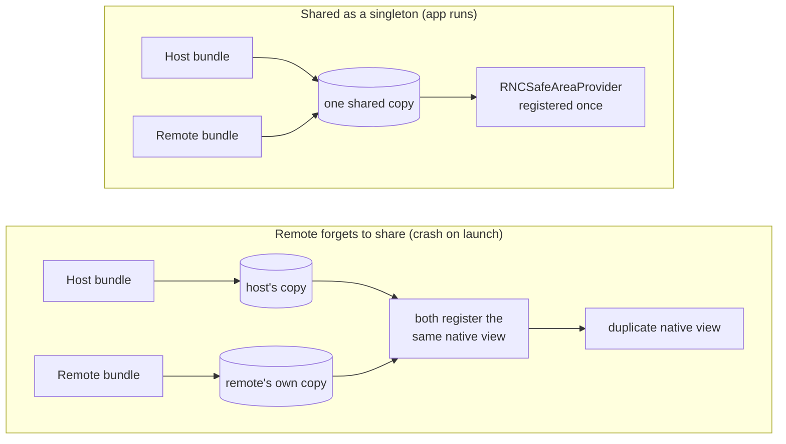

The [last post](/blog/your-first-federated-remote-react-native/) ended by pointing here: the shared-singleton contract, and the mistake that crashes the app on launch. This post covers both. What `shared` actually means, the three options that control it, and the failure a remote hits when it breaks the contract on a library with a native side. That failure is loud, immediate, and names itself, which makes it one of the easier ones to fix.

We pick up exactly where post 2 left off. If you built along then, stay on your own code. If not, start from post 2's finished state:

```sh
git clone https://github.com/warrendeleon/react-native-module-federation
git checkout post-02-first-remote
```

## What "shared" actually meant in post 2

Post 2 declared `react` and `react-native` as shared singletons and moved on. Here is the host's half of that, from `apps/host/rspack.config.mjs`:

```js
shared: {
  react: { singleton: true, eager: true, requiredVersion: pkg.dependencies.react },
  'react-native': {
    singleton: true,
    eager: true,
    requiredVersion: pkg.dependencies['react-native'],
  },
},
```

Three options do the work, and each one answers a different question.

**`singleton: true` answers "how many copies may exist at runtime?"** One. When the host and the remote both ask for `react`, Module Federation hands them the same instance instead of letting each load its own. This is the load-bearing option. React keeps its hooks state in module-level variables, so two copies of React in one app means two separate piles of state, and any hook called against the wrong pile throws.

**`eager: true` answers "is this copy ready before the app's first line runs?"** On the host, yes. A normal Module Federation entry is asynchronous: it sets up the share scope, then starts your code. React Native does not give you that gap. Its entry is synchronous, so the host marks its shared copies `eager` to load them into the share scope up front, before `AppRegistry` renders anything. The remote does not need `eager`, because by the time it loads, the host has already filled the scope.

**`requiredVersion` answers "which versions count as the same?"** It pins the acceptable range, read straight from the host's `package.json`. Leave it out and Module Federation cannot tell whether the host's copy satisfies the remote, so it stops treating them as interchangeable. More on that at the end, because that is the one failure here that does stay quiet.

So far this is post 2 with the reasoning filled in. The contract starts to matter the moment a remote depends on a third library, not just React.

## A real dependency: the safe area

React Native's built-in `SafeAreaView` is deprecated. The maintained replacement is [react-native-safe-area-context](https://github.com/AppAndFlow/react-native-safe-area-context), and it ships with the current React Native template, so both apps in the repo already have it. It is a good test of the contract because it works through React context: a `SafeAreaProvider` mounted near the root measures the device's safe area, and any component below reads it with `useSafeAreaInsets`.

In a federated app, the provider and the consumer live in different bundles. The host owns the shell, so the host mounts the provider. Rewrite `apps/host/App.tsx`:

```tsx
import React, { Suspense } from 'react';
import { ActivityIndicator, StyleSheet } from 'react-native';
import { SafeAreaProvider } from 'react-native-safe-area-context';

const PokedexScreen = React.lazy(() => import('listApp/PokedexScreen'));

export default function App() {
  return (
    <SafeAreaProvider>
      <Suspense fallback={<ActivityIndicator style={styles.loader} size="large" />}>
        <PokedexScreen />
      </Suspense>
    </SafeAreaProvider>
  );
}

const styles = StyleSheet.create({
  loader: { flex: 1 },
});
```

The host no longer pads the screen itself. It provides the safe-area context and hands the whole canvas to the remote. Now the remote reads the inset and keeps its own title clear of the notch. Update `apps/list/src/PokedexScreen.tsx`:

```tsx
import React from 'react';
import { FlatList, StyleSheet, Text, View } from 'react-native';
import { useSafeAreaInsets } from 'react-native-safe-area-context';

const POKEMON = [
  { id: 1, name: 'Bulbasaur' },
  { id: 4, name: 'Charmander' },
  { id: 7, name: 'Squirtle' },
  { id: 25, name: 'Pikachu' },
  { id: 133, name: 'Eevee' },
];

export default function PokedexScreen() {
  const insets = useSafeAreaInsets();
  return (
    <View style={[styles.screen, { paddingTop: insets.top + 24 }]}>
      <Text style={styles.title}>Pokédex</Text>
      <Text style={styles.subtitle}>Served by the list remote</Text>
      <FlatList
        data={POKEMON}
        keyExtractor={p => String(p.id)}
        renderItem={({ item }) => (
          <View style={styles.row}>
            <Text style={styles.number}>#{String(item.id).padStart(3, '0')}</Text>
            <Text style={styles.name}>{item.name}</Text>
          </View>
        )}
      />
    </View>
  );
}

const styles = StyleSheet.create({
  screen: { flex: 1, padding: 24, backgroundColor: '#fff' },
  title: { fontSize: 28, fontWeight: '700' },
  subtitle: { fontSize: 14, color: '#6b7280', marginBottom: 16 },
  row: {
    flexDirection: 'row',
    paddingVertical: 12,
    borderBottomWidth: StyleSheet.hairlineWidth,
    borderBottomColor: '#e5e7eb',
  },
  number: { width: 56, color: '#9ca3af', fontVariant: ['tabular-nums'] },
  name: { fontSize: 16, fontWeight: '500' },
});
```

There is now a context handshake that crosses the bundle boundary: the provider is in the host, the `useSafeAreaInsets` call is in the remote. For that to connect, both apps need the *same* `SafeAreaProvider`, from the same copy of the library. A React context is identified by the object that creates it. Two copies of the library make two different context objects, and a consumer reading copy B will never see a provider mounted from copy A.

That is what the contract is for. Add the library to `shared` in both configs as a singleton. The host (`apps/host/rspack.config.mjs`), eager like its other shared copies:

```js
shared: {
  react: { singleton: true, eager: true, requiredVersion: pkg.dependencies.react },
  'react-native': {
    singleton: true,
    eager: true,
    requiredVersion: pkg.dependencies['react-native'],
  },
  'react-native-safe-area-context': {
    singleton: true,
    eager: true,
    requiredVersion: pkg.dependencies['react-native-safe-area-context'],
  },
},
```

And the remote (`apps/list/rspack.config.mjs`), singleton but not eager:

```js
shared: {
  react: { singleton: true, requiredVersion: pkg.dependencies.react },
  'react-native': {
    singleton: true,
    requiredVersion: pkg.dependencies['react-native'],
  },
  'react-native-safe-area-context': {
    singleton: true,
    requiredVersion: pkg.dependencies['react-native-safe-area-context'],
  },
},
```

Start both dev servers and run the host (the [three-terminal routine from post 2](/blog/your-first-federated-remote-react-native/)). The Pokédex renders with its title sitting below the Dynamic Island, padded by the inset the remote read from the host's provider. One library, one provider, one context object, shared across two apps that were built and shipped on their own.

## Now break it

Delete one entry. Take `react-native-safe-area-context` out of the *remote's* `shared` block, leaving it in the host's. This is the realistic version of the mistake: the host author shared it, the remote author forgot. Restart the remote's dev server and reload the host.

The app does not render a slightly-wrong screen. It red-boxes on launch:

```
Uncaught Error: Tried to register two views with the same name RNCSafeAreaProvider
```

Here is why it is loud rather than quiet. `react-native-safe-area-context` is not pure JavaScript. It ships a native view, `RNCSafeAreaProvider`, that it registers with React Native's view registry at startup. The host's copy registers it once. When the remote drops the share, it bundles its own copy, and that copy tries to register the same native name a second time. React Native keeps one registry per app and refuses the duplicate. The crash fires before a single Pokémon reaches the screen.



This is the pattern for any library with a native side: a navigation library, a gesture handler, a storage module. Share it from one place and it works. Let two bundles each carry their own and they collide at the native layer, early and obviously. The error even names the view, so the fix points back at the missing share.

Put that entry back in the remote's `shared` block, and the app builds and runs again.

React itself fails just as loudly, for a different reason. Drop `react` from a remote's `shared` and the remote bundles its own React. The first hook the remote runs gets checked against the wrong copy, and you get the familiar `Invalid hook call` red box. Same lesson: the runtime will not quietly run two copies of something that was built to be one.

## The failure that does stay quiet

One case earns the "quiet" label, and it is `requiredVersion`. Keep `singleton: true` but drop `requiredVersion`, and the app still builds and runs. The singleton rule forces one copy, so in development, with one version installed, nothing visibly changes. The danger only appears when the host and a remote are built against genuinely different versions of a pure-JavaScript shared package. With no version range to check, Module Federation cannot warn that they disagree. It loads whichever copy wins and runs on. That is the one to be careful with, because it builds and ships clean, and only shows up once two teams end up on different versions of a dependency. Pin `requiredVersion` from `package.json`, as the configs above do, and you turn that silent drift into a warning you can read.

So the general rule is the reassuring one. Most ways of breaking the shared contract crash on launch, name the thing you got wrong, and cost you a few minutes. The quiet one is narrow and you can close it with a single field.

## What you built, and what's next

The host owns one `SafeAreaProvider`. The remote reads its insets across the bundle boundary, because both apps resolve to one shared copy of the library. You saw the contract hold, then watched it crash when a remote forgot its half, and you know now that the crash is the friendly outcome.

The finished code for this post is the `post-03-shared-singleton` tag, so you can diff it against your own:

```sh
git checkout post-03-shared-singleton
```

Next in the series: the host stops being a single screen and becomes a real shell, owning the tab bar while each tab is a remote loaded at runtime.

## Sources

- [react-native-safe-area-context](https://github.com/AppAndFlow/react-native-safe-area-context) — the maintained safe-area library, and the `RNCSafeAreaProvider` native view in the crash
- [Module Federation 2.0](https://module-federation.io/) — the `shared` contract: `singleton`, `eager`, and `requiredVersion`
- [react-native-module-federation](https://github.com/warrendeleon/react-native-module-federation) — the companion repo, at the tag `post-03-shared-singleton`
