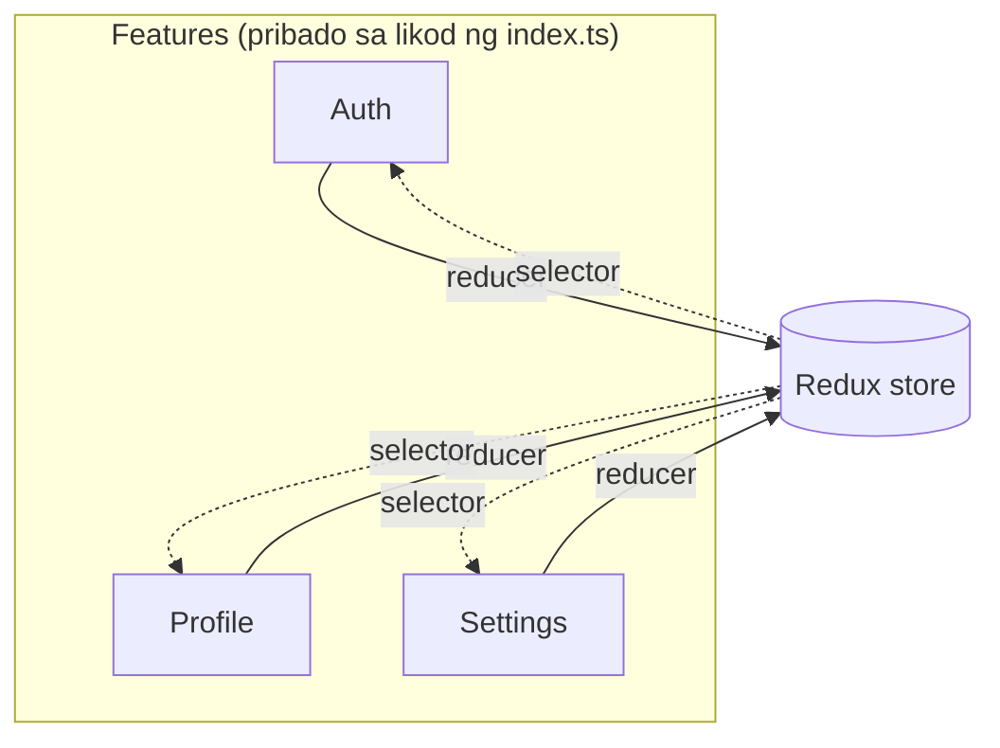

Ang maikling bersyon: sa ibaba ng halos limang features na may sariling state, ayos lang ang type-first folders (`screens/`, `hooks/`, `services/`). Sa itaas no'n, ang parehong layout ay nagsisimulang magastos sa 'yo nang higit sa nakakatabi nito. Ang post na ito ay tungkol sa kung bakit, at kung saan nakaupo ang linya.

## 85 files para sa isang feature

Ganyan karami ang TypeScript files ng Auth feature ko. Anim na screens, isang Redux store, isang React context, isang custom hook, mga PIN components na may Storybook stories, form validation schemas laban sa **common password blacklist**, rate limiting, lockout service, at tests sa bawat level.

Sa karamihan ng React Native projects, ang 85 files na 'yan ay nakakalat sa **pitong magkakaibang folders**. Screens sa isang lugar, hooks sa isa pa, store slice sa iba, validation sa isa pa. Para maintindihan kung paano gumagana ang authentication, magbubukas ka ng pitong folders at mentally i-reconstruct ang relationships ng mga files na wala namang kalapit-lapit sa isa't isa.

Maayos ang itsura ng layout na 'yan sa tatlo o apat na screens. Lampas doon, nagiging invisible ang relationships. Ang hook para sa isang feature ay nakatira nang malayo sa screen na gumagamit nito. Ang validation rules ay nasa hiwalay na folder mula sa form na ini-validate. Ang pag-review ng feature ay pag-scan ng maraming alphabetised na lists para mahanap ang mga piraso.

## Ang type-first layout, at kung bakit ito ang default

Kilala mo 'to:

```
src/
├── screens/
│   ├── LoginScreen.tsx
│   ├── ProfileScreen.tsx
│   ├── SettingsScreen.tsx
│   └── WorkExperienceScreen.tsx
├── components/
│   ├── PINInput.tsx
│   ├── ProfileCard.tsx
│   └── AlertBox.tsx
├── hooks/
│   ├── useAuth.ts
│   └── useProfile.ts
├── store/
│   ├── authSlice.ts
│   └── profileSlice.ts
└── utils/
    └── dateFormatter.ts
```

Mga files na grouped ayon sa uri. **Type-first.** Karamihan ng React Native tutorials ay ganito ang paraan ng pag-lay out, at may magagandang dahilan para diyan. Madaling makilala ng bagong contributors ang hugis. Ang isang reviewer na nagsi-skim ng take-home test ay agad na makakapansin ng `screens/`, `hooks/`, `components/` nang hindi nag-iisip. Ang folder names ay tumutugma sa vocabulary ng framework, kaya nababaon ang mental model mula sa isang project papunta sa isa pa. Para sa tatlo o apat na screens, sapat na 'yan para maipanatiling maayos. Kung nag-take-home tech test ka na, [ang folder structure mo ay isa sa mga unang tinitingnan ng reviewer](/blog/how-to-pass-a-react-native-tech-test/), at type-first ang ligtas na pili doon.

Hawak ng hugis habang maliit pa ang app. Tapos magdadagdag ka ng authentication na may PIN setup, email verification, password recovery. Magdadagdag ka ng profile management na may picture uploads, account editing, password changes. Bigla na lang 25 files na ang `screens/`, at para mahanap ang hook na para sa profile picture upload, kailangan mong mag-scan ng alphabetical list ng *bawat hook sa buong app*.

Ngayon subukan mong **mag-delete ng feature**. I-remove ang screen mula sa `screens/`. Hanapin ang hook nito sa `hooks/`. Ang service nito sa `services/`. Ang store slice nito. Ang components nito. Ang validation schema nito. Ang tests nito, na nasa hiwalay na `__tests__/` tree. Makalamiss ka ng isang file at may dead code ka na tatambay dyan ng ilang buwan.

'Yan ang test. Kung mas matagal mag-remove ng feature kaysa mag-build ng isa, ang structure ay lumalaban sa 'yo.

## Isang folder per feature

May 13 features ang app ko. Bawat isa ay nasa iisang directory lang:

```
src/features/
├── Auth/           # 85 files. Login, registration, PIN, lockout
├── Profile/        # API, store, picture upload, 5 screens
├── Settings/       # Theme, language, 3 screens
├── Education/      # Store, API, 1 screen
├── WorkExperience/ # Store, API, 4 screens
├── Home/           # 1 screen, 1 export
├── Legal/          # Privacy policy, T&Cs
├── Permissions/    # Camera, photo library, denial screens
├── MockStatus/     # Dev-only MSW status screen
├── PDF/            # PDF viewer
├── Placeholder/    # Chat, booking placeholders
├── WebView/        # Generic webview screen
└── Splash/         # Splash screen
```

Lahat ng iba pa ay nasa labas ng features: `shared/` para sa reusable components at hooks, `store/` para sa Redux config, `navigation/`, `httpClients/`, `utils/`, `i18n/`.

Ang pinakasimple na feature ay dalawang files. Ang pinaka-complex ay 85. **Bawat isa ay may mga folders lang na talagang kailangan niya.** Walang empty na `services/` directory dahil lang sinabi ng template na dapat nandoon.

## Ano ang itsura ng 85 files kapag co-located

```
src/features/Auth/
├── __tests__/
├── api/
│   └── __tests__/
├── components/
│   ├── __tests__/
│   ├── PINDot.tsx
│   ├── PINDot.stories.tsx
│   ├── PINInput.tsx
│   ├── PINInput.stories.tsx
│   ├── PINKeypad.tsx
│   └── PINKeypad.stories.tsx
├── context/
│   └── AuthContext.tsx
├── hooks/
│   └── useAuth.ts
├── services/
│   └── pinLockoutService.ts
├── store/
│   ├── __tests__/
│   ├── actions.ts
│   ├── reducer.ts
│   └── selectors.ts
├── utils/
│   ├── __tests__/
│   ├── emailResendRateLimiter.ts
│   ├── pinHashing.ts
│   ├── pinValidation.ts
│   └── rateLimiter.ts
├── validation/
│   ├── __tests__/
│   ├── customRules.ts
│   ├── loginSchema.ts
│   ├── passwordRecoverySchema.ts
│   └── registrationSchema.ts
├── EmailVerificationScreen.tsx
├── ForgotPasswordScreen.tsx
├── LoginScreen.tsx
├── PINSetupScreen.tsx
├── RegistrationScreen.tsx
├── ResetPasswordScreen.tsx
└── index.ts
```

Ang PIN hashing ay nakaupo katabi ng PIN validation, katabi ng PIN components, katabi ng PIN setup screen. **Ang relationship ng mga files ay nakikita mismo sa folder layout.** Binubuksan ko ang `Auth/` at nakikita ko ang bawat piraso ng authentication system nang hindi na pumunta sa ibang lugar.

Sa type-first na structure, ang mga PIN files na 'yan ay nasa `components/`, `utils/`, `services/`, at `screens/`. *Apat na folders para sa isang concept.*

## Ang delete test sa praktika

Ang acid test mula kanina. Ano ba talaga ang itsura nito para sa bawat layout?

**Type-first:** mag-delete ng files mula sa `screens/`, `components/`, `hooks/`, `services/`, `store/`, `utils/`, `validation/`, at `__tests__/`. Maka-miss ka ng isang file at may orphan ka na. Maka-miss ka ng import at mag-crash ang app sa boot.

**Feature-first:** i-delete ang `src/features/Auth/`, i-remove ang `authReducer` mula sa store config, i-remove ang navigation routes. **Tatlong steps.** Sasabihin ng compiler kung may na-miss akong reference.

Nagawa ko na 'to. Pag-remove ng feature na may 40+ files ay wala pang isang minuto. Karamihan ng minuto na 'yon ay ang navigation config.

## Ang contract na nagpapaligtas sa refactoring

Bawat feature ay nag-e-export lang ng kailangan ng iba pang bahagi ng app. Ang `index.ts` sa feature root ang siyang contract:

```typescript
// src/features/Auth/index.ts
export { authReducer, login, logout, selectIsAuthenticated } from './store';
export { AuthProvider } from './context';
export { useAuth } from './hooks';
export { LoginScreen } from './LoginScreen';
export { RegistrationScreen } from './RegistrationScreen';
```

PIN hashing, rate limiting, lockout logic. **Wala sa mga 'yan ang naka-export.** Pribado lahat sa Auth. Puwede kong i-rewrite ang *buong* PIN implementation, at basta hindi nagbabago ang exports, walang napapansin sa labas ng Auth.

Ang store config ay nag-i-import ng `authReducer`. Ang navigation ay nag-i-import ng screens. 'Yon lang. Ang 80+ internal files ay invisible sa natitirang codebase.

## Ang mga features ay hindi nag-i-import mula sa ibang features

Ito ang rule na nagbubuklod sa lahat.

Kung kailangan malaman ng Auth kung naka-load na ang profile, nagbabasa ito mula sa Redux store gamit ang selector. Hindi ito nag-i-import mula sa `@app/features/Profile` nang direkta. **Ang store lang ang communication layer sa pagitan ng features.**

<div id="feature-boundaries"></div>



Bawat feature ay may-ari ng sarili nitong Redux slice. Ang root store ang nag-combine sa kanila:

```typescript
import { authReducer } from '@app/features/Auth';
import { profileReducer } from '@app/features/Profile';
import { settingsReducer } from '@app/features/Settings';
import { educationReducer } from '@app/features/Education';
import { workExperienceReducer } from '@app/features/WorkExperience';

const rootReducer = combineReducers({
  settings: settingsReducer,
  auth: persistedAuthReducer,
  profile: profileReducer,
  workExperience: workExperienceReducer,
  education: educationReducer,
});
```

I-break mo ang no-cross-import rule nang isang beses at magkakaroon ka ng circular dependencies within a week. Nag-i-import ang Feature A mula sa Feature B, na nag-i-import mula sa Feature C, na nag-i-import mula sa Feature A. Maglalabas ang bundler ng cryptic error at walang nakakaalam kung saan nagsimula ang cycle.

## Ang shared code ay kailangang deserve ang lugar niya

Kung isang feature lang ang gumagamit ng component, nananatili ito sa feature na 'yon. Kung dalawa o higit pang features ang nangangailangan, lilipat ito sa `src/shared/`. Mataas ang bar.

Bawat shared abstraction ay isang **coupling point**. Sa sandaling mapunta ang `AlertBox` sa `shared/`, limang features ang naka-depend sa interface nito. Kapag binago mo ito, kailangan mong i-check ang lahat ng lima. Mas gusto ko pang mag-duplicate ng tatlong linya sa dalawang features kaysa gumawa ng shared utility na nagpapahirap sa pag-change ng dalawa nang hiwalay.

Ang mga hooks na napupunta sa `shared/` ay 'yung talagang cross-cutting: `useAppColorScheme`, `useHapticFeedback`, `useReducedMotion`, `useCameraPermission`, `usePhotoLibraryPermission`. Mga bagay na maaaring kailanganin ng kahit anong screen. Hindi mga bagay na *dalawang screens* lang naman ang nagkataong kailangan ngayon.

## Ang tests ay sumusunod sa parehong rule

Ang tests ay katabi ng code na tine-test nila. Ang Auth store tests ay nasa `Auth/store/__tests__/`. Ang Auth validation tests ay nasa `Auth/validation/__tests__/`. Walang hiwalay na test tree sa project root.

Ang isang exception: **cross-feature integration tests**. Login na nag-f-flow papunta sa profile loading. Settings changes na nagpo-propagate sa UI. Background tasks na tumatakbo sa maraming features. Tumatawid ang mga ito sa maraming features, kaya nasa `src/features/__tests__/` sila, sa labas ng kahit anong single feature.

```
src/features/__tests__/
├── BackgroundTasks.integration.rntl.tsx
├── CrossFeatureIntegration.rntl.tsx
├── OnboardingJourney.integration.rntl.tsx
├── ProfileCompletionJourney.integration.rntl.tsx
└── RealtimeSubscription.integration.rntl.tsx
```

Kapag nag-break ang isang test, sinasabi ng location kung saan titingnan. Kung nasa `Auth/store/__tests__/`, ang problema ay sa auth store. Kung nasa `features/__tests__/`, ang problema ay sa kung paano nag-i-interact ang mga features. Ang location mismo *ang* diagnosis.

## Kailan mo dapat mag-switch

Kung tatlong screens lang ang app mo at walang state management, *huwag gawin 'to*. Sapat na ang flat list ng screens at ilang shared hooks. Nagdadagdag ng overhead ang feature-first na hindi kailangan ng maliliit na projects.

Ang crossover ay nakaupo sa bandang **limang features na may sariling state**. Sa ilalim no'n, mas mahal ang structure kaysa sa naitatabi nito. Sa ibabaw no'n, ang type-first na ang nagpapabagal sa 'yo.

Buksan mo ang `screens/` folder mo ngayon. Bilangin ang files. Kung hindi mo masabi kung alin ang magkakasama sa tingin lang sa list, hindi ka na tinutulungan ng structure.

Ang buong project source ay nasa [github.com/warrendeleon/rn-warrendeleon](https://github.com/warrendeleon/rn-warrendeleon).
