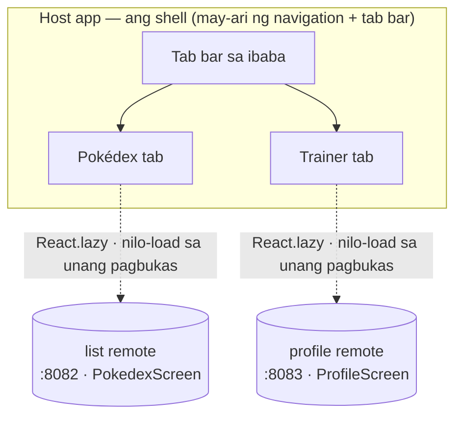

Hanggang ngayon, isang screen mula sa isang remote ang nilo-load ng host. Higit pa sa isang screen ang tunay na app: may shell ito, may tab bar, may lugar para sa mga feature. Ginagawang shell na iyon ang host sa post na ito. Ito ang may-ari ng navigation at ng tab bar, at bawat tab ay hiwalay na remote, binuo at na-deploy nang mag-isa, nilo-load sa runtime.

Ang hugis na bubuuin natin, bago ang anumang code: ang host ang may-ari ng tab bar, at bawat tab ay hiwalay na remote, na kinukuha at pinapatakbo sa runtime sa unang pagbukas mo nito.



Magpapatuloy tayo kung saan tumigil ang post 3. Kung sumunod ka sa tutorial, manatili sa sarili mong code. Kung hindi, magsimula mula sa tapos na estado ng post 3:

```sh
git clone https://github.com/warrendeleon/react-native-module-federation
git checkout post-03-shared-singleton
```

## Pangalawang remote para punan ang pangalawang tab

Hindi tab bar ang isang tab. Kaya nagdadagdag tayo ng pangalawang remote, `profile`, gaya ng pagbuo ng post 2 sa remote na `list`: isang bagong React Native app sa Re.Pack, walang `AppRegistry.registerComponent`, naglalantad ng isang screen. Gawin ito katabi ng iba at i-install ang mga dependency nito gaya ng ginawa mo sa `list`.

Ang screen na inilalantad nito, `apps/profile/src/ProfileScreen.tsx`. Binabasa nito ang safe-area inset mula sa provider ng host, ang parehong shared singleton mula sa post 3:

```tsx
import React from 'react';
import { StyleSheet, Text, View } from 'react-native';
import { useSafeAreaInsets } from 'react-native-safe-area-context';

const TRAINER = { name: 'Ash Ketchum', region: 'Kanto', badges: 8, caught: 151 };

export default function ProfileScreen() {
  const insets = useSafeAreaInsets();
  return (
    <View style={[styles.screen, { paddingTop: insets.top + 24 }]}>
      <Text style={styles.title}>Trainer</Text>
      <Text style={styles.subtitle}>Served by the profile remote</Text>
      <View style={styles.card}>
        <Text style={styles.name}>{TRAINER.name}</Text>
        <Text style={styles.meta}>
          {TRAINER.region} · {TRAINER.badges} badges · {TRAINER.caught} caught
        </Text>
      </View>
    </View>
  );
}

const styles = StyleSheet.create({
  screen: { flex: 1, padding: 24, backgroundColor: '#fff' },
  title: { fontSize: 28, fontWeight: '700' },
  subtitle: { fontSize: 14, color: '#6b7280', marginBottom: 16 },
  card: {
    padding: 16,
    borderRadius: 12,
    borderWidth: StyleSheet.hairlineWidth,
    borderColor: '#e5e7eb',
    backgroundColor: '#f9fafb',
  },
  name: { fontSize: 18, fontWeight: '600', marginBottom: 4 },
  meta: { fontSize: 14, color: '#6b7280' },
});
```

Ang container entry nito, `apps/profile/src/index.js`, ay nananatiling walang laman, dahil walang sinisimulan ang isang remote nang mag-isa:

```js
export {};
```

Ang `apps/profile/rspack.config.mjs` nito ay ang config ng `list` na may ibang pangalan, ibang inilantad na screen, at parehong shared singletons:

```js
new Repack.plugins.ModuleFederationPluginV2({
  name: 'profileApp',
  filename: 'profileApp.container.js.bundle',
  exposes: {
    './ProfileScreen': './src/ProfileScreen.tsx',
  },
  dts: false,
  shared: {
    react: { singleton: true, requiredVersion: pkg.dependencies.react },
    'react-native': {
      singleton: true,
      requiredVersion: pkg.dependencies['react-native'],
    },
    'react-native-safe-area-context': {
      singleton: true,
      requiredVersion: pkg.dependencies['react-native-safe-area-context'],
    },
  },
}),
```

Bigyan ito ng sarili nitong dev server port para hindi mabangga sa `list` sa 8082. Sa `apps/profile/package.json`:

```json
"scripts": {
  "start:remote": "react-native start --config rspack.config.mjs --port 8083"
}
```

Ngayon may dalawang remote, sa 8082 at 8083, bawat isa ay screen na naghihintay ng host.

## Nakakakuha ng navigation ang host

Sa host ang tab bar, hindi sa mga remote. Nag-i-install ang host ng navigation library; nananatiling payak na screen ang mga remote na walang alam tungkol sa tabs. I-install ito sa host lang:

```sh
cd apps/host
npm install @react-navigation/native @react-navigation/bottom-tabs react-native-screens
cd ios && bundle exec pod install
```

Native module ang `react-native-screens`, kaya kailangan ng host ng pod install at bagong native build. Nandiyan na ang `react-native-safe-area-context` mula post 3, at ginagamit ito ng React Navigation.

At narito ang mahalagang punto tungkol sa pag-share, na siyang kontrata ng post 3 nang baligtad. Nasa host lang ang React Navigation dahil host lang ang gumagamit nito. Hindi ito ini-import ng mga remote, kaya walang ishe-share. Nananatiling eksaktong dati ang mga shared singleton: `react`, `react-native`, at `react-native-safe-area-context`. Kailangan lang i-share ang isang library kapag may code sa magkabilang panig ng hangganan na humahawak dito.

## Ang shell

I-rewrite ang `apps/host/App.tsx`. May-ari na ngayon ang host ng `SafeAreaProvider`, ng `NavigationContainer`, at ng bottom tab navigator. Ang laman ng bawat tab ay remote na nilo-load nang lazy:

```tsx
import React, { Suspense } from 'react';
import { ActivityIndicator, StyleSheet } from 'react-native';
import { SafeAreaProvider } from 'react-native-safe-area-context';
import { NavigationContainer } from '@react-navigation/native';
import { createBottomTabNavigator } from '@react-navigation/bottom-tabs';

const PokedexScreen = React.lazy(() => import('listApp/PokedexScreen'));
const ProfileScreen = React.lazy(() => import('profileApp/ProfileScreen'));

// A remote downloads the first time its tab is opened, so each tab renders behind a Suspense
// spinner. Wrapping once here keeps the lazy boundary out of the remotes.
function withSuspense(Remote: React.ComponentType) {
  return function Tab() {
    return (
      <Suspense fallback={<ActivityIndicator style={styles.loader} size="large" />}>
        <Remote />
      </Suspense>
    );
  };
}

const PokedexTab = withSuspense(PokedexScreen);
const ProfileTab = withSuspense(ProfileScreen);

const Tab = createBottomTabNavigator();

export default function App() {
  return (
    <SafeAreaProvider>
      <NavigationContainer>
        <Tab.Navigator screenOptions={{ headerShown: false }}>
          <Tab.Screen name="Pokédex" component={PokedexTab} />
          <Tab.Screen name="Trainer" component={ProfileTab} />
        </Tab.Navigator>
      </NavigationContainer>
    </SafeAreaProvider>
  );
}

const styles = StyleSheet.create({
  loader: { flex: 1 },
});
```

Bawat tab ay remote sa likod ng `React.lazy` at `Suspense`. Nada-download ang remote sa unang pagbukas ng tab nito, hindi sa pag-launch, kaya nagsisimula ang app sa unang tab at kinukuha lang ang pangalawa kapag lumipat ka rito.

Kailangang malaman ng host kung saan nakatira ang pangalawang remote. Idagdag ito sa `remotes` sa `apps/host/rspack.config.mjs`:

```js
remotes: {
  listApp: `listApp@http://localhost:8082/${platform}/mf-manifest.json`,
  profileApp: `profileApp@http://localhost:8083/${platform}/mf-manifest.json`,
},
```

At sabihin sa TypeScript ang hugis ng bagong federated import, sa `apps/host/mf-modules.d.ts`:

```ts
declare module 'profileApp/ProfileScreen' {
  import type React from 'react';
  const ProfileScreen: React.ComponentType;
  export default ProfileScreen;
}
```

## Patakbuhin ito

Apat na terminal na ngayon, isa kada remote at isa para sa host, kasama ang build:

```sh
cd apps/list && npm run start:remote      # :8082
cd apps/profile && npm run start:remote   # :8083
cd apps/host && npm start                 # :8081
cd apps/host && npm run ios
```

Nag-boot ang host sa Pokédex tab at nire-render ang remote na `list`. Pindutin ang **Trainer** at kinukuha ng host ang remote na `profile` mula sa 8083, pinapatakbo ito, at ipinapakita ang card ng trainer. Dalawang feature, binuo at sineserve ng dalawang hiwalay na app, sa isang tab bar na hindi pag-aari ng alinman sa kanila.

<div class="device-frame">
  
</div>

## Ang nabuo mo, at ang susunod

Shell na ang host ngayon. Ito ang may-ari ng navigation at ng tab bar; bawat tab ay remote na binuo at na-deploy nang mag-isa at nilo-load sa runtime. Nananatiling simple ang mga remote: nagre-render sila ng screen at walang alam kung paano sila inaayos. Ang pagdaragdag ng pangatlong feature ay pagdaragdag ng pangatlong remote at pangatlong tab, walang babaguhin sa mga naka-deploy na.

Ang tapos na code para sa post na ito ay ang tag na `post-04-host-shell`, para ma-diff mo ito laban sa sarili mo:

```sh
git checkout post-04-host-shell
```

Ang susunod sa serye: titigil ang mga tab sa hardcoded na data at magsisimulang mag-share ng isang store. Isang RTK Query cache sa mga remote, totoong data mula sa isang API, at cross-module dispatch.

## Mga sanggunian

- [React Navigation](https://reactnavigation.org/) — ang bottom tab navigator na pundasyon ng host shell
- [Module Federation 2.0](https://module-federation.io/) — ang `name@url` remotes na naglo-load ng bawat tab sa runtime
- [react-native-module-federation](https://github.com/warrendeleon/react-native-module-federation) — ang companion repo, sa tag na `post-04-host-shell`
