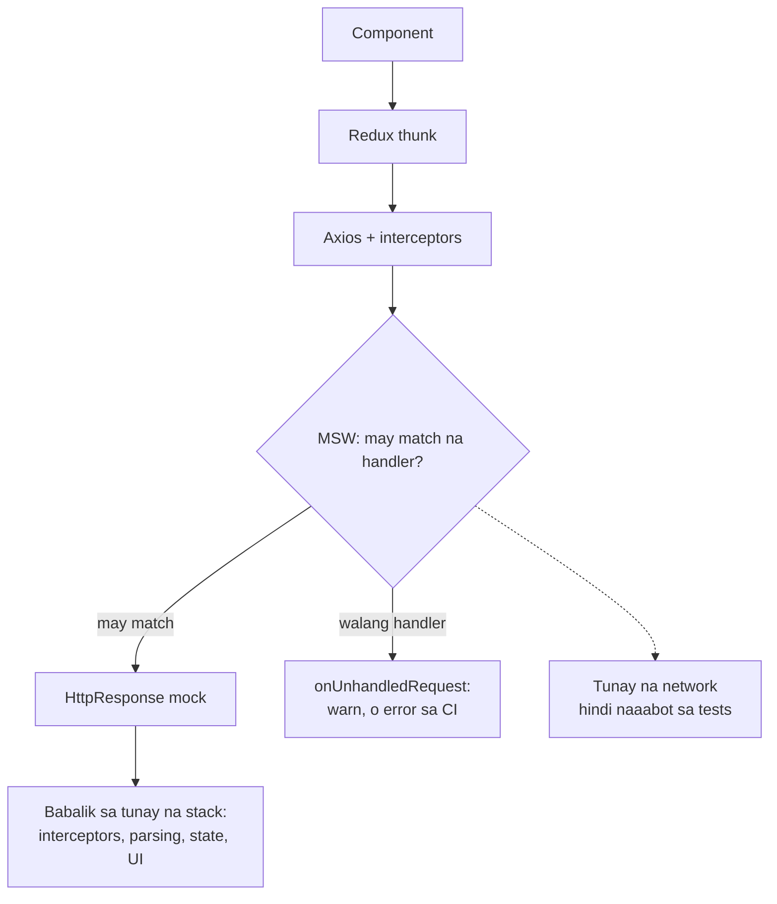

## Bakit MSW sa halip na manual mocks

Karamihan ng React Native projects ay nagmo-mock ng kanilang API layer gamit ang `jest.fn()`. Mino-mock mo ang `fetch` o ang iyong Axios instance, dine-define kung ano ang ibabalik, at tine-test laban doon.

Gumagana. Hanggang hindi na.

Ang problema: tine-test mo ang interaction ng iyong code sa isang mock, hindi sa isang HTTP layer. Kung ang iyong API client ay nagbago kung paano gumagawa ng URLs, nagdadagdag ng headers, o nagha-handle ng retries, hindi mahuhuli ng mock ang regression. Mas mahalaga pa ito kung nagva-validate ka ng responses sa runtime gamit ang isang bagay tulad ng [runtime response validation gamit ang Zod](/blog/runtime-api-validation-zod-react-native/), dahil gusto mong tumakbo ang validation layer laban sa tunay na response shapes, hindi sa mga hinabi-habing mock objects. Palaging ibinabalik ng mock ang sinabi mo, kahit ano pa ang talagang ipinadala ng code.

**Mock Service Worker (MSW)** nag-iintercept ng requests sa network level. Ang iyong code ay gumagawa ng tunay na HTTP calls. Hinuhuli ng MSW ang mga ito bago umalis sa process at ibinabalik ang iyong mock responses. Lahat ng nasa pagitan ng iyong component at ng network ay nae-exercise: ang Redux thunk, ang Axios interceptors, ang error handling, ang response parsing.

Pinapalitan ng manual mocks ang iyong code. Pinapalitan ng MSW ang network. Tumatakbo ang code nang eksakto kung paano ito tatakbo sa device, hanggang sa punto kung saan aalis na sana ang request.

<div id="msw-intercept"></div>



## Assumptions

Ang setup sa ibaba ay isinulat laban sa:

- React Native 0.74+ na may default na `react-native` Jest preset
- TypeScript na may standard na RN Babel config
- Redux Toolkit (ito ang ina-assume ng custom render wrapper)
- Node 18 o mas bago (Node 20 ang rekomendado)

Kung nasa mas lumang RN version ka, isang Expo Jest preset, o walang Redux, ang mga *konsepto* ay aplikable pa rin pero kakailanganing i-adjust ang ilang snippets.

## Installation

Tumatakbo ang MSW v2 sa Jest tests sa pamamagitan ng Node.js server. Hindi relevant ang browser service worker para sa mobile, kaya balewalain ang lahat ng nasa MSW docs tungkol sa service-worker registration.

```bash
yarn add -D msw node-fetch@2 web-streams-polyfill
```

Halata na ang `msw`. Ang `node-fetch` at `web-streams-polyfill` ang mga polyfill na kailangan ng MSW v2 sa React Native Jest environment, na ico-connect ko sa susunod na step.

> 💡 **Bakit i-pin sa `node-fetch@2`?** Ang `node-fetch` v3+ ay ESM-only at hindi maglo-load sa pamamagitan ng `require()` sa isang CommonJS Jest setup file. I-pin sa v2 (ang ginagawa ng post na ito), o i-migrate ang polyfills file papuntang ESM. Ang v2 ang mas walang gulong na landas sa isang default na React Native Jest preset.

> 💡 **Huwag magtiwala sa mga post na nagsasabing "walang polyfills na kailangan".** Nakabase ang MSW v2 sa Fetch API at Web Streams. May mga Node + Jest combination na mayroon na ng mga global na ito; ang React Native Jest preset ay wala. Kapag walang polyfills, makikita mo ang `ReferenceError: Response is not defined` o `TextEncoder is not defined` sa unang pagkakataong susubukan ng MSW na gumawa ng response.

## Polyfills

Gumawa ng `jest.polyfills.cjs` sa project root. Kailangan itong `.cjs` (hindi `.ts`) dahil iniload ito ng Jest bago pa ma-set up ang TypeScript transformer:

```js
/**
 * MSW polyfills para sa React Native.
 * Kailangan para sa Mock Service Worker v2 sa Jest tests.
 */

// TextEncoder / TextDecoder
const { TextEncoder, TextDecoder } = require('util');
global.TextEncoder = TextEncoder;
global.TextDecoder = TextDecoder;

// Fetch API
if (!global.fetch) {
  global.fetch = require('node-fetch');
  global.Headers = require('node-fetch').Headers;
  global.Request = require('node-fetch').Request;
  global.Response = require('node-fetch').Response;
}

// ReadableStream (para sa response streaming)
if (!global.ReadableStream) {
  try {
    const { ReadableStream } = require('web-streams-polyfill');
    global.ReadableStream = ReadableStream;
  } catch {
    // optional ang web-streams-polyfill para sa mas lumang MSW v2
  }
}
```

Tumatakbo ang file na ito *bago* mag-load ang test framework, kaya wala pang `beforeAll`, `jest`, atbp. dito. Para lang ito sa pag-set up ng globals.

## Jest config

I-connect ang polyfills file at isang hiwalay na setup file sa `jest.config.cjs`:

```js
module.exports = {
  preset: 'react-native',
  testEnvironment: 'node',
  setupFiles: ['<rootDir>/jest.polyfills.cjs'],
  setupFilesAfterEnv: ['<rootDir>/jest.setup.ts'],
  transformIgnorePatterns: [
    // Ini-ignore ng default RN preset ang halos lahat ng node_modules; kailangang ma-transform ang MSW.
    'node_modules/(?!(react-native|@react-native|msw|until-async)/)',
  ],
  moduleFileExtensions: ['ts', 'tsx', 'js', 'jsx', 'json', 'node'],
};
```

Dalawang key ang gumagawa ng trabaho:

| Key | Kailan tumatakbo | Gamitin para sa |
|---|---|---|
| `setupFiles` | Bago ma-install ang Jest framework | Polyfills, global variables, anumang hindi nangangailangan ng `jest`/`expect` |
| `setupFilesAfterEnv` | Pagkatapos ng Jest framework, bago bawat test file | `beforeAll`/`afterEach` hooks, MSW server lifecycle, custom matchers |

Ang linya ng `transformIgnorePatterns` ang isa pang gotcha: nilalaktawan ng default RN preset ang pag-transform ng `node_modules`, pero may modern syntax ang MSW na hindi kayang patakbuhin ng Jest nang ganoon na lang. Idagdag ang `msw|until-async` sa allow-list o makikita mo ang `SyntaxError: Cannot use import statement outside a module` mula sa loob ng `node_modules/msw/`.

## Ang server

Gumawa ng `src/test-utils/msw/server.ts`:

```typescript
import { setupServer } from 'msw/node';
import { handlers } from './handlers';

/**
 * MSW server para sa Jest. Sinisimulan/pinapatay sa jest.setup.ts.
 * Gamitin ang `server.use(...errorHandlers)` para i-override bawat test.
 */
export const server = setupServer(...handlers);
```

Kinukuha ng server ang iyong default handlers (success responses) at nag-iintercept ng mga tumutugmang requests.

## Pag-connect sa lifecycle

Sa `jest.setup.ts` (na iniload ng Jest sa pamamagitan ng `setupFilesAfterEnv`), simulan ang server bago ang tests, i-reset sa pagitan ng tests, isara pagkatapos:

```typescript
import '@testing-library/jest-native/extend-expect';
import { server } from './src/test-utils/msw/server';

// MSW server lifecycle
beforeAll(() => server.listen({ onUnhandledRequest: 'warn' }));
afterEach(() => server.resetHandlers());
afterAll(() => server.close());
```

| Hook | Ano ang ginagawa |
|---|---|
| `beforeAll` | Sinisimulan ang server bago tumakbo ang kahit anong test |
| `afterEach` | Nire-reset ang handlers sa defaults sa pagitan ng tests (para hindi mag-leak ang overrides ng isang test) |
| `afterAll` | Pinapatay ang server pagkatapos makumpleto ang lahat ng tests |

Ang `onUnhandledRequest: 'warn'` na option ay nagla-log ng warning kung ang iyong code ay gumagawa ng request na walang tumutugmang handler. Sa CI, palitan ito ng `'error'` para mag-fail ang build sa mga nawawalang handlers:

```typescript
const onUnhandledRequest = process.env.CI ? 'error' : 'warn';
beforeAll(() => server.listen({ onUnhandledRequest }));
```

> 💡 **Kung gumagamit ang iyong tests ng fake timers**, i-flush ang pending timers sa `afterEach` bago i-reset ang handlers. Kung hindi, isang animation timer na naka-schedule sa loob ng isang component ay puwedeng mag-fire pagkatapos magsimula ang susunod na test at mag-trigger ng mga maling failures.

## Pagsusulat ng handlers

Bawat handler ay isang function na tumutugma sa isang HTTP method at URL, at nagbabalik ng response.

Isang basic handler para sa REST API:

```typescript
import { http, HttpResponse } from 'msw';

const BASE_URL = 'https://api.example.com';

export const handlers = [
  http.get(`${BASE_URL}/items`, () => {
    return HttpResponse.json([
      { id: 1, name: 'Item One' },
      { id: 2, name: 'Item Two' },
    ]);
  }),

  http.get(`${BASE_URL}/items/:id`, ({ params }) => {
    const { id } = params;
    return HttpResponse.json({ id: Number(id), name: `Item ${id}` });
  }),

  http.post(`${BASE_URL}/items`, async ({ request }) => {
    const body = await request.json();
    return HttpResponse.json({ id: 3, ...body }, { status: 201 });
  }),
];
```

Ilang bagay na dapat malaman: ang method-specific helpers (`http.get`, `http.post`, at iba pa) ay tumutugma base sa HTTP verb, ang URL params tulad ng `:id` ay awtomatikong na-extract papunta sa `params`, ang request body ay nakukuha sa `await request.json()`, at ang `HttpResponse.json()` ay nagbabalik ng typed JSON kasama ang anumang status code na ipasa mo.

## Paghihiwalay ng fixtures mula sa handlers

Gumagana ang inline response objects para sa isang sketch. Hindi sila gumagana sa isang tunay na codebase: ang parehong shapes ay lumalabas sa handlers, sa component tests, at sa Storybook stories, at ayaw mong mag-maintain ng tatlong kopya.

Hilahin ang fixture data sa sarili nitong file:

```typescript
// src/test-utils/msw/mockData.ts
export const mockItems = [
  { id: 1, name: 'Item One', createdAt: '2026-01-01T00:00:00Z' },
  { id: 2, name: 'Item Two', createdAt: '2026-01-02T00:00:00Z' },
];

export const mockProfile = {
  id: 'user_1',
  name: 'Warren de Leon',
  email: 'hi@example.com',
};
```

Magbabasa na ang handlers mula sa `mockData`:

```typescript
import { http, HttpResponse } from 'msw';
import { mockItems, mockProfile } from './mockData';

export const handlers = [
  http.get(`${BASE_URL}/items`, () => HttpResponse.json(mockItems)),
  http.get(`${BASE_URL}/me`, () => HttpResponse.json(mockProfile)),
];
```

Magagamit muli ang parehong fixtures sa component tests kung saan ino-bypass mo ang MSW at direktang ipinapasa ang data. Iisang source of truth.

## Handler sets para sa bawat scenario

Ang default success handlers ang simula. Pero kailangang mag-handle ng failures din ang mga tunay na apps. Dito humihinto ang karamihan ng MSW setups. **Huwag huminto dito.**

Ang mga bug na talagang umaabot sa production ay hindi ang happy-path failures. Ang mga awkward: ang 401 na bumabalik sa kalagitnaan ng session dahil nag-expire ang token limang minuto na ang nakaraan, ang 429 mula sa biglaang refresh attempts pagkatapos ng maikling network blip, ang 422 na may ibang validation shape kaysa sa inaasahan ng iyong form, ang 408 na dapat ay naging retry pero hindi. Wala sa mga iyon ang mahuhuli kung ang error coverage mo ay "paano kung magbalik ng 500 ang API?".

Gumagawa ako ng hiwalay na handler sets para sa bawat error scenario na kailangang i-handle ng app:

```typescript
// Success (default)
export const handlers = [...apiHandlers, ...authHandlers];

// Server errors
export const errorHandlers = [
  http.get(`${BASE_URL}/items`, () => {
    return HttpResponse.json(
      { message: 'Internal server error' },
      { status: 500 }
    );
  }),
];

// Unauthorized (expired token)
export const unauthorizedHandlers = [
  http.get(`${BASE_URL}/items`, () => {
    return HttpResponse.json(
      { error: 'invalid_token', message: 'Token has expired' },
      { status: 401 }
    );
  }),
];

// Rate limiting
export const rateLimitHandlers = [
  http.post(`${BASE_URL}/auth/token`, () => {
    return HttpResponse.json(
      { error: 'too_many_requests', message: 'Try again in 60 seconds' },
      { status: 429, headers: { 'Retry-After': '60' } }
    );
  }),
];

// Timeout (hindi kailanman nare-resolve)
export const timeoutHandlers = [
  http.get(`${BASE_URL}/items`, async () => {
    await new Promise(resolve => setTimeout(resolve, 60000));
    return HttpResponse.json({}, { status: 408 });
  }),
];

// Offline (network failure)
export const offlineHandlers = [
  http.get(`${BASE_URL}/items`, () => {
    return HttpResponse.error();
  }),
];
```

Sa aking project, mayroon akong **11 handler sets**:

| Handler set | Status | Ano ang tine-test |
|---|---|---|
| `handlers` | 200 | Default success responses |
| `errorHandlers` | 500 | Server error handling |
| `unauthorizedHandlers` | 401 | Expired/invalid token flows |
| `forbiddenHandlers` | 403 | Mga banned/suspended na accounts |
| `conflictHandlers` | 409 | Duplicate registration |
| `validationErrorHandlers` | 422 | Form validation errors |
| `rateLimitHandlers` | 429 | Rate limiting na may Retry-After |
| `emailNotConfirmedHandlers` | 400 | Kinakailangang email verification |
| `storageErrorHandlers` | 413/404 | File upload/delete errors |
| `timeoutHandlers` | 408 | Network timeout simulation |
| `offlineHandlers` | Error | Kumpletong network failure |

Bawat set ay nae-export at puwedeng i-swap bawat test.

> 💡 **Tip:** Gumagamit ang timeout handler ng `await new Promise(resolve => setTimeout(resolve, 60000))` para mag-simulate ng request na hindi kailanman natatapos. Mag-fi-fire muna ang request timeout ng iyong code, tine-test ang timeout handling path.

## Paggamit ng handlers sa tests

Awtomatikong tumatakbo ang default handlers (nakaregistro sa `setupServer`). Para mag-test ng error scenarios, i-override ang mga ito bawat test:

```typescript
import { server } from '@app/test-utils/msw/server';
import { errorHandlers, unauthorizedHandlers } from '@app/test-utils/msw/handlers';

describe('API error handling', () => {
  it('shows error message on server failure', async () => {
    server.use(...errorHandlers);

    // I-render ang component, i-trigger ang fetch, i-assert ang error UI
  });

  it('redirects to login on 401', async () => {
    server.use(...unauthorizedHandlers);

    // I-render ang component, i-trigger ang fetch, i-assert ang redirect
  });

  // Hindi kailangan mag-cleanup - nire-reset ng afterEach sa jest.setup ang handlers
});
```

Pinapalitan ng spread (`...errorHandlers`) ang mga tumutugmang handlers. Nananatiling aktibo ang mga handler mula sa default set na hindi tumutugma. Pagkatapos ng test, nire-restore ng `server.resetHandlers()` ang defaults.

## Ang custom render wrapper

Mas maganda ang MSW na may tunay na Redux store, hindi mockejado. Ang buong punto ay i-test ang tunay na integration: component → Redux thunk → HTTP request → MSW intercept → response → state update → UI update.

```typescript
// src/test-utils/renderWithProviders.tsx
import React from 'react';
import { Provider } from 'react-redux';
import { combineReducers, configureStore } from '@reduxjs/toolkit';
import type { RenderOptions } from '@testing-library/react-native';
import { render } from '@testing-library/react-native';

import { itemsReducer } from '@app/features/Items';
import { authReducer } from '@app/features/Auth';

const rootReducer = combineReducers({
  items: itemsReducer,
  auth: authReducer,
});

type RootState = ReturnType<typeof rootReducer>;

function createTestStore(preloadedState?: Partial<RootState>) {
  return configureStore({
    reducer: rootReducer,
    preloadedState,
    middleware: getDefaultMiddleware =>
      getDefaultMiddleware({
        serializableCheck: false,
        immutableCheck: false,
      }),
  });
}

type AppStore = ReturnType<typeof createTestStore>;

interface ExtendedRenderOptions extends Omit<RenderOptions, 'wrapper'> {
  preloadedState?: Partial<RootState>;
  store?: AppStore;
}

export function renderWithProviders(
  ui: React.ReactElement,
  { preloadedState, store, ...options }: ExtendedRenderOptions = {},
) {
  const createdStore = store ?? createTestStore(preloadedState);

  const Wrapper = ({ children }: { children: React.ReactNode }) => (
    <Provider store={createdStore}>{children}</Provider>
  );

  return {
    store: createdStore,
    ...render(ui, { wrapper: Wrapper, ...options }),
  };
}
```

Nasaklaw niyan ang Redux. Karaniwang mas marami pang kailangan ang tunay na apps: i18n, navigation, theming, toast/notification context. Ang wrapper ang tamang lugar para i-compose silang lahat. Magdagdag ng providers sa paligid ng `{children}`:

```tsx
const Wrapper = ({ children }: { children: React.ReactNode }) => (
  <Provider store={createdStore}>
    <I18nextProvider i18n={i18n}>
      <ThemeProvider>
        <ToastProvider>
          {children}
        </ToastProvider>
      </ThemeProvider>
    </I18nextProvider>
  </Provider>
);
```

Kung gumagamit ang isang screen ng `react-navigation`, balutin ito sa `NavigationContainer` at isang in-memory navigator para sa test. Pareho lang ang prinsipyo: bawat provider na bumabalot sa iyong app sa `App.tsx` ay dapat bumalot sa iyong component sa `renderWithProviders`. Anuman ang nakalimutan mo ay isang pagkakaiba sa pagitan ng test environment at runtime, at sa mga pagkakaibang iyon nakatira ang flaky tests.

Ngayon ang iyong tests ay nagre-render na may tunay na store, nagdi-dispatch ng tunay na thunks, at ang MSW ang nagha-handle ng network:

```typescript
it('loads and displays items', async () => {
  // Nagbabalik ng success response ang default handlers
  const { getByText } = renderWithProviders(<ItemList />);

  await waitFor(() => {
    expect(getByText('Item One')).toBeTruthy();
  });
});

it('shows error state on failure', async () => {
  server.use(...errorHandlers);

  const { getByText } = renderWithProviders(<ItemList />);

  await waitFor(() => {
    expect(getByText('Something went wrong')).toBeTruthy();
  });
});
```

Walang manual mocking ng dispatch, selectors, o fetch. Tunay ang buong stack maliban sa network.

## Inline handler overrides

Minsan kailangan mo ng isang one-off response na hindi kasya sa kahit anong handler set. I-define ito inline:

```typescript
it('handles unexpected response shape', async () => {
  server.use(
    http.get('https://api.example.com/items', () => {
      return HttpResponse.json({ unexpected: 'shape' });
    })
  );

  // I-test na maayos na hina-handle ng code ang malformed responses
});
```

Kapaki-pakinabang ito para sa edge cases tulad ng malformed JSON, nawawalang fields, o hindi inaasahang status codes na hindi naman kailangan ng buong handler set.

## Pagpapatakbo ng tests

Kapag naka-connect na ang lahat, ganito ang itsura ng isang test file run:

```bash
yarn jest src/features/Items/__tests__/ItemList.rntl.tsx
```

```text
PASS  src/features/Items/__tests__/ItemList.rntl.tsx
  ItemList
    ✓ loads and displays items (218 ms)
    ✓ shows error state on failure (94 ms)
    ✓ redirects to login on 401 (102 ms)
    ✓ surfaces rate-limit message (89 ms)

Test Suites: 1 passed, 1 total
Tests:       4 passed, 4 total
```

Kung makakita ka ng warning tulad ng `[MSW] Warning: captured a request without a matching request handler`, ginagawa lang ng `onUnhandledRequest: 'warn'` ang trabaho nito. Magdagdag ng handler para sa URL o ayusin ang request na ginagawa ng iyong code.

Kung nag-hang ang suite at hindi natatapos, karaniwang naghihintay ang MSW sa isang request na hindi nare-resolve. Madalas, ito ay isang `timeoutHandlers` set na gumagamit ng `setTimeout(..., 60000)` habang may tunay pang timers ang test environment. Lumipat sa fake timers sa test na iyon (`jest.useFakeTimers()` tapos `jest.advanceTimersByTime(...)`) o paikliin ang simulated delay.

## Mga karaniwang pagkakamali

Ino-order match ang mga handler. Kung dalawang handler ang tumutugma sa parehong request, ang una ang mananalo. Kapag tumawag ka ng `server.use(...overrides)`, naunang inilalagay ang mga overrides, kaya mas may priority sila kaysa sa defaults.

Nag-si-simulate ng network failure ang `HttpResponse.error()`, hindi HTTP error. Hindi nakakatanggap ng response ang request. Gamitin ito para sa offline scenarios. Para sa HTTP errors (500, 401, at iba pa), gamitin ang `HttpResponse.json()` na may status code.

Kung ang iyong handler ay nagbabasa ng request body sa pamamagitan ng `request.json()`, kailangang `async` ang handler function. Kapag nakalimutan ito, isa sa mga karaniwang dahilan kung bakit tahimik na nagbabalik ng `undefined` ang handler.

**Tahimik ang mga unhandled requests bilang default.** Palaging gumamit ng `onUnhandledRequest: 'warn'` (o `'error'` sa CI) para lumitaw ang mga nawawalang handlers. Ang isang tahimik na unhandled request ay nangangahulugang pumapasa ang test sa maling dahilan.

Ang error na `Response is not defined` o `TextEncoder is not defined` ay nangangahulugang hindi nila-load ang polyfills file. I-check na nasa Jest config ang `setupFiles: ['<rootDir>/jest.polyfills.cjs']`, na `.cjs` ang file extension at hindi `.ts`, at na tama ang path relative sa `rootDir`.

Ang `SyntaxError: Cannot use import statement outside a module` na itinapon mula sa `node_modules/msw/` ay nangangahulugang hindi nata-transform ang MSW. Idagdag ang `msw|until-async` sa allow-list sa loob ng `transformIgnorePatterns`.

Mahalaga ang trailing slashes: hindi tutugma ang `http.get('/api/items')` sa isang request papuntang `/api/items/`. Itugma nang eksakto kung ano ang ipinapadala ng iyong code, o gumamit ng path pattern tulad ng `http.get('/api/items*', ...)`.

Ang **pumapasa ang tests nang lokal pero nag-fa-fail sa CI** ay karaniwang ang `onUnhandledRequest: 'error'` na humuhuli ng isang request na hindi mo namalayang ginagawa ng iyong code sa CI environment, madalas ay analytics o crash reporting. Magdagdag ng handler para rito, o tanggalin ang mga call na iyon sa test mode.

## Ang kumpletong file structure

```text
project-root/
  jest.config.cjs           # Jest config (preset, setupFiles, setupFilesAfterEnv)
  jest.polyfills.cjs        # TextEncoder, fetch, ReadableStream globals
  jest.setup.ts             # Server lifecycle, custom matchers, global mocks
  src/
    test-utils/
      msw/
        handlers.ts         # Lahat ng handler sets (success, error, 401, etc.)
        server.ts           # setupServer na may default handlers
        mockData.ts         # Fixture data na ginagamit ng handlers
      renderWithProviders.tsx  # Custom render na may tunay na store + providers
      index.ts              # Barrel export
```

Pinapayagan ng barrel export (`index.ts`) ang tests na mag-import ng mga karaniwang utilities mula sa iisang lugar. Para sa mga specific handler sets, mag-import nang direkta mula sa handlers file:

```typescript
import { server, renderWithProviders } from '@app/test-utils';
import { errorHandlers, unauthorizedHandlers } from '@app/test-utils/msw/handlers';
```

## Sa huli

Mga 30 minuto lang ang setup. Pagkatapos niyan, bawat bagong test ay mas simple kaysa sa manual mock equivalent. Nagsusulat ka ng `server.use(...errorHandlers)` sa halip na `jest.fn().mockRejectedValue(new Error('Network error'))`. Reusable ang handlers sa bawat test file. At tine-test mo ang tunay na integration behaviour, hindi mock behaviour.

Sinasaklaw ng 11 handler sets sa aking project ang bawat error path na hina-handle ng app. Kapag nagdagdag ako ng bagong API endpoint, nagdadagdag ako ng handlers isang beses, at bawat test na gumagamit ng endpoint na iyon ay nakakakuha ng tamang mocking nang libre. Ang parehong handler-set approach ay bumabagay rin sa [E2E tests na nakasulat sa Gherkin gamit ang Detox + Cucumber](/blog/detox-cucumber-bdd-react-native-e2e-testing/), kung saan dinadala ng Detox + Cucumber ang user flows at isang hiwalay na [runtime mocking sa Metro level](/blog/metro-runtime-mocking-react-native-e2e/) ang kumokontrol sa API responses, pero mga paksa iyon para sa susunod na mga post.

> Kung mas mahirap sumulat ng susunod na test kaysa sa pag-skip nito, ang test infrastructure mo ang problema.

*Ang mga code examples sa post na ito ay mula sa [rn-warrendeleon](https://github.com/warrendeleon/rn-warrendeleon), ang aking personal na React Native project. Nasa repo ang kumpletong MSW setup, handler sets, at custom render wrapper.*
