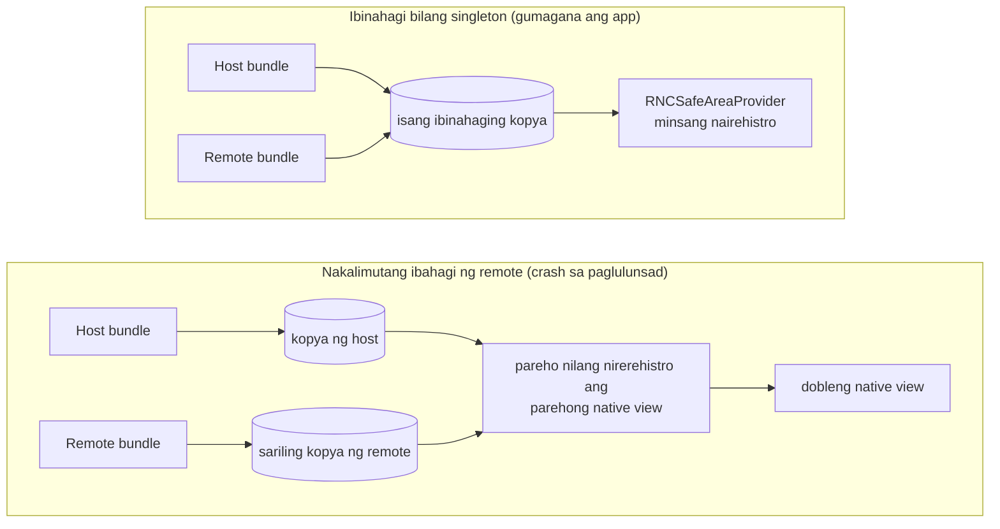

Nagtapos ang [nakaraang post](/blog/your-first-federated-remote-react-native/) sa pagturo rito: ang shared-singleton contract, at ang pagkakamaling nagpapa-crash sa app sa pag-launch. Saklaw ng post na ito ang dalawa. Kung ano talaga ang ibig sabihin ng `shared`, ang tatlong option na kumokontrol dito, at ang pagkabigong nararanasan ng isang remote kapag sinira nito ang contract sa isang library na may native side. Maingay, agaran, at pinapangalanan nito ang sarili ang pagkabigong iyon, kaya ito ang isa sa mga pinakamadaling ayusin.

Magpapatuloy tayo mismo sa kung saan tumigil ang post 2. Kung sumunod ka sa tutorial noon, manatili sa sarili mong code. Kung hindi, magsimula mula sa tapos na estado ng post 2:

```sh
git clone https://github.com/warrendeleon/react-native-module-federation
git checkout post-02-first-remote
```

## Ano talaga ang ibig sabihin ng "shared" sa post 2

Idineklara ng post 2 ang `react` at `react-native` bilang shared singletons at nagpatuloy lang. Narito ang kalahati ng host, mula sa `apps/host/rspack.config.mjs`:

```js
shared: {
  react: { singleton: true, eager: true, requiredVersion: pkg.dependencies.react },
  'react-native': {
    singleton: true,
    eager: true,
    requiredVersion: pkg.dependencies['react-native'],
  },
},
```

Tatlong option ang gumagawa ng trabaho, at bawat isa ay sumasagot sa magkaibang tanong.

**Sinasagot ng `singleton: true` ang "ilang kopya ang puwedeng umiral sa runtime?"** Isa. Kapag parehong humingi ng `react` ang host at ang remote, ibinibigay ng Module Federation ang parehong instance sa halip na hayaang mag-load ang bawat isa ng sarili nito. Ito ang pinakamahalagang option. Iniimbak ng React ang state ng mga hook nito sa mga variable na nasa module level, kaya ang dalawang kopya ng React sa isang app ay nangangahulugang dalawang magkahiwalay na bunton ng state, at anumang hook na tinawag laban sa maling bunton ay magtatapon ng error.

**Sinasagot ng `eager: true` ang "handa na ba ang kopyang ito bago tumakbo ang unang linya ng app?"** Sa host, oo. Asynchronous ang normal na entry ng Module Federation: inihahanda nito ang share scope, pagkatapos ay sisimulan ang code mo. Hindi ka binibigyan ng React Native ng ganoong puwang. Synchronous ang entry nito, kaya minamarkahan ng host ang mga shared na kopya nito bilang `eager` para ma-load ang mga ito sa share scope nang maaga, bago mag-render ng kahit ano ang `AppRegistry`. Hindi kailangan ng remote ang `eager`, dahil sa oras na mag-load ito, napuno na ng host ang scope.

**Sinasagot ng `requiredVersion` ang "anong mga bersyon ang itinuturing na pareho?"** Pina-pin nito ang katanggap-tanggap na range, na binabasa mismo mula sa `package.json` ng host. Tanggalin ito at hindi malalaman ng Module Federation kung tinutugunan ng kopya ng host ang remote, kaya hihinto itong ituring silang magkapalit. Higit pa tungkol dito sa dulo, dahil ito ang tanging pagkabigo rito na talagang nananatiling tahimik.

Hanggang dito ay post 2 ito na may dagdag na pangangatwiran. Nagiging mahalaga ang contract sa sandaling umasa ang isang remote sa pangatlong library, hindi lang sa React.

## Isang totoong dependency: ang safe area

Deprecated na ang built-in na `SafeAreaView` ng React Native. Ang minementinang kapalit ay ang [react-native-safe-area-context](https://github.com/AppAndFlow/react-native-safe-area-context), at kasama ito sa kasalukuyang template ng React Native, kaya nasa dalawang app na ng repo ito. Magandang pagsubok ito ng contract dahil gumagana ito sa pamamagitan ng React context: isang `SafeAreaProvider` na naka-mount malapit sa root ang sumusukat sa safe area ng device, at babasahin ito ng anumang component sa ibaba gamit ang `useSafeAreaInsets`.

Sa isang federated app, magkaiba ang bundle na tinitirhan ng provider at ng consumer. Ang host ang may-ari ng shell, kaya ang host ang nagmo-mount ng provider. I-rewrite ang `apps/host/App.tsx`:

```tsx
import React, { Suspense } from 'react';
import { ActivityIndicator, StyleSheet } from 'react-native';
import { SafeAreaProvider } from 'react-native-safe-area-context';

const PokedexScreen = React.lazy(() => import('listApp/PokedexScreen'));

export default function App() {
  return (
    <SafeAreaProvider>
      <Suspense fallback={<ActivityIndicator style={styles.loader} size="large" />}>
        <PokedexScreen />
      </Suspense>
    </SafeAreaProvider>
  );
}

const styles = StyleSheet.create({
  loader: { flex: 1 },
});
```

Hindi na pinapadding ng host ang screen mismo. Ibinibigay nito ang safe-area context at iniaabot ang buong canvas sa remote. Ngayon babasahin ng remote ang inset at pananatilihing malayo sa notch ang sarili nitong title. I-update ang `apps/list/src/PokedexScreen.tsx`:

```tsx
import React from 'react';
import { FlatList, StyleSheet, Text, View } from 'react-native';
import { useSafeAreaInsets } from 'react-native-safe-area-context';

const POKEMON = [
  { id: 1, name: 'Bulbasaur' },
  { id: 4, name: 'Charmander' },
  { id: 7, name: 'Squirtle' },
  { id: 25, name: 'Pikachu' },
  { id: 133, name: 'Eevee' },
];

export default function PokedexScreen() {
  const insets = useSafeAreaInsets();
  return (
    <View style={[styles.screen, { paddingTop: insets.top + 24 }]}>
      <Text style={styles.title}>Pokédex</Text>
      <Text style={styles.subtitle}>Served by the list remote</Text>
      <FlatList
        data={POKEMON}
        keyExtractor={p => String(p.id)}
        renderItem={({ item }) => (
          <View style={styles.row}>
            <Text style={styles.number}>#{String(item.id).padStart(3, '0')}</Text>
            <Text style={styles.name}>{item.name}</Text>
          </View>
        )}
      />
    </View>
  );
}

const styles = StyleSheet.create({
  screen: { flex: 1, padding: 24, backgroundColor: '#fff' },
  title: { fontSize: 28, fontWeight: '700' },
  subtitle: { fontSize: 14, color: '#6b7280', marginBottom: 16 },
  row: {
    flexDirection: 'row',
    paddingVertical: 12,
    borderBottomWidth: StyleSheet.hairlineWidth,
    borderBottomColor: '#e5e7eb',
  },
  number: { width: 56, color: '#9ca3af', fontVariant: ['tabular-nums'] },
  name: { fontSize: 16, fontWeight: '500' },
});
```

May context handshake na ngayon na tumatawid sa hangganan ng mga bundle: nasa host ang provider, at nasa remote ang tawag na `useSafeAreaInsets`. Para magkonekta iyon, kailangan ng dalawang app ang *parehong* `SafeAreaProvider`, mula sa parehong kopya ng library. Ang isang React context ay kinikilala sa pamamagitan ng object na lumilikha rito. Dalawang kopya ng library ang gumagawa ng dalawang magkaibang context object, at ang isang consumer na nagbabasa ng kopya B ay hinding-hindi makakakita ng provider na naka-mount mula sa kopya A.

Para diyan ang contract. Idagdag ang library sa `shared` sa parehong config, bilang singleton. Ang host (`apps/host/rspack.config.mjs`), eager gaya ng iba nitong shared na kopya:

```js
shared: {
  react: { singleton: true, eager: true, requiredVersion: pkg.dependencies.react },
  'react-native': {
    singleton: true,
    eager: true,
    requiredVersion: pkg.dependencies['react-native'],
  },
  'react-native-safe-area-context': {
    singleton: true,
    eager: true,
    requiredVersion: pkg.dependencies['react-native-safe-area-context'],
  },
},
```

At ang remote (`apps/list/rspack.config.mjs`), singleton pero hindi eager:

```js
shared: {
  react: { singleton: true, requiredVersion: pkg.dependencies.react },
  'react-native': {
    singleton: true,
    requiredVersion: pkg.dependencies['react-native'],
  },
  'react-native-safe-area-context': {
    singleton: true,
    requiredVersion: pkg.dependencies['react-native-safe-area-context'],
  },
},
```

Simulan ang dalawang dev server at patakbuhin ang host (ang [three-terminal na rutina mula sa post 2](/blog/your-first-federated-remote-react-native/)). Nagre-render ang Pokédex na nasa ilalim ng Dynamic Island ang title nito, padded ng inset na binasa ng remote mula sa provider ng host. Isang library, isang provider, isang context object, na shared sa dalawang app na binuo at ni-publish nang sarilinan.

## Ngayon sirain mo

Magbura ng isang entry. Tanggalin ang `react-native-safe-area-context` mula sa `shared` block ng *remote*, na iniiwan ito sa host. Ito ang makatotohanang bersyon ng pagkakamali: ni-share ito ng may-akda ng host, nakalimutan ng may-akda ng remote. I-restart ang dev server ng remote at i-reload ang host.

Hindi nagre-render ang app ng bahagyang maling screen. Nagka-crash ito sa pag-launch:

```
Uncaught Error: Tried to register two views with the same name RNCSafeAreaProvider
```

<div class="device-frame">
  
</div>

At narito kung bakit ito maingay sa halip na tahimik. Hindi purong JavaScript ang `react-native-safe-area-context`. May dala itong native view, ang `RNCSafeAreaProvider`, na nirerehistro nito sa view registry ng React Native sa pag-startup. Minsan itong nirerehistro ng kopya ng host. Kapag binitawan ng remote ang share, binabalot nito ang sarili nitong kopya, at sinusubukan ng kopyang iyon na irehistro ang parehong native na pangalan sa pangalawang pagkakataon. Iisang registry kada app ang pinapanatili ng React Native at tinatanggihan nito ang duplicate. Pumuputok ang crash bago pa man marating ng kahit isang Pokémon ang screen.



Ito ang pattern para sa anumang library na may native side: isang navigation library, isang gesture handler, isang storage module. I-share ito mula sa iisang lugar at gumagana ito. Hayaang magdala ang dalawang bundle ng tig-isa nilang sarili at magbabanggaan sila sa native layer, maaga at malinaw. Pinapangalanan pa nga ng error ang view, kaya nakaturo pabalik ang ayos sa kulang na share.

Ibalik ang entry na iyon sa `shared` block ng remote, at magbu-build at tatakbo muli ang app.

Ang React mismo ay nabibigo nang kasing-ingay, sa ibang dahilan. Tanggalin ang `react` mula sa `shared` ng isang remote at babalutin ng remote ang sarili nitong React. Ang unang hook na patatakbuhin ng remote ay sinusuri laban sa maling kopya, at makukuha mo ang kilalang `Invalid hook call` na red box. Parehong aral: hindi tatakbo nang tahimik ang runtime ng dalawang kopya ng isang bagay na idinisenyo para maging isa.

## Ang pagkabigong talagang nananatiling tahimik

Isang kaso ang kumikita sa label na "tahimik", at iyon ay ang `requiredVersion`. Panatilihin ang `singleton: true` pero tanggalin ang `requiredVersion`, at patuloy pa ring nabubuo at tumatakbo ang app. Pinipilit ng singleton rule ang iisang kopya, kaya sa development, na may iisang bersyong naka-install, walang nakikitang nagbabago. Lumilitaw lang ang panganib kapag ang host at ang remote ay binuo laban sa tunay na magkaibang bersyon ng isang purong-JavaScript na shared package. Kung walang version range na susuriin, hindi makakapagbabala ang Module Federation na hindi sila tugma. Iko-load nito ang kopyang mananalo at magpapatuloy. Iyon ang dapat bantayan, dahil naka-build at nai-publish ito nang malinis, at lumilitaw lang kapag napunta ang dalawang team sa magkaibang bersyon ng isang dependency. I-pin ang `requiredVersion` mula sa `package.json`, gaya ng ginagawa ng mga config sa itaas, at gagawin mong nababasang babala ang tahimik na pag-aanod na iyon.

Kaya ang panuntunang praktikal ang nakakaginhawa. Karamihan sa mga paraan ng pagsira sa shared contract ay nagka-crash sa pag-launch, pinapangalanan ang iyong namali, at nagkakahalaga ng ilang minuto. Makitid ang tahimik na isa at maisasara mo ito sa iisang field.

## Ang nabuo mo, at ang susunod

May-ari ang host ng iisang `SafeAreaProvider`. Binabasa ng remote ang mga inset nito habang tumatawid sa hangganan ng mga bundle, dahil ang dalawang app ay nareresolba sa iisang shared na kopya ng library. Nakita mong humawak ang contract, pagkatapos ay nakita mong nag-crash nang makalimutan ng isang remote ang kalahati nito, at alam mo na ngayon na ang crash ang mabait na resulta.

Ang tapos na code para sa post na ito ay ang tag na `post-03-shared-singleton`, para ma-diff mo ito laban sa sarili mo:

```sh
git checkout post-03-shared-singleton
```

Ang susunod sa serye: titigil ang host bilang iisang screen at magiging tunay na shell, na may-ari ng tab bar habang ang bawat tab ay isang remote na nakakarga sa runtime.

## Mga sanggunian

- [react-native-safe-area-context](https://github.com/AppAndFlow/react-native-safe-area-context) — ang minementinang safe area library, at ang native view na `RNCSafeAreaProvider` sa crash
- [Module Federation 2.0](https://module-federation.io/) — ang `shared` contract: `singleton`, `eager`, at `requiredVersion`
- [react-native-module-federation](https://github.com/warrendeleon/react-native-module-federation) — ang companion repo, sa tag na `post-03-shared-singleton`
