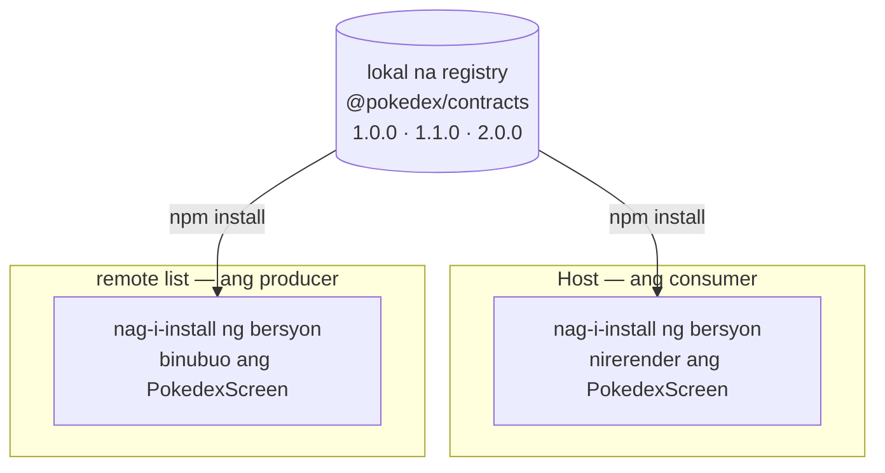

Hanggang ngayon, nilo-load ng host ang mga remote nito nang hindi nakikita kung ano ang inilalantad ng mga ito. Binuo at na-ship ang isang remote nang mag-isa, kaya sa compile time ay walang file ang host para sa `listApp/PokedexScreen`; umiiral lang ang module na iyon sa runtime, kapag kinuha na ito ng Module Federation. Para hindi magreklamo ang TypeScript, sinusulat ng host ang hugis nito nang manu-mano:

```ts
declare module 'listApp/PokedexScreen' {
  import type React from 'react';
  const PokedexScreen: React.ComponentType;
  export default PokedexScreen;
}
```

Isang hula ang deklarasyong iyon: sinulat ito ng may-akda ng host, pinaniniwalaan ito ng compiler, at walang sumusuri rito laban sa screen na talagang ini-ship ng remote. Habang walang tinatanggap na props ang screen, walang halaga ito; sa sandaling tumanggap ito ng prop, puwedeng hindi magkasundo ang host at ang remote, at malalaman mo lang ito sa runtime, hindi sa build.

Ang solusyon ay isang contract na ini-import ng magkabilang panig. Pero narito ang bahaging nagpapasya kung may halaga ba ito: ang host at ang remote ay binuo at na-ship nang mag-isa, kaya hindi sila puwedeng mag-share ng file sa disk. Kahit sa iisang repository, magkahiwalay silang build, at sa mas malawak na mundo, madalas silang magkahiwalay na repository na pag-aari ng magkahiwalay na team. Kaya ang contract ay hindi isang file na inaabot mo mula sa kabilang panig. Isa itong package na pino-publish mo, at ini-install ayon sa bersyon. Binubuo ito ng post na ito, ipino-publish sa isang registry, ini-install sa magkabilang panig, at pagkatapos ay itinatanong ang tanong na nagpapasya ng lahat: ano ang mangyayari kapag napunta ang host at ang isang remote sa magkaibang bersyon.

<div id="architecture"></div>



Itutuloy natin kung saan tumigil ang post 4. Kung sumunod ka sa build, manatili sa sarili mong code. Kung hindi, magsimula sa huling estado ng post 4:

```sh
git clone https://github.com/warrendeleon/react-native-module-federation
git checkout post-04-host-shell
```

## Ang contract

Ang contract ay isang maliit na package ng mga type at wala nang iba. Gumawa ng `packages/contracts` katabi ng `apps`.

Ang mga type na ini-export nito, `packages/contracts/src/screens.ts`. Ito ang nag-iisang lugar kung saan nagkakasundo ang host at ang remote tungkol sa kung ano ang tumatawid sa tahi:

```ts
import type { ComponentType } from 'react';

export interface PokedexScreenProps {
  // The list remote reports which Pokémon was tapped. The host owns navigation and decides what
  // happens next, so the remote never imports a navigator; it just hands back an id.
  onSelectPokemon: (id: number) => void;
}

// The profile screen takes nothing from the host yet. An empty contract is still a contract: the
// host's import resolves to "a component with no props", enforced rather than assumed.
export type ProfileScreenProps = Record<string, never>;

// The exposed-module types, composed from the props above. The host's ambient declarations point at
// these, so a federated import is typed from the same source the remote was built against.
export type PokedexScreenModule = ComponentType<PokedexScreenProps>;
export type ProfileScreenModule = ComponentType<ProfileScreenProps>;
```

Isang barrel, `packages/contracts/src/index.ts`:

```ts
export * from './screens';
```

Ang `package.json` nito. Ang bersyon ang bahaging pinakamahalaga: ito ay `1.0.0`, ang unang na-publish na putol ng tahi. Itinuturo ng `publishConfig` ang pag-publish sa lokal na registry na sisimulan natin, at binubuo ng `prepublishOnly` ang mga type bago ang bawat publish para palaging makatanggap ang mga consumer ng sariwang deklarasyon:

```json
{
  "name": "@pokedex/contracts",
  "version": "1.0.0",
  "description": "The typed seam between the host and every federated remote: the props each exposed screen takes.",
  "main": "dist/index.js",
  "types": "dist/index.d.ts",
  "files": ["dist", "src", "README.md"],
  "scripts": {
    "build": "tsc",
    "typecheck": "tsc --noEmit",
    "prepublishOnly": "npm run build"
  },
  "publishConfig": {
    "registry": "http://localhost:4873/"
  },
  "peerDependencies": {
    "react": "*"
  },
  "devDependencies": {
    "@types/react": "^19.2.0",
    "typescript": "^5.8.3"
  }
}
```

Ang `tsconfig.json` nito ay naglalabas ng mga deklarasyon sa `dist`, para makatanggap ang mga consumer ng mga type bukod sa JavaScript:

```json
{
  "compilerOptions": {
    "target": "ES2020",
    "module": "CommonJS",
    "moduleResolution": "node",
    "lib": ["ES2020"],
    "jsx": "react-jsx",
    "strict": true,
    "esModuleInterop": true,
    "skipLibCheck": true,
    "declaration": true,
    "declarationMap": true,
    "sourceMap": true,
    "outDir": "dist",
    "rootDir": "src",
    "forceConsistentCasingInFileNames": true,
    "isolatedModules": true
  },
  "include": ["src/**/*"],
  "exclude": ["dist", "node_modules"]
}
```

Dahil bawat export ay isang type, binubura ang import sa build. Walang anuman mula sa package na ito ang umaabot sa bundle, at walang runtime dependency na ishe-share gaya ng pagshe-share sa `react`. Sinasalamin nito ang contract ng post 3 sa ibang layer: nag-share ang post 3 ng library sa runtime para hindi mag-crash ang app; nagshe-share ito ng type sa compile time para hindi magsinungaling ang build.

## I-publish ito sa isang registry

Gagana ang isang `file:` path papunta sa `../../packages/contracts` dito, dahil sa monorepo na ito magkakatabi ang mga app sa disk. Pero magtuturo rin ito ng maling bagay. Ang buong punto ng isang federated remote ay binubuo at ini-ship ito nang mag-isa; sa araw na lumipat ito sa sarili nitong repository, wala na ang isang path sa filesystem. Kaya tinatrato natin ang contract gaya ng kakailanganing gawin ng mga consumer nito sa production: isang versioned package na kinukuha mula sa isang registry.

Sa lokal, ang registry na iyon ay [Verdaccio](https://verdaccio.org/), isang maliit na npm registry na ikaw mismo ang nagpapatakbo. Kumakatawan ito sa kung anuman ang gamit mo sa production: isang pribadong npm registry, GitHub Packages, o Artifactory. Patakbuhin ito sa sarili nitong terminal:

```sh
npx verdaccio
```

Bumubukas ito sa `http://localhost:4873`. Magrehistro ng user laban dito nang isang beses, na nagsusulat ng token sa iyong user-level na `~/.npmrc`:

```sh
npm adduser --registry http://localhost:4873
```

Ituro ang `@pokedex` scope sa lokal na registry para roon i-resolve ng dalawang app ang contract, habang ang lahat ng iba pa ay nanggagaling pa rin sa npm. Isang project-level na `.npmrc` sa root ng repo:

```sh
@pokedex:registry=http://localhost:4873/
```

Mag-build at mag-publish mula sa package. Pinapatakbo ng `prepublishOnly` ang build para sa iyo:

```sh
cd packages/contracts
npm publish
```

```sh
+ @pokedex/contracts@1.0.0
```

Ngayon ang tahi ay isang na-publish na artifact na may bersyon. Malapit nang gumawa ng tunay na trabaho ang bersyong iyon.

## I-install ito sa magkabilang panig

Kinukuha ng host at ng remote list ang contract bilang dependency, ayon sa version range. Idagdag ito sa `apps/host/package.json` at `apps/list/package.json`:

```json
"dependencies": {
  "@pokedex/contracts": "^1.0.0",
  ...
}
```

Pagkatapos ay `npm install` sa bawat isa. Sa pagkakataong ito, tunay na install ito: dino-download at ina-unpack ng bawat app ang sarili nitong kopya ng `@pokedex/contracts@1.0.0` sa `node_modules`, sa halip na ituro ang isang shared na folder gaya ng gagawin ng isang `file:` path. May hawak ang host at ang remote na tig-isang kopya ng bersyong hiniling nila.

Binubuo ng remote list ang screen nito laban sa contract. Ang mga props nito ay nanggagaling sa `@pokedex/contracts`, kaya sinusuri ang signature laban sa parehong type na irerender ng host. `apps/list/src/PokedexScreen.tsx`:

```tsx
import React from 'react';
import { FlatList, Pressable, StyleSheet, Text, View } from 'react-native';
import { useSafeAreaInsets } from 'react-native-safe-area-context';
import type { PokedexScreenProps } from '@pokedex/contracts';

const POKEMON = [
  { id: 1, name: 'Bulbasaur' },
  { id: 4, name: 'Charmander' },
  { id: 7, name: 'Squirtle' },
  { id: 25, name: 'Pikachu' },
  { id: 133, name: 'Eevee' },
];

export default function PokedexScreen({ onSelectPokemon }: PokedexScreenProps) {
  const insets = useSafeAreaInsets();
  return (
    <View style={[styles.screen, { paddingTop: insets.top + 24 }]}>
      <Text style={styles.title}>Pokédex</Text>
      <Text style={styles.subtitle}>Served by the list remote</Text>
      <FlatList
        data={POKEMON}
        keyExtractor={p => String(p.id)}
        renderItem={({ item }) => (
          <Pressable style={styles.row} onPress={() => onSelectPokemon(item.id)}>
            <Text style={styles.number}>#{String(item.id).padStart(3, '0')}</Text>
            <Text style={styles.name}>{item.name}</Text>
          </Pressable>
        )}
      />
    </View>
  );
}

const styles = StyleSheet.create({
  screen: { flex: 1, padding: 24, backgroundColor: '#fff' },
  title: { fontSize: 28, fontWeight: '700' },
  subtitle: { fontSize: 14, color: '#6b7280', marginBottom: 16 },
  row: {
    flexDirection: 'row',
    paddingVertical: 12,
    borderBottomWidth: StyleSheet.hairlineWidth,
    borderBottomColor: '#e5e7eb',
  },
  number: { width: 56, color: '#9ca3af', fontVariant: ['tabular-nums'] },
  name: { fontSize: 16, fontWeight: '500' },
});
```

Nire-render ng host ang screen at nagpapasa ng handler. Nag-uulat ang remote list ng id; ang host ang may-ari ng navigation at nagpapasya kung ano ang gagawin dito, kaya hindi kailanman nag-i-import ang remote ng navigator. Ang prop-less na generic wrapper mula post 4 ay hindi kayang magdala ng prop, kaya nakakakuha ng sarili nitong maliit na wrapper ang bawat tab. Ang buong `apps/host/App.tsx`:

```tsx
import React, { Suspense } from 'react';
import { ActivityIndicator, StyleSheet } from 'react-native';
import { SafeAreaProvider } from 'react-native-safe-area-context';
import { NavigationContainer } from '@react-navigation/native';
import { createBottomTabNavigator } from '@react-navigation/bottom-tabs';

const PokedexScreen = React.lazy(() => import('listApp/PokedexScreen'));
const ProfileScreen = React.lazy(() => import('profileApp/ProfileScreen'));

// The host owns navigation, so it owns what a selection means. The list remote reports an id through
// the onSelectPokemon prop typed in @pokedex/contracts; for now the host just logs it, and a later
// post wires it to a detail route. Pass a wrong-shaped handler here and TypeScript stops the build.
function handleSelectPokemon(id: number) {
  console.log(`Selected Pokémon #${id}`);
}

function PokedexTab() {
  return (
    <Suspense fallback={<ActivityIndicator style={styles.loader} size="large" />}>
      <PokedexScreen onSelectPokemon={handleSelectPokemon} />
    </Suspense>
  );
}

function ProfileTab() {
  return (
    <Suspense fallback={<ActivityIndicator style={styles.loader} size="large" />}>
      <ProfileScreen />
    </Suspense>
  );
}

const Tab = createBottomTabNavigator();

export default function App() {
  return (
    <SafeAreaProvider>
      <NavigationContainer>
        <Tab.Navigator screenOptions={{ headerShown: false }}>
          <Tab.Screen name="Pokédex" component={PokedexTab} />
          <Tab.Screen name="Trainer" component={ProfileTab} />
        </Tab.Navigator>
      </NavigationContainer>
    </SafeAreaProvider>
  );
}

const styles = StyleSheet.create({
  loader: { flex: 1 },
});
```

Panghuli, alisin ang hula. Tumitigil ang `apps/host/mf-modules.d.ts` sa pagsulat ng hugis nang manu-mano at sa halip ay hinihiram ito mula sa contract:

```ts
declare module 'listApp/PokedexScreen' {
  import type { PokedexScreenModule } from '@pokedex/contracts';
  const PokedexScreen: PokedexScreenModule;
  export default PokedexScreen;
}

declare module 'profileApp/ProfileScreen' {
  import type { ProfileScreenModule } from '@pokedex/contracts';
  const ProfileScreen: ProfileScreenModule;
  export default ProfileScreen;
}
```

I-typecheck ang host at ang list. Pareho silang pumapasa, bawat isa laban sa parehong na-publish na `1.0.0`. Ang producer at ang consumer ay nagkakasundo na ngayon sa tahi sa pamamagitan ng isang artifact, hindi ng isang hula. Sa ngayon, mukha itong walang saysay. Ginagawa itong higit pa rito ng bersyon.

## Ang tunay na pagsubok: kapag nag-iiba ang mga bersyon

Sa isang monorepo na may isang build, nahuhuli ang pag-aanod nang libre, dahil sabay na nagko-compile ang lahat. Ang safety net na iyon ang eksaktong isinusuko ng isang federated app: ang host at bawat remote ay binubuo, at dine-deploy, nang mag-isa. Puwede silang nasa magkaibang bersyon ng contract nang sabay. Kung iyon ay hindi nakakasama o nakamamatay ang tunay na paksa ng post na ito.

### Additive change: ligtas ang pag-aanod

Sabihin nating gustong suportahan ng remote list ang isang long press, at baka magpasa ang host ng handler para rito balang araw. Idagdag ang prop sa contract, optional nang sadya:

```ts
export interface PokedexScreenProps {
  onSelectPokemon: (id: number) => void;
  // Added in 1.1.0. Optional on purpose: a host built against 1.0.0 never passes it, and still
  // satisfies the contract. That is what makes an additive change safe to roll out unevenly.
  onLongPressPokemon?: (id: number) => void;
}
```

Nagdaragdag ito sa tahi nang hindi binabago ang anumang naroon na, kaya isa itong minor bump. Itakda ang bersyon sa `1.1.0` at i-publish:

```sh
+ @pokedex/contracts@1.1.0
```

Inaampon ito ng remote list, at ikinakabit ang long press sa pamamagitan ng optional chaining para maging ligtas na no-op hanggang sa magpasa ng handler ang isang host:

```tsx
export default function PokedexScreen({
  onSelectPokemon,
  onLongPressPokemon,
}: PokedexScreenProps) {
  // ...
  <Pressable
    style={styles.row}
    onPress={() => onSelectPokemon(item.id)}
    onLongPress={() => onLongPressPokemon?.(item.id)}
  >
```

I-install ang `1.1.0` sa list, at iwan ang host sa `1.0.0`:

```sh
cd apps/list && npm install @pokedex/contracts@1.1.0
```

Ngayon, ang dalawang panig ay nasa magkaibang bersyon, at pareho silang pumapasa sa typecheck. Binubuo ng list laban sa `1.1.0`, na may bagong prop. Binubuo ng host laban sa `1.0.0`, na wala nito, kaya hindi ito kailanman ipinapasa ng host, at masaya na ang isang screen na nangangailangan lang ng `onSelectPokemon` kahit wala ito. Ang isang additive na pagbabago ay dine-deploy nang hindi pantay at nananatiling ligtas, na siyang buong dahilan kung bakit umiiral ang isang caret range tulad ng `^1.0.0`: kukunin ng host ang `1.1.0` sa susunod nitong install, pero walang pressure na mag-upgrade nang sabay. Patakbuhin ang `npm install @pokedex/contracts` sa host kahit kailan mo gusto, at pareho na ang dalawang panig sa `1.1.0`.

### Breaking change: dito may tunay na trabaho ang bersyon

Ngayon, isang pagbabagong hindi puwedeng maging additive. Ipagpalagay na napagdesisyunan ng team na dapat string ang mga id. Nire-retype nito ang isang umiiral na prop, kaya mali ang anumang binuo laban sa lumang hugis. May pangalan si semver para riyan, isang major bump. Itakda ang bersyon sa `2.0.0`, baguhin ang type, at i-publish:

```ts
onSelectPokemon: (id: string) => void;
```

```sh
+ @pokedex/contracts@2.0.0
```

May tatlong bagay na nangyayari, at sama-sama, sila ang punto ng buong package.

**Tinatanggihan ito ng caret.** Nasa `^1.x` ang host. Mag-install, tapos tingnan kung saan ito na-resolve:

```sh
cd apps/host && npm install @pokedex/contracts
npm ls @pokedex/contracts
```

```sh
Host@0.0.1
└── @pokedex/contracts@1.1.0
```

Kinukuha nito ang `1.1.0`, ang pinakabagong `1.x`, at hindi ito tatawid sa `2.0.0` nang mag-isa. Ang isang breaking change ay hindi kumakalat nang tahimik; may kailangang humingi nito ayon sa major version. Ginagawa ni semver ang trabaho nito bago pa tumakbo ang isang linya ng iyong code.

**Ang pag-opt in ang humuhuli ng pag-aanod.** Ilipat ang list sa `2.0.0` nang sadya, nang hindi binabago ang code nito, at titigil itong mag-compile:

```sh
cd apps/list && npm install @pokedex/contracts@2.0.0
```

```sh
src/PokedexScreen.tsx(32,44): error TS2345: Argument of type 'number' is not assignable to parameter of type 'string'.
src/PokedexScreen.tsx(33,53): error TS2345: Argument of type 'number' is not assignable to parameter of type 'string'.
```

Nahuli ng bersyon ang mismatch sa sandaling inampon ito ng list. Sa loob ng isang repository, laban sa isang na-install na bersyon, gumagana ang contract nang eksakto gaya ng inaasahan mo.

**Sa pagitan ng mga bersyon, walang sumusuri rito.** Iangkop ang list sa `2.0.0` para magpasa ito ng string, at iwan ang host sa `1.1.0`:

```tsx
onPress={() => onSelectPokemon(String(item.id))}
```

Nagko-compile ang dalawang repository, ang list laban sa `2.0.0` at ang host laban sa `1.1.0`, at hindi sila magkasundo: ang handler ng host ay naka-type para sa number, ang list ngayon ay nagpapadala ng string, at walang compiler na makakakita sa pagitan ng dalawang na-install na bersyon. Ito ang tapat na limitasyon ng isang type contract. Ito ay isang build-time spec, hindi isang runtime na garantiya; hindi nito kayang bantayan ang isang boundary sa pagitan ng dalawang unit na nag-pin ng magkaibang major. Sa runtime, dumarating ang string kung saan umaasa ang host ng number, nang walang humahadlang, at mas masama pa, baka hindi pa nga ito mag-crash. Nilululon ng isang payak na `console.log` ang pagkakaiba. Lumilitaw ang bug sa bandang huli, saanman ginagamit ang id bilang number: isang paghahambing na hindi kailanman tumutugma, isang numeric sort na nagkakagulo, isang naka-type na route param na sumasablay.

Kaya ang isang breaking change ay isang coordinated rollout, hindi isang publish. Inilipat mo ang dalawang panig sa `2.0.0` nang sabay, o patuloy mong sine-serve ang lumang bersyon ng remote hanggang sa makahabol ang host, isang bagay na ginagawang posible ng federation at binubuo ng isang susunod na post. Ang trabaho ni semver dito ay hindi ang pigilan ang pagkasira. Ito ay gawing maingay at sadya ang pagkasira sa halip na tahimik. Ibalik ang contract sa `1.1.0`; hindi tayo magpa-publish ng string, pero kailangang malaman ng bawat federated team kung ano ang hitsura nito bago ito mangyari sa kanila sa production.

## Patakbuhin ito

Kailangan lang ang Verdaccio para mag-publish at mag-install. Kapag nasa `node_modules` na ang contract, binubura ito sa build, kaya hindi kailanman nahahawakan ng tumatakbong app ang registry. Ang run ay ang sa post 4, na may bawat remote at ang host sa sarili nitong terminal:

```sh
cd apps/list && npm run start:remote      # :8082
cd apps/profile && npm run start:remote   # :8083
cd apps/host && npm start                 # :8081
cd apps/host && npm run ios
```

Eksaktong gaya pa rin ng dati ang itsura ng app pagkatapos ng post 4: dalawang tab, ang listahang Pokédex na ini-serve ng remote list. Pindutin ang isang Pokémon at nilo-log ng host ang selection na natanggap nito sa kabila ng tahi, sa pamamagitan ng isang prop na ti-type ng magkabilang panig mula sa iisang na-publish na bersyon.

<div class="device-frame">
  
</div>

## Ang nabuo mo, at ang susunod

Ang tahi sa pagitan ng host at ng mga remote nito ay isang na-publish, versioned, at nasusuri na artifact. Ang isang pagbabago rito ay lumilitaw sa isang diff at sa isang version number, kung saan makikita ng dalawang team kung additive ito o breaking, sa halip na dalawang panig na umaanod nang bulag laban sa isang hula. Ang mga additive na pagbabago ay dine-deploy nang hindi pantay at nananatiling ligtas. Ang mga breaking change ay tumatangging kumalat nang mag-isa at pinipilit ang isang coordinated na paglipat. Walang libre rito: ang pag-publish at ang mga version bump ay tunay na trabaho, pero ang trabahong iyon ang presyo ng pagpayag sa dalawang app na mag-deploy nang mag-isa. Kung ayaw mo nito, ayaw mo ng federation; gusto mo ng iisang app.

Ang nag-iisang bagay na hindi kayang gawin ng contract ay bantayan ang boundary sa runtime, dahil sa puntong iyon, wala na ang mga type. Ang isang runtime check sa tahi ang panangga: i-validate kung ano talaga ang tumatawid dito gamit ang isang schema library tulad ng Zod, para ang isang maling value ay mabigo nang maingay sa boundary sa halip na makalusot sa isang type na wala na. May sarili itong post sa bandang huli ng serye.

Ang tapos na code para sa post na ito ay ang tag na `post-05-contracts`, kaya puwede mo itong i-diff laban sa sarili mo:

```sh
git checkout post-05-contracts
```

Susunod, isang maikling pagliko bago ang federated state na trabaho: dalawang post tungkol sa React state mismo, magsisimula sa hatian sa pagitan ng server state at client state at kung bakit hinahawakan ng isang React app ang mga ito sa dalawang magkaibang library. Pagkatapos ay babalikan natin ito sa federation, kung saan titigil ang mga tab sa hardcoded na data at magsi-share ng isang store sa mga remote, na may totoong data mula sa isang API.

## Mga sanggunian

- [Verdaccio](https://verdaccio.org/) — ang lokal na npm registry kung saan pino-publish ang contract
- [Module Federation 2.0](https://module-federation.io/) — ang runtime na naglo-load ng bawat remote na inilalarawan ng contract
- [TypeScript: ambient modules](https://www.typescriptlang.org/docs/handbook/modules/reference.html#ambient-modules) — kung bakit ang isang import na umiiral lang sa runtime ay kailangan pa rin ng deklaradong hugis
- [semver](https://semver.org/) — kung ano ang ipinapangako sa isang consumer ng isang major kumpara sa isang minor
- [react-native-module-federation](https://github.com/warrendeleon/react-native-module-federation) — ang companion repo, sa tag `post-05-contracts`
