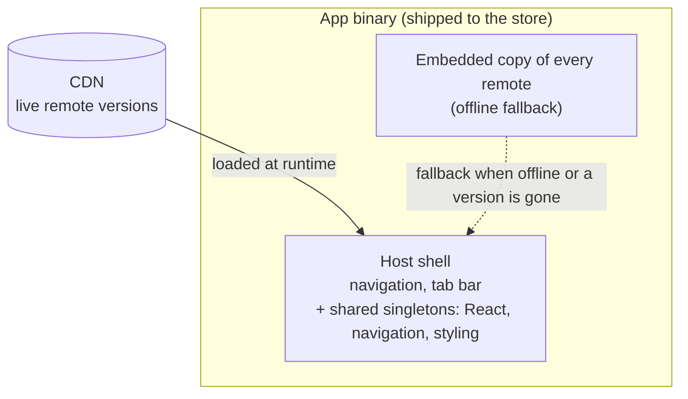

Ang maikling bersyon: pinapayagan ng Module Federation ang isang React Native app na i-load ang mga feature nito sa runtime, kaya ang bawat isa ay puwedeng i-deploy at i-update nang mag-isa sa halip na sumakay sa iisang app-store release. Nakukuha mo riyan ang independent deploys at over-the-air fixes. Binibigyan ka rin nito ng isang distributed-systems problem na dating trabaho ng bundler. Bubuo ang series na ito ng gumaganang federated setup mula sa simula sa isang maliit na Pokédex app. Ang unang post na ito ay tungkol sa kung dapat mo ba itong gawin.

## Bawat feature ay nai-ship sa bawat release

Ang isang standard na React Native app ay iisang bundle. I-organisa mo ito nang maayos, [by feature](/blog/feature-first-project-structure-react-native/) sa halip na by type, at wala itong binabago rito: ang login screen, ang settings page, ang report na walang nagbubukas, lahat compiled nang sabay-sabay, lahat naka-gate sa likod ng iisang store review, lahat sumasakay sa iisang release train. Ang isang one-line fix sa isang screen ay naghihintay na ma-rebuild, ma-resubmit, at ma-approve ang buong app.

Para sa isang maliit na app na may iisang team, ayos lang iyon. Mura ang release train at nandoon naman ang lahat. Para sa isang malaking app na may ilang team, mahal iyon. Ang urgent fix ng isang team ay naghihintay sa likod ng kalahating-tapos na feature ng ibang team dahil iisang binary ang ginagamit nila. Nagiging negosasyon ang release, at bumababa ang cadence sa pinakamabagal na contributor sa train.

Ang coupling na iyon ang gustong tanggalin ng Module Federation. Hindi ang bundle size, hindi ang build speed, mga magandang side effect lang iyon. Ang totoong premyo ay ang pagputol ng kawing sa pagitan ng "binago ko ang feature ko" at "kailangang i-ship ang buong app".

## Ano nga ba talaga ito

Ang isang federated app ay may **host** at isang set ng mga **remote**. Ang host ang shell: navigation, ang tab bar, ang shared libraries, ang mga bahaging laging nandoon. Ang mga remote ang mga feature, at ang bawat isa ay binubuo at idine-deploy nang mag-isa, tapos hinihila papasok sa runtime mula sa isang URL.

Hindi kino-compile ng host ang mga remote papasok sa sarili nito tulad ng ginagawa ng iisang bundle. May kopya pa rin ng bawat isa na nakasakay sa loob ng app binary bilang fallback, kailangang gumana ang na-review na app nang mag-isa, nang walang network, pero ang kopyang iyon ay ang garantisadong minimum lang. Ang live na bersyon ay galing sa CDN at nag-u-update nang walang release. Ibinibigay din ng host ang mabibigat na shared libraries nang isang beses, React, ang navigation stack, ang styling layer, kaya kinukonsumo ng bawat remote ang kopya ng host sa halip na magdala ng sarili nito. Ang isang remote ay nagiging maliit na payload ng feature code na pumupwesto sa isang shell na hawak na ang lahat ng nasa ilalim nito.

Sa praktika, tumatakbo iyon sa [Re.Pack](https://re-pack.dev/) (Rspack sa ilalim) na may [Module Federation 2.0](https://module-federation.io/). Ang mga mechanics ay nasa susunod na post. Sa ngayon sapat na ang mental model: isang shell na nag-lo-load ng features sa runtime, mula sa network o sa naka-bake na fallback, laban sa isang contract tungkol sa kung ano ang ibinibigay ng shell.

## Ano ang nakukuha mo rito

**Independent deploys.** Nag-ship ang isang feature team kapag handa na ang feature nila, hindi kapag umalis na ang train. Tumitigil ang release na maging shared resource na pinipila ng lahat.

**Over-the-air fixes.** Ang isang bug sa isang remote ay re-upload ng remote na iyon, hindi isang store submission. Live ang fix sa loob ng ilang minuto, at kinukuha ito ng bawat user sa susunod na launch nila, sa loob ng platform rules (higit pa riyan sa ibaba).

**Mas mabilis na starts.** Ang mga feature na hindi kailangan sa launch ay nag-lo-load nang lazy, kaya mas kaunting JavaScript ang tumatakbo sa critical path. Hindi lumiliit ang mismong download kung nag-ship ka ng offline fallback, dala pa rin ng binary ang bawat remote, pero puwedeng bumilis ang startup.

**Team autonomy sa scale.** Ang bawat feature ay may sariling build, sariling deploy, sariling cadence. Tumitigil ang architecture na piliting maglockstep ang mga team.

Kung wala sa mga iyon ang sakit na talagang nararamdaman mo, ang natitirang bahagi ng post na ito ang exit mo. Niso-solve ng federation ang coupling. Walang coupling, walang dahilan para magbayad para sa solusyon.

## Ano ang halaga nito

Ito ang bahaging nilalaktawan ng mga masigasig na post, kaya ito ang bahaging sulit pagdahanan.

**Ang shared-singleton contract.** Nagbibigay ang host ng iisang React, iisang navigation library, iisang styling layer, at nire-render ng bawat remote laban sa mga iyon. Sa sandaling kailanganin ng isang remote ang isang *mas bago* na bersyon ng shared library kaysa sa dala ng host, mayroon kang version-skew problem. Kung hindi ma-handle, nakikipagnegosasyon pababa ang runtime sa kopya ng host at nasisira ang remote sa isang API na wala sa kopyang iyon. Nalulutas ito, binubuo ng series ang fix, pero ang paglutas dito ang halaga: nagiging isang contract na pag-aari mo ang shared set at kailangan mong panatilihing compatible, trabahong ginagawa dati ng compiler nang libre.

**Ang compatibility burden, lalo na para sa mga lumang app version.** Hindi lahat ng user ay nag-u-update. Ang isang binary na ininstall ng isang tao ilang buwan na ang nakaraan ay may shared libraries na naka-freeze sa kung anuman ang nai-ship noon. Mag-push ka ng remote na nangangailangan ng mas bago at masisira mo nang eksakto ang mga taong hindi gumalaw. Kaya napupunta ka sa pagpapanatiling available ng mga lumang remote version para sa mga lumang app version, ang parehong disiplina ng pagpapanatiling buhay ng isang lumang API endpoint hanggang sa tumigil tumawag ang huling client. Hindi iyon trabaho ng bundler. Ang pagpapatakbo iyon ng isang versioned service.

**Integrity.** Sa sandaling nagda-download at nagpapatakbo ang app mo ng code mula sa isang URL, ang URL na iyon ay isang attack surface. Kailangan mong pirmahan ang ini-ship mo at ipa-verify iyon ng device bago i-execute, o puwedeng ibigay sa mga user mo ng isang na-compromise na host ang kahit anong gusto nito. Tapos kailangan mo ring protektahan ang *pagpili* ng version, para hindi makapag-serve nang tahimik ng luma at vulnerable na build ang isang replayed o naibalik na manifest. Ang security na ibinigay sa iyo nang libre ng iisang signed binary, ginagawa mo na ngayon nang ikaw mismo.

**Platform rules.** Pinapayagan ng [Apple's guideline 2.5.2](https://developer.apple.com/app-store/review/guidelines/#software-requirements) ang isang app na mag-download at magpatakbo ng interpreted code tulad ng JavaScript, na siyang dahilan kung bakit legal ang OTA, pero hangga't hindi nito binabago ang pangunahing layunin ng app, at kailangan pa ring gumana nang mag-isa ang binary na sinubmit mo. Walang pag-ship ng malalaking unreviewed na feature over the air. Nabubuhay ang federation sa loob ng mga linyang iyon, hindi nito binubura ang mga ito.

**Operational surface.** Isang CDN na patatakbuhin, mga cache na i-invalidate, mga rollback na i-script, mga failure na imo-monitor. Kapag hindi naka-load ang isang remote, kailangang mag-degrade ang app sa isang bagay na ligtas sa halip na magpakita ng blangkong screen. Tunay na engineering ang safety net na iyon, at nasa iyo iyon.

Pagsama-samahin: ang Module Federation ay isang distributed-systems problem na nakadamit ng bundler. Bounded ang bahaging bundler, i-setup mo at tapos na. Ang bahaging systems, signing, versioning, compatibility, fallback, ang totoong trabaho, at hindi ito ganap na natatapos.

## Kailan ito sulit

Abutin ito kapag totoo ang tatlong ito:

- **Maraming team** ang nagtatapakan sa isang shared release.
- **Ang coupling ay isang nasusukat na halaga**, mas mabagal na cadence, mga naka-block na fix, hindi isang teoretikal.
- **May makakapag-ari ng platform**, ang CDN, ang signing, ang version contract, ang fallback layer, bilang patuloy na trabaho.

Laktawan ito kapag maliit ang app, iisang team ang nag-aari nito, at hindi pabigat ang isang store release kada ilang linggo. Ang complexity na kukunin mo ay lulupig sa coupling na aalisin mo. Ang code splitting nang nag-iisa, async chunks nang walang runtime-remote machinery, ang magbibigay sa iyo ng lazy-loading at mas-mabilis-na-start na panalo sa isang fraction ng halaga, at isa itong matinong tigil bago ang buong federation.

Ang federation ay isang scaling tool. Gamitin ito dahil naabot mo na ang scale na nag-justify rito, hindi dahil interesante ang architecture. Interesante nga ito. Iyon ang bitag.

## Ano ang ginagawa ng natitirang bahagi ng series na ito

Mula rito ay hands-on na. Bubuo kami ng federated setup sa isang maliit na Pokédex app at dadalhin ito hanggang dulo:

- isang host at isang unang remote, nag-lo-load sa runtime
- ang shared-singleton contract, at ang bitag na tahimik itong sumisira
- pag-load ng mga remote mula sa CDN, na may offline fallback na naka-bake sa app
- pagpirma sa mga remote at sa version manifest para hindi tumakbo ang isang na-tamper o na-replay na build
- at ang mahirap, ang pagsisiguro na hindi makakuha ang isang lumang app version ng remote na hindi nito kayang patakbuhin, at hindi nagke-crash kapag may nawawala

Pagdating ng dulo, magkakaroon ka ng gumaganang bersyon ng lahat ng binabalaan ka lang ng post na ito, at malinaw na pakiramdam kung ito ay isang palitan na dapat gawin ng app mo.

## Mga Sanggunian

- [Re.Pack](https://re-pack.dev/): ang React Native bundler na bumabalot sa Rspack at nag-ship ng Module Federation support
- [Module Federation 2.0](https://module-federation.io/): ang runtime architecture
- [Rspack](https://rspack.dev/): ang Rust-based bundler sa ilalim ng Re.Pack
- [App Store Review Guidelines, 2.5.2](https://developer.apple.com/app-store/review/guidelines/#software-requirements): ang patakaran ng Apple sa downloaded interpreted code
