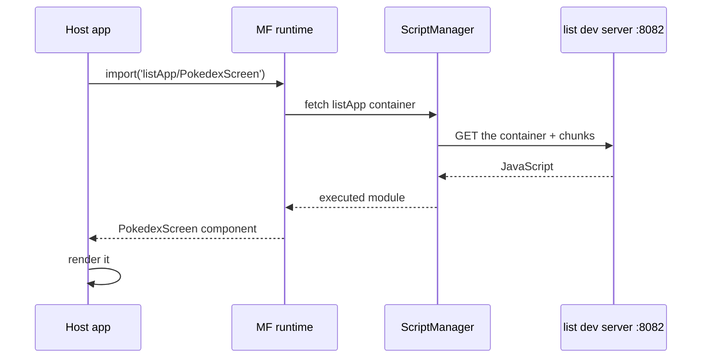

Ipinakita ng [unang post](/blog/why-module-federation-react-native/) ang dahilan para sa Module Federation. Bubuo naman ang isang ito ng pinakamaliit na tunay na bersyon nito: dalawang hiwalay na React Native app, kung saan ang isang app (ang host) ay nag-lo-load ng screen mula sa isa pa (isang remote) habang tumatakbo ito. Mula sa walang lamang folder papunta sa isang tumatakbong app, ipinapakita ang bawat hakbang.

Nasa companion repo ang tapos na code sa tag para sa post na ito, kaya puwede mo itong i-clone at i-diff laban sa sarili mo kung may na-drift:

```sh
git clone https://github.com/warrendeleon/react-native-module-federation
git checkout post-02-first-remote
```

Ito ang makukuha mo sa dulo. Ang listahan ng Pokémon sa screen ay nakatira sa, at ini-serve ng, isang *ibang app* mula sa tumatakbo:


## Dalawang app

Kailangan ng isang federation ng isang host at hindi bababa sa isang remote. Gumawa ng dalawang sariwang React Native app:

```sh
mkdir react-native-module-federation && cd react-native-module-federation
npx @react-native-community/cli@latest init Host --directory apps/host
npx @react-native-community/cli@latest init List --directory apps/list
```

Ang `host` ang shell na lina-launch ng user. Ang `list` ay isang feature na ilo-load papasok dito sa runtime.

## Ilagay ang dalawa sa Re.Pack

May kasamang Metro ang React Native. Tumatakbo ang Module Federation 2.0 sa [Re.Pack](https://re-pack.dev/) (Rspack sa ilalim), kaya ang unang trabaho ay palitan ang bundler. Pareho ang mga hakbang sa dalawang app.

I-install ang bundler at ang federation packages sa bawat app:

```sh
npm install -D @callstack/repack @rspack/core \
  @module-federation/enhanced @module-federation/runtime @swc/helpers
```

Ang `@swc/helpers` ang madaling makaligtaan. Kino-compile ng Re.Pack ang code mo gamit ang SWC (ang Speedy Web Compiler, isang Rust-based na alternatibo sa Babel na ginagamit nito sa ilalim). Kapag kino-compile pababa ng SWC ang modernong syntax, naglalabas ito ng mga `require("@swc/helpers/…")` na tawag sa isang maliit na shared helper library sa halip na i-inline ang parehong boilerplate sa lahat ng dako. Makaligtaan ang package at mabibigo ang build na may isang screen ng "can't resolve" na error na walang hint sa tunay na dahilan.

Ngayon ituro ang React Native CLI sa Re.Pack. Sa **dalawang** app, idagdag ang `react-native.config.js`:

```js
// apps/host/react-native.config.js  AND  apps/list/react-native.config.js
module.exports = {
  commands: require('@callstack/repack/commands/rspack'),
};
```

Ang iisang file na iyon ang gumagawa para gamitin ng `react-native start` at `react-native bundle` ang Rspack sa halip na Metro. Napalitan na ang bundler. Ang nagkakaiba sa pagitan ng host at remote ay ang `rspack.config.mjs` na nakukuha ng bawat isa, kung saan naka-configure ang federation.

## Ang remote: i-expose ang isang screen

Ang isang federated remote ay isang app na walang `AppRegistry.registerComponent`. Hindi ito nagbu-boot sa sarili nito, naghihintay ito na hilahin papasok sa isang host. Nagde-declare ito ng pangalan at kung ano ang ibinibigay nito.

Una ang screen na ibinibigay nito, `apps/list/src/PokedexScreen.tsx`. Sadyang plain React Native, ang post na ito ay tungkol sa pag-load nito, hindi sa pag-istilo nito:

```tsx
import React from 'react';
import { FlatList, StyleSheet, Text, View } from 'react-native';

const POKEMON = [
  { id: 1, name: 'Bulbasaur' },
  { id: 4, name: 'Charmander' },
  { id: 7, name: 'Squirtle' },
  { id: 25, name: 'Pikachu' },
  { id: 133, name: 'Eevee' },
];

export default function PokedexScreen() {
  return (
    <View style={styles.screen}>
      <Text style={styles.title}>Pokédex</Text>
      <Text style={styles.subtitle}>Served by the list remote</Text>
      <FlatList
        data={POKEMON}
        keyExtractor={p => String(p.id)}
        renderItem={({ item }) => (
          <View style={styles.row}>
            <Text style={styles.number}>#{String(item.id).padStart(3, '0')}</Text>
            <Text style={styles.name}>{item.name}</Text>
          </View>
        )}
      />
    </View>
  );
}

const styles = StyleSheet.create({
  screen: { flex: 1, padding: 24, backgroundColor: '#fff' },
  title: { fontSize: 28, fontWeight: '700' },
  subtitle: { fontSize: 14, color: '#6b7280', marginBottom: 16 },
  row: {
    flexDirection: 'row',
    paddingVertical: 12,
    borderBottomWidth: StyleSheet.hairlineWidth,
    borderBottomColor: '#e5e7eb',
  },
  number: { width: 56, color: '#9ca3af', fontVariant: ['tabular-nums'] },
  name: { fontSize: 16, fontWeight: '500' },
});
```

Ang entry point ng container, `apps/list/src/index.js`, ay halos walang laman. Walang nire-register na root component ang isang remote, kaya wala itong gagawin sa startup:

```js
// apps/list/src/index.js
export {};
```

Ngayon ang config, `apps/list/rspack.config.mjs`:

```js
import path from 'node:path';
import { fileURLToPath } from 'node:url';
import * as Repack from '@callstack/repack';
import pkg from './package.json' with { type: 'json' };

const __dirname = path.dirname(fileURLToPath(import.meta.url));

export default Repack.defineRspackConfig(env => {
  const { mode, platform } = env;

  return {
    mode,
    context: __dirname,
    entry: './src/index.js',
    resolve: {
      // Lets the resolver read each package's `exports` map, which the Module Federation
      // runtime needs for subpath imports like '@module-federation/runtime/helpers'.
      ...Repack.getResolveOptions({ enablePackageExports: true }),
    },
    output: {
      path: `${__dirname}/build/[platform]`,
      uniqueName: 'ListApp',
    },
    module: {
      rules: [
        {
          test: /\.[cm]?[jt]sx?$/,
          type: 'javascript/auto',
          use: { loader: '@callstack/repack/babel-swc-loader', parallel: true, options: {} },
        },
        ...Repack.getAssetTransformRules(),
      ],
    },
    plugins: [
      new Repack.RepackPlugin({
        extraChunks: [
          { include: /.*/, type: 'remote', outputPath: `build/${platform}/remote` },
        ],
      }),
      new Repack.plugins.ModuleFederationPluginV2({
        name: 'listApp',
        filename: 'listApp.container.js.bundle',
        exposes: {
          './PokedexScreen': './src/PokedexScreen.tsx',
        },
        dts: false,
        shared: {
          react: { singleton: true, requiredVersion: pkg.dependencies.react },
          'react-native': {
            singleton: true,
            requiredVersion: pkg.dependencies['react-native'],
          },
        },
      }),
    ],
  };
});
```

Tatlong bagay doon ang mahalaga. Mina-map ng `exposes` ang isang public key, `./PokedexScreen`, sa isang file. Ang key na iyon ang buong public surface ng remote. Nide-declare ng `shared` ang react at react-native bilang singletons, kaya nire-render ang remote laban sa iisang kopya ng host sa halip na i-bundle ang sarili nito (sisira ang hooks sa dalawang React sa iisang runtime). At ang `enablePackageExports: true` ay hindi opsyonal: kung wala ito, hindi ma-resolve ng federation runtime ang sarili nitong subpath imports at mabibigo ang build.

Magdagdag ng dev-server script sa `apps/list/package.json`:

```json
"scripts": {
  "start:remote": "react-native start --config rspack.config.mjs --port 8082"
}
```

Simulan ito:

```sh
cd apps/list && npm run start:remote
```

Nagse-serve ito ng manifest sa `http://localhost:8082/ios/mf-manifest.json` na naglalarawan sa container at sa screen na ini-expose nito. Buksan ang URL na iyon at makikita mo ang `./PokedexScreen` na nakalista. Walang nire-render ang remote sa sarili nito, isa itong feature na naghihintay ng app.

## Ang host: i-load ang remote

Ang host ay isang ordinaryong React Native app. Kinukonsumo ng `apps/host/rspack.config.mjs` nito ang remote:

```js
import path from 'node:path';
import { fileURLToPath } from 'node:url';
import * as Repack from '@callstack/repack';
import pkg from './package.json' with { type: 'json' };

const __dirname = path.dirname(fileURLToPath(import.meta.url));

export default Repack.defineRspackConfig(env => {
  const { mode, platform } = env;

  return {
    mode,
    context: __dirname,
    entry: './index.js',
    resolve: {
      ...Repack.getResolveOptions({ enablePackageExports: true }),
    },
    output: {
      path: `${__dirname}/build/[platform]`,
      uniqueName: 'Host',
    },
    module: {
      rules: [
        {
          test: /\.[cm]?[jt]sx?$/,
          type: 'javascript/auto',
          use: { loader: '@callstack/repack/babel-swc-loader', parallel: true, options: {} },
        },
        ...Repack.getAssetTransformRules(),
      ],
    },
    plugins: [
      new Repack.RepackPlugin(),
      new Repack.plugins.ModuleFederationPluginV2({
        name: 'host',
        filename: 'host.container.js.bundle',
        remotes: {
          // name@url: the host knows listApp lives at this manifest URL. In dev that is the
          // remote's own dev server on :8082.
          listApp: `listApp@http://localhost:8082/${platform}/mf-manifest.json`,
        },
        dts: false,
        shared: {
          react: { singleton: true, eager: true, requiredVersion: pkg.dependencies.react },
          'react-native': {
            singleton: true,
            eager: true,
            requiredVersion: pkg.dependencies['react-native'],
          },
        },
      }),
    ],
  };
});
```

Ang linyang `name@url` ang buong wiring: alam ng host na may remote na tinatawag na `listApp` na nakaupo sa manifest URL na iyon. Nagdaragdag ang `shared` ng host ng `eager: true`, dahil ang host ang iisang kopya na nire-render-an ng lahat, at ginagawang handa ng `eager` ang share scope bago tumakbo ang synchronous app entry, kaya walang kailangang bootstrap file.

Ngayon i-load ito. Palitan ang `apps/host/App.tsx`:

```tsx
import React, { Suspense } from 'react';
import { ActivityIndicator, SafeAreaView, StyleSheet } from 'react-native';

const PokedexScreen = React.lazy(() => import('listApp/PokedexScreen'));

export default function App() {
  return (
    <SafeAreaView style={styles.root}>
      <Suspense fallback={<ActivityIndicator style={styles.loader} size="large" />}>
        <PokedexScreen />
      </Suspense>
    </SafeAreaView>
  );
}

const styles = StyleSheet.create({
  root: { flex: 1 },
  loader: { flex: 1 },
});
```

Ang `listApp/PokedexScreen` ay hindi isang package na nasa disk. Ito ang `listApp` mula sa `remotes` ng host, tapos ang `./PokedexScreen` na ini-expose ng remote na iyon. Sa runtime, ginagawang ng Module Federation ang import na iyon na "kunin ang container ng listApp mula sa URL nito, simulan ito, ibalik ang `PokedexScreen` export nito". Dahil isa itong dynamic import na nagbabalik ng promise, kasya ito nang diretso sa `React.lazy` na may `Suspense` spinner habang nagda-download ang remote.

Hindi alam ng TypeScript ang specifier na iyon, kaya sabihin mo ang hugis nito. Idagdag ang `apps/host/mf-modules.d.ts`:

```ts
declare module 'listApp/PokedexScreen' {
  import type React from 'react';
  const PokedexScreen: React.ComponentType;
  export default PokedexScreen;
}
```

## ScriptManager: ang bahaging iba sa native

Lahat ng nasa itaas ay magiging pamilyar sa kahit sinong gumawa na ng Module Federation sa web. Ang React Native ang kung saan naghihiwalay ito.

Sa web, ang `import('listApp/PokedexScreen')` ay nagtatapos sa pag-fetch ng browser ng script over HTTP at pagpapatakbo nito ng engine. Palaging ginagawa iyon ng browser. Rutina lang para rito ang pag-load ng code mula sa isang URL. Walang katumbas ang React Native runtime. Walang DOM, walang `<script>` tag, walang built-in na paraan para humila ng dagdag na code on demand kapag naka-boot na ang app. Ang standard na RN app ay iisang self-contained na bundle, naka-load sa launch, na walang lamang nakakaalam kung paano humayo at kumuha ng isa pang chunk mamaya.

Pinupunan ng Re.Pack ang gap na iyon gamit ang **ScriptManager**: ang bahaging gumagawa sa isang request na ginagawa ng federation runtime ("kailangan ko ang container ng listApp") na maging tunay na hakbang, alamin ang URL, kunin ang script, ibigay ito sa engine para patakbuhin, i-cache ito. Sa native, dumadaan dito ang bawat federated import.

Ang magandang balita para sa post na ito: sa dev, wala kang isusulat na anuman dito. Ang Module Federation plugin na idinagdag mo na ang awtomatikong nag-wi-wire sa ScriptManager at sa isang default resolver na nakakaalam kung paano aabutin ang dev server ng remote. Kaya ang buong loop ay:



Kapag lumipat ka sa production, ang ScriptManager ang kung saan nasa tunay na trabaho: pag-resolve ng versioned CDN URLs, pag-verify ng signature bago patakbuhin ang anuman, pag-fall back sa isang embedded copy kapag nabigo ang network. Lahat mamaya sa series. Sa ngayon sapat nang malaman na ito ang tulay sa pagitan ng "i-import ang isang remote" at "dumarating ang code over the wire at tumatakbo" na ibinigay ng browser sa web federation nang libre.

## Patakbuhin ito

May native iOS project ang host, JS-only ang remote. Kaya nai-install ang pods para sa host lang:

```sh
cd apps/host/ios && bundle install && bundle exec pod install
```

Tapos, sa tatlong terminal:

```sh
# 1. the remote's dev server (leave the one from earlier running, or start it)
cd apps/list && npm run start:remote     # :8082

# 2. the host's dev server
cd apps/host && npm start                # :8081

# 3. build and launch the host on a simulator
cd apps/host && npm run ios
```

Nagbu-boot ang host, sandaling nagpapakita ng spinner habang kinukuha nito ang `listApp` mula sa `:8082`, tapos nire-render ang Pokédex screen, na ini-serve ng ganap na hiwalay na app.

Para patunayan na talagang hiwalay sila, ihinto ang list dev server at i-reload ang host. Hindi maka-load ang screen. Ang paggawang mag-degrade iyon sa isang bagay na ligtas, isang offline copy na nakatayo sa loob ng host, ay sariling post mamaya sa series. Sa ngayon ang basic loop ang mahalaga, at tumatakbo ito.

## Ano ang ginawa mo, at ano ang minimal pa

May dalawa kang app na nagbu-build at nagde-deploy nang mag-isa, na pinagsama sa runtime. Ini-import ng host ang isang screen by name, at dumarating ang code over the network at tumatakbo sa loob nito. Walang kino-compile ang remote papasok sa host.

Dalawang bagay ang sadyang pinanatiling minimal, bawat isa ay sariling post:

- **Ang shared libraries.** Naka-share ang react at react-native kaya nire-render ang remote laban sa kopya ng host. Ang buong contract, eager kontra lazy, version skew, at ang pagkakamaling tahimik itong sumisira, ang susunod na post.
- **Lahat ng kailangan ng production.** Versioned CDN loads, signing, isang offline fallback, at kung ano ang nangyayari kapag wala na ang isang remote. Ang ikalawang kalahati ng series.

Susunod: ang shared-singleton contract, at ang isang pagkakamaling tahimik itong sumisira.

## Mga Sanggunian

- [Re.Pack](https://re-pack.dev/): ang React Native bundler na bumabalot sa Rspack at nagbibigay ng ScriptManager at Module Federation support
- [Module Federation 2.0](https://module-federation.io/): ang runtime architecture sa likod ng `name@url` remotes at `exposes`
- [react-native-module-federation](https://github.com/warrendeleon/react-native-module-federation): ang companion repo, sa tag na `post-02-first-remote`
