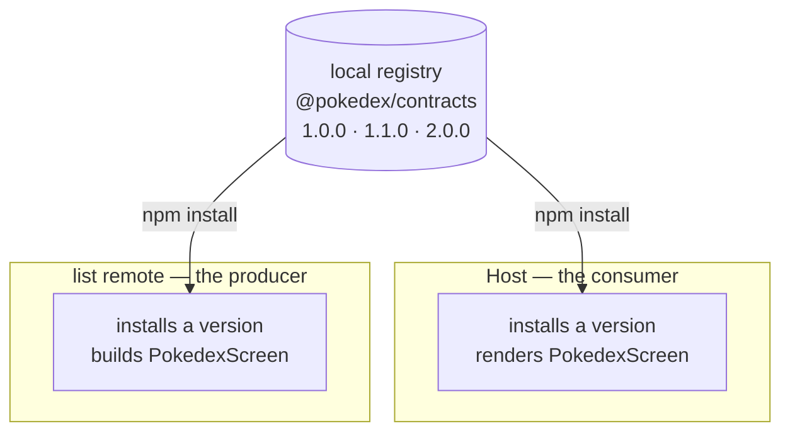

So far the host has loaded its remotes without ever seeing what they expose. A remote is built and shipped on its own, so at compile time the host has no file for `listApp/PokedexScreen`; that module only exists at runtime, once Module Federation fetches it. To stop TypeScript complaining, the host hand-writes a shape for it:

```ts
declare module 'listApp/PokedexScreen' {
  import type React from 'react';
  const PokedexScreen: React.ComponentType;
  export default PokedexScreen;
}
```

That declaration is a guess: the host author wrote it, the compiler believes it, and nothing checks it against the screen the remote actually ships. While the screen takes no props it costs nothing; the moment it takes a prop, the host and the remote can disagree, and you find out at runtime, not at build.

The fix is a contract both sides import. But here is the part that decides whether it is worth anything: the host and the remote are built and shipped on their own, so they cannot share a file on disk. Even in one repository they are separate builds, and in the wider world they are often separate repositories owned by separate teams. So the contract is not a file you reach across to. It is a package you publish, and install by version. This post builds it, publishes it to a registry, installs it on both sides, and then asks the question that decides everything: what happens when the host and a remote end up on different versions.

<div id="architecture"></div>



We pick up where post 4 left off. If you built along, stay on your own code. If not, start from post 4's finished state:

```sh
git clone https://github.com/warrendeleon/react-native-module-federation
git checkout post-04-host-shell
```

## The contract

The contract is a small package of types and nothing else. Create `packages/contracts` next to `apps`.

The types it exports, `packages/contracts/src/screens.ts`. This is the one place the host and the remote agree on what crosses the seam:

```ts
import type { ComponentType } from 'react';

export interface PokedexScreenProps {
  // The list remote reports which Pokémon was tapped. The host owns navigation and decides what
  // happens next, so the remote never imports a navigator; it just hands back an id.
  onSelectPokemon: (id: number) => void;
}

// The profile screen takes nothing from the host yet. An empty contract is still a contract: the
// host's import resolves to "a component with no props", enforced rather than assumed.
export type ProfileScreenProps = Record<string, never>;

// The exposed-module types, composed from the props above. The host's ambient declarations point at
// these, so a federated import is typed from the same source the remote was built against.
export type PokedexScreenModule = ComponentType<PokedexScreenProps>;
export type ProfileScreenModule = ComponentType<ProfileScreenProps>;
```

A barrel, `packages/contracts/src/index.ts`:

```ts
export * from './screens';
```

Its `package.json`. The version is the part that will matter most: this is `1.0.0`, the first published cut of the seam. `publishConfig` points publishing at the local registry we are about to start, and `prepublishOnly` builds the types before each publish so consumers always get fresh declarations:

```json
{
  "name": "@pokedex/contracts",
  "version": "1.0.0",
  "description": "The typed seam between the host and every federated remote: the props each exposed screen takes.",
  "main": "dist/index.js",
  "types": "dist/index.d.ts",
  "files": ["dist", "src", "README.md"],
  "scripts": {
    "build": "tsc",
    "typecheck": "tsc --noEmit",
    "prepublishOnly": "npm run build"
  },
  "publishConfig": {
    "registry": "http://localhost:4873/"
  },
  "peerDependencies": {
    "react": "*"
  },
  "devDependencies": {
    "@types/react": "^19.2.0",
    "typescript": "^5.8.3"
  }
}
```

Its `tsconfig.json` emits declarations into `dist`, so consumers get types as well as JavaScript:

```json
{
  "compilerOptions": {
    "target": "ES2020",
    "module": "CommonJS",
    "moduleResolution": "node",
    "lib": ["ES2020"],
    "jsx": "react-jsx",
    "strict": true,
    "esModuleInterop": true,
    "skipLibCheck": true,
    "declaration": true,
    "declarationMap": true,
    "sourceMap": true,
    "outDir": "dist",
    "rootDir": "src",
    "forceConsistentCasingInFileNames": true,
    "isolatedModules": true
  },
  "include": ["src/**/*"],
  "exclude": ["dist", "node_modules"]
}
```

Because every export is a type, the import is erased at build. Nothing from this package reaches a bundle, and there is no runtime dependency to share the way `react` is. It mirrors post 3's contract at a different layer: post 3 shared a library at runtime so the app does not crash; this shares a type at compile time so the build does not lie.

## Publish it to a registry

A `file:` path to `../../packages/contracts` would work here, because in this monorepo the apps are siblings on disk. It would also teach the wrong thing. The whole point of a federated remote is that it builds and ships on its own; the day it moves to its own repository, a path across the filesystem is gone. So we treat the contract the way its consumers will have to in production: a versioned package pulled from a registry.

Locally, that registry is [Verdaccio](https://verdaccio.org/), a small npm registry you run yourself. It stands in for whatever you use in production: a private npm registry, GitHub Packages, or Artifactory. Start it in its own terminal:

```sh
npx verdaccio
```

It comes up on `http://localhost:4873`. Register a user against it once, which writes a token into your user-level `~/.npmrc`:

```sh
npm adduser --registry http://localhost:4873
```

Point the `@pokedex` scope at the local registry so both apps resolve the contract there, while everything else still comes from npm. A project-level `.npmrc` at the repo root:

```sh
@pokedex:registry=http://localhost:4873/
```

Build and publish from the package. `prepublishOnly` runs the build for you:

```sh
cd packages/contracts
npm publish
```

```sh
+ @pokedex/contracts@1.0.0
```

The seam is now a published artifact with a version on it. That version is about to do real work.

## Install it on both sides

The host and the list remote each take the contract as a dependency, by version range. Add it to `apps/host/package.json` and `apps/list/package.json`:

```json
"dependencies": {
  "@pokedex/contracts": "^1.0.0",
  ...
}
```

Then `npm install` in each. This time it is a real install: each app downloads and unpacks its own copy of `@pokedex/contracts@1.0.0` into `node_modules`, instead of pointing at one shared folder the way a `file:` path would. The host and the remote each hold the version they asked for.

The list remote builds its screen against the contract. Its props come from `@pokedex/contracts`, so the signature is checked against the same type the host will render with. `apps/list/src/PokedexScreen.tsx`:

```tsx
import React from 'react';
import { FlatList, Pressable, StyleSheet, Text, View } from 'react-native';
import { useSafeAreaInsets } from 'react-native-safe-area-context';
import type { PokedexScreenProps } from '@pokedex/contracts';

const POKEMON = [
  { id: 1, name: 'Bulbasaur' },
  { id: 4, name: 'Charmander' },
  { id: 7, name: 'Squirtle' },
  { id: 25, name: 'Pikachu' },
  { id: 133, name: 'Eevee' },
];

export default function PokedexScreen({ onSelectPokemon }: PokedexScreenProps) {
  const insets = useSafeAreaInsets();
  return (
    <View style={[styles.screen, { paddingTop: insets.top + 24 }]}>
      <Text style={styles.title}>Pokédex</Text>
      <Text style={styles.subtitle}>Served by the list remote</Text>
      <FlatList
        data={POKEMON}
        keyExtractor={p => String(p.id)}
        renderItem={({ item }) => (
          <Pressable style={styles.row} onPress={() => onSelectPokemon(item.id)}>
            <Text style={styles.number}>#{String(item.id).padStart(3, '0')}</Text>
            <Text style={styles.name}>{item.name}</Text>
          </Pressable>
        )}
      />
    </View>
  );
}

const styles = StyleSheet.create({
  screen: { flex: 1, padding: 24, backgroundColor: '#fff' },
  title: { fontSize: 28, fontWeight: '700' },
  subtitle: { fontSize: 14, color: '#6b7280', marginBottom: 16 },
  row: {
    flexDirection: 'row',
    paddingVertical: 12,
    borderBottomWidth: StyleSheet.hairlineWidth,
    borderBottomColor: '#e5e7eb',
  },
  number: { width: 56, color: '#9ca3af', fontVariant: ['tabular-nums'] },
  name: { fontSize: 16, fontWeight: '500' },
});
```

The host renders the screen and passes a handler. The list remote reports an id; the host owns navigation and decides what to do with it, so the remote never imports a navigator. The prop-less generic wrapper from post 4 cannot carry a prop, so each tab gets its own small wrapper instead. The whole of `apps/host/App.tsx`:

```tsx
import React, { Suspense } from 'react';
import { ActivityIndicator, StyleSheet } from 'react-native';
import { SafeAreaProvider } from 'react-native-safe-area-context';
import { NavigationContainer } from '@react-navigation/native';
import { createBottomTabNavigator } from '@react-navigation/bottom-tabs';

const PokedexScreen = React.lazy(() => import('listApp/PokedexScreen'));
const ProfileScreen = React.lazy(() => import('profileApp/ProfileScreen'));

// The host owns navigation, so it owns what a selection means. The list remote reports an id through
// the onSelectPokemon prop typed in @pokedex/contracts; for now the host just logs it, and a later
// post wires it to a detail route. Pass a wrong-shaped handler here and TypeScript stops the build.
function handleSelectPokemon(id: number) {
  console.log(`Selected Pokémon #${id}`);
}

function PokedexTab() {
  return (
    <Suspense fallback={<ActivityIndicator style={styles.loader} size="large" />}>
      <PokedexScreen onSelectPokemon={handleSelectPokemon} />
    </Suspense>
  );
}

function ProfileTab() {
  return (
    <Suspense fallback={<ActivityIndicator style={styles.loader} size="large" />}>
      <ProfileScreen />
    </Suspense>
  );
}

const Tab = createBottomTabNavigator();

export default function App() {
  return (
    <SafeAreaProvider>
      <NavigationContainer>
        <Tab.Navigator screenOptions={{ headerShown: false }}>
          <Tab.Screen name="Pokédex" component={PokedexTab} />
          <Tab.Screen name="Trainer" component={ProfileTab} />
        </Tab.Navigator>
      </NavigationContainer>
    </SafeAreaProvider>
  );
}

const styles = StyleSheet.create({
  loader: { flex: 1 },
});
```

Last, retire the guess. `apps/host/mf-modules.d.ts` stops hand-writing the shape and borrows it from the contract instead:

```ts
declare module 'listApp/PokedexScreen' {
  import type { PokedexScreenModule } from '@pokedex/contracts';
  const PokedexScreen: PokedexScreenModule;
  export default PokedexScreen;
}

declare module 'profileApp/ProfileScreen' {
  import type { ProfileScreenModule } from '@pokedex/contracts';
  const ProfileScreen: ProfileScreenModule;
  export default ProfileScreen;
}
```

Typecheck the host and the list. Both pass, each against the same published `1.0.0`. Producer and consumer now agree on the seam through one artifact, not a guess. So far this looks like busywork. The version makes it more than that.

## The real test: versions drift

In a monorepo with one build, drift is caught for free, because everything compiles together. That safety net is exactly what a federated app gives up: the host and each remote build, and deploy, on their own. They can be on different versions of the contract at the same time. Whether that is fine or fatal is the actual subject of this post.

### Additive change: safe to drift

Say the list remote wants to support a long press, and the host might pass a handler for it one day. Add the prop to the contract, optional on purpose:

```ts
export interface PokedexScreenProps {
  onSelectPokemon: (id: number) => void;
  // Added in 1.1.0. Optional on purpose: a host built against 1.0.0 never passes it, and still
  // satisfies the contract. That is what makes an additive change safe to roll out unevenly.
  onLongPressPokemon?: (id: number) => void;
}
```

This adds to the seam without changing anything already there, so it is a minor bump. Set the version to `1.1.0` and publish:

```sh
+ @pokedex/contracts@1.1.0
```

The list remote adopts it, and wires the long press through optional chaining so it is a safe no-op until a host passes a handler:

```tsx
export default function PokedexScreen({
  onSelectPokemon,
  onLongPressPokemon,
}: PokedexScreenProps) {
  // ...
  <Pressable
    style={styles.row}
    onPress={() => onSelectPokemon(item.id)}
    onLongPress={() => onLongPressPokemon?.(item.id)}
  >
```

Install `1.1.0` in the list, and leave the host on `1.0.0`:

```sh
cd apps/list && npm install @pokedex/contracts@1.1.0
```

Now the two sides are on different versions, and both typecheck. The list builds against `1.1.0`, which has the new prop. The host builds against `1.0.0`, which does not, so the host never passes it, and a screen that requires only `onSelectPokemon` is happy without it. An additive change rolls out unevenly and stays safe, which is the whole reason a caret range like `^1.0.0` exists: the host will pick up `1.1.0` on its next install, but it is under no pressure to upgrade at the same time. Run `npm install @pokedex/contracts` in the host whenever you like, and both sides are on `1.1.0`.

### Breaking change: the version does real work

Now a change that cannot be additive. Suppose the team decides ids should be strings. That re-types an existing prop, so anything built against the old shape is wrong. Semver has a name for that, a major bump. Set the version to `2.0.0`, change the type, and publish:

```ts
onSelectPokemon: (id: string) => void;
```

```sh
+ @pokedex/contracts@2.0.0
```

Three things happen, and together they are the point of the whole package.

**The caret refuses it.** The host is on `^1.x`. Install, then check what it resolved to:

```sh
cd apps/host && npm install @pokedex/contracts
npm ls @pokedex/contracts
```

```sh
Host@0.0.1
└── @pokedex/contracts@1.1.0
```

It takes `1.1.0`, the newest `1.x`, and will not cross to `2.0.0` on its own. A breaking change does not propagate silently; someone has to ask for it by major version. Semver is doing its job before a line of your code runs.

**Opting in catches the drift.** Move the list to `2.0.0` deliberately, without changing its code, and it stops compiling:

```sh
cd apps/list && npm install @pokedex/contracts@2.0.0
```

```sh
src/PokedexScreen.tsx(32,44): error TS2345: Argument of type 'number' is not assignable to parameter of type 'string'.
src/PokedexScreen.tsx(33,53): error TS2345: Argument of type 'number' is not assignable to parameter of type 'string'.
```

The version caught the mismatch the moment the list adopted it. Inside one repository, against one installed version, the contract works exactly as you would hope.

**Across versions, nothing checks it.** Adapt the list to `2.0.0` so it passes strings, and leave the host on `1.1.0`:

```tsx
onPress={() => onSelectPokemon(String(item.id))}
```

Both repositories compile, the list against `2.0.0` and the host against `1.1.0`, and they disagree: the host's handler is typed for a number, the list now sends a string, and no compiler can see across the two installed versions. This is the honest limit of a type contract. It is a build-time spec, not a runtime guarantee; it cannot police a boundary between two units that pinned different majors. At runtime the string arrives where the host expected a number, with nothing to stop it, and worse, it may not even crash. A bare `console.log` swallows the difference. The bug surfaces later, wherever the id is used as a number: a comparison that never matches, a numeric sort that scrambles, a typed route param that misses.

So a breaking change is a coordinated rollout, not a publish. You move both sides to `2.0.0` together, or you keep serving the old remote version until the host catches up, which federation makes possible and a later post builds. Semver's job here is not to prevent the break. It is to make the break loud and deliberate instead of silent. Put the contract back to `1.1.0`; we are not shipping strings, but every federated team has to know what this looks like before it happens to them in production.

## Run it

Verdaccio is only needed to publish and install. Once the contract is in `node_modules`, it is erased at build, so the running app never touches the registry. The run is post 4's, with each remote and the host in its own terminal:

```sh
cd apps/list && npm run start:remote      # :8082
cd apps/profile && npm run start:remote   # :8083
cd apps/host && npm start                 # :8081
cd apps/host && npm run ios
```

The app looks exactly as it did after post 4: two tabs, the Pokédex list served by the list remote. Tap a Pokémon and the host logs the selection it received across the seam, through a prop both sides type from one published version.

<div class="device-frame">
  
</div>

## What you built, and what's next

The seam between the host and its remotes is a published, versioned, reviewable artifact. A change to it shows up in a diff and a version number, where both teams can see whether it is additive or breaking, instead of two sides drifting blind against a guess. Additive changes roll out unevenly and stay safe. Breaking changes refuse to spread on their own and force a coordinated move. None of that comes free: the publishing and the version bumps are real work, but that work is the price of letting two apps deploy on their own. If you do not want it, you do not want federation; you want one app.

The one thing the contract cannot do is guard the boundary at runtime, because the types are gone by then. A runtime check at the seam is the backstop: validate what actually crosses it with a schema library like Zod, so a wrong value fails loudly at the boundary instead of slipping through a type that is no longer there. That check gets its own post later in the series.

The finished code for this post is the `post-05-contracts` tag, so you can diff it against your own:

```sh
git checkout post-05-contracts
```

Next, a short detour before the federated state work: two posts on React state itself, starting with the split between server state and client state and why a React app holds them in two different libraries. Then we bring it back to federation, where the tabs stop holding hardcoded data and share one store across the remotes, with real data from an API.

## Sources

- [Verdaccio](https://verdaccio.org/) — the local npm registry the contract is published to
- [Module Federation 2.0](https://module-federation.io/) — the runtime that loads each remote the contract describes
- [TypeScript: ambient modules](https://www.typescriptlang.org/docs/handbook/modules/reference.html#ambient-modules) — why a runtime-only import still needs a declared shape
- [semver](https://semver.org/) — what a major versus a minor bump promises a consumer
- [react-native-module-federation](https://github.com/warrendeleon/react-native-module-federation) — the companion repo, at the tag `post-05-contracts`
