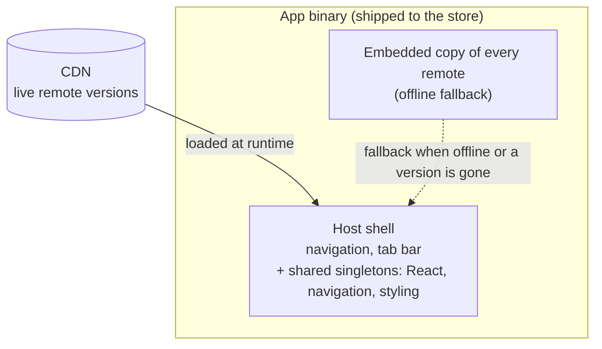

The short version: Module Federation lets a React Native app load its features at runtime, so each one can be deployed and updated on its own instead of riding in a single app-store release. That buys independent deploys and over-the-air fixes. It also hands you a distributed-systems problem that used to be a bundler's job. This series builds a working federated setup from scratch on a small Pokédex app. This first post is about whether you should.

## Every feature ships in every release

A standard React Native app is one bundle. Organise it well, [by feature](/blog/feature-first-project-structure-react-native/) rather than by type, and it changes nothing here: the login screen, the settings page, the report nobody opens, all compiled together, all gated behind the same store review, all riding the same release train. A one-line fix to one screen waits for the whole app to be rebuilt, resubmitted, and approved.

For a small app with one team, that's fine. The release train is cheap and everyone is on it anyway. For a large app with several teams, it's expensive. One team's urgent fix sits behind another team's half-finished feature because they share a binary. The release turns into a negotiation, and the cadence drops to the slowest contributor on the train.

That coupling is the thing Module Federation is trying to undo. Not bundle size, not build speed, those are nice side effects. The real prize is breaking the link between "I changed my feature" and "the whole app has to ship".

## What it actually is

A federated app has a **host** and a set of **remotes**. The host is the shell: navigation, the tab bar, the shared libraries, the bits that are always there. The remotes are the features, and each one is built and deployed on its own, then pulled in at runtime from a URL.

The host doesn't compile the remotes into itself the way a single bundle does. A copy of each still rides inside the app binary as a fallback, the reviewed app has to work on its own, with no network, but that copy is only the guaranteed minimum. The live version comes from the CDN and updates without a release. The host also provides the heavy shared libraries once, React, the navigation stack, the styling layer, so each remote consumes the host's copy instead of carrying its own. A remote becomes a small payload of feature code that snaps into a shell already holding everything underneath it.

In practice that runs on [Re.Pack](https://re-pack.dev/) (Rspack underneath) with [Module Federation 2.0](https://module-federation.io/). The mechanics are a later post. For now the mental model is enough: a shell that loads features at runtime, from the network or a baked-in fallback, against a contract about what the shell provides.

## What it buys you

**Independent deploys.** A feature team ships when their feature is ready, not when the train leaves. The release stops being a shared resource everyone queues for.

**Over-the-air fixes.** A bug in one remote is a re-upload of that remote, not a store submission. The fix is live in minutes, and each user picks it up on their next launch, within the platform rules (more on those below).

**Faster starts.** Features that aren't needed at launch load lazily, so less JavaScript runs on the critical path. The download itself doesn't shrink if you ship an offline fallback, the binary still carries every remote, but startup can.

**Team autonomy at scale.** Each feature owns its own build, its own deploy, its own cadence. The architecture stops forcing teams into lockstep.

If none of those are pains you actually feel, the rest of this post is your exit. Federation solves coupling. No coupling, no reason to pay for the solution.

## What it costs

This is the part the enthusiastic posts skip, so it's the part worth slowing down on.

**The shared-singleton contract.** The host provides one React, one navigation library, one styling layer, and every remote renders against those. The moment a remote needs a *newer* version of a shared library than the host carries, you have a version-skew problem. Unhandled, the runtime negotiates down to the host's copy and the remote breaks on an API that copy doesn't have. It's solvable, the series builds the fix, but solving it is the cost: the shared set becomes a contract you own and have to keep compatible, work the compiler used to do for free.

**The compatibility burden, especially for old app versions.** Users don't all update. A binary someone installed months ago has the shared libraries frozen at whatever shipped then. Push a remote that needs newer ones and you break exactly the people who haven't moved. So you end up keeping old remote versions available for old app versions, the same discipline as keeping an old API endpoint alive until the last client stops calling it. That is not bundler work. That is running a versioned service.

**Integrity.** Once your app downloads and runs code from a URL, that URL is an attack surface. You have to sign what you ship and have the device verify it before executing, or a compromised host can hand your users whatever it likes. Then you have to protect the *choice* of version too, so a replayed or rolled-back manifest can't quietly serve an old, vulnerable build. Security that a single signed binary gave you for free, you now build yourself.

**Platform rules.** What makes OTA legal at all is Apple's Developer Program License Agreement (section 3.3.2): an app may run downloaded interpreted code like JavaScript, as long as it doesn't change the app's primary purpose. Review [guideline 2.5.2](https://developer.apple.com/app-store/review/guidelines/#software-requirements) is the matching constraint, the binary you submit still has to work on its own and can't pull down code that introduces or changes features. No shipping major unreviewed features over the air. Federation lives inside those lines, it doesn't erase them.

**Operational surface.** A CDN to run, caches to invalidate, rollbacks to script, failures to monitor. When a remote won't load, the app has to degrade to something safe instead of showing a blank screen. That safety net is real engineering, and it's on you.

Put together: Module Federation is a distributed-systems problem wearing a bundler's clothes. The bundler part is bounded, you set it up and it's done. The systems part, signing, versioning, compatibility, fallback, is the actual work, and it never fully ends.

## When it's worth it

Reach for it when all three are true:

- **Multiple teams** are stepping on each other in a shared release.
- **The coupling is a measured cost**, slower cadence, blocked fixes, not a theoretical one.
- **Someone can own the platform**, the CDN, the signing, the version contract, the fallback layer, as ongoing work.

Skip it when the app is small, one team owns it, and a store release every couple of weeks is no burden. The complexity you'd take on dwarfs the coupling you'd remove. Code splitting alone, async chunks without the runtime-remote machinery, gets you the lazy-loading and faster-start win at a fraction of the cost, and it's a sensible stop short of full federation.

Federation is a scaling tool. Adopt it because you've hit the scale that justifies it, not because the architecture is interesting. It is interesting. That's the trap.

## What the rest of this series does

From here it's hands-on. We build a federated setup on a small Pokédex app and take it the whole way:

- a host and a first remote, loading at runtime
- the shared-singleton contract, and the trap that fails it silently
- loading remotes from a CDN, with an offline fallback baked into the app
- signing remotes and the version manifest so a tampered or replayed build can't run
- and the hard one, making sure an old app version never gets a remote it can't run, and never crashes when one goes missing

By the end you'll have a working version of everything this post just warned you about, and a clear sense of whether it's a trade your app should make.

## Sources

- [Re.Pack](https://re-pack.dev/): the React Native bundler that wraps Rspack and ships Module Federation support
- [Module Federation 2.0](https://module-federation.io/): the runtime architecture
- [Rspack](https://rspack.dev/): the Rust-based bundler under Re.Pack
- [App Store Review Guidelines, 2.5.2](https://developer.apple.com/app-store/review/guidelines/#software-requirements): Apple's rule on downloaded interpreted code
