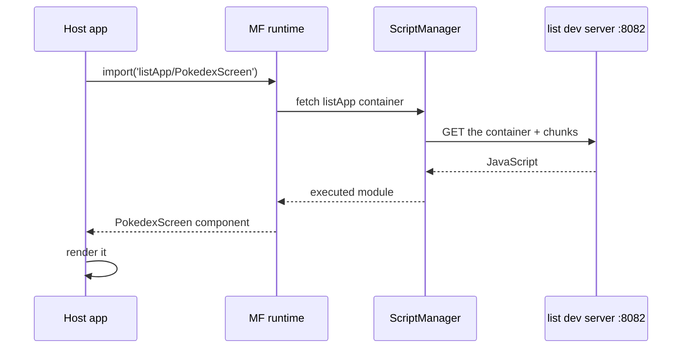

The [first post](/blog/why-module-federation-react-native/) made the case for Module Federation. This one builds the smallest real version of it: two separate React Native apps, where one app (the host) loads a screen from the other (a remote) while it's running. We go from an empty folder to a running app, every step shown.

The finished code is in the companion repo at the tag for this post, so you can clone it and diff against your own if something drifts:

```sh
git clone https://github.com/warrendeleon/react-native-module-federation
git checkout post-02-first-remote
```

This is what you'll have at the end. The list of Pokémon on screen lives in, and is served by, a *different app* from the one running:

<div class="device-frame">
  
</div>

## Two apps

A federation needs a host and at least one remote. Create two fresh React Native apps:

```sh
mkdir react-native-module-federation && cd react-native-module-federation
npx @react-native-community/cli@20.1.0 init Host --directory apps/host --version 0.85.3
npx @react-native-community/cli@20.1.0 init List --directory apps/list --version 0.85.3
```

The versions are pinned on purpose: this series is built and verified on RN 0.85.3 with Re.Pack 5.2.5, on the iOS simulator. A newer RN scaffold will probably work, but you'd be first to find out. (Android runs the same configs, with one wrinkle: the `localhost` manifest URLs need `adb reverse`, or `10.0.2.2` in their place.)

`host` is the shell the user launches. `list` is a feature that will be loaded into it at runtime.

## Put both on Re.Pack

React Native ships with Metro. Module Federation 2.0 runs on [Re.Pack](https://re-pack.dev/) (Rspack underneath), so the first job is to swap the bundler. The steps are identical in both apps.

Install the bundler and the federation packages in each app:

```sh
npm install -D @callstack/repack @rspack/core \
  @module-federation/enhanced @swc/helpers
```

`@swc/helpers` is the easy one to miss. Re.Pack compiles your code with SWC (the Speedy Web Compiler, a Rust-based alternative to Babel that it uses underneath). When SWC compiles modern syntax down, it emits `require("@swc/helpers/…")` calls to a small shared helper library rather than inlining the same boilerplate everywhere. Miss the package and the build fails with a screen of "can't resolve" errors that give no hint of the real cause.

Now point the React Native CLI at Re.Pack. In **both** apps, add `react-native.config.js`:

```js
// apps/host/react-native.config.js  AND  apps/list/react-native.config.js
module.exports = {
  commands: require('@callstack/repack/commands/rspack'),
};
```

That single file is what makes `react-native start` and `react-native bundle` use Rspack instead of Metro. The bundler is swapped. What differs between host and remote is the `rspack.config.mjs` each one gets, which is where federation is configured.

## The remote: expose a screen

A federated remote is an app with no `AppRegistry.registerComponent`. It doesn't boot itself, it waits to be pulled into a host. It declares a name and what it hands out.

First the screen it hands out, `apps/list/src/PokedexScreen.tsx`. Plain React Native on purpose, this post is about loading it, not styling it:

```tsx
import React from 'react';
import { FlatList, StyleSheet, Text, View } from 'react-native';

const POKEMON = [
  { id: 1, name: 'Bulbasaur' },
  { id: 4, name: 'Charmander' },
  { id: 7, name: 'Squirtle' },
  { id: 25, name: 'Pikachu' },
  { id: 133, name: 'Eevee' },
];

export default function PokedexScreen() {
  return (
    <View style={styles.screen}>
      <Text style={styles.title}>Pokédex</Text>
      <Text style={styles.subtitle}>Served by the list remote</Text>
      <FlatList
        data={POKEMON}
        keyExtractor={p => String(p.id)}
        renderItem={({ item }) => (
          <View style={styles.row}>
            <Text style={styles.number}>#{String(item.id).padStart(3, '0')}</Text>
            <Text style={styles.name}>{item.name}</Text>
          </View>
        )}
      />
    </View>
  );
}

const styles = StyleSheet.create({
  screen: { flex: 1, padding: 24, backgroundColor: '#fff' },
  title: { fontSize: 28, fontWeight: '700' },
  subtitle: { fontSize: 14, color: '#6b7280', marginBottom: 16 },
  row: {
    flexDirection: 'row',
    paddingVertical: 12,
    borderBottomWidth: StyleSheet.hairlineWidth,
    borderBottomColor: '#e5e7eb',
  },
  number: { width: 56, color: '#9ca3af', fontVariant: ['tabular-nums'] },
  name: { fontSize: 16, fontWeight: '500' },
});
```

The container's entry point, `apps/list/src/index.js`, is almost empty. A remote registers no root component, so it has nothing to do at startup:

```js
// apps/list/src/index.js
export {};
```

Now the config, `apps/list/rspack.config.mjs`:

```js
import path from 'node:path';
import { fileURLToPath } from 'node:url';
import * as Repack from '@callstack/repack';
import pkg from './package.json' with { type: 'json' };

const __dirname = path.dirname(fileURLToPath(import.meta.url));

export default Repack.defineRspackConfig(env => {
  const { mode, platform } = env;

  return {
    mode,
    context: __dirname,
    entry: './src/index.js',
    resolve: {
      // Lets the resolver read each package's `exports` map, which the Module Federation
      // runtime needs for subpath imports like '@module-federation/runtime/helpers'.
      ...Repack.getResolveOptions({ enablePackageExports: true }),
    },
    output: {
      path: `${__dirname}/build/[platform]`,
      uniqueName: 'ListApp',
    },
    module: {
      rules: [
        {
          test: /\.[cm]?[jt]sx?$/,
          type: 'javascript/auto',
          use: { loader: '@callstack/repack/babel-swc-loader', parallel: true, options: {} },
        },
        ...Repack.getAssetTransformRules(),
      ],
    },
    plugins: [
      new Repack.RepackPlugin({
        extraChunks: [
          { include: /.*/, type: 'remote', outputPath: `build/${platform}/remote` },
        ],
      }),
      new Repack.plugins.ModuleFederationPluginV2({
        name: 'listApp',
        filename: 'listApp.container.js.bundle',
        exposes: {
          './PokedexScreen': './src/PokedexScreen.tsx',
        },
        dts: false,
        shared: {
          react: { singleton: true, requiredVersion: pkg.dependencies.react },
          'react-native': {
            singleton: true,
            requiredVersion: pkg.dependencies['react-native'],
          },
        },
      }),
    ],
  };
});
```

Three things in there matter. `exposes` maps a public key, `./PokedexScreen`, to a file. That key is the remote's entire public surface. `shared` declares react and react-native as singletons, so the remote renders against the host's one copy instead of bundling its own (two Reacts in one runtime would break hooks). And `enablePackageExports: true` is not optional: without it the federation runtime can't resolve its own subpath imports and the build fails.

Add a dev-server script to `apps/list/package.json`:

```json
"scripts": {
  "start:remote": "react-native start --config rspack.config.mjs --port 8082"
}
```

Start it:

```sh
cd apps/list && npm run start:remote
```

It serves a manifest at `http://localhost:8082/ios/mf-manifest.json` describing the container and the screen it exposes. Open that URL and you'll see `./PokedexScreen` listed. The remote renders nothing on its own, it's a feature waiting for an app.

## The host: load the remote

The host is an ordinary React Native app. Its `apps/host/rspack.config.mjs` consumes the remote:

```js
import path from 'node:path';
import { fileURLToPath } from 'node:url';
import * as Repack from '@callstack/repack';
import pkg from './package.json' with { type: 'json' };

const __dirname = path.dirname(fileURLToPath(import.meta.url));

export default Repack.defineRspackConfig(env => {
  const { mode, platform } = env;

  return {
    mode,
    context: __dirname,
    entry: './index.js',
    resolve: {
      ...Repack.getResolveOptions({ enablePackageExports: true }),
    },
    output: {
      path: `${__dirname}/build/[platform]`,
      uniqueName: 'Host',
    },
    module: {
      rules: [
        {
          test: /\.[cm]?[jt]sx?$/,
          type: 'javascript/auto',
          use: { loader: '@callstack/repack/babel-swc-loader', parallel: true, options: {} },
        },
        ...Repack.getAssetTransformRules(),
      ],
    },
    plugins: [
      new Repack.RepackPlugin(),
      new Repack.plugins.ModuleFederationPluginV2({
        name: 'host',
        filename: 'host.container.js.bundle',
        remotes: {
          // name@url: the host knows listApp lives at this manifest URL. In dev that is the
          // remote's own dev server on :8082.
          listApp: `listApp@http://localhost:8082/${platform}/mf-manifest.json`,
        },
        dts: false,
        shared: {
          react: { singleton: true, eager: true, requiredVersion: pkg.dependencies.react },
          'react-native': {
            singleton: true,
            eager: true,
            requiredVersion: pkg.dependencies['react-native'],
          },
        },
      }),
    ],
  };
});
```

The `name@url` line is the whole wiring: the host knows a remote called `listApp` sits at that manifest URL. The host's `shared` adds `eager: true`, because the host is the one copy everyone renders against, and `eager` makes the share scope ready before the synchronous app entry runs, so no bootstrap file is needed.

Now load it. Replace `apps/host/App.tsx`:

```tsx
import React, { Suspense } from 'react';
import { ActivityIndicator, StyleSheet } from 'react-native';
import { SafeAreaProvider, SafeAreaView } from 'react-native-safe-area-context';

const PokedexScreen = React.lazy(() => import('listApp/PokedexScreen'));

export default function App() {
  return (
    <SafeAreaProvider>
      <SafeAreaView style={styles.root}>
        <Suspense fallback={<ActivityIndicator style={styles.loader} size="large" />}>
          <PokedexScreen />
        </Suspense>
      </SafeAreaView>
    </SafeAreaProvider>
  );
}

const styles = StyleSheet.create({
  root: { flex: 1 },
  loader: { flex: 1 },
});
```

`listApp/PokedexScreen` is not a package on disk. It's the `listApp` from the host's `remotes`, then the `./PokedexScreen` that remote exposed. At runtime, Module Federation turns that import into "fetch listApp's container from its URL, start it, return its `PokedexScreen` export". Because it's a dynamic import returning a promise, it fits directly into `React.lazy` with a `Suspense` spinner while the remote downloads.

TypeScript doesn't know that specifier, so tell it the shape. Add `apps/host/mf-modules.d.ts`:

```ts
declare module 'listApp/PokedexScreen' {
  import type React from 'react';
  const PokedexScreen: React.ComponentType;
  export default PokedexScreen;
}
```

## ScriptManager: the part that's different on native

Everything above would look familiar to anyone who's done Module Federation on the web. React Native is where it diverges.

On the web, `import('listApp/PokedexScreen')` ends in the browser fetching a script over HTTP and the engine running it. A browser does that constantly. Loading code from a URL is routine for it. A React Native runtime has no equivalent. No DOM, no `<script>` tag, no built-in way to pull in more code on demand once the app has booted. A standard RN app is one self-contained bundle, loaded at launch, with nothing in it that knows how to go and fetch another chunk later.

Re.Pack fills that gap with **ScriptManager**: the piece that turns a request the federation runtime makes ("I need listApp's container") into the real steps, work out the URL, fetch the script, hand it to the engine to run, cache it. On native, every federated import goes through it.

The good news for this post: in dev you write none of it. The Module Federation plugin you already added auto-wires ScriptManager and a default resolver that knows how to reach the remote's dev server. So the full loop is just:

<div id="scriptmanager-flow"></div>



When you move to production, ScriptManager is where the real work is: resolving versioned CDN URLs, verifying a signature before running anything, falling back to an embedded copy when the network fails. All later in the series. For now it's enough to know it's the bridge between "import a remote" and "code arrives over the wire and runs" that the browser gave web federation for free.

## Run it

The host is the only app whose native project gets built; the remote keeps its `ios/` folder from the scaffold, but nothing ever compiles it. So pods are installed for the host only:

```sh
cd apps/host/ios && bundle install && bundle exec pod install
```

Then, in three terminals:

```sh
# 1. the remote's dev server (leave the one from earlier running, or start it)
cd apps/list && npm run start:remote     # :8082

# 2. the host's dev server
cd apps/host && npm start                # :8081

# 3. build and launch the host on a simulator
cd apps/host && npm run ios
```

The host boots, shows the spinner briefly while it fetches `listApp` from `:8082`, then renders the Pokédex screen, served by a completely separate app.

To prove they really are separate, stop the list dev server and reload the host. The screen can't load. Making that degrade to something safe, an offline copy built into the host, is its own post later in the series. Right now the basic loop is what matters, and it runs.

## What you built, and what's still minimal

You have two apps that build and deploy on their own, joined at runtime. The host imports a screen by name, and the code arrives over the network and runs inside it. The remote compiled nothing into the host.

Two things were kept deliberately minimal, each its own post:

- **The shared libraries.** react and react-native are shared so the remote renders against the host's copy. The full contract, eager versus lazy, version skew, and the mistake that crashes the app on launch, is the next post.
- **Everything production needs.** Versioned CDN loads, signing, an offline fallback, and what happens when a remote is gone. The second half of the series.

Next: the shared-singleton contract, and the mistake that crashes the app on launch.

## Sources

- [Re.Pack](https://re-pack.dev/): the React Native bundler that wraps Rspack and provides ScriptManager and Module Federation support
- [Module Federation 2.0](https://module-federation.io/): the runtime architecture behind `name@url` remotes and `exposes`
- [react-native-module-federation](https://github.com/warrendeleon/react-native-module-federation): the companion repo, at the tag `post-02-first-remote`
